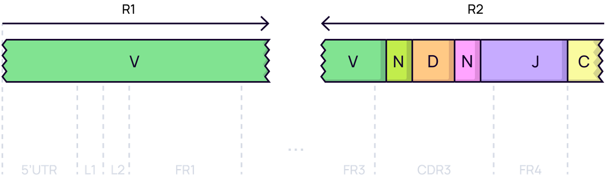
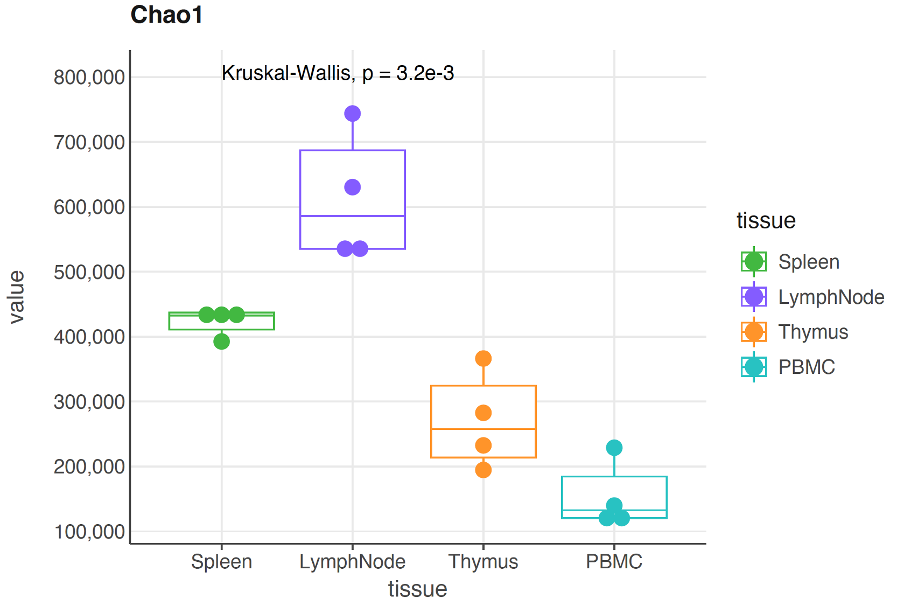
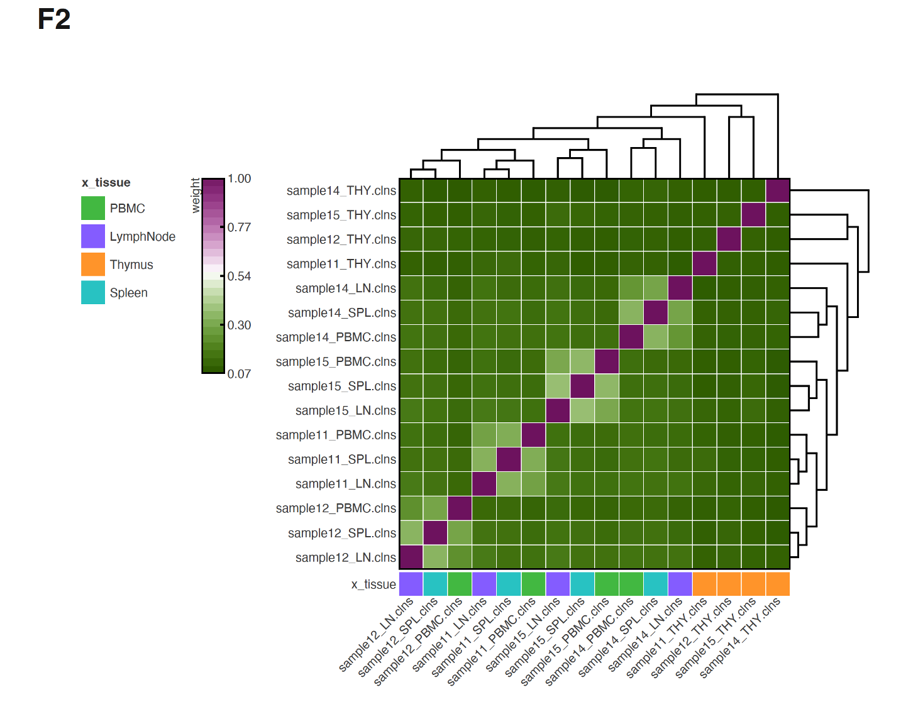

# Target 5'RACE TCR library tutorial

### Repertoire extraction
Let's say we have a folder `fastq/` with FASTQ file pairs.

??? note "Show files"
    ```
    ls fastq/
    
    sample11_LN_R1.fastq    sample11_SPL_R1.fastq  sample12_LN_R1.fastq    sample12_SPL_R1.fastq  sample14_LN_R1.fastq    sample14_SPL_R1.fastq  sample15_LN_R1.fastq    sample15_SPL_R1.fastq
    sample11_LN_R2.fastq    sample11_SPL_R2.fastq  sample12_LN_R2.fastq    sample12_SPL_R2.fastq  sample14_LN_R2.fastq    sample14_SPL_R2.fastq  sample15_LN_R2.fastq    sample15_SPL_R2.fastq
    sample11_PBMC_R1.fastq  sample11_THY_R1.fastq  sample12_PBMC_R1.fastq  sample12_THY_R1.fastq  sample14_PBMC_R1.fastq  sample14_THY_R1.fastq  sample15_PBMC_R1.fastq  sample15_THY_R1.fastq
    sample11_PBMC_R2.fastq  sample11_THY_R2.fastq  sample12_PBMC_R2.fastq  sample12_THY_R2.fastq  sample14_PBMC_R2.fastq  sample14_THY_R2.fastq  sample15_PBMC_R2.fastq  sample15_THY_R2.fastq
    ```
These files contain sequences of TCR-betta chain enriched cDNA libraries of mice. Libraries were 
obtained from RNA, isolated from various tissues, using 5'RACE method. Sequence specific primer for 
C-region was used in library preparation protocol. The image bellow shows schematic sequencing read 
locations on the TCR mRNA molecule.

<figure markdown>
  { width="600" }
</figure>


Our goal is to generate clonotype tables for every sample, compare groups of samples and create plots.

The most straightforward way to get clonotype tables is to use 
[```mixcr analyze```](../reference/mixcr-analyze.md).

According to the library preparation protocol, `mixcr` command should look like this:

=== "Single pair of files"
    ```
    mixcr analyze amplicon \
        -s mmu \
        --starting-material rna \
        --receptor-type trb \
        --5-end no-v-primers --3-end c-primers \
        --adapters adapters-present \
        fastq/sample11_LN_R1.fastq fastq/sample11_LN_R2.fastq result/sample11_LN
    ```
=== "Multiple files"
    ```
    ls fastq/*R1.fastq | parallel \
    "mixcr analyze amplicon \
        --species mmu \
        --starting-material rna \
        --receptor-type trb \
        --5-end no-v-primers --3-end c-primers \
        --adapters adapters-present \
        {} {=s:R1:R2:=} {=s:.*\/:result/:; s:_R.*::=}"
    ```
??? hint "How to run command on multiple files?"
    This method is described in [Handy bash commands](../tips/usefullBashScripts.md) section of this 
    documentation.
    Briefly, lets assume we work on Linux, and let's say we have 
    [GNU parallel](https://www.gnu.org/software/parallel/) installed. We then first list 
    all R1 filenames and pass that list to parallel. Inside `mixcr analyze amplicon` 
    we use ```sed``` to pass input and output files. For R2 filename we have to replace R1 with R2 
    (```{=s:R1:R2:=}``` ), and for the output we remove the path to the R1 file, replace it with a 
    new one instead and remove filename ending starting with `_R` (`{=s:.*\/:result/:; s:_R.*::=}`).

- ```--species``` is set to mmu for Mus Musculus
- ```--starting material``` rna. Determines weather the reference sequence will have introns or not.
- ```--receptor-type``` is ```trb``` because we know that only this chain should be present in the data.
- ```--5-end no-v-primers``` is set to ```no-v-primers``` since 5'RACE protocol was used in library 
preparation. For V multiplex library that argument should be set to ```v-primers```. 
- ```--3-end-primers``` is ```c-primers``` since the primer used for library preparation is 
complimentary to C-region of TCR genes.
- ```--adapers adapters present``` because primer sequence is present in the data and has not been 
cut prior to.
- finally we specify paths for both input files and a path to output folder with prefix describing 
the sample

Running the command above will generate the following set of files for every sample:

- ```sample11_LN.vdjca``` is a binary file with alignments 
- ```sample11_LN.clns``` is a binary file with assembled clonotypes
- ```sample11_LN.clonotypes.TRB.txt``` is a human-readable tab-delimited file with clonotype table for this sample. Check reports section of this documentation to find out more about the data stored in it.
- ```sample11_LN.report``` is a report file which contains both reports for alignment and assemble. Please see Reports section of this documentation to learn how to read ```mixcr``` reports.

??? tip "Always check the report"
    ```
    Analysis date: Thu May 19 12:11:44 CEST 2022
    Input file(s): fastq/sample11_LN_R1.fastq,fastq/sample11_LN_R2.fastq
    Output file(s): mixcr/sample11_LN.vdjca
    Version: 3.0.13-83-pmaster; built=Fri May 13 16:40:38 CEST 2022; rev=e88be90a73; lib=repseqio.v1.9
    Command line arguments: --species mmu --library default --threads 24 --report mixcr/sample11_LN.report -p rna-seq -OvParameters.geneFeatureToAlign=VTranscriptWithP -OvParameters.parameters.floatingLeftBound=true -OjParameters.parameters.floatingRightBound=false -OcParameters.parameters.floatingRightBound=true fastq/sample11_LN_R1.fastq fastq/sample11_LN_R2.fastq mixcr/sample11_LN.vdjca
    Analysis time: 3.27m
    Total sequencing reads: 229362
    Successfully aligned reads: 182846 (79.72%)
    Paired-end alignment conflicts eliminated: 1 (0%)
    Alignment failed, no hits (not TCR/IG?): 3518 (1.53%)
    Alignment failed because of absence of V hits: 32654 (14.24%)
    Alignment failed because of absence of J hits: 7964 (3.47%)
    No target with both V and J alignments: 2380 (1.04%)
    Overlapped: 2780 (1.21%)
    Overlapped and aligned: 133 (0.06%)
    Alignment-aided overlaps: 0 (0%)
    Overlapped and not aligned: 2647 (1.15%)
    No CDR3 parts alignments, percent of successfully aligned: 14 (0.01%)
    Partial aligned reads, percent of successfully aligned: 258 (0.14%)
    TRA chains: 1 (0%)
    TRB chains: 182845 (100%)
    Realigned with forced non-floating bound: 453164 (197.58%)
    Realigned with forced non-floating right bound in left read: 31 (0.01%)
    Realigned with forced non-floating left bound in right read: 31 (0.01%)
    ======================================
    Analysis date: Thu May 19 12:15:00 CEST 2022
    Input file(s): mixcr/sample11_LN.vdjca
    Output file(s): mixcr/sample11_LN.clns
    Version: 3.0.13-83-pmaster; built=Fri May 13 16:40:38 CEST 2022; rev=e88be90a73; lib=repseqio.v1.9
    Command line arguments: --report mixcr/sample11_LN.report --threads 24 -OassemblingFeatures="[CDR3]" -OseparateByV=false -OseparateByJ=true -OseparateByC=false mixcr/sample11_LN.vdjca mixcr/sample11_LN.clns
    Analysis time: 5.12m
    Final clonotype count: 140051
    Average number of reads per clonotype: 1.3
    Reads used in clonotypes, percent of total: 181941 (79.32%)
    Reads used in clonotypes before clustering, percent of total: 182228 (79.45%)
    Number of reads used as a core, percent of used: 182167 (99.97%)
    Mapped low quality reads, percent of used: 61 (0.03%)
    Reads clustered in PCR error correction, percent of used: 287 (0.16%)
    Reads pre-clustered due to the similar VJC-lists, percent of used: 0 (0%)
    Reads dropped due to the lack of a clone sequence, percent of total: 275 (0.12%)
    Reads dropped due to low quality, percent of total: 0 (0%)
    Reads dropped due to failed mapping, percent of total: 343 (0.15%)
    Reads dropped with low quality clones, percent of total: 0 (0%)
    Clonotypes eliminated by PCR error correction: 226
    Clonotypes dropped as low quality: 0
    Clonotypes pre-clustered due to the similar VJC-lists: 0
    Clonotypes dropped in fine filtering: 0
    Partially aligned reads attached to clones by tags: 0 (0%)
    Partially aligned reads with ambiguous clone attachments by tags: 0 (0%)
    Partially aligned reads failed to attach to clones by tags: 0 (0%)
    TRA chains: 1 (0%)
    TRB chains: 140050 (100%)
    ======================================
    ```

??? "Show output files in ```result/``` folder"
    ```
    ls result
    
    sample11_LN.clns                  sample11_THY.clonotypes.TRB.txt   sample12_SPL.report               sample14_PBMC.vdjca              sample15_PBMC.clns
    sample11_LN.clonotypes.TRB.txt    sample11_THY.report               sample12_SPL.vdjca                sample14_SPL.clns                sample15_PBMC.clonotypes.TRB.txt
    sample11_LN.report                sample11_THY.vdjca                sample12_THY.clns                 sample14_SPL.clonotypes.TRB.txt  sample15_PBMC.report
    sample11_LN.vdjca                 sample12_LN.clns                  sample12_THY.clonotypes.TRB.txt   sample14_SPL.report              sample15_PBMC.vdjca
    sample11_PBMC.clns                sample12_LN.clonotypes.TRB.txt    sample12_THY.report               sample14_SPL.vdjca               sample15_SPL.clns
    sample11_PBMC.clonotypes.TRB.txt  sample12_LN.report                sample12_THY.vdjca                sample14_THY.clns                sample15_SPL.clonotypes.TRB.txt
    sample11_PBMC.report              sample12_LN.vdjca                 sample14_LN.clns                  sample14_THY.clonotypes.TRB.txt  sample15_SPL.report
    sample11_PBMC.vdjca               sample12_PBMC.clns                sample14_LN.clonotypes.TRB.txt    sample14_THY.report              sample15_SPL.vdjca
    sample11_SPL.clns                 sample12_PBMC.clonotypes.TRB.txt  sample14_LN.report                sample14_THY.vdjca               sample15_THY.clns
    sample11_SPL.clonotypes.TRB.txt   sample12_PBMC.report              sample14_LN.vdjca                 sample15_LN.clns                 sample15_THY.clonotypes.TRB.txt
    sample11_SPL.report               sample12_PBMC.vdjca               sample14_PBMC.clns                sample15_LN.clonotypes.TRB.txt   sample15_THY.report
    sample11_SPL.vdjca                sample12_SPL.clns                 sample14_PBMC.clonotypes.TRB.txt  sample15_LN.report               sample15_THY.vdjca
    sample11_THY.clns                 sample12_SPL.clonotypes.TRB.txt   sample14_PBMC.report              sample15_LN.vdjca
    ```

### Postanalysis
Now when we have clonsets for all our samples we can move on to postanalysis.

First we want to create a ```metadata.tsv``` file. 
This is a tab-delimited file, which contains ```sample``` column with sample names, origin 
tissue data and animal number.

??? note "Show metadata"
    | sample        | animal | tissue |
    |---------------|--------|--------|
    | sample11_LN   | 11     | LN     |
    | sample11_PBMC | 11     | PBMC   |
    | sample11_SPL  | 11     | SPL    |
    | sample11_THY  | 11     | THY    |
    | sample12_LN   | 12     | LN     |
    | sample12_PBMC | 12     | PBMC   |
    | sample12_SPL  | 12     | SPL    |
    | sample12_THY  | 12     | THY    |
    | sample14_LN   | 14     | LN     |
    | sample14_PBMC | 14     | PBMC   |
    | sample14_SPL  | 14     | SPL    |
    | sample14_THY  | 14     | THY    |
    | sample15_LN   | 15     | LN     |
    | sample15_PBMC | 15     | PBMC   |
    | sample15_SPL  | 15     | SPL    |
    | sample15_THY  | 15     | THY    |


Now lets perform postanalysis calculations. There are two major functions dedicated to general repertoire 
analysis metrics:

- [```mixcr postanalysis individual```](../reference/mixcr-postanalysis.md) is responsible for individual repertoire metrics (ex. Diversity, CDR3 profile etc.).
- [```mixcr postanalysis overlap```](../reference/mixcr-postanalysis.md) provides an easy-to-use way to
overlap repertoires of multiple samples and find our how close they are to each other regarding the 
metrics selected.

=== "individual"
    ```bash
    postanalysis individual \
        --only-productive \
        --default-downsampling count-reads-auto \
        --metadata result/metadata.tsv \
        --tables postanalysis/postanalysis-output.tsv \
        --preproc-tables postanalysis/preproc.tsv \
        --chains TRB \
        result/*.clns \
        postanalysis/individual-postanalysis-output.json
    ```
=== "overlap"
    ```
    mixcr postanalysis overlap \
        --only-productive \
        --default-downsampling count-reads-auto \
        --metadata result/metadata.tsv \
        --tables postanalysis/tables-overlap.tsv \
        --preproc-tables postanalysis/preproc_overlap.tsv \
        --chains TRB \
        result/*.clns \
        postanalysis/overlap-postanalysis-output.json
    ```

The command above will execute individual postanalysis block. All non-functional clone sequences 
will be dropped (```--only-productive```). Because it is better to compare diversity indices on 
normalized data, we are using ```--default-downsampling count-reads-auto```. This type of downsample 
automatically determines the threshold. ```--group tissue``` means that samples will be joined in 
groups by tissue of origin (according to the metadata provided).

Now, as an example, lets visualize diversity statistics using 
[```mixcr exportPlots diversity```](../reference/mixcr-exportPlots.md).

```bash
mixcr exportPlots diversity \
    --metadata result/metadata.tsv \
    --chains TRB \
    --plot-type boxplot \
    --primary-group tissue \
    postanalysis/individual-postanalysis-output.json plots/diversity.pdf
```

Here we select `tissue` metadata as the parameter to group the samples on the plot by.

This command wil produce a `pdf` file with plots for all available diversity metrics. You can see on
of the plot bellow.

<figure markdown>
  { width="600" }
</figure>

Now lets plot the result of overlap analysis.

```
mixcr exportPlots overlap \
    --metadata result/metadata.tsv \
    --chains TRB \
    --color-key tissue \
    postanalysis/overlap-postanalysis-output.json plots/overlap.pdf

```
<figure markdown>
  { width="600" }
</figure>


    