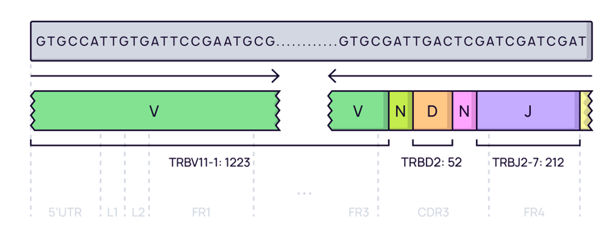
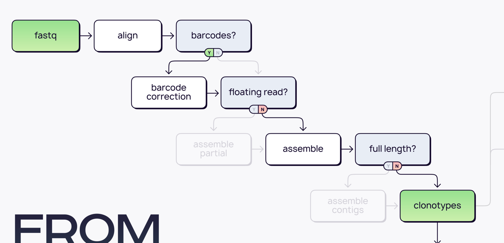
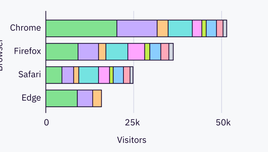

# Data libraries

This tutorial uses the data from the publication: Simon S, Voillet V, Vignard V, et al, _PD-1 and TIGIT coexpression identifies a circulating CD8 T cell subset predictive of response to anti-PD-1 therapy_, Journal for ImmunoTherapy of Cancer 2020;8:e001631. [doi: 10.1136/jitc-2020-001631](https://jitc.bmj.com/content/8/2/e001631)

The data was collected from 12 patients. PBMC samples were obtained at three time points for each patient. The libraries were generated using _Human TCR Panel QIAseq Immune Repertoire RNA Library Kit (QIAGEN&trade;)_. Sequencing was performed using Illumina NextSeq&trade; sequencing machine. Each samples contain sequences of TCRα and TCRβ chains enriched cDNA libraries of human. 261bp Read 1 holds CDR3 region and 41bp Read 2 with UMI (first 12bp):



All data may be downloaded from SRA:
```shell
> sra-download SRR10545725 fastq/
```

The project contains 544 paired fastq files, separated in multiple lanes and  biosample ids:
```shell
> ls fastq/

SRR10545725_GSM4195461_TCR-seq_P15-T0-TIGIT_Homo_sapiens_OTHER_1.fastq.gz
SRR10545725_GSM4195461_TCR-seq_P15-T0-TIGIT_Homo_sapiens_OTHER_2.fastq.gz
SRR10545726_GSM4195461_TCR-seq_P15-T0-TIGIT_Homo_sapiens_OTHER_1.fastq.gz
SRR10545726_GSM4195461_TCR-seq_P15-T0-TIGIT_Homo_sapiens_OTHER_2.fastq.gz
SRR10545727_GSM4195461_TCR-seq_P15-T0-TIGIT_Homo_sapiens_OTHER_1.fastq.gz
SRR10545727_GSM4195461_TCR-seq_P15-T0-TIGIT_Homo_sapiens_OTHER_2.fastq.gz
SRR10545728_GSM4195461_TCR-seq_P15-T0-TIGIT_Homo_sapiens_OTHER_1.fastq.gz
SRR10545728_GSM4195461_TCR-seq_P15-T0-TIGIT_Homo_sapiens_OTHER_2.fastq.gz
...
```
Each file name encodes the information about lane, biosample id, metadata, R1 or R2. For example for the first file from above listing: `SRR10545497` - lane, `GSM4195404` - biosample id, `P5` -  patient id, `T0` - time point, `DPOS` - double positive, `OTHER_1` - first mate of paired-end data.


# Upstream analysis

The most straightforward way to get clonotype tables is to use a universal [`mixcr analyze`](../reference/mixcr-analyze.md) command.

According to the library preparation protocol, the library has V primers on 5'-end and C primers on 3', so the command for a single sample is the following:

```shell
> mixcr analyze amplicon \
    --species hsa \
    --starting-material rna \
    --receptor-type tcr \
    --5-end v-primers \
    --3-end c-primers \
    --adapters adapters-present \
    --tag-pattern '^(R1:*)\^(UMI:N{12})' \
    fastq/SRR{{n}}_GSM4195461_TCR-seq_P15-T0-TIGIT_Homo_sapiens_OTHER_1.fastq.gz \
    fastq/SRR{{n}}_GSM4195461_TCR-seq_P15-T0-TIGIT_Homo_sapiens_OTHER_2.fastq.gz \
    result/P15-T0-TIGIT
```

The meaning of these options is the following:

- `--species` is set to `hsa` for _Homo Sapience_


- `--starting-material` RNA or DNA. It affects the choice of V gene region which will be used as target in [`align`](../reference/align.md) step (`vParameters.geneFeatureToAlign`, see [`align` documentation](../reference/align.md)): `rna` corresponds to the `VTranscriptWithout5UTRWithP` and `dna` to `VGeneWithP` (see [Gene features and anchor points](../reference/geneFeatures.md) for details)


- `--receptor-type` TCR or BCR. It affects the choice of underlying alignment algorithms: MiXCR uses fundamentally different algorithms for TCRs and BCRs because BCRs have somatic hypermutations and long indels.   


- `--5-end no-v-primers` may be `no-v-primers` or `v-primers`. For V multiplex libraries we use `v-primers` while e.g. for 5'RACE one need to use `no-v-primers`. Depending on the presence of primers or adapters at 5'-end MiXCR uses either global or local alignment algorithm to align the left bound of V.


- `--3-end-primers` may be `j-primers`, `j-c-intron-primers` or `c-primers`. Here we use `c-primers` since the primer used for library preparation is complimentary to C-region of TCR genes. Depending on the presence of primers or adapters at 3'-end MiXCR uses either global or local alignment algorithms to align the right bound of J and C gene segments.


- `--adapers` may be `adapters-present` or `no-adapters`. We use `adapters-present` because primer sequence is present in the data and has not been cut prior to. Presence or absence of adapter sequences results in the choice between local and global alignment algorithms on the edges of the target sequence.


- `--tag-pattern` is used to specify UMI pattern for the library. MiXCR provides a powerful regex-like [language](../reference/tag-pattern.md) allowing to specify almost arbitrary barcode structure. Here we use `^(R1:*)\^(UMI:N{12})` pattern to specify that R1 should be used as is, UMI spans the first 12 letters of R2 and the rest of R2 is ignored.  


- finally we specify paths for both input files and a path to output folder with prefix describing the sample. Note that `{{n}}` syntax is similar to Linux wildcard behaviour: it will concatenate all fastq files matching this pattern into one sample. This is very useful when you have for example multiple lanes.


Running the command above will generate the following files:

```shell
> ls result/

# human-readable reports 
P15-T0-TIGIT.report
# raw alignments (highly compressed binary file)
P15-T0-TIGIT.vdjca
# alignments with corrected UMI barcode sequences 
P15-T0-TIGIT.corrected.vdjca
# TCRα & TCRβ CDR3 clonotypes (highly compressed binary file)
P15-T0-TIGIT.clns
# TCRα & TCRβ CDR3 clonotypes exported in tab-delimited txt
P15-T0-TIGIT.clonotypes.TRA.tsv
P15-T0-TIGIT.clonotypes.TRB.tsv  
```

Clonotype tables is the main result of the upstream analysis. They are stored in a highly compressed and efficient binary `.clns` file and can be exported in many ways: detailed [tab-delimited format](../reference/mixcr-exportClone) with dozens of customizable columns, [human readable](../reference/mixcr-exportClonesPretty) for manual inspection, and [AIRR format](../reference/mixcr-exportAirr) suitable for many scientific downstream analysis tools. By default MiXCR exports clonotypes in a tab-delimited format separately for each immunological chain.

In order to run the analysis for all samples in the project on Linux we can for example use [GNU Parallel](https://www.gnu.org/software/parallel/) in the following way:

```shell
> ls /fastq/*_1* | \
  sed 's:SRR[0-9]*_:SRR\{\{n\}\}_:g' | \
  uniq | \
  parallel -j2  \
  'mixcr analyze amplicon \
    --species hsa \
    --starting-material rna \
    --receptor-type tcr \
    --5-end v-primers \
    --3-end c-primers \
    --adapters adapters-present \
    --tag-pattern '^(R1:*)\^(UMI:N{12})' \
    {} \
    {=s:OTHER_1:OTHER_2:=} \
    result/{=s:.*TCR-seq_:PRJNA592172/:; s:_Homo.*::=}'
```

You can check more details in [_Handy bash commands_](../tips/usefullBashScripts.md) section of documentation. Briefly, we list all R1 files in the fastq directory, replace lane specifications with MiXCR `{{n}}` wildcard, pipe the list to parallel, then run `mixcr analyze` for each pair, again using sed to obtain R2 filename from R1 and the name of output.  

## Details and fine-tuning

Under the hood, `mixcr analyze amplicon` executes the following pipeline of MiXCR actions:



Each step in this pipeline is executed with a specific options inherited from the options supplied to `mixcr analyze amplicon`. Instead of running `analyze` one can run the whole pipeline step by step and additionally fine tune the analysis parameters at each step. Another reason why sometimes it is better to execute the pipeline step by step is the ability to better manage hardware resources allocated to each step, because some steps are memory intensive and less CPU intensive, while others are vice a versa.


Let's go throw each step executed in the considered case. 

### `align` 

Performs:
- alignment of raw sequencing reads against reference database of V-, D-, J- and C- gene segments
- pattern matching of tag pattern sequence and extraction of barcodes

 ```shell
 > mixcr align \
    --species hsa \
    --tag-pattern '^(R1:*)\^(UMI:N{12})' \
    --report result/P15-T0-TIGIT.report \
    --json-report result/P15-T0-TIGIT.report.json \
    -OvParameters.geneFeatureToAlign="VTranscriptWithout5UTRWithP" \
    -OvParameters.parameters.floatingLeftBound=true \
    -OjParameters.parameters.floatingRightBound=false \
    -OcParameters.parameters.floatingRightBound=true \
    fastq/SRR{{n}}_GSM4195461_TCR-seq_P15-T0-TIGIT_Homo_sapiens_OTHER_1.fastq.gz \
    fastq/SRR{{n}}_GSM4195461_TCR-seq_P15-T0-TIGIT_Homo_sapiens_OTHER_2.fastq.gz \
    result/P15-T0-TIGIT.vdjca
```

Options `--report` and `--json-report` are specified here explicitly. Since we start from RNA data we use `VTranscriptWithout5UTRWithP` for the alignment of V segments (see [Gene features and anchor points](../reference/geneFeatures.md). Because we have primers on V segment, we use local alignment on the left bound of V and since we have primers on C segment, we use global alignment for J and local on the right bound of C.

This step utilizes all available CPUs and scales perfectly. When there are a lot of CPUs, the only limiting factor is the speed of disk I/O. To limit the number of used CPUs one can pass `--threads N` option.  

### `correctAndSortTags`

Corrects sequencing and PCR errors _inside_ barcode sequences. This step does extremely important job by correcting artificial diversity caused by errors in barcodes. In the considered example project it corrects only sequences of UMIs.

```shell
> mixcr correctAndSortTags \
    --report result/P15-T0-TIGIT.report \
    --json-report result/P15-T0-TIGIT.report.json \
    P15-T0-TIGIT.vdjca \
    P15-T0-TIGIT.corrected.vdjca
```
Options `--report` and `--json-report` are specified here explicitly so that the report files will be appended with the barcode correction report.

### `assemble`

Assembles clonotypes and applies several layers of errors correction. In the current example project we consider TCRα & TCRβ separately and  clonotype by its CDR3 sequence. The layers of correction applied in this example are:
 - assembly consensus CDR3 sequence for each UMI
 - quality-awared correction for sequencing errors
 - clustering to correct for PCR errors, which still may present even in the case of UMI data, since a error may be introduced e.g. on the first reverse-transcription cycle

```shell
> mixcr assemble \
    --report result/P15-T0-TIGIT.report \
    --json-report result/P15-T0-TIGIT.report.json \
    P15-T0-TIGIT.corrected.vdjca \
    P15-T0-TIGIT.clns
```

Options `--report` and `--json-report` are specified here explicitly so that the report files will be appended with assembly report.

Assembly step may be quite memory consuming for very big datasets. MiXCR offloads memory intensive computations to disk and does it in a highly efficient and parallelized way, fully utilizing all hardware facilities. For such big samples it may be worth to control the amount of RAM provided to MiXCR using `-Xmx` JVM option (the more RAM supplied the faster execution):
```shell
> mixcr -Xmx16g assemble ...
```

### exportClones

Finally, to export clonotype tables in tabular form `exportClones` is used:
```shell
> mixcr exportClones \
    -p full \
    -uniqueTagCount UMI \
    P15-T0-TIGIT.clns \
    P15-T0-TIGIT.tsv
```

Here `-p full` is a shorthand for the full preset of common export columns and `-uniqueTagCount UMI` adds a column with the UMI count for each clone.  


# Quality controls

MiXCR generates comprehensive reports for each step of the pipeline, containing exhaustive information about quality of the library and performance of the algorithms. These reports are a primary source of the feedback to the wet lab, and also may be used to tune the parameters of the pipeline.

The very basic overview of the whole pipeline performance for the project may be generated in a graphical form using:
```shell
> mixcr exportPlots qcOverview results/*.clns qcOverview.pdf
```



Individual reports for each sample are generated automatically.  


# Downstream analysis


- ```sample11_LN.vdjca``` is a binary file with alignments 
- ```sample11_LN.clns``` is a binary file with assembled clonotypes
- ```sample11_LN.clonotypes.TRB.txt``` is a human-readable tab-delimited file with clonotype table for this sample. Check reports section of this documentation to find out more about the data stored in it.
- ```sample11_LN.report``` is a report file which contains both reports for alignment and assemble. Please see Reports section of this documentation to learn how to read ```mixcr``` reports.

Next step is to perform that analysis on multiple file pairs. We work on Linux, and let's say we have [GNU parallel installed](https://www.gnu.org/software/parallel/).
Then we can easily run the command above for all files in the folder:

```
ls fastq/*R1.fastq |\
 parallel "mixcr analyze amplicon \
   	-s mmu \
    --starting-material rna \
    --receptor-type trb \
    --5-end no-v-primers --3-end c-primers \
    --adapters adapters-present \
    {} {=s:R1:R2:=} {=s:.*\/:result/:; s:_R.*::=}"
```

This method is described in [Handy bash commands](../tips/usefullBashScripts.md) section of this documentation.

Briefly, we list all R1 filenames and pass that list to parallel. Inside ```mixcr analyze amplicon``` we use ```sed``` to pass input and output files. For R2 filename we have to replace R1 with R2 (```{=s:R1:R2:=}``` ), and for the output we remove the path to the R1 file, replace it with a new one instead and remove filename ending starting with ```_R``` (```{=s:.*\/:result/:; s:_R.*::=}```).

After execution is complete ```result/``` folder has files wor all the samples similar to those mentioned above.

```
ls result

sample11_LN.clns                  sample11_THY.clonotypes.TRB.txt   sample12_SPL.report               sample14_PBMC.vdjca              sample15_PBMC.clns
sample11_LN.clonotypes.TRB.txt    sample11_THY.report               sample12_SPL.vdjca                sample14_SPL.clns                sample15_PBMC.clonotypes.TRB.txt
sample11_LN.report                sample11_THY.vdjca                sample12_THY.clns                 sample14_SPL.clonotypes.TRB.txt  sample15_PBMC.report
sample11_LN.vdjca                 sample12_LN.clns                  sample12_THY.clonotypes.TRB.txt   sample14_SPL.report              sample15_PBMC.vdjca
sample11_PBMC.clns                sample12_LN.clonotypes.TRB.txt    sample12_THY.report               sample14_SPL.vdjca               sample15_SPL.clns
sample11_PBMC.clonotypes.TRB.txt  sample12_LN.report                sample12_THY.vdjca                sample14_THY.clns                sample15_SPL.clonotypes.TRB.txt
sample11_PBMC.report              sample12_LN.vdjca                 sample14_LN.clns                  sample14_THY.clonotypes.TRB.txt  sample15_SPL.report
sample11_PBMC.vdjca               sample12_PBMC.clns                sample14_LN.clonotypes.TRB.txt    sample14_THY.report              sample15_SPL.vdjca
sample11_SPL.clns                 sample12_PBMC.clonotypes.TRB.txt  sample14_LN.report                sample14_THY.vdjca               sample15_THY.clns
sample11_SPL.clonotypes.TRB.txt   sample12_PBMC.report              sample14_LN.vdjca                 sample15_LN.clns                 sample15_THY.clonotypes.TRB.txt
sample11_SPL.report               sample12_PBMC.vdjca               sample14_PBMC.clns                sample15_LN.clonotypes.TRB.txt   sample15_THY.report
sample11_SPL.vdjca                sample12_SPL.clns                 sample14_PBMC.clonotypes.TRB.txt  sample15_LN.report               sample15_THY.vdjca
sample11_THY.clns                 sample12_SPL.clonotypes.TRB.txt   sample14_PBMC.report              sample15_LN.vdjca
```

Now when we have clonsets for all files we can move on to postanalysis.

First we should create a ```metadata.tsv``` file. This is a tab-delimited file, which contains ```sample``` column with sample names, origin tissue data and animal number.


| sample                    | sample_id      | animal | tissue |
|---------------------------|----------------|--------|--------|
| result/sample11_LN.clns   | sample11_LN    | 11     | LN     |
| result/sample11_PBMC.clns | sample11_PBMC  | 11     | PBMC   |
| result/sample11_SPL.clns  | sample11_SPL   | 11     | SPL    |
| result/sample11_THY.clns  | sample11_THY   | 11     | THY    |
| result/sample12_LN.clns   | sample12_LN    | 12     | LN     |
| result/sample12_PBMC.clns | sample12_PBMC  | 12     | PBMC   |
| result/sample12_SPL.clns  | sample12_SPL   | 12     | SPL    |
| result/sample12_THY.clns  | sample12_THY   | 12     | THY    |
| result/sample14_LN.clns   | sample14_LN    | 14     | LN     |
| result/sample14_PBMC.clns | sample14_PBMC  | 14     | PBMC   |
| result/sample14_SPL.clns  | sample14_SPL   | 14     | SPL    |
| result/sample14_THY.clns  | sample14_THY   | 14     | THY    |
| result/sample15_LN.clns   | sample15_LN    | 15     | LN     |
| result/sample15_PBMC.clns | sample15_PBMC  | 15     | PBMC   |
| result/sample15_SPL.clns  | sample15_SPL   | 15     | SPL    |
| result/sample15_THY.clns  | sample15_THY   | 15     | THY    |

Now we can proceed to postanalysis.

Diversity indices are a part of [```mixcr postanalysis individual```](../reference/mixcr-postanalysis.md).

```
postanalysis individual \
    --only-productive \
    --default-downsampling umi-count-auto \
    --metadata result/metadata.tsv \
    --group tissue \
    --tables postanalysis/postanalysis-output.tsv \
    --preproc-tables postanalysis/preproc.tsv \
    --chains TRB \
    result/*.clns \
    postanalysis/individual-postanalysis-output.json
```

The command above will execute individual postanalysis block. All non-functional clone sequences will be dropped (```--only-productive```). Because it is better to compare diversity indices on normalized data, we are using ```--default-downsampling umi-count-auto```. This type of downsample automatically determines the threshold. ```--group tissue``` means that samples will be joined in groups by tissue of origin (according to the metadata provided).

Finally, we want to create box-plots with diversity.

```
mixcr exportPlots diversity \
    --metadata result/metadata.tsv \
    --chains TRB \
    --plot-type boxplot \
    --p-adjust-method none \
    --primary-group tissue \
    postanalysis/individual-postanalysis-output.json plots/diversity.pdf
```


    