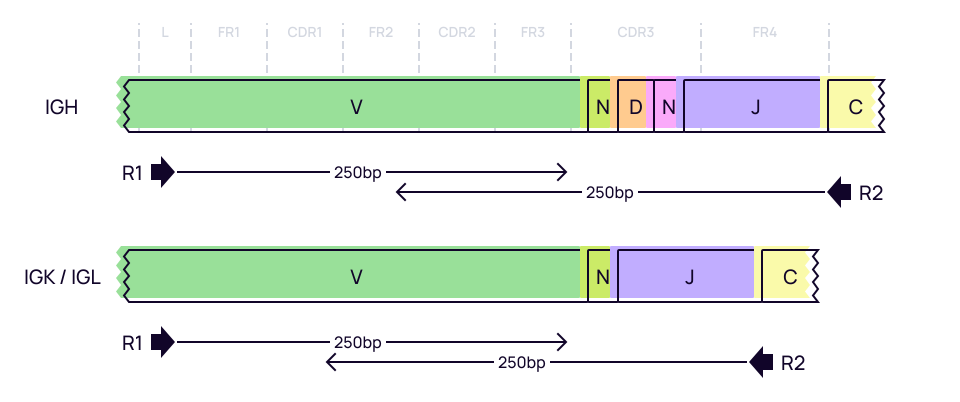
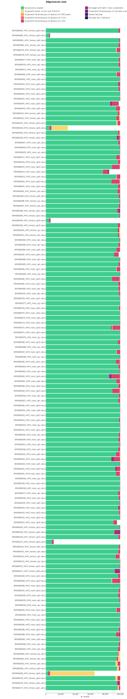

# ABHelix
Here we will discuss how to process BCR cDNA libraries obtained with ABHelix kit.

## Data libraries

This tutorial uses the data from the following publication: *High frequency of shared clonotypes in human B cell receptor repertoires.* Soto C et al., , Nature, 2019 Feb;566(7744):398-402
[doi: 10.1038/s41586-019-0934-8](https://doi.org/10.1038/s41586-019-0934-8)

Peripheral blood samples were collected from three donors : HIP1 (female, 47 y.o.), HIP2 (male, 22 y.o.) and HIP3(male, 29 y.o.). Samples were collected in multiple replicas. Total RNA was extracted from PBMCs and multiple reactions of reverse transcription were combined and purified using magnetic beads. The purified RT products were divided evenly for the first round of PCR amplification specific to human IgG, IgL IgK, IgM, or IgA. The 5' multiplex PCR primers were designed within the leader sequences of each productive V gene and the 3' primers within the constant regions, but in close approximation to the J gene/constant region junctions. The resulting first-round PCR products were purified with magnetic beads and subjected to the second round of PCR
amplification to add Illumina index and adapter sequences. Subsequent amplicon libraries were sequenced using next-generation sequencing. Paired end sequencing was performed on Illumina HiSeq 2500, R1 and R2 are 250bp long.

All data is available from SRA (PRJNA511481) using e.g. [SRA Explorer](https://sra-explorer.info).

??? tip "Use [aria2c](https://aria2.github.io) for efficient download of the full dataset with the proper filenames:"
    ```shell title="download.sh"
    --8<-- "abhelix-bcr/scripts/010-download-aria2c.sh"
    ```
    ```shell title="download-list.txt"
    --8<-- "abhelix-bcr/scripts/download-list.txt"
    ```

The project contains 136 FASTQ file pairs. The above script downloads all the data to `raw/` folder. Each file name encodes the data about the donor, its sex and Ig chain. For example for the first file from the above list: 

- `SRR8365277` - sample id
- `HIP1` - patient id
- `female` - patient sex
- `IgG1` - Ig heavy chain, isotype IGG1.

The structure of the library is shown on the picture bellow. 



It is worth noticing, that reads in IgA and IgM cDNA libraries samples cover about 20 and 21 base pairs of C gene, accordingly. In the original paper authors say that these samples were processed at AbHelix, LLC (www.AbHelix.com, South Plainfield, NJ, USA) and briefly emphasise: "For IgG sequencing reads, subclass-specific sequences in the beginning of the constant regions were used for identifying IgG1, IgG2, IgG3, and IgG4 subclass sequences." But, the reads in IgG subtypes samples (IgG1,IgG2,IgG3,IgG4) only cover last 5 nucleotides of the C gene. It is not clear how these subclasses were identified.
Nevertheless, we will process all samples as if the primers are located on the J gene/constant region junctions for two reasons:

- For IgA and IgM we don't know what part of the sequence comes from the primers, and IgG cDNA libraries presumably were amplifies using J-C junction primer, since only 5 nucleotides of the C gene are present.
- The samples are already separated by isotypes, thus we don't really need C gene sequence, as we rely on a AbHelix protocol.

## Upstream analysis

MiXCR has a dedicated preset for this protocol, thus analysing the data ia as easy as:

```shell
--8<-- "abhelix-bcr/scripts/020-upstream-preset.sh"
```

One might also use [GNU Parallel](https://www.gnu.org/software/parallel/) to process all samples at once:

```shell
--8<-- "abhelix-bcr/scripts/020-upstream-preset-parallel.sh"
```

### Under the hood pipeline:

Under the hood the command above actually executes the following pipeline:

#### `align`
Alignment of raw sequencing reads against reference database of V-, D-, J- and C- gene segments.

```shell
--8<-- "abhelix-bcr/scripts/040-upstream-align.sh"
```

Option `--report` is specified here explicitly.

`--species hsa`
: determines the organism species.

`-p`
: `kAligner2_4.0` a preset of MiXCr parameters which includes kAligner2 (a specialized aligner for BCR data).

`-OvParameters.geneFeatureToAlign="VTranscriptWithout5UTRWithP"`
: Sets a V gene feature to align. Check [gene features](../reference/ref-gene-features.md) for more info.

`-OvParameters.parameters.floatingLeftBound=false`
: Results in a global alignment algorithm for V gene left bound. We use it because we don't have any primers covering V gene coding sequence.

`-OjParameters.parameters.floatingRightBound=true`
: Results in a local alignment algorithm for J gene right bound. Local alignment is needed because, as have been mentioned above, the primers are most likely cover the right bound of th J gene, at least for IgG samples. The more correct way would be to use separate settings for IgA\IgM libraries, where most likely the primer most likely only covers the C gene. But for the purpose of this tutorial we will use a more universal way, since the exact location of the primers is unknown.

#### `assemble`
Assembles alignments into clonotypes and applies several layers of errors correction(ex. quality-dependent correction for sequencing errors, PCR-error correction by clustering). Check [`mixcr assemble`](../reference/mixcr-assemble.md) for more information.

```shell
--8<-- "abhelix-bcr/scripts/050-upstream-assemble.sh"
```

Options `--report` and `--json-report` are specified here explicitly so that the report files will be appended with assembly report.

`-OassemblingFeatures={FR1Begin:FR4End}`
: This is a very important parameter that sets the [gene features](../reference/ref-gene-features.md) that will define different clones. By default, only `CDR3` is used for naming different clones. But in case of BCR data, due to hypermutations in V region, we should also include V gene sequence, because two different clones may share the same `CDR3`. Note, that this is only possible if sequencing reads cover assembling features, which is true in this case.


#### `export`
Exports clonotypes from .clns file into human-readable tables. 

```shell
--8<-- "abhelix-bcr/scripts/060-upstream-exportClones.sh"
```

`-с <chain>`
: defines a specific chain to be exported.

By the end of upstream analysis you should have the following set of output files:

```shell
# human-readable reports 
SRR8365277_HIP1_female_IgG1.report

# raw alignments (highly compressed binary file)
SRR8365277_HIP1_female_IgG1.vdjca

# IGH, IGK and IGL clonotypes (highly compressed binary file)
SRR8365277_HIP1_female_IgG1.clns

# IGH, IGK and IGL clonotypes exported in tab-delimited txt
SRR8365277_HIP1_female_IgG1.clonotypes.IGH.txt
```

While `.clns` file holds all data and is used for downstream analysis, the output `.txt` clonotype table will contain exhaustive information about each clonotype as well:

??? tip "See first 100 records from SRR8365277_HIP1_female_IgG1:"
    {{ read_csv('docs/mixcr/guides/abhelix-bcr/figs/SRR8365277_HIP1_female_IgG1.clonotypes.IGH.txt', engine='python', sep='\t', nrows=100) }}


## Quality control

Now when we have processed all samples, we can proceed to quality control. First thing that we want to look at is the 
alignment quality. This can be easily done with the following command:

```shell
--8<-- "abhelix-bcr/scripts/080-qc-align.sh"
```


From the plot above we see that most samples have high percentage of successfully aligned reads (above 90%). What we can
also tell is that from all the samples those that come from HIP1_female_IgG4 have a lower alignment rate:

- SRR8365486_HIP1_female_IgG4
- SRR8365430_HIP1_female_IgG4
- SRR8365394_HIP1_female_IgG4
- SRR8365317_HIP1_female_IgG4
- SRR8365280_HIP1_female_IgG4

That suggest a potential issue during sample preparation. Note that HIP3_male_IgG4 and HIP3_male_IgG3 sample also tend to
have a lower alignment rate.

Let's look at the same plot, but instead of percentages of reads  we will plot an absolute number of reads.

```shell
--8<-- "abhelix-bcr/scripts/081-qc-align-absolute.sh"
```


The plot shows that nearly all bad samples have significantly lower total reads count. 
Next, lets take a closer look at SRR8365280_HIP1_female_IgG4. This sample has quite a bit of reads but most of them lack Ig sequences. By default, MiXCR removed non target reads during alignment. We will realign this sample using options `-OallowPartialAlignments=true` and `-OallowNoCDR3PartAlignments=true` to preserve partially aligned reads. We will also save not aligned reads (`--not-aligned-R1`, `--not-aligned-R2`) to separate FASTQ files for manual inspection. See [`mixcr align`](../reference/mixcr-align.md) for more details.

Bellow is the complete command:

```shell
--8<-- "abhelix-bcr/scripts/090-qc-debug-align.sh"
```

Resulting `SRR8365280_HIP1_female_IgG4_notAligned_R1.fastq` and `SRR8365280_HIP1_female_IgG4_notAligned_R1.fastq` files can be manually inspected. A brief [BLAST](https://blast.ncbi.nlm.nih.gov/Blast.cgi) search revealed that a lot of reads align with PhiX, which is regularly used as a DNA sequencing control in Illumina protocol. Bellow you can see a few reads from  `SRR8365280_HIP1_female_IgG4_notAligned_R2.fastq`.

```shell
@SRR8365280.116 GWZHISEQ01:570:HYJYKBCXX:1:1101:12039:44077/2
GAGAGATGAGATTGAGGCTGGGAAAAGTTACTGTAGCCGACGTTTTGGCGGCGCAACCTGTGACGACAAATCTGCTCAAATTTATGCGCGCTTCGATAAAAATGATTGGCGTATCCAACCTGCAGAGTTTTATCGCTTCCATGACGCAGAAGTTAACACTTTCGGATATTTCTGATGAGTCGAAAAATTATCTTGATAAAGCAGGAATTACTACTGCTTGTTTACGAATTAAATCGAAGTGGACTGCTGGC
+
DDBDD<GHHIFHIHIIIEHIGGIIIIIIGHIIIICHIIIIIHEHHHHDHIICHHHIIIIIIIIIIIGDHIIFHIIIIIGIIIIIHIHHIHIIHIIHHIIIIHIIIIIIIIIIIIIGIIIIHIIIIEHHIIHHHGIIIIIIIIIIIIIHIIIHIHHIIIIIIHIIIII=FHHIFHCGHG?HIIIIGIIIIEHCFHHII?GHH.FHEHIIHHHH-BGHHHHGFHIIIHI.5B6-8@F-B@HHHHIIIIGFE?-
@SRR8365280.117 GWZHISEQ01:570:HYJYKBCXX:1:1101:13143:44082/2
ACGATGAGGGACATAAAAAGTAAAAATGTCTACAGTAGAGTCAATAGCAAGGCCACGACGCAATGGAGAAAGACGGAGAGCGCCAACGGCGTCCATCTCGAAGGAGTCGCCAGCGATAACCGGAGTAGTTGAAATGGTAATAAGACGACCAATCTGACCAGCAAGGAAGCCAAGATGGGAAAGGTCATGCGGCATACGCTCGGCGCCAGTTTGAATATTAGACATAATTTATCCTCAAGTAAGGGGCCGAA
+
DDDDBIIIIIHHGHHIHHHIIIFIGIHHIIHHIIIIIHHIHIIIIEHHHGIIIIIIIIIHHIIIIIIHIIIFHIHIIIIIHGHIIIIHIIIIIHIHIIIIIDGHHHHIGIIHIIIIIIIIIGHIHGHHHHHIHIIEHIIII@HHIIIIIIIHIHIIHHIHIHIIIIIHIIII.BEGHGII?FHGHFHHHCDHIIIIHHCEHHIHIGIIIAHGEEEHH?FH?AFFHFHHHHH?FCH--BHHHHHE@,,>??H
@SRR8365280.118 GWZHISEQ01:570:HYJYKBCXX:1:1101:9938:44446/2
AGAAGAAAACGTGCGTCAAAAATTACGTGCAGAAGGAGTGATGTAATGTCTAAAGGTAAAAAACGTTCTGGCGCTCGCCCTGGTCGTCCGCAGCCGTTGCGAGGTACTAAAGGCAAGCGTAAAGGCGCTCGTCTTTGGTATGTAGGTGGTCAACAATTTTAATTGCAGGGGCTTCGGCCCCTTACTTGAGGATAAATTATGTCTAATATTCAAACTGGCGCCGAGCGTATGCCGCATGACCTTTCCCATCT
+
DDDDDIIGIIIIIIHGHHHHHHHIIIIHIF?HHIII?FHIIHIIIEHFHHIIIIIIIIHIIIIIIHIIIHIIIIIIIIIIIIIIIIIGIIIIIIIIHHHIHHHHIIIIHIIIIIIIHIIIHIIHIGIICGHCHHIHHGEEEEHIIIIIIIIIIIGHIIIIIIIIHIIICE<CHIIHHIIHIHIIIIFHIIIIIIHHEGEHHAFEECHIGHIIIIIG?E?EEH?CHGIGHII?GHIDDHHHIIIHEHEFB-A
```

Now lets look inside `SRR8365280_HIP1_female_IgG4_debug.vdjca` file witch now has partially aligned reads in it.
That can be easily achieved using [`mixcr exportAlignmentsPretty`](../reference/mixcr-exportPretty.md#raw-alignments).

The function bellow will generate a `.txt` human-readable file with alignments. We use parameter `--skip 1000` to skip first 1000 reads, as first reads usually have bad quality, and `--limit 100` will export only 100 alignments.

```shell
--8<-- "abhelix-bcr/scripts/110-qc-exportAlignmentsPretty.sh"
```

Bellow you can see one of the alignments. First read aligns with a good score to IGHV1-69D. But its pair consists of low-quality nucleotides and can't be aligned against ahy IGHJ.

Further analysis might help reveal where such low quality reads come from.

```shell
>>> Read ids: 12846


                                                L1><L2     L2><FR1
                _ T  R  F  L  F  V  V  A  A  A  T  G  V  Q  S  Q  V  Q  L  V  Q  S  G  P  E  V
     Quality    76767888777877765777666775777788877737576737677788888767777778357777767777667877
     Target0  0 CACTAGGTTCCTCTTTGTGGTGGCAGCAGCTACAGGTGTCCAGTCCCAGGTGCAGCTGGTGCAGTCTGGGCCTGAGGTGA 79  Score
IGHV1-69D*00 11 cTGGaggttcctctttgtggtggcagcagctacaggtgtccagtcccaggtgcagctggtgcagtctgggGctgaggtga 90  1901

                                                     FR1><CDR1              CDR1><FR2
                K  K  P  G  S  S  V  K  V  S  C  E  A  S  G  G  T  F  S  N  F  A  V  N  W  V  R
     Quality    87888877888677675673763577787777777786767777776667878888888773577677878867775677
     Target0 80 AGAAGCCTGGGTCGTCGGTGAAGGTCTCCTGCGAGGCTTCTGGAGGCACCTTCAGTAACTTTGCTGTCAACTGGGTGCGA 159  Score
IGHV1-69D*00 91 agaagcctgggtcCtcggtgaaggtctcctgcAaggcttctggaggcaccttcagCaGctAtgctAtcaGctgggtgcga 170  1901

                                                 FR2><CDR2              CDR2><FR3
                  Q  A  P  G  Q  G  L  E  W  V  G  G  I  I  P  L  F  N  V  A  K  Y  A  Q  K  F  E
     Quality     77787778865577867376625733535577887777787767786772253677767777677777787777766667
     Target0 160 CAGGCCCCTGGACAAGGGCTTGAGTGGGTGGGAGGGATCATCCCTCTATTTAATGTGGCAAAGTACGCACAGAAGTTCGA 239  Score
IGHV1-69D*00 171 caggcccctggacaagggcttgagtggAtgggagggatcatccctAtCtttGGtACAgcaaaCtacgcacagaagttcCa 250  1901


                   G  R  V _
     Quality     76677566676
     Target0 240 GGGCAGAGTCA 250  Score
IGHV1-69D*00 251 gggcagagtca 261  1901


Quality   26426422222222222562442222424424255222225225222225224226522255252272242277525257
Target1 0 GGTTGGTTGGCGGGCTCATCCCGCTATTTAATGTGGGGATGTACGCACTGAGGTACGTTGGCAGGGTCCCGGTTGTCGCG 79  Score


Quality    72737277523535532353332333335333222235526353536262252522222577533555352225673735
Target1 80 GACGATTCAGTGGGCTGTGCTTACGTAGACATTGCCCGCTTGCGATCTGCCGCCAGCGCCGTGTATTACTGTGCGGCTTC 159  Score


Quality     53333223353333655367555355333325223333535353355335367777733353335333333533533533
Target1 160 AGGTGGCGACGTCCTGTGATATGACTACAAGGCCCCCTAAGGGGATGAACTATGGGGGCAATCGACAATAGTGACCGTCT 239  Score


Quality     33533233333
Target1 240 ACTAAGTTTCG 250  Score
```

Finally, lets check chain usage among all samples.

```shell
--8<-- "abhelix-bcr/scripts/120-qc-chainUsage.sh"
```


The plot suggests that this data has a low cross-contamination level, since almost all clones from IgG1, IgG2,IgG3,IgG4,IgM and IgA samples are IGH, and samples with IgK and IgL mostly consist of IGK and IGL clones.

## Full-length clonotype assembly

ABhelix BCR protocol allows to recover a broader BCR receptor sequence then just `CDR3` region. According to the protocol, forward primers are located in the leader region, thus we can safely use an assembling feature that starts from `FR1` and be sure that no primers will affect the original sequence. The reverse primers are located in C gene region close to `FR4End`.

Taking into account what is mentioned above, the longest possible assembling feature for this protocol is `"{FR1Begin:FR4End}"`.

MiXCR has a specific preset to obtain full-length BCR clones with ABhelix protocol:

```shell
--8<-- "abhelix-bcr/scripts/130-upstream-preset-full-length.sh"
```

The `mixcr assemble` step in this preset differs from the one above in the following manner:

```shell
--8<-- "abhelix-bcr/scripts/140-upstream-assemble-full-length.sh
```

`-OassemblingFeatures="{FR1Begin:FR4End}"`
: sets the assembling feature to the region which starts from `FR1Begin` and ends at the end of `FR4`.

Notice that we do not use `-OseparateByV=true` and `-OseparateByJ=true` in this case because assembling feature already covers full V and J sequences, thus in case if clones have identical `CDR3` they will still be separated.

## Reports
Finally, MiXCR provides a very convenient way to look at the reports generated at ech step. Every `.vdjca`, `.clns` and `.clna` file holds all the reports for every MiXCR function that has been applied to this sample. E.g. in our case `.clns` file contains reports for `mixcr align` and `mixcr assemble`. To output this report use [`mixcr exportReports`](../reference/mixcr-exportReports.md) as shown bellow. Note `--json` parameter will output a JSON-formatted report.

```shell
--8<-- "abhelix-bcr/scripts/125-qc-exportReports.sh"
```

```shell
--8<-- "abhelix-bcr/scripts/125-qc-exportReports-json.sh"
```

??? "Show report file"
    === "`.txt`"
        ```shell
        --8<-- "abhelix-bcr/figs/SRR8365277_HIP1_female_IgG1.report.txt"
        ```
    === "`.json`"
        ```js
        --8<-- "abhelix-bcr/figs/SRR8365277_HIP1_female_IgG1.report.json"
        ```