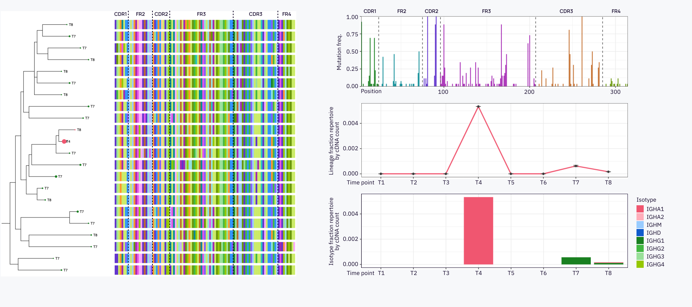

# B cell lineage tracing

MiXCR allows V- and J-gene allele inference and somatic hypermutation lineage trees reconstruction. This guide covers these two major advances in BCR repertoire analysis and provides examples.

See full webinar video:

<iframe width="560" height="315" style="display: block; margin: 0 auto;" src="https://www.youtube.com/embed/HblPe8NhZL4" title="YouTube video player" frameborder="0" allow="accelerometer; autoplay; clipboard-write; encrypted-media; gyroscope; picture-in-picture" allowfullscreen></iframe>

## Data and experimental design

This tutorial uses the longitudinal data on IGH repertoires obtained for one healthy middle aged donor who experienced two COVID-19 infections during the course of the last two years. Peripheral blood samples were obtained at 8 timepoints in replicates.


PBMC was isolated using ficoll density gradient centrifugation and RNA was isolated for cDNA library preparation using [MiLaboratories Human IG RNA Multiplex kit](../reference/overview-built-in-presets.md#milaboratories).


Let's download the full dataset for the donor:


## Upstream analysis


Running upstream analysis is easy with the [`mixcr analyze`](../reference/mixcr-analyze.md`) command, which requires only a few arguments:
```shell
mixcr analyze milab-human-bcr-multiplex-full-length \
      file_R1.fastq.gz \
      file_R2.fastq.gz \
      output_id
```

`milab-human-bcr-multiplex-full-length`
: is the preset name for [MiLaboratories Human IG RNA Multiplex kit](../reference/overview-built-in-presets.md#milaboratories). The presets for [most of the commercially available platforms](../reference/overview-built-in-presets.md) are supported along with generic presets allowing running the pipeline for custom protocols.

`file_R1.fastq.gz` and `file_R2.fastq.gz`
: the filenames for raw files with sequencing reads, no preprocessing is required (e.g. primers/adapters trimming or UMI-processing).

`output_id`
: output prefix which will be used in the names of the output files.

The command above will generate the following set of output files:
```shell
> ls mixcr/DCh_T1_pbmc_H_2*

# human-readable reports for every step in txt and json format
DCh_T1_pbmc_H_2.align.report.json
DCh_T1_pbmc_H_2.align.report.txt
DCh_T1_pbmc_H_2.assemble.report.json
DCh_T1_pbmc_H_2.assemble.report.txt
DCh_T1_pbmc_H_2.refine.report.json
DCh_T1_pbmc_H_2.refine.report.txt

# alignments (highly compressed binary file)
DCh_T1_pbmc_H_2.vdjca

# alignments with corrected UMI barcode sequences
DCh_T1_pbmc_H_2.refined.vdjca

# IG clonotypes (highly compressed binary file)
DCh_T1_pbmc_H_2.clns
```

We can utilize GNU parallel to run the pipeline for multiple files simultaneously:
```shell
ls raw/*R1*.fastq.gz | parallel --line-buffer 'mixcr analyze \
   milab-human-bcr-multiplex-full-length \
   --remove-step exportClones \
   {}   {=s:R1:R2:=}  \
   mixcr/{=s:.*/:: ; s:_R1.fastq.gz:: =}'
```

Note that we also have added `--remove-step exportClones` ['mix-in' option](../reference/overview-presets.md). Initially this preset includes `mixcr exportClones` step, but we will skip it for now, as we need to infer the allelic variants first and reassign clonotypes to a newly generated individualized gene segment reference library.

### Quality control

Before we move on to lineage trees reconstruction, we will look at the basic QC plots.

First, let’s generate and investigate alignment rates QC plot.
```shell
mixcr exportQc align \
      mixcr/*.clns \
      figures/alignQc.pdf
```


We observe that all the libraries aligned very well, more than 90% of the reads were successfully aligned to the reference gene segment library.

Next we would like to inspect the number of sequencing reads for each of the libraries, we add `--absolute-values` flag for the same command as above:
```shell
mixcr exportQc align \
      --absolute-values \
      mixcr/*.clns \
      figures/alignQc.pdf
```


We see that depth by reads is a little uneven between our samples, however for each of them we have at least one million sequencing reads, which is generally enough for this analysis.

We can investigate this further exporting UMI coverage by reads plot:
```shell
mixcr exportQc tags \
      mixcr/*.clns   \
      figures/readsPerUmiQc.pdf
```


This plot demonstrates the distribution of how many times unique cDNA molecules (each represented by a UMI) were covered by sequencing reads. It is common to observe a bimodal distribution, with the lower peak attributing to the dubious sequences, generated by PCR- and sequencing errors. MiXCR automatically calculates the optimal threshold and filters out UMI groups with low coverage by reads to account for this.


## Allele inference

The next step, after obtaining clonotypes is to perform allele inference to separate true allelic variants from hypermutations alterations. This is done using [`mixcr findAlleles`](../reference/mixcr-findAlleles.md) commands which works in two steps:

 - a new personalized reference gene library is generated based on the provided samples;
 - the newly generated reference is used to realign each clone. New .clns files are generated.

Only samples obtained from a single donor (or genetic mice strain) should be provided for allele inference.

```
mixcr findAlleles \
      --report mixcr/DCh.findAlleles.report.txt \
      --export-alleles-mutations mixcr/DCh_alleles.tsv \
      --export-library mixcr/DCh_alleles.json \
      --output-template {file_dir_path}/{file_name}.reassigned.clns \
      mixcr/*.clns
```
The following parameters and options are used:

`--export-alleles-mutations`
: specifies a path to write the descriptions and stats for all original and new alleles

`--export-library`
: specifies a path where to write the new library with found alleles. Supports exporting in `.fasta` or MiXCR-compatible json formats, which is defined by output filename extension

`--output-template {file_dir_path}/{file_name}_.reassigned.clns`
: specifies the output file path. `{file_dir_path}/{file_name}_.reassigned.clns` means that each realigned `.clns` file will be placed in the same folder and will have the same base name as the original `.clns` file.

For more information on how to read the output tables see [`mixcr findAlleles`](../reference/mixcr-findAlleles.md).


### Export clones

Now, when the alleles have been reassigned we can export clonotype tables in human-readable format:
```
mixcr exportClones \ 
      mixcr/DCh_T1_pbmc_H_2.reassigned.clns \
      mixcr/DCh_T1_pbmc_H_2.txt
```
                                   

## Generate lineage trees

Now we can reconstruct clonal lineage trees with [`mixcr findShmTrees`](../reference/mixcr-findShmTrees.md) command:
```
mixcr findShmTrees \
      --report mixcr/DCh_trees.log \
      mixcr/*.reassigned.clns \
      mixcr/DCh.shmt
```

To export information on lineage trees in human-readable format use [`mixcr exportShmTreesWithNodes`](../reference/mixcr-exportShmTrees.md):
```
mixcr exportShmTreesWithNodes \
      mixcr/DCh.shmt \
      mixcr/DCh_trees.txt
```

## Lineage analysis

Load necessary packages, define several handy helper functions, and color pallets:

??? Quote "Expand"
    
    ```R
    #| code-fold: true
    library(tidyr)
    library(readr)
    library(stringr)
    library(stringdist)
    library(ggplot2)
    library(msa)
    library(magrittr)
    library(ggbeeswarm)
    library(tibble)
    library(dplyr)
    library(plotly)
    library(ggtree)
    library(ggrepel)
    library(data.table)
    
    `%+%` <- function(a, b) paste0(a, b)
    
    `+.uneval` <- function(a,b) {
        `class<-`(modifyList(a,b), "uneval")
    }
    
    alignment2Fasta <- function(alignment, filename) {
      sink(filename)
      
      n <- length(rownames(alignment))
      for(i in seq(1, n)) {
        cat(paste0('>', rownames(alignment)[i]))
        cat('\n')
        the.sequence <- toString(unmasked(alignment)[[i]])
        cat(the.sequence)
        cat('\n')  
      }
      
      sink(NULL)
    }
    
    mi_27<-c(
      "#99E099","#198020","#42B842","#C1ADFF","#845CFF","#5F31CC","#FFCB8F",
      "#FF9429","#C26A27","#90E0E0","#27C2C2","#068A94","#FAAAFA","#E553E5",
      "#A324B2","#CBEB67","#95C700","#659406","#99CCFF","#2D93FA","#105BCC",
      "#FFADBA","#F05670","#AD3757","#D3D7E0","#929BAD","#5E5E70")
    
    mi_dark<-c(
      "#198020",
      "#5F31CC",
      "#C26A27",
      "#068A94",
      "#A324B2",
      "#659406",
      "#105BCC",
      "#AD3757",
      "#5E5E70")
    
    aminoacids_pal<-c(
      "#99E099","#198020","#42B842","#C1ADFF","#845CFF","#5F31CC","#FFCB8F",
      "#FF9429","#C26A27","#90E0E0","#27C2C2","#068A94","#FAAAFA","#E553E5",
      "#A324B2","#CBEB67","#95C700","#659406","#99CCFF","#2D93FA","#105BCC",
      "#FFADBA","#F05670","#AD3757","#D3D7E0","#929BAD","#5E5E70")
    
    isotype_pal<-c(
      IGHA1 = "#F05670",
      IGHA2 = "#FFADBA",
      IGHM = "#99CCFF",
      IGHD = "#105BCC",
      IGHG1 ="#198020",
      IGHG2 ="#42B842",
      IGHG3 ="#99E099",
      IGHG4 ="#95C700")
    ```

### Load clonesets, lineages and calculate statistics

Loading `mixcr exportClones` command output and calculating number of clonotypes and unique cDNA molecules

```R
folder<-"~/webinar/mixcr/"
cloneset_files<-dir(folder,".reassigned_IGH.tsv",full.names = T)

clonesets<-read_tsv(cloneset_files,id="fileName") %>% 
  mutate(id=str_remove_all(fileName,".*\\/|.reassigned_IGH.tsv"),
         isotype=str_remove(allCHitsWithScore, "\\*.*"))

stats_clonesets<-clonesets %>%
  group_by(id) %>%
  summarise(totalCloneInSample=n(),
            totalUMIsInSample=sum(uniqueUMICount))
```

Load `mixcr exportShmTreesWithNodes` command output, parse metadata from filenames, and join with statistics table generated on previous step

```R
lng_db<-read_tsv("~/ch_covid/mixcr/shmTrees/DCh_trees.tsv") %>% 
  mutate(id=str_remove_all(fileName,".*\\/|.reassigned.clns"),
         isotype=str_remove(bestCHit,"\\*00")) %>% 
  separate("id",c("donor","timepoint","tissue","status","repnum"),
           sep="_",
           remove=F) %>%
  left_join(stats_clonesets,by ="id")
# Note rows with NA in cloneId and fileName fields - these are the inferred nodes
```

For further processing it is useful to pivot to R's wide format:

??? Quote "Pivot to wide format"
    
    ```R
    lngs_trees_wide<-lng_db %>%
      filter(!fileName=="") %>% 
      group_by(treeId,timepoint,repnum) %>% 
      summarise(nClones=n(),
                nClonesNormalized=n()/dplyr::first(totalCloneInSample),
                nUMIsNormalized=sum(uniqueUMICount)/dplyr::first(totalUMIsInSample),
                nUMIs=sum(uniqueUMICount),
                isotypes=list(unique(isotype)),
                nConditions=n_distinct(status),
                conditions=paste(unique(status),collapse=","),
                nTissues=n_distinct(tissue),
                tissues=paste(unique(tissue),collapse=","),
                totalCloneInSample=dplyr::first(totalCloneInSample),
                totalUMIsInSample=dplyr::first(totalUMIsInSample)
      ) %>% 
      ungroup() %>%
      group_by(treeId) %>% 
      mutate(timepoint=factor(timepoint,levels=c("T1","T2","T3","T4","T5","T6","T7","T8")),
             timepoints=timepoint %>%unique() %>% sort() %>%  paste(collapse=","),
             isotypes=c(isotypes) %>% unlist() %>% unique() %>%sort() %>%  paste(collapse=","),
             totalNClones=sum(nClones),
             totalCount=sum(nUMIs)) %>% 
      ungroup() %>% 
      arrange(timepoint) %>% 
      pivot_wider(id_cols = c(treeId,isotypes,timepoints,totalNClones,totalCount), 
                  names_from = c(timepoint,repnum),
                  values_from = c(nClones,nUMIs,nClonesNormalized,nUMIsNormalized),
                  values_fill = 0.00) %>% 
      mutate(across(starts_with("nClonesN"),.fns = ~ ifelse(.x==0, min(.x[.x>0])/2, .x )),
             across(starts_with("nUmisN"),.fns = ~ ifelse(.x==0, min(.x[.x>0])/2, .x ))) %>% 
      mutate(switchedIsotypePresent=ifelse(str_detect(isotypes, "IGHA|IGHG|IGHE"), TRUE, FALSE))
    ```

### Visualizations

??? Quote "Define function to draw lineage abundance scatter plots"
    
    ```R
    drawScatter<-function(sample1,sample2,metric,coloring){
      #Two possible options for metric - nClonesNormalized and nUMIsNormalized
      #Two possible options for coloring - changedTrees and switchedIsotypePresent
      #Set limits for plots depending on metric
      if (metric=="nClonesNormalized"){
        upperLimit=0.2*1e-2
        lowerLimit=0.8*1e-05
      } else if (metric=="nUMIsNormalized"){
        upperLimit=1*1e-1
        lowerLimit=0.5*1e-05
      }
      
      g<-ggplot(lngs_trees_wide,
             aes_string(x=metric %+% "_" %+% sample1,
                        y=metric %+% "_" %+% sample2) +
              aes(text = "timepoints: " %+% timepoints %+% "\n"  %+% 
                    "isotypes: "  %+% isotypes %+% "\n"  %+%
                    "N Clones in " %+% eval(parse(text = "sample1")) %+% ": " %+%
                    eval(parse(text = "nClones" %+% "_" %+%
                                 eval(parse(text = "sample1")))) %+% "\n" %+%
                    "N Clones in " %+% eval(parse(text = "sample2")) %+% ": " %+%
                    eval(parse(text = "nClones" %+% "_" %+%
                                 eval(parse(text = "sample2")))) %+% "\n" %+%
                    "total N Clonotypes: " %+% totalNClones %+% "\n" %+%
                    "total N UMIs: " %+% totalCount
                    ))+   
        geom_point(aes_string(color=coloring),
                   alpha=0.5,size=4)+
        theme_bw()+
        scale_x_log10()+
        scale_y_log10()+
        theme(legend.position = "none") +
        geom_abline(slope=1, intercept=0, linetype=2,color="grey28")
     
       if(exists("upperLimit")) {
        g<-g+ expand_limits(y=c(lowerLimit,upperLimit),x=c(lowerLimit,upperLimit))
      }
      
      if(coloring=="changedTrees") {
      g<-g+geom_point(data=lngs_trees_wide %>% filter(changedTrees),
                      color="#F05670",
                      alpha=0.4,
                      size=4) +
        scale_color_manual(values= c("grey76","#F05670"))
      } else if (coloring=="switchedIsotypePresent") {
       g<-g+ scale_color_manual(values= c(mi_dark[2],mi_dark[1]))
      }
    }
    ```

Each point represents a lineage, values represent number of cDNA molecules (each represented by one UMI) normalized by total number of cDNA molecules in the corresponding sample. In the steady state time point (T6) many of the most abundant (by cDNA) lineages are not replicated. Presumably these lineages are derived from antibody-secreting cells (ASCs), with high expression of IGH mRNA, but with low number of cells in them. At peak of response timepoint (T7) ASCs subset is represented by lineages undergoing active clonal expansions, with many cells present in peripheral blood, that's why it is easier to detect them in replicates.

```R
g1<-drawScatter("T6_1","T6_2","nUMIsNormalized",coloring="switchedIsotypePresent")+
  labs(x="T6, pre-COVID19, replicate 1",y="T6 pre-COVID19, replicate 2")
g2<-drawScatter("T7_1","T7_2","nUMIsNormalized",coloring="switchedIsotypePresent")+
  labs(x="T7, d7 COVID19, replicate 1",y="T7, d7 COVID19, replicate 2")
g3<-drawScatter("T6_1","T7_2","nUMIsNormalized",coloring="switchedIsotypePresent")+labs(x="T6, pre-COVID19, replicate 1",y="T7, d7 COVID19, replicate 2")
ggplotly(g1)
ggplotly(g2)
ggplotly(g3)
```


Now we can label the responding lineages, looking at the deviation of abundance between timepoints T6 and T7 and comparing it to deviation between replicates at peak of response (T7). We also filter lineages which have more than 5 different clonotypes at T7.

??? Quote "Define function to draw changed lineages"
   
    ```R
    lngs_trees_wide %<>% 
       mutate(logFCp61_71=log10(nUMIsNormalized_T6_1/nUMIsNormalized_T7_1),
              logFCp61_72=log10(nUMIsNormalized_T6_1/nUMIsNormalized_T7_2),
              logFCp62_71=log10(nUMIsNormalized_T6_2/nUMIsNormalized_T7_1),
              logFCp62_72=log10(nUMIsNormalized_T6_1/nUMIsNormalized_T7_2)) %>%
      #Calculate standard deviation 
      mutate(
        sd71_72=(nUMIsNormalized_T7_1-nUMIsNormalized_T7_2)^2 / ((nUMIsNormalized_T7_1+nUMIsNormalized_T7_2)/2),
        sd61_71=(nUMIsNormalized_T6_1-nUMIsNormalized_T7_1)^2 / ((nUMIsNormalized_T6_1+nUMIsNormalized_T7_1)/2),
        sd61_72=(nUMIsNormalized_T6_1-nUMIsNormalized_T7_2)^2 / ((nUMIsNormalized_T6_1+nUMIsNormalized_T7_2)/2),
        sd62_71=(nUMIsNormalized_T6_2-nUMIsNormalized_T7_1)^2 / ((nUMIsNormalized_T6_2+nUMIsNormalized_T7_1)/2),
        sd62_72=(nUMIsNormalized_T6_2-nUMIsNormalized_T7_2)^2 / ((nUMIsNormalized_T6_2+nUMIsNormalized_T7_2)/2)) %>% 
      #Label lineages that have sd between T6 and T7 higher than between replicates in T7
      #and havr more than 5 unique clonotypes at T7
      #and also increased abundance in T7 compared to T6 by comparison of all replicates
      mutate(
        changedTrees=sd71_72<sd61_71 & sd71_72<sd61_72 & sd71_72<sd62_71 & sd71_72<sd62_72 &(nClones_T7_1+nClones_T7_2>5) & logFCp61_71<0  & logFCp61_72<0 & logFCp62_71<0 & logFCp62_72<0) 
    ```

Draw responding lineages:

```R
g1<-drawScatter("T6_1","T6_2","nUMIsNormalized",coloring="changedTrees")+
  labs(x="T6, pre-COVID19, replicate 1",y="T6 pre-COVID19, replicate 2")
g2<-drawScatter("T7_1","T7_2","nUMIsNormalized",coloring="changedTrees")+
  labs(x="T7, d7 COVID19, replicate 1",y="T7, d7 COVID19, replicate 2")
g3<-drawScatter("T6_1","T7_2","nUMIsNormalized",coloring="changedTrees")+labs(x="T6, pre-COVID19, replicate 1",y="T7, d7 COVID19, replicate 2")
ggplotly(g1)
ggplotly(g2)
ggplotly(g3)
```


In pink we show lineages presumably responding to second COVID19 infection, defined at the previous step. We observe that some of these lineages also increased their abundance at first COVID19 response time point (T4).

??? Quote "Draw lineage tracing plot"
    
    ```R
    #Reshape a little bit to account to the replicates present at some of the timepoints
    lngs_trees_tracking<-lngs_trees_wide %>% 
      select(treeId,changedTrees, nUMIsNormalized_T1_1:nUMIsNormalized_T8_1) %>% 
      pivot_longer(cols=nUMIsNormalized_T1_1:nUMIsNormalized_T8_1,names_to= "timepoint",values_to = "nUMIsNormalized")  %>%
      mutate(timepoint=str_remove(timepoint,"nUMIsNormalized_")) %>% 
      separate("timepoint",into=c("timepoint","repnum")) %>%
      group_by(timepoint) %>% 
      mutate(nReplicates=n_distinct(repnum)) %>% 
      ungroup() %>% 
      pivot_wider(id_cols = c(treeId,changedTrees,timepoint,nReplicates),
                  names_from = repnum,
                  names_prefix = "rep_",
                  values_from = nUMIsNormalized,
                  values_fill = 0.0) %>% 
      rowwise() %>% 
      mutate(meanNUMIsNormalized=ifelse(nReplicates==1, rep_1 , mean(c(rep_1,rep_2))),
             minNUMIsNormalized=ifelse(nReplicates==1, rep_1 , min(rep_1,rep_2)),
             maxNUMIsNormalized=ifelse(nReplicates==1, rep_1 , max(rep_1,rep_2)))
    
    #Draw lineage tracing plot
    lngs_trees_tracking %>% 
      ggplot()+
      geom_line(data= lngs_trees_tracking %>% filter(!changedTrees),
                aes(x=timepoint, y=meanNUMIsNormalized, group=treeId),
                color="#929BAD",
                alpha=0.2,size=1)+
      geom_line(data= lngs_trees_tracking %>% filter(changedTrees),
                aes(x=timepoint, y=meanNUMIsNormalized, group=treeId),
                color="#F05670",
                alpha=0.8,size=1)+
      theme_bw()+
      labs(y="Fraction of the lineage by cDNA molecules",
           x="Time point")+
        geom_segment(aes(x = 5, y = 0.085, xend = 4, yend = 0.08),
                                          arrow = arrow(length = unit(0.2, "cm")))+
        geom_segment(aes(x = 6, y = 0.085, xend =7, yend = 0.08),
                     arrow = arrow(length = unit(0.2, "cm")))+
        annotate("text", x=5.5, y=0.086, label= "COVID19") +
        geom_vline(xintercept = 4,linetype=2,color="grey76")+
        geom_vline(xintercept = 7,linetype=2,color="grey76")
    ```


### Analysis for individual trees

??? Quote "Define function for drawing phylogenetic trees with amino acid sequence alignments"
    
    ```R
    drawTreeWithMSA<- function(trId){
      library(ggtree)
      tree<-read.tree("~/ch_covid/mixcr/shmTrees/newick/" %+% trId %+% ".tree")
      
      
      tree_meta<-lng_db %>% 
        filter(treeId==trId) %>% 
        select(nodeId,
               isotype,
               timepoint,
               tissue,
               aaSeqCDR3,
               uniqueUMICount,
               cloneId) %>% 
        dplyr::rename(ID=nodeId)
      
      ## draw initial tree 
      g<-ggtree(tree) %<+% tree_meta +
        geom_text(aes(label=timepoint), hjust=-.5,size=4)+
        geom_tippoint(aes(color =isotype , size=uniqueUMICount))+
        scale_color_manual(values=isotype_pal)+
        theme(legend.position = 'bottom')+
          scale_size_continuous(range = c(2, 7))
    
      MiXCRtreeVDJ<-lng_db %>%
        filter(treeId==trId) %>% 
        pull(`aaSeq{CDR1Begin:FR4End}`) %>% AAStringSet()
      
      names(MiXCRtreeVDJ)<-lng_db %>%
        filter(treeId==trId) %>% 
        pull(nodeId)
      
      msaMiXCRtreeVDJ<-msa(MiXCRtreeVDJ)
      
      alignment2Fasta(msaMiXCRtreeVDJ,"~/ch_covid/mixcr/shmTrees/export/" %+% trId %+% "_aln.fasta")
    
      pdf(file = "~/ch_covid/mixcr/shmTrees/export/" %+% trId %+% ".pdf",  
          width = 16, # The width of the plot in inches
          height = 12)
      print(msaplot(g,"~/ch_covid/mixcr/shmTrees/export/" %+% trId %+% "_aln.fasta",
                offset=8,width = 2,color=c("grey88",mi_27))
      )
    }
    ```

??? Quote "Define function for drawing SHM frequencies by position plot"
    
    ```R
    mutationPositionPlot<-function(trId){
      treeDb<-lng_db %>% filter(!is.na(cloneId),treeId==trId) %>% 
        mutate(CDR1BeginPosition=0,
               FR2BeginPosition=positionInReferenceOfFR2Begin-positionInReferenceOfCDR1Begin,
               CDR2BeginPosition=positionInReferenceOfCDR2Begin-positionInReferenceOfCDR1Begin,
               FR3BeginPosition=positionInReferenceOfFR3Begin-positionInReferenceOfCDR1Begin,
               CDR3BeginPosition=positionInReferenceOfCDR3Begin-positionInReferenceOfCDR1Begin,
               FR4BeginPosition=positionInReferenceOfCDR3Begin-positionInReferenceOfCDR1Begin+nchar(nSeqCDR3))
      
      
      FR2Pos<-treeDb %>% 
        pull(FR2BeginPosition) %>%
        unique()%>% min()
      
      CDR2Pos<-treeDb %>% 
        pull(CDR2BeginPosition) %>%
        unique() %>% min()
      
      FR3Pos<-treeDb %>% 
        pull(FR3BeginPosition) %>%
        unique()%>% min()
      
     CDR3Pos<-treeDb %>% 
        pull(CDR3BeginPosition) %>%
        unique()%>% min()
      
     FR4Pos<-treeDb %>% 
        pull(FR4BeginPosition) %>%
        unique()%>% min()
    
    mutByRegion<-str_extract_all(treeDb %>% 
                            pull(`nMutations{CDR1Begin:FR3End}BasedOnGermline`),
                    "[0-9]*[0-9][0-9]*") %>% unlist() %>% table() %>% 
      enframe(name = "position",value="nMut") %>% 
      mutate(position=as.integer(position),nMut=as.integer(nMut),
             region=case_when(
               position<FR2Pos ~ "CDR1",
               position<CDR2Pos ~ "FR2",
               position<FR3Pos ~ "CDR2",
               position<CDR3Pos ~ "FR3"
             )) %>% 
      bind_rows(
        str_extract_all(treeDb %>% pull(nMutationsCDR3BasedOnGermline),
                        "[0-9]*[0-9][0-9]*") %>% unlist() %>% table() %>% 
          enframe(name = "position",value="nMut") %>% 
          mutate(position=as.integer(position)+CDR3Pos,nMut=as.integer(nMut),
                 region="CDR3")
      ) %>% 
      bind_rows(
        str_extract_all(treeDb %>% pull(nMutationsFR4BasedOnGermline),
                        "[0-9]*[0-9][0-9]*") %>% unlist() %>% table() %>% 
          enframe(name = "position",value="nMut") %>% 
          mutate(position=as.integer(position)+FR4Pos,nMut=as.integer(nMut),
                 region="FR4")
      ) %>% 
      mutate(freqMut=nMut/nrow(treeDb))
      
    
    g<-mutByRegion%>% 
      ggplot(aes(x=position,y=freqMut,fill=region)) +
      theme_bw()+
      geom_bar(stat="identity")+
      scale_fill_manual(values=mi_dark)+
      geom_vline(xintercept = c(FR2Pos,CDR2Pos,FR3Pos,CDR3Pos,FR4Pos),color="grey28",linetype=2)+
      theme(legend.position = "none")+
      scale_x_continuous(expand=c(0,0)) +
      scale_y_continuous(expand=c(0,0)) +
      labs(y="Mutation freq.", x="Position")
    
    print(g)
    
    }
    ```

??? Quote "Define function for drawing lineage longitudinal trajectory"
    
    ```R
    lineageTrajectoryPlot<-function(trId){
      g<-lngs_trees_tracking %>% 
        filter(treeId==trId) %>% 
        ggplot(aes(x=timepoint, y=meanNUMIsNormalized, group=treeId))+
        geom_line(color="#F05670",size=1)+
        geom_point(color="grey20")+
        theme_bw()+
        labs(y="Lineage fraction in\nrepertoire by cDNA count",
             x="Time point")+
        geom_errorbar(aes(ymin=minNUMIsNormalized,
                          ymax=maxNUMIsNormalized),
                      width = 0.15,
                      color="grey26")
      print(g)
    }
    ```

??? Quote "Define function for drawing lineage isotype abundance by timepoints"
    
    ```R
    lineageIsotypesPlot<-function(trId){
    g<-  lngs_trees_tracking %>% 
          filter(treeId==trId) %>%
          #calculate isotype proportions in each timepoint and join to tracking data.frame
          left_join(
            lng_db %>%
              filter(treeId==trId,!is.na(cloneId)) %>% 
              group_by(isotype,timepoint) %>% 
              summarise(UMICount=sum(uniqueUMICount)) %>% 
              ungroup() %>% 
              group_by(timepoint) %>% 
              mutate(UMIFraction=UMICount/sum(UMICount)),
          by=c("timepoint")) %>% 
          mutate(isotypeUMIFraction=UMIFraction*meanNUMIsNormalized) %>% 
          ggplot(aes(x=timepoint,y=isotypeUMIFraction,fill=isotype))+
            geom_histogram(stat="identity")+
            theme_bw()+
            scale_fill_manual(values=isotype_pal)+
            labs(y="Isotype fraction in\nrepertoire by cDNA count",
                 x="Time point")+
            theme(legend.position = "none")
    print(g)
    }
    ```

#### Draw all plots for lineage 13628

```R
#| warning: false
drawTreeWithMSA(13628)
mutationPositionPlot(13628)
lineageTrajectoryPlot(13628)
lineageIsotypesPlot(13628)
```


#### Draw all plots for lineage 10511

```R
#| warning: false
drawTreeWithMSA(10511)
mutationPositionPlot(10511)
lineageTrajectoryPlot(10511)
lineageIsotypesPlot(10511)
```


#### Draw all plots for lineage 12796

```R
#| warning: false
drawTreeWithMSA(12796)
mutationPositionPlot(12796)
lineageTrajectoryPlot(12796)
lineageIsotypesPlot(12796)
```



#### Alternative representations for lineage trees

Lets calculate the number of synonymous and non-synonymous mutations in clonotypes within lineages by parsing `mutationsDetailed` columns from `'mixcr exportShmTreesWithNodes`' command output:

??? Quote "Code"
    
    ```R
    suppressWarnings(
    lng_db %<>% 
     mutate(
        across(starts_with("mutationsDetailed"),
               .fns = ~ str_split(.x,pattern = ",") %>%
                                 lapply(function(mut){
                                   if (is.na(mut)) { 
                                     return(0)
                                   } else {
                                   str_split(mut,pattern=":") %>%
                                     transpose() %>%
                                     as.data.table() %>%
                                     summarise(nMut=n()) %>% 
                                     pull(nMut)}}) %>% 
                                 unlist(),
               .names = "mutNum_{.col}" ),
        across(starts_with("mutationsDetailed"),
               .fns = ~ str_split(.x,pattern = ",") %>%
                 lapply(function(mut){
                   if (is.na(mut)) { 
                     return(0)
                   } else {
                     str_split(mut,pattern=":") %>%
                       transpose() %>%
                       as.data.table() %>%
                       summarise(nMutSyn=sum(V2=="")) %>% 
                       pull(nMutSyn)}}) %>% 
                 unlist(),
               .names = "mutNumSyn_{.col}" ),
        across(starts_with("mutationsDetailed"),
               .fns = ~ str_split(.x,pattern = ",") %>%
                 lapply(function(mut){
                   if (is.na(mut)) { 
                     return(0)
                   } else {
                     str_split(mut,pattern=":") %>%
                       transpose() %>%
                       as.data.table() %>%
                       summarise(nMutNonSyn=sum(V2!="")) %>% 
                       pull(nMutNonSyn)}}) %>% 
                 unlist(),
               .names = "mutNumNonSyn_{.col}" )
        
        ) %>% 
      rename_at(vars(matches("^mutNum_|^mutNumSyn_|^mutNumNonSyn_")), ~ str_remove(., "_mutationsDetailed")) )
    
    lng_db%<>% 
      rowwise() %>% 
      mutate(totalSynMut=sum(across(mutNumSynInCDR1BasedOnGermline:mutNumSynInFR4BasedOnGermline)),
             totalNonSynMut=sum(across(mutNumNonSynInCDR1BasedOnGermline:mutNumNonSynInFR4BasedOnGermline))) %>% 
     ungroup()
    ```

Let's plot the phylogenetic tree for one of the lineages in three alternative colorings: by isotype, by timepoint and by number of non-synonymous mutations

```R
trId=12796

tree<-read.tree("~/ch_covid/mixcr/shmTrees/newick/" %+% trId %+% ".tree")

tree_meta<-lng_db %>% 
  filter(treeId==trId) %>% 
  select(nodeId,
         isotype,
         timepoint,
         totalNonSynMut,
         uniqueUMICount,
         cloneId) %>% 
  dplyr::rename(ID=nodeId)

## draw initial tree 
g1<-ggtree(tree) %<+% tree_meta +
  geom_text_repel(aes(label=isotype))+
  geom_tippoint(aes(color =isotype, size=uniqueUMICount))+
  scale_color_manual(values=isotype_pal)+
  theme(legend.position = 'bottom')+
  labs(color="Isotype")

g2<-ggtree(tree) %<+% tree_meta +
  geom_text_repel(aes(label=timepoint))+
  geom_tippoint(aes(color =timepoint, size=uniqueUMICount ))+
  scale_colour_manual(values=mi_dark)+
theme(legend.position = 'bottom') 


g3<-ggtree(tree) %<+% tree_meta +
  geom_text_repel(aes(label=totalNonSynMut))+
  geom_tippoint(aes(color =totalNonSynMut, size=uniqueUMICount ))+
  scale_colour_gradientn(colours=c("#DFFADC", "#611347"))+
theme(legend.position = 'bottom')+
  labs(color="# of non-syn. SHM")

cowplot::plot_grid(g1,g2,g3,nrow=1)
```

