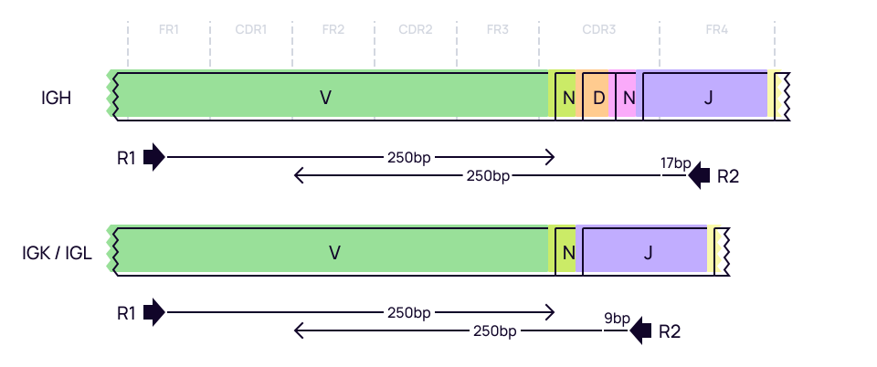

# BIOMED2
Here we will discuss how to process BCR cDNA libraries obtained with BIOMED2 kit.

## Data libraries

This tutorial uses the data from the following publication: *High frequency of shared clonotypes in human B cell receptor
repertoires.* Soto C et al., Nature, 2019 Feb;566(7744):398-402
[doi: 10.1038/s41586-019-0934-8](https://doi.org/10.1038/s41586-019-0934-8)

Peripheral blood samples were collected from three donors: HIP1 (female, 47 y.o.), HIP2 (male, 22 y.o.) and HIP3 (male, 29 y.o.). Samples were collected in multiple replicas. Total RNA was extracted from PBMCs and then RT-PCR was utilized to generate BCR amplicon libraries using BIOMED2 multiplex primers. Subsequent libraries were sequenced using next-generation sequencing.

The data for this tutorial can be downloaded using the script bellow:

```shell
curl -L ftp://ftp.sra.ebi.ac.uk/vol1/fastq/SRR836/008/SRR8365468/SRR8365468_1.fastq.gz -o SRR8365468_HIP2_male_R1.fastq.gz
curl -L ftp://ftp.sra.ebi.ac.uk/vol1/fastq/SRR836/008/SRR8365468/SRR8365468_2.fastq.gz -o SRR8365468_HIP2_male_R2.fastq.gz
curl -L ftp://ftp.sra.ebi.ac.uk/vol1/fastq/SRR836/007/SRR8365457/SRR8365457_1.fastq.gz -o SRR8365457_HIP1_female_R1.fastq.gz
curl -L ftp://ftp.sra.ebi.ac.uk/vol1/fastq/SRR836/007/SRR8365457/SRR8365457_2.fastq.gz -o SRR8365457_HIP1_female_R2.fastq.gz
...
```

??? note "See full script"
    ```shell
    #!/usr/bin/env bash
    curl -L ftp://ftp.sra.ebi.ac.uk/vol1/fastq/SRR836/008/SRR8365468/SRR8365468_1.fastq.gz -o SRR8365468_HIP2_male_R1.fastq.gz
    curl -L ftp://ftp.sra.ebi.ac.uk/vol1/fastq/SRR836/008/SRR8365468/SRR8365468_2.fastq.gz -o SRR8365468_HIP2_male_R2.fastq.gz
    curl -L ftp://ftp.sra.ebi.ac.uk/vol1/fastq/SRR836/007/SRR8365457/SRR8365457_1.fastq.gz -o SRR8365457_HIP1_female_R1.fastq.gz
    curl -L ftp://ftp.sra.ebi.ac.uk/vol1/fastq/SRR836/007/SRR8365457/SRR8365457_2.fastq.gz -o SRR8365457_HIP1_female_R2.fastq.gz
    curl -L ftp://ftp.sra.ebi.ac.uk/vol1/fastq/SRR836/008/SRR8365458/SRR8365458_1.fastq.gz -o SRR8365458_HIP1_female_R1.fastq.gz
    curl -L ftp://ftp.sra.ebi.ac.uk/vol1/fastq/SRR836/008/SRR8365458/SRR8365458_2.fastq.gz -o SRR8365458_HIP1_female_R2.fastq.gz
    curl -L ftp://ftp.sra.ebi.ac.uk/vol1/fastq/SRR836/009/SRR8365459/SRR8365459_1.fastq.gz -o SRR8365459_HIP1_female_R1.fastq.gz
    curl -L ftp://ftp.sra.ebi.ac.uk/vol1/fastq/SRR836/009/SRR8365459/SRR8365459_2.fastq.gz -o SRR8365459_HIP1_female_R2.fastq.gz
    curl -L ftp://ftp.sra.ebi.ac.uk/vol1/fastq/SRR836/003/SRR8365463/SRR8365463_1.fastq.gz -o SRR8365463_HIP1_female_R1.fastq.gz
    curl -L ftp://ftp.sra.ebi.ac.uk/vol1/fastq/SRR836/003/SRR8365463/SRR8365463_2.fastq.gz -o SRR8365463_HIP1_female_R2.fastq.gz
    curl -L ftp://ftp.sra.ebi.ac.uk/vol1/fastq/SRR836/009/SRR8365469/SRR8365469_1.fastq.gz -o SRR8365469_HIP2_male_R1.fastq.gz
    curl -L ftp://ftp.sra.ebi.ac.uk/vol1/fastq/SRR836/009/SRR8365469/SRR8365469_2.fastq.gz -o SRR8365469_HIP2_male_R2.fastq.gz
    curl -L ftp://ftp.sra.ebi.ac.uk/vol1/fastq/SRR836/005/SRR8365465/SRR8365465_1.fastq.gz -o SRR8365465_HIP1_female_R1.fastq.gz
    curl -L ftp://ftp.sra.ebi.ac.uk/vol1/fastq/SRR836/005/SRR8365465/SRR8365465_2.fastq.gz -o SRR8365465_HIP1_female_R2.fastq.gz
    curl -L ftp://ftp.sra.ebi.ac.uk/vol1/fastq/SRR836/007/SRR8365467/SRR8365467_1.fastq.gz -o SRR8365467_HIP2_male_R1.fastq.gz
    curl -L ftp://ftp.sra.ebi.ac.uk/vol1/fastq/SRR836/007/SRR8365467/SRR8365467_2.fastq.gz -o SRR8365467_HIP2_male_R2.fastq.gz
    curl -L ftp://ftp.sra.ebi.ac.uk/vol1/fastq/SRR836/004/SRR8365464/SRR8365464_1.fastq.gz -o SRR8365464_HIP1_female_R1.fastq.gz
    curl -L ftp://ftp.sra.ebi.ac.uk/vol1/fastq/SRR836/004/SRR8365464/SRR8365464_2.fastq.gz -o SRR8365464_HIP1_female_R2.fastq.gz
    curl -L ftp://ftp.sra.ebi.ac.uk/vol1/fastq/SRR836/000/SRR8365450/SRR8365450_1.fastq.gz -o SRR8365450_HIP3_male_R1.fastq.gz
    curl -L ftp://ftp.sra.ebi.ac.uk/vol1/fastq/SRR836/000/SRR8365450/SRR8365450_2.fastq.gz -o SRR8365450_HIP3_male_R2.fastq.gz
    curl -L ftp://ftp.sra.ebi.ac.uk/vol1/fastq/SRR836/001/SRR8365461/SRR8365461_1.fastq.gz -o SRR8365461_HIP1_female_R1.fastq.gz
    curl -L ftp://ftp.sra.ebi.ac.uk/vol1/fastq/SRR836/001/SRR8365461/SRR8365461_2.fastq.gz -o SRR8365461_HIP1_female_R2.fastq.gz
    curl -L ftp://ftp.sra.ebi.ac.uk/vol1/fastq/SRR836/002/SRR8365462/SRR8365462_1.fastq.gz -o SRR8365462_HIP1_female_R1.fastq.gz
    curl -L ftp://ftp.sra.ebi.ac.uk/vol1/fastq/SRR836/002/SRR8365462/SRR8365462_2.fastq.gz -o SRR8365462_HIP1_female_R2.fastq.gz
    curl -L ftp://ftp.sra.ebi.ac.uk/vol1/fastq/SRR836/006/SRR8365456/SRR8365456_1.fastq.gz -o SRR8365456_HIP1_female_R1.fastq.gz
    curl -L ftp://ftp.sra.ebi.ac.uk/vol1/fastq/SRR836/006/SRR8365456/SRR8365456_2.fastq.gz -o SRR8365456_HIP1_female_R2.fastq.gz
    curl -L ftp://ftp.sra.ebi.ac.uk/vol1/fastq/SRR836/005/SRR8365475/SRR8365475_1.fastq.gz -o SRR8365475_HIP2_male_R1.fastq.gz
    curl -L ftp://ftp.sra.ebi.ac.uk/vol1/fastq/SRR836/005/SRR8365475/SRR8365475_2.fastq.gz -o SRR8365475_HIP2_male_R2.fastq.gz
    curl -L ftp://ftp.sra.ebi.ac.uk/vol1/fastq/SRR836/000/SRR8365460/SRR8365460_1.fastq.gz -o SRR8365460_HIP1_female_R1.fastq.gz
    curl -L ftp://ftp.sra.ebi.ac.uk/vol1/fastq/SRR836/000/SRR8365460/SRR8365460_2.fastq.gz -o SRR8365460_HIP1_female_R2.fastq.gz
    curl -L ftp://ftp.sra.ebi.ac.uk/vol1/fastq/SRR836/000/SRR8365470/SRR8365470_1.fastq.gz -o SRR8365470_HIP2_male_R1.fastq.gz
    curl -L ftp://ftp.sra.ebi.ac.uk/vol1/fastq/SRR836/000/SRR8365470/SRR8365470_2.fastq.gz -o SRR8365470_HIP2_male_R2.fastq.gz
    curl -L ftp://ftp.sra.ebi.ac.uk/vol1/fastq/SRR836/001/SRR8365471/SRR8365471_1.fastq.gz -o SRR8365471_HIP2_male_R1.fastq.gz
    curl -L ftp://ftp.sra.ebi.ac.uk/vol1/fastq/SRR836/001/SRR8365471/SRR8365471_2.fastq.gz -o SRR8365471_HIP2_male_R2.fastq.gz
    curl -L ftp://ftp.sra.ebi.ac.uk/vol1/fastq/SRR836/003/SRR8365473/SRR8365473_1.fastq.gz -o SRR8365473_HIP2_male_R1.fastq.gz
    curl -L ftp://ftp.sra.ebi.ac.uk/vol1/fastq/SRR836/003/SRR8365473/SRR8365473_2.fastq.gz -o SRR8365473_HIP2_male_R2.fastq.gz
    curl -L ftp://ftp.sra.ebi.ac.uk/vol1/fastq/SRR836/009/SRR8365449/SRR8365449_1.fastq.gz -o SRR8365449_HIP3_male_R1.fastq.gz
    curl -L ftp://ftp.sra.ebi.ac.uk/vol1/fastq/SRR836/009/SRR8365449/SRR8365449_2.fastq.gz -o SRR8365449_HIP3_male_R2.fastq.gz
    curl -L ftp://ftp.sra.ebi.ac.uk/vol1/fastq/SRR836/002/SRR8365482/SRR8365482_1.fastq.gz -o SRR8365482_HIP1_female_R1.fastq.gz
    curl -L ftp://ftp.sra.ebi.ac.uk/vol1/fastq/SRR836/002/SRR8365482/SRR8365482_2.fastq.gz -o SRR8365482_HIP1_female_R2.fastq.gz
    curl -L ftp://ftp.sra.ebi.ac.uk/vol1/fastq/SRR836/006/SRR8365446/SRR8365446_1.fastq.gz -o SRR8365446_HIP3_male_R1.fastq.gz
    curl -L ftp://ftp.sra.ebi.ac.uk/vol1/fastq/SRR836/006/SRR8365446/SRR8365446_2.fastq.gz -o SRR8365446_HIP3_male_R2.fastq.gz
    curl -L ftp://ftp.sra.ebi.ac.uk/vol1/fastq/SRR836/003/SRR8365483/SRR8365483_1.fastq.gz -o SRR8365483_HIP1_female_R1.fastq.gz
    curl -L ftp://ftp.sra.ebi.ac.uk/vol1/fastq/SRR836/003/SRR8365483/SRR8365483_2.fastq.gz -o SRR8365483_HIP1_female_R2.fastq.gz
    curl -L ftp://ftp.sra.ebi.ac.uk/vol1/fastq/SRR836/007/SRR8365447/SRR8365447_1.fastq.gz -o SRR8365447_HIP3_male_R1.fastq.gz
    curl -L ftp://ftp.sra.ebi.ac.uk/vol1/fastq/SRR836/007/SRR8365447/SRR8365447_2.fastq.gz -o SRR8365447_HIP3_male_R2.fastq.gz
    curl -L ftp://ftp.sra.ebi.ac.uk/vol1/fastq/SRR836/004/SRR8365484/SRR8365484_1.fastq.gz -o SRR8365484_HIP1_female_R1.fastq.gz
    curl -L ftp://ftp.sra.ebi.ac.uk/vol1/fastq/SRR836/004/SRR8365484/SRR8365484_2.fastq.gz -o SRR8365484_HIP1_female_R2.fastq.gz
    curl -L ftp://ftp.sra.ebi.ac.uk/vol1/fastq/SRR836/008/SRR8365448/SRR8365448_1.fastq.gz -o SRR8365448_HIP3_male_R1.fastq.gz
    curl -L ftp://ftp.sra.ebi.ac.uk/vol1/fastq/SRR836/008/SRR8365448/SRR8365448_2.fastq.gz -o SRR8365448_HIP3_male_R2.fastq.gz
    curl -L ftp://ftp.sra.ebi.ac.uk/vol1/fastq/SRR836/004/SRR8365424/SRR8365424_1.fastq.gz -o SRR8365424_HIP3_male_R1.fastq.gz
    curl -L ftp://ftp.sra.ebi.ac.uk/vol1/fastq/SRR836/004/SRR8365424/SRR8365424_2.fastq.gz -o SRR8365424_HIP3_male_R2.fastq.gz
    curl -L ftp://ftp.sra.ebi.ac.uk/vol1/fastq/SRR836/005/SRR8365485/SRR8365485_1.fastq.gz -o SRR8365485_HIP1_female_R1.fastq.gz
    curl -L ftp://ftp.sra.ebi.ac.uk/vol1/fastq/SRR836/005/SRR8365485/SRR8365485_2.fastq.gz -o SRR8365485_HIP1_female_R2.fastq.gz
    curl -L ftp://ftp.sra.ebi.ac.uk/vol1/fastq/SRR836/008/SRR8365488/SRR8365488_1.fastq.gz -o SRR8365488_HIP1_female_R1.fastq.gz
    curl -L ftp://ftp.sra.ebi.ac.uk/vol1/fastq/SRR836/008/SRR8365488/SRR8365488_2.fastq.gz -o SRR8365488_HIP1_female_R2.fastq.gz
    curl -L ftp://ftp.sra.ebi.ac.uk/vol1/fastq/SRR836/001/SRR8365421/SRR8365421_1.fastq.gz -o SRR8365421_HIP3_male_R1.fastq.gz
    curl -L ftp://ftp.sra.ebi.ac.uk/vol1/fastq/SRR836/001/SRR8365421/SRR8365421_2.fastq.gz -o SRR8365421_HIP3_male_R2.fastq.gz
    curl -L ftp://ftp.sra.ebi.ac.uk/vol1/fastq/SRR836/009/SRR8365489/SRR8365489_1.fastq.gz -o SRR8365489_HIP1_female_R1.fastq.gz
    curl -L ftp://ftp.sra.ebi.ac.uk/vol1/fastq/SRR836/009/SRR8365489/SRR8365489_2.fastq.gz -o SRR8365489_HIP1_female_R2.fastq.gz
    curl -L ftp://ftp.sra.ebi.ac.uk/vol1/fastq/SRR836/000/SRR8365490/SRR8365490_1.fastq.gz -o SRR8365490_HIP1_female_R1.fastq.gz
    curl -L ftp://ftp.sra.ebi.ac.uk/vol1/fastq/SRR836/000/SRR8365490/SRR8365490_2.fastq.gz -o SRR8365490_HIP1_female_R2.fastq.gz
    curl -L ftp://ftp.sra.ebi.ac.uk/vol1/fastq/SRR836/006/SRR8365246/SRR8365246_1.fastq.gz -o SRR8365246_HIP1_female_R1.fastq.gz
    curl -L ftp://ftp.sra.ebi.ac.uk/vol1/fastq/SRR836/006/SRR8365246/SRR8365246_2.fastq.gz -o SRR8365246_HIP1_female_R2.fastq.gz
    curl -L ftp://ftp.sra.ebi.ac.uk/vol1/fastq/SRR836/004/SRR8365474/SRR8365474_1.fastq.gz -o SRR8365474_HIP1_female_R1.fastq.gz
    curl -L ftp://ftp.sra.ebi.ac.uk/vol1/fastq/SRR836/004/SRR8365474/SRR8365474_2.fastq.gz -o SRR8365474_HIP1_female_R2.fastq.gz
    curl -L ftp://ftp.sra.ebi.ac.uk/vol1/fastq/SRR836/002/SRR8365422/SRR8365422_1.fastq.gz -o SRR8365422_HIP3_male_R1.fastq.gz
    curl -L ftp://ftp.sra.ebi.ac.uk/vol1/fastq/SRR836/002/SRR8365422/SRR8365422_2.fastq.gz -o SRR8365422_HIP3_male_R2.fastq.gz
    curl -L ftp://ftp.sra.ebi.ac.uk/vol1/fastq/SRR836/003/SRR8365423/SRR8365423_1.fastq.gz -o SRR8365423_HIP3_male_R1.fastq.gz
    curl -L ftp://ftp.sra.ebi.ac.uk/vol1/fastq/SRR836/003/SRR8365423/SRR8365423_2.fastq.gz -o SRR8365423_HIP3_male_R2.fastq.gz
    curl -L ftp://ftp.sra.ebi.ac.uk/vol1/fastq/SRR836/000/SRR8365420/SRR8365420_1.fastq.gz -o SRR8365420_HIP3_male_R1.fastq.gz
    curl -L ftp://ftp.sra.ebi.ac.uk/vol1/fastq/SRR836/000/SRR8365420/SRR8365420_2.fastq.gz -o SRR8365420_HIP3_male_R2.fastq.gz
    curl -L ftp://ftp.sra.ebi.ac.uk/vol1/fastq/SRR836/009/SRR8365419/SRR8365419_1.fastq.gz -o SRR8365419_HIP3_male_R1.fastq.gz
    curl -L ftp://ftp.sra.ebi.ac.uk/vol1/fastq/SRR836/009/SRR8365419/SRR8365419_2.fastq.gz -o SRR8365419_HIP3_male_R2.fastq.gz
    curl -L ftp://ftp.sra.ebi.ac.uk/vol1/fastq/SRR836/008/SRR8365248/SRR8365248_1.fastq.gz -o SRR8365248_HIP1_female_R1.fastq.gz
    curl -L ftp://ftp.sra.ebi.ac.uk/vol1/fastq/SRR836/008/SRR8365248/SRR8365248_2.fastq.gz -o SRR8365248_HIP1_female_R2.fastq.gz
    curl -L ftp://ftp.sra.ebi.ac.uk/vol1/fastq/SRR836/009/SRR8365249/SRR8365249_1.fastq.gz -o SRR8365249_HIP1_female_R1.fastq.gz
    curl -L ftp://ftp.sra.ebi.ac.uk/vol1/fastq/SRR836/009/SRR8365249/SRR8365249_2.fastq.gz -o SRR8365249_HIP1_female_R2.fastq.gz
    curl -L ftp://ftp.sra.ebi.ac.uk/vol1/fastq/SRR836/007/SRR8365247/SRR8365247_1.fastq.gz -o SRR8365247_HIP1_female_R1.fastq.gz
    curl -L ftp://ftp.sra.ebi.ac.uk/vol1/fastq/SRR836/007/SRR8365247/SRR8365247_2.fastq.gz -o SRR8365247_HIP1_female_R2.fastq.gz
    curl -L ftp://ftp.sra.ebi.ac.uk/vol1/fastq/SRR836/000/SRR8365250/SRR8365250_1.fastq.gz -o SRR8365250_HIP1_female_R1.fastq.gz
    curl -L ftp://ftp.sra.ebi.ac.uk/vol1/fastq/SRR836/000/SRR8365250/SRR8365250_2.fastq.gz -o SRR8365250_HIP1_female_R2.fastq.gz
    curl -L ftp://ftp.sra.ebi.ac.uk/vol1/fastq/SRR836/008/SRR8365348/SRR8365348_1.fastq.gz -o SRR8365348_HIP1_female_R1.fastq.gz
    curl -L ftp://ftp.sra.ebi.ac.uk/vol1/fastq/SRR836/008/SRR8365348/SRR8365348_2.fastq.gz -o SRR8365348_HIP1_female_R2.fastq.gz
    curl -L ftp://ftp.sra.ebi.ac.uk/vol1/fastq/SRR836/001/SRR8365251/SRR8365251_1.fastq.gz -o SRR8365251_HIP1_female_R1.fastq.gz
    curl -L ftp://ftp.sra.ebi.ac.uk/vol1/fastq/SRR836/001/SRR8365251/SRR8365251_2.fastq.gz -o SRR8365251_HIP1_female_R2.fastq.gz
    curl -L ftp://ftp.sra.ebi.ac.uk/vol1/fastq/SRR836/008/SRR8365418/SRR8365418_1.fastq.gz -o SRR8365418_HIP3_male_R1.fastq.gz
    curl -L ftp://ftp.sra.ebi.ac.uk/vol1/fastq/SRR836/008/SRR8365418/SRR8365418_2.fastq.gz -o SRR8365418_HIP3_male_R2.fastq.gz
    curl -L ftp://ftp.sra.ebi.ac.uk/vol1/fastq/SRR836/000/SRR8365310/SRR8365310_1.fastq.gz -o SRR8365310_HIP1_female_R1.fastq.gz
    curl -L ftp://ftp.sra.ebi.ac.uk/vol1/fastq/SRR836/000/SRR8365310/SRR8365310_2.fastq.gz -o SRR8365310_HIP1_female_R2.fastq.gz
    curl -L ftp://ftp.sra.ebi.ac.uk/vol1/fastq/SRR836/002/SRR8365252/SRR8365252_1.fastq.gz -o SRR8365252_HIP1_female_R1.fastq.gz
    curl -L ftp://ftp.sra.ebi.ac.uk/vol1/fastq/SRR836/002/SRR8365252/SRR8365252_2.fastq.gz -o SRR8365252_HIP1_female_R2.fastq.gz
    curl -L ftp://ftp.sra.ebi.ac.uk/vol1/fastq/SRR836/008/SRR8365308/SRR8365308_1.fastq.gz -o SRR8365308_HIP1_female_R1.fastq.gz
    curl -L ftp://ftp.sra.ebi.ac.uk/vol1/fastq/SRR836/008/SRR8365308/SRR8365308_2.fastq.gz -o SRR8365308_HIP1_female_R2.fastq.gz
    curl -L ftp://ftp.sra.ebi.ac.uk/vol1/fastq/SRR836/009/SRR8365309/SRR8365309_1.fastq.gz -o SRR8365309_HIP1_female_R1.fastq.gz
    curl -L ftp://ftp.sra.ebi.ac.uk/vol1/fastq/SRR836/009/SRR8365309/SRR8365309_2.fastq.gz -o SRR8365309_HIP1_female_R2.fastq.gz
    curl -L ftp://ftp.sra.ebi.ac.uk/vol1/fastq/SRR836/003/SRR8365253/SRR8365253_1.fastq.gz -o SRR8365253_HIP1_female_R1.fastq.gz
    curl -L ftp://ftp.sra.ebi.ac.uk/vol1/fastq/SRR836/003/SRR8365253/SRR8365253_2.fastq.gz -o SRR8365253_HIP1_female_R2.fastq.gz
    curl -L ftp://ftp.sra.ebi.ac.uk/vol1/fastq/SRR836/007/SRR8365307/SRR8365307_1.fastq.gz -o SRR8365307_HIP1_female_R1.fastq.gz
    curl -L ftp://ftp.sra.ebi.ac.uk/vol1/fastq/SRR836/007/SRR8365307/SRR8365307_2.fastq.gz -o SRR8365307_HIP1_female_R2.fastq.gz
    curl -L ftp://ftp.sra.ebi.ac.uk/vol1/fastq/SRR836/009/SRR8365259/SRR8365259_1.fastq.gz -o SRR8365259_HIP2_male_R1.fastq.gz
    curl -L ftp://ftp.sra.ebi.ac.uk/vol1/fastq/SRR836/009/SRR8365259/SRR8365259_2.fastq.gz -o SRR8365259_HIP2_male_R2.fastq.gz
    curl -L ftp://ftp.sra.ebi.ac.uk/vol1/fastq/SRR836/008/SRR8365258/SRR8365258_1.fastq.gz -o SRR8365258_HIP2_male_R1.fastq.gz
    curl -L ftp://ftp.sra.ebi.ac.uk/vol1/fastq/SRR836/008/SRR8365258/SRR8365258_2.fastq.gz -o SRR8365258_HIP2_male_R2.fastq.gz
    curl -L ftp://ftp.sra.ebi.ac.uk/vol1/fastq/SRR836/006/SRR8365306/SRR8365306_1.fastq.gz -o SRR8365306_HIP1_female_R1.fastq.gz
    curl -L ftp://ftp.sra.ebi.ac.uk/vol1/fastq/SRR836/006/SRR8365306/SRR8365306_2.fastq.gz -o SRR8365306_HIP1_female_R2.fastq.gz
    curl -L ftp://ftp.sra.ebi.ac.uk/vol1/fastq/SRR836/005/SRR8365305/SRR8365305_1.fastq.gz -o SRR8365305_HIP1_female_R1.fastq.gz
    curl -L ftp://ftp.sra.ebi.ac.uk/vol1/fastq/SRR836/005/SRR8365305/SRR8365305_2.fastq.gz -o SRR8365305_HIP1_female_R2.fastq.gz
    curl -L ftp://ftp.sra.ebi.ac.uk/vol1/fastq/SRR836/004/SRR8365304/SRR8365304_1.fastq.gz -o SRR8365304_HIP1_female_R1.fastq.gz
    curl -L ftp://ftp.sra.ebi.ac.uk/vol1/fastq/SRR836/004/SRR8365304/SRR8365304_2.fastq.gz -o SRR8365304_HIP1_female_R2.fastq.gz
    curl -L ftp://ftp.sra.ebi.ac.uk/vol1/fastq/SRR836/000/SRR8365260/SRR8365260_1.fastq.gz -o SRR8365260_HIP2_male_R1.fastq.gz
    curl -L ftp://ftp.sra.ebi.ac.uk/vol1/fastq/SRR836/000/SRR8365260/SRR8365260_2.fastq.gz -o SRR8365260_HIP2_male_R2.fastq.gz
    curl -L ftp://ftp.sra.ebi.ac.uk/vol1/fastq/SRR836/003/SRR8365303/SRR8365303_1.fastq.gz -o SRR8365303_HIP1_female_R1.fastq.gz
    curl -L ftp://ftp.sra.ebi.ac.uk/vol1/fastq/SRR836/003/SRR8365303/SRR8365303_2.fastq.gz -o SRR8365303_HIP1_female_R2.fastq.gz
    curl -L ftp://ftp.sra.ebi.ac.uk/vol1/fastq/SRR836/001/SRR8365261/SRR8365261_1.fastq.gz -o SRR8365261_HIP2_male_R1.fastq.gz
    curl -L ftp://ftp.sra.ebi.ac.uk/vol1/fastq/SRR836/001/SRR8365261/SRR8365261_2.fastq.gz -o SRR8365261_HIP2_male_R2.fastq.gz
    curl -L ftp://ftp.sra.ebi.ac.uk/vol1/fastq/SRR836/002/SRR8365262/SRR8365262_1.fastq.gz -o SRR8365262_HIP2_male_R1.fastq.gz
    curl -L ftp://ftp.sra.ebi.ac.uk/vol1/fastq/SRR836/002/SRR8365262/SRR8365262_2.fastq.gz -o SRR8365262_HIP2_male_R2.fastq.gz
    curl -L ftp://ftp.sra.ebi.ac.uk/vol1/fastq/SRR836/002/SRR8365302/SRR8365302_1.fastq.gz -o SRR8365302_HIP1_female_R1.fastq.gz
    curl -L ftp://ftp.sra.ebi.ac.uk/vol1/fastq/SRR836/002/SRR8365302/SRR8365302_2.fastq.gz -o SRR8365302_HIP1_female_R2.fastq.gz
    curl -L ftp://ftp.sra.ebi.ac.uk/vol1/fastq/SRR836/001/SRR8365301/SRR8365301_1.fastq.gz -o SRR8365301_HIP1_female_R1.fastq.gz
    curl -L ftp://ftp.sra.ebi.ac.uk/vol1/fastq/SRR836/001/SRR8365301/SRR8365301_2.fastq.gz -o SRR8365301_HIP1_female_R2.fastq.gz
    curl -L ftp://ftp.sra.ebi.ac.uk/vol1/fastq/SRR836/003/SRR8365263/SRR8365263_1.fastq.gz -o SRR8365263_HIP2_male_R1.fastq.gz
    curl -L ftp://ftp.sra.ebi.ac.uk/vol1/fastq/SRR836/003/SRR8365263/SRR8365263_2.fastq.gz -o SRR8365263_HIP2_male_R2.fastq.gz
    curl -L ftp://ftp.sra.ebi.ac.uk/vol1/fastq/SRR836/004/SRR8365264/SRR8365264_1.fastq.gz -o SRR8365264_HIP1_female_R1.fastq.gz
    curl -L ftp://ftp.sra.ebi.ac.uk/vol1/fastq/SRR836/004/SRR8365264/SRR8365264_2.fastq.gz -o SRR8365264_HIP1_female_R2.fastq.gz
    curl -L ftp://ftp.sra.ebi.ac.uk/vol1/fastq/SRR836/007/SRR8365267/SRR8365267_1.fastq.gz -o SRR8365267_HIP1_female_R1.fastq.gz
    curl -L ftp://ftp.sra.ebi.ac.uk/vol1/fastq/SRR836/007/SRR8365267/SRR8365267_2.fastq.gz -o SRR8365267_HIP1_female_R2.fastq.gz
    curl -L ftp://ftp.sra.ebi.ac.uk/vol1/fastq/SRR836/004/SRR8365274/SRR8365274_1.fastq.gz -o SRR8365274_HIP1_female_R1.fastq.gz
    curl -L ftp://ftp.sra.ebi.ac.uk/vol1/fastq/SRR836/004/SRR8365274/SRR8365274_2.fastq.gz -o SRR8365274_HIP1_female_R2.fastq.gz
    curl -L ftp://ftp.sra.ebi.ac.uk/vol1/fastq/SRR836/009/SRR8365269/SRR8365269_1.fastq.gz -o SRR8365269_HIP1_female_R1.fastq.gz
    curl -L ftp://ftp.sra.ebi.ac.uk/vol1/fastq/SRR836/009/SRR8365269/SRR8365269_2.fastq.gz -o SRR8365269_HIP1_female_R2.fastq.gz
    curl -L ftp://ftp.sra.ebi.ac.uk/vol1/fastq/SRR836/001/SRR8365271/SRR8365271_1.fastq.gz -o SRR8365271_HIP1_female_R1.fastq.gz
    curl -L ftp://ftp.sra.ebi.ac.uk/vol1/fastq/SRR836/001/SRR8365271/SRR8365271_2.fastq.gz -o SRR8365271_HIP1_female_R2.fastq.gz
    curl -L ftp://ftp.sra.ebi.ac.uk/vol1/fastq/SRR836/003/SRR8365273/SRR8365273_1.fastq.gz -o SRR8365273_HIP1_female_R1.fastq.gz
    curl -L ftp://ftp.sra.ebi.ac.uk/vol1/fastq/SRR836/003/SRR8365273/SRR8365273_2.fastq.gz -o SRR8365273_HIP1_female_R2.fastq.gz
    curl -L ftp://ftp.sra.ebi.ac.uk/vol1/fastq/SRR836/005/SRR8365265/SRR8365265_1.fastq.gz -o SRR8365265_HIP1_female_R1.fastq.gz
    curl -L ftp://ftp.sra.ebi.ac.uk/vol1/fastq/SRR836/005/SRR8365265/SRR8365265_2.fastq.gz -o SRR8365265_HIP1_female_R2.fastq.gz
    curl -L ftp://ftp.sra.ebi.ac.uk/vol1/fastq/SRR836/000/SRR8365270/SRR8365270_1.fastq.gz -o SRR8365270_HIP1_female_R1.fastq.gz
    curl -L ftp://ftp.sra.ebi.ac.uk/vol1/fastq/SRR836/000/SRR8365270/SRR8365270_2.fastq.gz -o SRR8365270_HIP1_female_R2.fastq.gz
    curl -L ftp://ftp.sra.ebi.ac.uk/vol1/fastq/SRR836/002/SRR8365272/SRR8365272_1.fastq.gz -o SRR8365272_HIP1_female_R1.fastq.gz
    curl -L ftp://ftp.sra.ebi.ac.uk/vol1/fastq/SRR836/002/SRR8365272/SRR8365272_2.fastq.gz -o SRR8365272_HIP1_female_R2.fastq.gz
    curl -L ftp://ftp.sra.ebi.ac.uk/vol1/fastq/SRR836/006/SRR8365266/SRR8365266_1.fastq.gz -o SRR8365266_HIP1_female_R1.fastq.gz
    curl -L ftp://ftp.sra.ebi.ac.uk/vol1/fastq/SRR836/006/SRR8365266/SRR8365266_2.fastq.gz -o SRR8365266_HIP1_female_R2.fastq.gz
    curl -L ftp://ftp.sra.ebi.ac.uk/vol1/fastq/SRR836/008/SRR8365268/SRR8365268_1.fastq.gz -o SRR8365268_HIP1_female_R1.fastq.gz
    curl -L ftp://ftp.sra.ebi.ac.uk/vol1/fastq/SRR836/008/SRR8365268/SRR8365268_2.fastq.gz -o SRR8365268_HIP1_female_R2.fastq.gz
    ```
The project contains 147 FASTQ file pairs. For the purpose of this tutorial we assume that all fastq files are stored  in `fastq/` folder. The structure of sequences is shown on the picture bellow. The data was obtained using multiplex primers for V and J genes.

<figure markdown>

</figure>

## Upstream analysis

The easiest way to obtain results from this type of data is to use [`mixcr analyze amplicon`](../reference/mixcr-analyze.md#generic-targeted-amplicon-libraries) command in the following manner:

```shell
> mixcr analyze amplicon \ 
    --species hsa \
    --starting-material rna \
    --receptor-type bcr \
    --5-end v-primers \
    --3-end j-primers \
    --adapters adapters-present \
    fastq/SRR8365468_HIP2_male_R1.fastq.gz fastq/SRR8365468_HIP2_male_R2.fastq.gz \
    result/SRR8365468_HIP2_male
```
Arguments explained:

`--species`
: is set to `hsa` for _Homo Sapience_

`--starting-material`
: affects the choice of V gene region which will be used as target in [`align`](../reference/mixcr-align.md) step (`vParameters.geneFeatureToAlign`, see [`align` documentation](../reference/mixcr-align.md)). By specifying `rna` as starting material, `VTranscriptWithout5UTRWithP` will be used as `geneFeatureToAlign` for V segment.

`--receptor-type`
: affects the choice of underlying alignment algorithms. Due to somatic hypermutations and long indels MiXCR uses different alignment algorithms for BCRs.

`--5-end`
: is set to `v-primers` because samples were prepared using multiplex V-primers. This leads to a local alignment on the left bound of V gene (if `adapters-present` is specified).

`--3-end`
: is set to `j-primers`, since the J multiplex primers were used for library preparation. This leads to a local alignment on the right bound of J gene (if `adapters-present` is specified).

`--adapers`
: is set to `adapters-present` because primer sequences are present in the data and has not been cut prior to. Together with `--5-end v-primers` and `--3-end j-primers` it leads to a local alignment on the left bound of V gene and right bound of J gene.


A common practice to process all samples at once is to use [GNU Parallel](https://www.gnu.org/software/parallel/):

```shell
ls fastq/*R1* | parallel -j4 \
'mixcr analyze amplicon \
  --species hsa \
  --starting-material rna \
  --receptor-type bcr \
  --5-end v-primers \
  --3-end j-primers \
  --adapters adapters-present \
  {} {=s:R1:R2:=} \
  {=s:.*\/:result/:;s:_R.*::=}'
```

where `-j 4` means that 4 samples will be analyzed at a time. Pay attention to available computing resources.

### Under the hood pipeline:

Under the hood the command above actually executes the following pipeline:

#### `align`
Alignment of raw sequencing reads against reference database of V-, D-, J- and C- gene segments.

```shell
# align raw reads
> mixcr align \
    -s hsa \
    -p kAligner2 \
    -OvParameters.geneFeatureToAlign="VTranscriptWithout5UTRWithP" \
    -OvParameters.parameters.floatingLeftBound=true \
    -OjParameters.parameters.floatingRightBound=true \
    -OcParameters.parameters.floatingRightBound=false \
    --report result/SRR8365468_HIP2_male.report \
     fastq/SRR8365468_HIP2_male_R1.fastq.gz fastq/SRR8365468_HIP2_male_R2.fastq.gz \
     result/SRR8365468_HIP2_male.vdjca
```

Option `--report` is specified here explicitly.

`-p`
: `kAligner2` specifies the specific BCR aligner.

`-OvParameters.geneFeatureToAlign="VTranscriptWithout5UTRWithP"`
: Sets a V gene feature to align. Check [gene features](../reference/ref-gene-features.md) for more info.

`-OvParameters.parameters.floatingLeftBound=true`
: Results in a local alignment algorithm for V gene left bound.

`-OjParameters.parameters.floatingRightBound=true`
: Results in a local alignment algorithm for J gene right bound.

`-OcParameters.parameters.floatingRightBound=false`
: Results in a global alignment algorithm for C gene right bound.

#### `assemble`
Assembles alignments into clonotypes and applies several layers of errors correction(ex. quality-awared correction for sequencing errors, clustering to correct for PCR errors). Check [`mixcr assemble`](../reference/mixcr-assemble.md) for more information.

```shell
# assemble clonotypes
> mixcr assemble \
    result/SRR8365468_HIP2_male.vdjca \
    result/SRR8365468_HIP2_male.clns
```

#### `export`
Exports clonotypes from .clns file into human-readable tables.

```shell
# export to tsv
> mixcr exportClones \
    -p full \
    -c IGH
    result/SRR8365468_HIP2_male.clns \
    result/SRR8365468_HIP2_male.clonotypes.IGHtxt
    
> mixcr exportClones \
    -p full \
    -c IGK
    result/SRR8365468_HIP2_male.clns \
    result/SRR8365468_HIP2_male.clonotypes.IGK.txt
    
> mixcr exportClones \
    -p full \
    -c IGL
    result/SRR8365468_HIP2_male.clns \
    result/SRR8365468_HIP2_male.clonotypes.IGL.txt
```

Here `-p full` defines the full preset of common export columns. Check [`mixcr export`](../reference/mixcr-export.md) for more information.

`-с <chain>`
: defines a specific chain to be exported. By default `mixcr analyze` exports all chains in separate files.

After execution is complete the following list of files is generated for every sample:

```shell
# human-readable reports 
SRR8365468_HIP2_male.report
# raw alignments (highly compressed binary file)
SRR8365468_HIP2_male.vdjca
# IGH, IGK and IGL CDR3 clonotypes (highly compressed binary file)
SRR8365468_HIP2_male.clns
# IGH, IGK and IGL CDR3 clonotypes exported in tab-delimited txt
SRR8365468_HIP2_male.IGH.tsv
SRR8365468_HIP2_male.IGL.tsv  
SRR8365468_HIP2_male.IGK.tsv  
```

Obtained `*.tsv` files can be used for manual examination. `*.clns` files can be used for downstream analysis using [`mixcr postanalisis`](../reference/mixcr-postanalysis.md).

## Quality control 

Now when we have all files processed lets perform Quality Control. That can be easily done using [`mixcr exportQc`](../reference/mixcr-exportQc.md) function.

```shell
# obtain alignment quality control
mixcr exportQc align result/*.vdjca alignQc.pdf

# obtain chain usage plot
mixcr exportQc chainUsage result/*.vdjca usageQc.pdf
```

First let's examine the alignment quality control plot. 

<figure markdown>

</figure>

Here we can see a percentage of successfully aligned reads for every sample as well as the percentage of reads that failed to align for various reasons. Some samples have a good alignment rate (more than 90%).
But a lot of samples had some issues that lead to alignment rate decreae to as low as 10-20%. Two major reasons for that outcome is:

- the lack of TCR/IG sequence
- absence of J hits

Let's take one of the bad quality samples (ex. SRR8365459_HIP1_female) and examine it. To look at the reads' alignments for that sample we first will run [`mixcr align`](../reference/mixcr-align.md) command for that sample once again, but this time we will specify additional options (`-OallowPartialAlignments=true -OallowNoCDR3PartAlignments=true`) that will preserve partially aligned reads (ex. reads that may lack J gene) and reads that lack `CDR3` sequence.

```shell
> mixcr align \
    -s hsa \
    -p kAligner2 \
    -OvParameters.geneFeatureToAlign="VTranscriptWithout5UTRWithP" \
    -OvParameters.parameters.floatingLeftBound=true \
    -OjParameters.parameters.floatingRightBound=true \
    -OcParameters.parameters.floatingRightBound=false \
    -OallowPartialAlignments=true \
    -OallowNoCDR3PartAlignments=true \
    fastq/SRR8365459_HIP_female_R1.fastq.gz fastq/SRR8365459_HIP_female_R2.fastq.gz \
    SRR8365459_HIP_female_debug.vdjca
```

Now, when we have a new `.vdjca` file let's visualize how reads cover FRs and CDRs regions for that sample.

```shell
> mixcr exportQc coverage \
    SRR8365459_HIP_female_debug.vdjca \
    SRR8365459_HIP_female_debug_coverageQc.pdf
```
This will generate three `.pdf` formatted plots: `R1` alignment, `R2` alignment and alignment of overlapped reads. These plots can tell us the percentage of reads that cover each region at a certain position. Briefly, for this sample, only those reads that overlap show a good coverage pattern.

=== "R1"
    <figure markdown>
    
    </figure>
=== "R2"
    <figure markdown>
    
    </figure>
=== "Overlap"
    <figure markdown>
    
    </figure>


Finally, we can look at raw alignments using [`mixcr exportAlignmentsPretty`](../reference/mixcr-exportPretty.md#raw-alignments).

The function bellow will generate a `.txt` human-readable file with alignments. We use parameter `--skip 1000` to skip first 1000 reads, as first reads usually have bad quality, and `--limit 100` will export only 100 alignments as we usually don't need to examine every alignment to see the issue. 

```shell
> mixcr exportAlignmentsPretty \
    --skip 1000 \
    --limit 100 \
    SRR8365459_HIP_female_debug.vdjca \
    SRR8365459_HIP_female.alignments.txt
```

Bellow you can see a few alignments from the generated file. The first one is an example of well aligned reads.

```shell
>>> Read ids: 1840


                                     FR1><CDR1              CDR1><FR2                               
                _ L  R  L  S  C  A  A  S  G  F  T  L  S  D  Y  Y  M  S  W  I  R  Q  A  P  G  K      
    Quality     77767826778888888888888887788888888888878888888888888887888778888888888888887878    
    Target0   0 CCTGAGACTCTCCTGTGCAGCCTCTGGATTCACCTTGAGTGACTACTACATGAGCTGGATCCGCCAGGCTCCAGGGAAGG 79   Score
IGHV3-11*00 107 cctgagactctcctgtgcagcctctggattcaccttCagtgactactacatgagctggatccgccaggctccagggaagg 186  2102

                                FR2><CDR2              CDR2><FR3                                    
                G  L  E  W  V  S  H  I  S  G  S  G  N  T  I  D  Y  A  D  S  V  K  G  R  F  T  I     
    Quality     88788887778888888888887788888888888888888888888888888888887888888888888888888888    
    Target0  80 GGCTGGAGTGGGTTTCACACATTAGTGGCAGTGGTAATACCATAGACTACGCAGACTCTGTGAAGGGCCGATTCACCATC 159  Score
IGHV3-11*00 187 ggctggagtgggtttcaTacattagtAgTagtggtaGtaccataTactacgcagactctgtgaagggccgattcaccatc 266  2102

                                                                                       FR3><CDR3    
                 S  R  D  N  A  K  N  S  L  Y  L  Q  M  N  S  L  R  D  D  D  T  A  V  F  Y  C  A    
    Quality     88888888888888888888888888888888888888888888888888888888888888888888888887888788    
    Target0 160 TCCAGGGACAACGCCAAGAACTCGCTCTATCTGCAAATGAACAGCCTGAGAGACGACGACACGGCCGTGTTTTATTGTGC 239  Score
IGHV3-11*00 267 tccagggacaacgccaagaactcActGtatctgcaaatgaacagcctgagagCcgaGgacacggccgtgtAttaCtgtgc 346  2102

                   V>  <D     D>   <J  CDR3><FR4                       FR4>             
                  R  G  R  Y  A  L  D  Y  W  G  Q  G  T  R  V  T  V  S  S _             
    Quality     88878788888888788888888888888888888888888888888888888888888888877776    
    Target0 240 GAGAGGCCGTTATGCCCTAGATTATTGGGGCCAGGGAACCCGGGTCACCGTCTCCTCAGGTAAGCCCC 307  Score
IGHV3-11*00 347 gagag                                                                351  2102
IGHD3-16*00  65        cgttatAcc                                                     73   31
 IGHD2-2*00  56           tatgcc                                                     61   30
IGHD3-10*00  61        cgttat                                                        66   30
   IGHJ4*00  28                    gaCtaCtggggccagggaacccTggtcaccgtctcctcag          67   313
   IGHJ5*00  37                          tggggccagggaacccTggtcaccgtctcctcag          70   311

```

Now, the following alignment is a troubled one. And for this particular sample the majority of alignments look similar. We can see that one read does not align to any reference sequences and has a lot of low-quality nucleotides.

```shell
>>> Read ids: 1853


                                                                                             
Quality   25762677888767572572527252276555757625555572625275777255225225525252725222252552   
Target0 0 CGGCATTCCTGCTGAAACGAGATCGGAAGAGCGTCGTGTAGGGAAAGAGTGTAGATCTCGGTGGTCGCCGTCACATTAAA 79  Score

                                                                                               
Quality    57222255256566257772557225555565256777672262255775556255567762277262262677727762    
Target0 80 AAAAAAAACCAGCAGTGATGTTGGCAGTTATGACTATGTCTCCTGGTACCAACAGCACCCAGGCACAGTCTCCAAACCCA 159  Score

                                                                                                
Quality     42222547622525426677662772660000000000000000000000000000000000000000000000000000    
Target0 160 TGACGTACAATGACAATACTCAGCCCTCAGGGGTCCCTGATCGATTCTCTGGCTTCAAGTCTGGCAATACGCCCTCCATG 239  Score

                           
Quality     00000000000    
Target0 240 ACCATCCTTAG 250  Score

                                                                                        CDR2><F    
                            CDR1><FR2                                           FR2><CDR2          
                F  G  S  Y  V  Y  V  S  W  Y  Q  Q  H  S  S  T  V  P  K  P  M  I  D  N  V  N  T    
   Quality     00000000000000000000000000000000000000000006247675667452527762544226662675276772    
   Target1   0 TTTGGGAGTTATGTCTATGTCTCCTGGTACCAACAGCACTCAAGCACAGTCCCCAAACCCATGATCGACAATGTCAATAC 79   Score
IGLV2-5*00 141  ttgggagttatgActatgtctcctggtaccaacagcacCcaGgcacagtccccaaacccatgatcTacaatgtcaatac 219  1445

               R3                                                                                  
                                                                                                   
                 Q  P  S  G  V  P  D  R  F  S  G  S  K  S  G  N  T  A  S  M  T  I  S  G  L  *      
   Quality     22262275272725267265252267676726267252555266222725267626677675277777757552652222    
   Target1  80 TCAGCCCTCAGGGGTCCCTGATCGTTTCTCTGGCTCCAAGTCTGGCAATACGGCCTCCATGACCATCTCTGGACTCTAGG 159  Score
IGLV2-5*00 220 tcagccctcaggggtccctgatcgtttctctggctccaagtctggcaatacggcctccatgaccatctctggactcCagg 299  1445

                                                                                                
                                                                                                
            V  Y  K  Q  K  T  A  Y  E  C  Q  S  R  S  R  H  S  C  *  T  A  L  P  I  S  A  F     
Quality     55222252675222525222752252222225622525266672252275226775565552222577665575255625    
Target1 160 TTTACAAGCAGAAGACGGCATACGAGTGCCAGTCCCGGTCTCGGCATTCCTGCTGAACCGCTCTTCCGATCTCGGCATTC 239  Score

                           
                           
             L  L  T _     
Quality     72552252777    
Target1 240 CTGCTGACCCG 250  Score

```

Another quality report we should investigate is chain abundance plot.

```shell
> mixcr exportQc chainUsage \
    result/*.vdjca \
    chainUsage.pdf
```

<figure markdown>

</figure>

From that plot we can see another issue. According to the publication, the data was generated using a V and J primers  multiplex protocol in such a way that every sample should have sequences for both heavy and light IG chains. But we see, that most samples have only one of the chains present in the sample, and those samples that have both still have a strange distribution, which has to be about 50\50, as every cell has both chains.

## Fine tuned parameters for BIOMED2

This data is obtained using multiplex mix of V and J primers that can be found [here](https://www.nature.com/articles/s41586-019-0934-8/tables/3). In the original paper, where [Biomed2 primer set was published](https://www.nature.com/articles/2403202) the authors declare that some primers allow upto 2 mismatches. This means that these mismatches will end up in the final sequences and may introduce bias into alignment process.

Thus, a more precise approach is required if we want to be sure that mismatches in primers did not affect our analysis.  Before we dive into analysis lets take a closer look at the library structure.

Briefly:

1. There are 16 primers (complimentary to VH, VK and VL segments). These primers' sequences are located in `FR1`region. `R1` is 250bp long and, depending on a certain V gene, it covers the whole V segment upto to the beginning of`CDR3` region.
2. There are 5 primers (complimentary to JH, JK and JL segments). These primers are located in `FR4`. `R2` starts from one of these primers and ends somewhere in `FR2`.

The proper way to approach V- / J- multiplex derived data is to determine gene features that we are going to align (see [`geneFeatureToAlign`](../reference/mixcr-align.md#gene-features-to-align)). These features should be long enough to correctly determine gene segments, but should not include regions complimentary to primer sequences. In our case it is relatively easy to set `vParameters.geneFeatureToAlign` as the primer located in FR1 region, thus we can start our alignment from `CDR1` and there would be still a major part of V gene left (`CDR1`, `FR2`,`CDR2`,`FR3` and `GermlineVCDR3Part`), witch is enough for proper assigning. Determining `jParameters.geneFeatureToAlign` is rather tricky, because J primers are located in `FR4` and if we exclude that whole region there would be too few nucleotides left for correct J-gene assignment. Let's have a closer look at the exact location of J primers bellow relative to `FR4` border and see if we can preserve part of it.

Bellow you can see J primers aligned with one of the corresponding  IGHJ / IGKL / IGLJ gene sequences Lowercase letters show mismatches relative to the reference.

```shell
    -------------------------FR4----------><----CD3------
Jh  CTTACCTGAGGAGACGGTGACC
         CTGAGGAGACGGTGACCAGGGTTCCCTGGCCCCAGTAGTCAAAGTAGT IGHJ4*02 

   -----------------FR4----------><--CD3--
Jk1 TTTGATaTCCACCTTGGTCCC 
   GTTTGATTTCCACCTTGGTCCCTTGGCCGAACGTCCAC IGKJ1*01

   -----------------FR4----------><--CD3--
Jk2 TTTAATCTCCAGTCGTGTCCC
   GTTTAATCTCCAGTCGTGTCCCTTGGCCGAAGGTGATC IGKJ5*01

  -----------------FR4----------><--CD3--
Jl1 AGGACGGTGACCTTGGTCCC
  CTAGGACGGTGACCTTGGTCCCAGTTCCGAAGACATAA IGLJ1*01

  -----------------FR4----------><--CD3--
Jl2 AGGACGGTCAGCTgGGTCCC
  CTAGGACGGTCAGCTTGGTCCCTCCGCCGAATACCACA IGLJ2*01
```

JH primer 3'-end is 17bp further then `FR4Begin`. J primers for light chains are all end 9bp further then `FR4Begin`.  Thus, we can safely use 9bp past `FR4Begin` and be sure, that primer sequences will be excluded.

On the picture bellow you can see a more detailed cDNA library structure.

<figure markdown>

</figure>

Taking into account all that was mentioned above, lets construct a new analysis pipeline:

```shell
# align raw reads
> mixcr align \
    --species HomoSapiens \
    -p kAligner2 \
    -OvParameters.geneFeatureToAlign={CDR1Begin:VEnd}+{VEnd:VEnd(-20)} \
    -OjParameters.geneFeatureToAlign={JBegin(20):JBegin}+{JBegin:FR4Begin(9)} \
    -OvParameters.parameters.floatingLeftBound=false \
    -OjParameters.parameters.floatingRightBound=false \
    fastq/SRR8365468_HIP2_male_R1.fastq.gz SRR8365468_HIP2_male_R2.fastq.gz \
    result/SRR8365468_HIP2_male.vdjca

# assemble clonotypes
> mixcr assemble \
    -OassemblingFeatures="{CDR1Begin:FR4Begin(9)}" \
    -OseparateByV=true \
    -OseparateByJ=true \
    result/SRR8365468_HIP2_male.vdjca \
    result/SRR8365468_HIP2_male.clns

# export to tsv
> mixcr exportClones \
    result/SRR8365468_HIP2_male.clns \
    result/SRR8365468_HIP2_male.txt
```
Arguments explained:

### `align`

`--species HomoSapiens`
:  determines the reference that will be used

`-p kAligner2`
: activate [BCR dedicated aligner algorithms](../reference/mixcr-align.md#aligner-parameters)

`-OvParameters.geneFeatureToAlign={CDR1Begin:VEnd}+{VEnd:VEnd(-20)}`
: determines V gene features that will be used for alignment. Here, it is V transcript staring from `CDR1` till `VEnd`, and P segment (see [gene features](../reference/ref-gene-features.md))

`-OjParameters.geneFeatureToAlign={JBegin(20):JBegin}+{JBegin:FR4Begin(9)}`
: determines J gene features that will be used for alignment. Here, it is a J gene-derived P segment and a J transcript staring from `JBegin` till 9 bp past `FR4Begin`. (see [gene features](../reference/ref-gene-features.md))

`-OvParameters.parameters.floatingLeftBound=false`
: global alignment will be applied on the left bound of V gene. Meaning the left bound of target will be aligned. This is possible because we have excluded V gene primers location from the alignment feature. Overall it allows to increase V gene identification accuracy and overall specificity of alignments.

`-OjParameters.parameters.floatingRightBound=false`
: global alignment will be applied on the right bound of J gene. Meaning the right bound of target be aligned. This is possible because we have excluded J gene primers location from the alignment feature. Overall it allows to increase J gene identification accuracy and overall specificity of alignments.

`fastq/SRR8365468_HIP2_male_R1.fastq.gz SRR8365468_HIP2_male_R2.fastq.gz`
: input FASTQ files pair

`result/SRR8365468_HIP2_male.vdjca`
: Output `.vdjca` file name

### `assemble`

`-OassemblingFeatures="{CDR1Begin:FR4Begin(9)}"`
: sets the assembling feature to the region which starts from `CDR1Begin` and ends 9bp past `FR4Begin`

`-OseparateByV=true`
: consider two clones as different if they have equal `CDR3` sequence but different V assignments 

`-OseparateByJ=true`
: consider two clones as different if they have equal `CDR3` sequence but different J assignments

Note that due to the fact that we drastically shrink J feature to align the percentage of dropped reads may increase. 