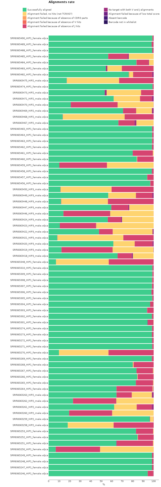
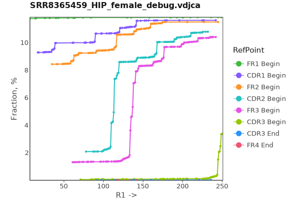
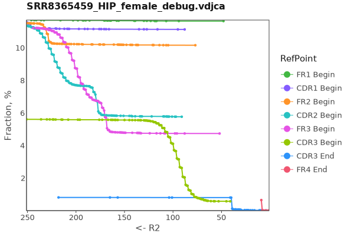

# BIOMED2
Here we will discuss how to process BCR cDNA libraries obtained with BIOMED2 kit.

## Data libraries

This tutorial uses the data from the following publication: *High frequency of shared clonotypes in human B cell receptor repertoires.* Soto C et al., Nature, 2019 Feb;566(7744):398-402
[doi: 10.1038/s41586-019-0934-8](https://doi.org/10.1038/s41586-019-0934-8)

Peripheral blood samples were collected from three donors: HIP1 (female, 47 y.o.), HIP2 (male, 22 y.o.) and HIP3 (male, 29 y.o.). Samples were collected in multiple replicas. Total RNA was extracted from PBMCs and then RT-PCR was utilized to generate BCR amplicon libraries using BIOMED2 multiplex primers. Subsequent libraries were sequenced using next-generation sequencing.

??? tip "Use [aria2c](https://aria2.github.io) for efficient download of the full dataset with the proper filenames:"
    ```shell title="download.sh"
    --8<-- "biomed2-bcr/scripts/010-download-aria2c.sh"
    ```
    ```shell title="download-list.txt"
    --8<-- "biomed2-bcr/scripts/download-list.txt"
    ```

The above script downloads all the data to `raw/` folder. Each file name encodes the data about the donor and its sex. For example for the first file from the above list (`SRR8365468_HIP2_male_R1.fastq.gz`):

- `SRR8365468` - sample id
- `HIP2` - patient id
- `female` - patient sex

The project contains 147 FASTQ file pairs. The structure of sequences is shown on the picture bellow. 

The structure of the library is shown on the picture bellow.


This data is obtained using multiplex mix of V and J primers that can be found [here](https://www.nature.com/articles/s41586-019-0934-8/tables/3). In the original paper, where [Biomed2 primer set was published](https://www.nature.com/articles/2403202) the authors declare that some primers allow upto 2 mismatches. This means that these mismatches will end up in the final sequences and may introduce bias into alignment process.

Briefly:
1. There are 16 primers (complimentary to VH, VK and VL segments). These primers' sequences are located in `FR1`region and the longest primer consists of 32 nucleotides. `R1` is 250bp long and, depending on a certain V gene, it covers the whole V segment upto to the beginning of`CDR3` region.
2. There are 5 primers (complimentary to JH, JK and JL segments). These primers are located in `FR4` and the longest consists of 26 nucleotides. `R2` starts from one of these primers and ends in `FR2`.

Bellow you can see J primers aligned with  IGHJ / IGKL / IGLJ genes sequences.

```shell
# IGHJ

         <---------FR4----------------->
NNNNCTTACCTGAGGAGACGGTGACC												  <- Jh-primer
         CTGAGGAGACGGTGACCAGGGTGCCCTGGCCCCAGTGCTGGAAGTATTCAGC             <- IGHJ1
         CTGAGGAGACAGTGACCAGGGTGCCACGGCCCCAGAGATCGAAGTACCAGTAG            <- IGHJ2
         CTGAAGAGACGGTGACCATTGTCCCTTGGCCCCAGACATCAAAAGCATCA               <- IGHJ3
         CTGAGGAGACGGTGACCAGGGTTCCTTGGCCCCAGTAGTCAAAGTAGT		          <- IGHJ4
         CTGAGGAGACGGTGACCAGGGTTCCTTGGCCCCAGGAGTCGAACCAGTTGT              <- IGHJ5
            AGGAGACGGTGACCGTGGTCCCTTGCCCCCAGACGTCCATACCGTAGTAGTAGTAGTAAT  <- IGHJ6
  
# IGK
     <------------ FR4---------->
  NNNNTTTGATaTCCAccTTGGTCCC                   <- Jk1-primer 
     GTTTGATTTCCACCTTGGTCCCTTGGCCGAACGTCCAC   <- IGKJ1
     GTTTGATCTCCAGCTTGGTCCCCTGGCCAAAAGTGTACA  <- IGKJ2
     GTTTGATATCCACTTTGGTCCCAGGGCCGAAAGTGAAT   <- IGKJ3
     GTTTGATCTCCACCTTGGTCCCTCCGCCGAAAGTGAGC   <- IGKJ4

  NNNNTTTAATCTCCAGTCGTGTCCC                   <- Jk2-primer
     GTTTAATCTCCAGTCGTGTCCCTTGGCCGAAGGTGATC   <- IGKJ5

# IGL
  <------------ FR4---------->
NNNNAGGACGGTGACCTTGGTCCC                  <- Jl1-primer
NNNNAGGACGGTCAGCTgGGTCCC                  <- Jl2-primer
  CTAGGACGGTGACCTTGGTCCCAGTTCCGAAGACATAA  <- IGLJ1
  CTAGGACGGTCAGCTTGGTCCCTCCGCCGAATACCACA  <- IGLJ2
  CTAGGACGGTCAGCTTGGTCCCTCCGCCGAATACCACA  <- IGLJ3*01
  CTAGGACGGTCAGCTTGGTCCCTCCGCCGAACACCCAA  <- IGLJ3*02
  CTAGGACGGTCAGCTCGGTCCCCTCACCAAACACCCAG  <- IGLJ5
  CGAGGACGGTCACCTTGGTGCCACTGCCGAACACATTA  <- IGLJ6
  CTAAAATGATCAGCTGGGTTCCTCCACCAAATACAAAA  <- IGLJ4
  CGAGGACGGTCAGCTGGGTGCCTCCTCCGAACACAGCA  <- IGLJ7
```
What's important, that in all cases there is enough nucleotides, not covered by the primer, for correct J gene identification. Thus, we can use MiXCR to trim primer sequence.

## Upstream analysis

MiXCR has a dedicated preset for this protocol, thus analysing the data ia as easy as:

```shell
--8<-- "biomed2-bcr/scripts/020-upstream-preset.sh"
```

One might also use [GNU Parallel](https://www.gnu.org/software/parallel/) to process all samples at once:

```shell
--8<-- "biomed2-bcr/scripts/020-upstream-preset-parallel.sh"
```

### Under the hood pipeline:

Under the hood `mixcr analyze biomed2-human-bcr-cdr3` executes the following pipeline:

#### `align`
Alignment of raw sequencing reads against reference database of V-, D-, J- and C- gene segments.

```shell
--8<-- "biomed2-bcr/scripts/040-upstream-align.sh"
```

Option `--report` is specified here explicitly.

`--species hsa`
: determines the organism species.

`-p`
: `kAligner2_4.0` a preset of MiXCr parameters which includes kAligner2 (a specialized aligner for BCR data).

`--tag-pattern "^N{32}(R1:*)\^N{26}(R2:*)"`
: With this pattern we trim 32 nucleotides (the length of the longest forward primer) from the beginning of R1 file and 26 nucleotide (the length of the longest reverse primer from the beginning of R2 file.

`-OvParameters.geneFeatureToAlign="VTranscriptWithout5UTRWithP"`
: Sets a V gene feature to align. Check [gene features](../reference/ref-gene-features.md) for more info.

`-OvParameters.parameters.floatingLeftBound=false`
: Results in a global alignment algorithm for V gene left bound. We can use global alignment here, because primer sequences were trimmed with `--tag-pattern`.

`-OjParameters.parameters.floatingRightBound=false`
: Results in a global alignment algorithm for J gene right bound. We can use global alignment here, because primer sequences were trimmed with `--tag-pattern`.

#### `assemble`
Assembles alignments into clonotypes and applies several layers of errors correction(ex. quality-awared correction for sequencing errors, clustering to correct for PCR errors). Check [`mixcr assemble`](../reference/mixcr-assemble.md) for more information. By default clones will be assembled by `CDR3` gene feature.


```shell
--8<-- "biomed2-bcr/scripts/050-upstream-assemble.sh"
```

`-OseparateByV=true`
: Split clones with the same `CDR3` sequence and different V-genes

`-OseparateByJ=true`
: Split clones with the same `CDR3` sequence and different J-genes

#### `export`
Exports clonotypes from .clns file into human-readable tables.

```shell
--8<-- "biomed2-bcr/scripts/050-upstream-exportClones.sh"
```

Here `-p full` defines the full preset of common export columns. Check [`mixcr export`](../reference/mixcr-export.md) for more information.

`-с <chain>`
: defines a specific chain to be exported.

After execution is complete the following list of files is generated for every sample:

```shell
# human-readable reports 
SRR8365468_HIP2_male.report
# raw alignments (highly compressed binary file)
SRR8365468_HIP2_male.vdjca
# IGH, IGK and IGL CDR3 clonotypes (highly compressed binary file)
SRR8365468_HIP2_male.clns
# IGH, IGK and IGL CDR3 clonotypes exported in tab-delimited txt
SRR8365468_HIP2_male.IGH.tsv
SRR8365468_HIP2_male.IGL.tsv  
SRR8365468_HIP2_male.IGK.tsv  
```

While `.clns` file holds all data and is used for downstream analysis using [`mixcr postanalisis`](../reference/mixcr-postanalysis.md), the output `.tsv` clonotype table will contain exhaustive information about each clonotype as well:

??? tip "See first 100 records from clonotype table SRR8365468_HIP2_male:"
    {{ read_csv('docs/mixcr/guides/biomed2-bcr/figs/SRR8365468_HIP2_male.clonotypes.IGH.tsv', engine='python', sep='\t') }}

## Quality control 

Now when we have all files processed lets perform Quality Control. The first thing to check is the alignment rate. That can be easily done using [`mixcr exportQc align`](../reference/mixcr-exportQc.md#alignment-reports) function.

```shell
--8<-- "biomed2-bcr/scripts/080-qc-align.sh"
```



Here we can see a percentage of successfully aligned reads for every sample as well as the percentage of reads that failed to align for various reasons. Some samples have a good alignment rate (more than 90%).  But a lot of samples had some issues that lead to an alignment as low as 10-20%. Two major reasons for that outcome according to the plot are:

- the lack of TCR/IG sequence
- absence of J hits

Let's take one of the bad quality samples (ex. SRR8365459_HIP1_female) and examine it. To look at the reads' alignments for that sample we first will run [`mixcr align`](../reference/mixcr-align.md) command for that sample once again, but this time we will specify additional options (`-OallowPartialAlignments=true -OallowNoCDR3PartAlignments=true`) that will preserve partially aligned reads (ex. reads that may lack J gene) and reads that lack `CDR3` sequence.

```shell
--8<-- "biomed2-bcr/scripts/090-qc-debug-align.sh"
```

Now, when we have a new `.vdjca` file let's visualize how reads cover FRs and CDRs regions for that sample.

```shell
--8<-- "biomed2-bcr/scripts/100-qc-coverage.sh"
```

This will generate three `.pdf` formatted plots: `R1` alignment, `R2` alignment and alignment of overlapped reads. These plots can tell us the percentage of reads that cover each region at a certain position. Briefly, for this sample, only those reads that overlap show a good coverage pattern.

=== "R1"
    
=== "R2"
    
=== "Overlap"
    

Finally, we can look at raw alignments using [`mixcr exportAlignmentsPretty`](../reference/mixcr-exportPretty.md#raw-alignments).

The function bellow will generate a `.txt` human-readable file with alignments. We use parameter `--skip 1000` to skip first 1000 reads, as first reads usually have bad quality, and `--limit 100` will export only 100 alignments as we usually don't need to examine every alignment to see the issue. 

```shell
--8<-- "biomed2-bcr/scripts/110-qc-exportAlignmentsPretty.sh"
```

Bellow you can see a few alignments from the generated file. The first one is an example of well aligned read.

```shell
>>> Read ids: 1840


                                     FR1><CDR1              CDR1><FR2                               
                _ L  R  L  S  C  A  A  S  G  F  T  L  S  D  Y  Y  M  S  W  I  R  Q  A  P  G  K      
    Quality     77767826778888888888888887788888888888878888888888888887888778888888888888887878    
    Target0   0 CCTGAGACTCTCCTGTGCAGCCTCTGGATTCACCTTGAGTGACTACTACATGAGCTGGATCCGCCAGGCTCCAGGGAAGG 79   Score
IGHV3-11*00 107 cctgagactctcctgtgcagcctctggattcaccttCagtgactactacatgagctggatccgccaggctccagggaagg 186  2102

                                FR2><CDR2              CDR2><FR3                                    
                G  L  E  W  V  S  H  I  S  G  S  G  N  T  I  D  Y  A  D  S  V  K  G  R  F  T  I     
    Quality     88788887778888888888887788888888888888888888888888888888887888888888888888888888    
    Target0  80 GGCTGGAGTGGGTTTCACACATTAGTGGCAGTGGTAATACCATAGACTACGCAGACTCTGTGAAGGGCCGATTCACCATC 159  Score
IGHV3-11*00 187 ggctggagtgggtttcaTacattagtAgTagtggtaGtaccataTactacgcagactctgtgaagggccgattcaccatc 266  2102

                                                                                       FR3><CDR3    
                 S  R  D  N  A  K  N  S  L  Y  L  Q  M  N  S  L  R  D  D  D  T  A  V  F  Y  C  A    
    Quality     88888888888888888888888888888888888888888888888888888888888888888888888887888788    
    Target0 160 TCCAGGGACAACGCCAAGAACTCGCTCTATCTGCAAATGAACAGCCTGAGAGACGACGACACGGCCGTGTTTTATTGTGC 239  Score
IGHV3-11*00 267 tccagggacaacgccaagaactcActGtatctgcaaatgaacagcctgagagCcgaGgacacggccgtgtAttaCtgtgc 346  2102

                   V>  <D     D>   <J  CDR3><FR4                       FR4>             
                  R  G  R  Y  A  L  D  Y  W  G  Q  G  T  R  V  T  V  S  S _             
    Quality     88878788888888788888888888888888888888888888888888888888888888877776    
    Target0 240 GAGAGGCCGTTATGCCCTAGATTATTGGGGCCAGGGAACCCGGGTCACCGTCTCCTCAGGTAAGCCCC 307  Score
IGHV3-11*00 347 gagag                                                                351  2102
IGHD3-16*00  65        cgttatAcc                                                     73   31
 IGHD2-2*00  56           tatgcc                                                     61   30
IGHD3-10*00  61        cgttat                                                        66   30
   IGHJ4*00  28                    gaCtaCtggggccagggaacccTggtcaccgtctcctcag          67   313
   IGHJ5*00  37                          tggggccagggaacccTggtcaccgtctcctcag          70   311

```

Now, the following alignment is a troubled one. And for this particular sample the majority of alignments look similar. We can see that one read does not align to any reference sequences and has a lot of low-quality nucleotides.

```shell
>>> Read ids: 1853


                                                                                             
Quality   25762677888767572572527252276555757625555572625275777255225225525252725222252552   
Target0 0 CGGCATTCCTGCTGAAACGAGATCGGAAGAGCGTCGTGTAGGGAAAGAGTGTAGATCTCGGTGGTCGCCGTCACATTAAA 79  Score

                                                                                               
Quality    57222255256566257772557225555565256777672262255775556255567762277262262677727762    
Target0 80 AAAAAAAACCAGCAGTGATGTTGGCAGTTATGACTATGTCTCCTGGTACCAACAGCACCCAGGCACAGTCTCCAAACCCA 159  Score

                                                                                                
Quality     42222547622525426677662772660000000000000000000000000000000000000000000000000000    
Target0 160 TGACGTACAATGACAATACTCAGCCCTCAGGGGTCCCTGATCGATTCTCTGGCTTCAAGTCTGGCAATACGCCCTCCATG 239  Score

                           
Quality     00000000000    
Target0 240 ACCATCCTTAG 250  Score

                                                                                        CDR2><F    
                            CDR1><FR2                                           FR2><CDR2          
                F  G  S  Y  V  Y  V  S  W  Y  Q  Q  H  S  S  T  V  P  K  P  M  I  D  N  V  N  T    
   Quality     00000000000000000000000000000000000000000006247675667452527762544226662675276772    
   Target1   0 TTTGGGAGTTATGTCTATGTCTCCTGGTACCAACAGCACTCAAGCACAGTCCCCAAACCCATGATCGACAATGTCAATAC 79   Score
IGLV2-5*00 141  ttgggagttatgActatgtctcctggtaccaacagcacCcaGgcacagtccccaaacccatgatcTacaatgtcaatac 219  1445

               R3                                                                                  
                                                                                                   
                 Q  P  S  G  V  P  D  R  F  S  G  S  K  S  G  N  T  A  S  M  T  I  S  G  L  *      
   Quality     22262275272725267265252267676726267252555266222725267626677675277777757552652222    
   Target1  80 TCAGCCCTCAGGGGTCCCTGATCGTTTCTCTGGCTCCAAGTCTGGCAATACGGCCTCCATGACCATCTCTGGACTCTAGG 159  Score
IGLV2-5*00 220 tcagccctcaggggtccctgatcgtttctctggctccaagtctggcaatacggcctccatgaccatctctggactcCagg 299  1445

                                                                                                
                                                                                                
            V  Y  K  Q  K  T  A  Y  E  C  Q  S  R  S  R  H  S  C  *  T  A  L  P  I  S  A  F     
Quality     55222252675222525222752252222225622525266672252275226775565552222577665575255625    
Target1 160 TTTACAAGCAGAAGACGGCATACGAGTGCCAGTCCCGGTCTCGGCATTCCTGCTGAACCGCTCTTCCGATCTCGGCATTC 239  Score

                           
                           
             L  L  T _     
Quality     72552252777    
Target1 240 CTGCTGACCCG 250  Score

```

Another quality report we should investigate is chain abundance plot.

```shell
--8<-- "biomed2-bcr/scripts/120-qc-chainUsage.sh"
```


From that plot we can see another issue. According to the publication, the data was generated using a V and J primers  multiplex protocol in such a way that every sample should have sequences for both heavy and light IG chains. But we see, that most samples have only one of the chains present in the sample, and those samples that have both still have a unexpected distribution, which has to be about 50\50, as every cell has both chains.


## Full-length clonotype assembly

Biomed2 BCR protocol allows to recover a broader BCR receptor sequence then just `CDR3` region. According to the protocol, forward primers are located in `FR1` region, thus we can safely use an assembling feature that starts from `CDR1` and be sure that no primers will affect the original sequence. The reverse primers are located in `FR4` region very close to `CDR3`, thus there is not much left from to include in clone assembly.

Taking into account what is mentioned above, the longest possible assembling feature for this protocol is `"{CDR1Begin:CDR3End}"`.

MiXCR has a specific preset to obtain full-length BCR clones with Biomed2 protocol:

```shell
--8<-- "biomed2-bcr/scripts/130-upstream-preset-full-length.sh"
```

The `mixcr assemble` step in this preset differs from the one above in the following manner:

```shell
--8<-- "biomed2-bcr/scripts/140-upstream-assemble-full-length.sh
```

`-OassemblingFeatures="{CDR1Begin:CDR3End}"`
: sets the assembling feature to the region which starts from `CDR1Begin` and ends at the end of `CDR3`.

Notice that we do not use `-OseparateByV=true` in this case because assembling feature already covers most of the V regions, thus in case if clones have identical `CDR3` they will still be separated.

## Reports

Finally, MiXCR provides a very convenient way to look at the reports generated at ech step. Every `.vdjca`, `.clns` and `.clna` file holds all the reports for every MiXCR function that has been applied to this sample. E.g. in our case `.clns` file contains reports for `mixcr align` and `mixcr assemble`. To output this report use [`mixcr exportReports`](../reference/mixcr-exportReports.md) as shown bellow. Note `--json` parameter will output a JSON-formatted report.

```shell
--8<-- "biomed2-bcr/scripts/125-qc-exportReports.sh"
```

```shell
--8<-- "biomed2-bcr/scripts/125-qc-exportReports-json.sh"
```

??? "Show report file"
    === "`.txt`"
        ```shell
        --8<-- "biomed2-bcr/figs/SRR8365468_HIP2_male.report.txt"
        ```
    === "`.json`"
        ```json
        --8<-- "biomed2-bcr/figs/SRR8365468_HIP2_male.report.json"
        ```