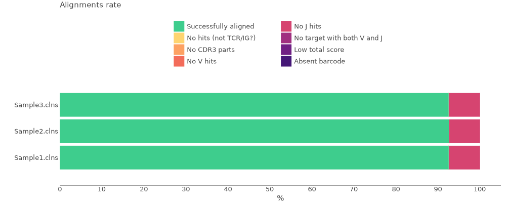
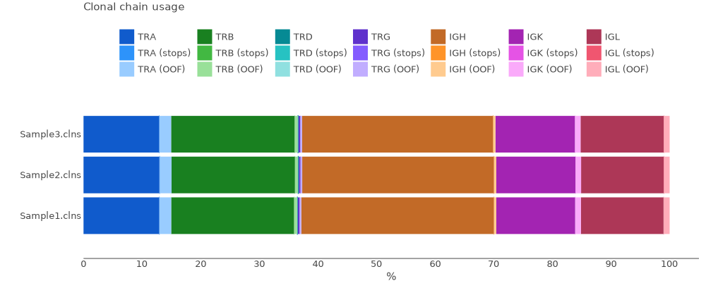

# DriverMap Adaptive Immune Receptor (AIR) TCR-BCR Profiling

Cellecta’s DriverMap™ AIR TCR-BCR assay is designed to specifically amplify only functional CDR3 RNA molecules' TCR and BCR cells, avoiding non-functional pseudogenes with similar structures. The assay simultaneously amplifies, in a single, multiplex RT-PCR reaction, all TCR and BCR CDR3 regions using a set of 300 experimentally validated PCR primers to yield Illumina-compatible, next-generation sequencing (NGS) libraries.

Bellow you can see the structure of cDNA library.


The data for this tutorial consists of three samples. Total RNA was isolated from human PBMC. cDNA libraries were prepared for each sample from 50ng of RNA according to Cellecta’s DriverMap™ AIR TCR-BCR assay protocol for all IGH chain. Sequencing was performed on an Illumina NextSeq500 sequencer paired-end 2x150 bp reads.

All data may be downloaded using the script bellow.

??? tip "Use [aria2c](https://aria2.github.io) for efficient download of the full dataset with the proper filenames:"
    ```shell title="download.sh"
    --8<-- "guides/cellecta-air-tcr-bcr/scripts/010-download-aria2c.sh"
    ```
    ```shell title="download-list.txt"
    --8<-- "guides/cellecta-air-tcr-bcr/scripts/download-list.txt"
    ```
## Upstream analysis

### One-line solution

MiXCR has a dedicated preset for this protocol, thus analysing the data is as easy as:

```shell
--8<-- "guides/cellecta-air-tcr-bcr/scripts/020-upstream-preset.sh"
```

Running the command above will generate the following files:

```shell
> ls result/

# human-readable reports 
Sample1.align.report.txt
Sample1.align.report.json
Sample1.refine.report.txt
Sample1.refine.report.json
Sample1.assemble.report.txt
Sample1.assemle.report.json

# raw alignments (highly compressed binary file)
Sample1.vdjca

#Alignments with corrected barcode after ```mixcr refineTagsAndSort```
Sample1.refined.vdjca

# TCR and BCR CDR3 clonotypes (highly compressed binary file)
Sample1.clns

# TCR and BCR CDR3 clonotypes exported in tab-delimited txt
Sample1.clones_IGH.tsv
Sample1.clones_IGK.tsv
Sample1.clones_IGL.tsv
Sample1.clones_TRAD.tsv
Sample1.clones_TRB.tsv
```

While `.clns` file holds all data and is used for downstream analysis using [`mixcr postanalisis`](../reference/mixcr-postanalysis.md), the output `.txt` clonotype table will contain exhaustive information about each clonotype as well:

??? tip "See first 500 records from Sample1.clones_IGH.tsv clonotype table"
    {{ read_csv('docs/mixcr/guides/cellecta-air-tcr-bcr/figs/Sample1.clones_IGH.tsv', engine='python', sep='\t') }}

In order to run the analysis for all samples in the project on Linux we can use [GNU Parallel](https://www.gnu.org/software/parallel/) in the following way:

```shell
--8<-- "guides/cellecta-air-tcr-bcr/scripts/021-upstream-preset-parallel.sh"
```

### Under the hood pipeline

Under the hood `cellecta-air-human` preset actually executes the following pipeline:

#### `align`
[Alignment](../reference/mixcr-align.md) of raw sequencing reads against reference database of V-, D-, J- and C- gene segments.

```shell
--8<-- "guides/cellecta-air-tcr-bcr/scripts/030-upstream-align.sh"
```

Option `--report` and `--json-report` are specified here explicitly.

`--species hsa`
: determines the organism species (hsa for _Homo Sapiens_).

`-p generic-amplicon-with-umi`
:  a preset of MiXCR parameters for amplicon data and defines required parameters for UMI correction.

`-tag-pattern '^(R1:*) \ ^(UMI:N{14})'`
: this pattern marks the UMI region and ensures primer sequences trimming. 

`--rna`
: Sets a V gene feature to align to `VTranscriptWithP`. Check [gene features](../reference/ref-gene-features.md) for more info.

`-OvParameters.parameters.floatingLeftBound=true`
: Results in a local alignment algorithm for V gene left bound due to the primer sequence presence.

`-OjParameters.parameters.floatingRightBound=false`
: Results in a global alignment algorithm for J gene right bound.

`-OcParameters.parameters.floatingRightBound=true`
: Results in a local alignment algorithm for C gene right bound due to the primer sequence presence.


#### `refineTagsAndSort`

[Corrects](../reference/mixcr-refineTagsAndSort.md) sequencing and PCR errors _inside_ barcode sequences. This step does extremely important job by correcting artificial diversity caused by errors in barcodes. In the considered example project it corrects only sequences of UMIs.

!!! note
    The `bundle-umi-kaligner2-v1-base` preset specified at the `mixcr align` step will turn on the automatic filtering of reads during this step. The filtering is based on the Otsu's method and automatically sets the threshold for number of reads per UMI. Only those UMIs that pass the threshold will be used in further analysis.

```shell
--8<-- "guides/cellecta-air-tcr-bcr/scripts/040-upstream-refineTagsAndSort.sh"
```

#### `assemble`
[Assembles](../reference/mixcr-assemble.md) clonotypes and applies several layers of errors correction:

- quality-dependent correction for sequencing errors
- PCR-error correction by clustering
- UMI-based error correction

Check [`mixcr assemble`](../reference/mixcr-assemble.md) for more information.


```shell
--8<-- "guides/cellecta-air-tcr-bcr/scripts/050-upstream-assemble.sh"
```

Options `--report` and `--json-report` are specified here explicitly so that the report files will be appended with assembly report.

`-OassemblingFeatures=CDR3`
: This option is specified here explicitly as by default the clones are assembled by `CDR3` sequence.

#### `export`
Exports clonotypes from .clns file into human-readable tables. The preset used at the alignment step also modifies this command to export UMIs counts and fraction for each clone.

```shell
--8<-- "guides/cellecta-air-tcr-bcr/scripts/060-upstream-exportClones.sh"
```

## Quality control

Now when we have all files processed lets perform Quality Control. That can be easily done using [`mixcr exportQc`](../reference/mixcr-exportQc.md)
function.

First we will look at the alignment report:

```shell
--8<-- "guides/cellecta-air-tcr-bcr/scripts/070-qc-align.sh"
```



From this plot we can tell that all samples have high alignment rate and ьщку еруфт 90% of all reads from each sample have been successfully aligned to the reference sequences and CDR3 has been established. 

Now we can check chains distribution plot:

```shell
--8<-- "guides/cellecta-air-tcr-bcr/scripts/080-qc-chainUsage.sh"
```



We clearly see that for every sample 5 chains were obtained (TRA,TRB,IGH,UGK,IGL)

## Reports
Finally, MiXCR provides a very convenient way to look at the reports generated at ech step. Every `.vdjca`, `.clns` and `.clna` file holds all the reports for every MiXCR function that has been applied to this sample. E.g. in our case `.clns` file contains reports for `mixcr align` and `mixcr assemble`. To output this report use [`mixcr exportReports`](../reference/mixcr-exportReports.md) as shown bellow. Note `--json` parameter will output a JSON-formatted report.

```shell
--8<-- "guides/cellecta-air-tcr-bcr/scripts/100-qc-exportReports.sh"
```

```shell
--8<-- "guides/cellecta-air-tcr-bcr/scripts/101-qc-exportReports-json.sh"
```

??? "Show report file"
    === "`.txt`"
        ```shell
        --8<-- "guides/cellecta-air-tcr-bcr/figs/Sample1.report.txt"
        ```
    === "`.json`"
        ```json
        --8<-- "guides/cellecta-air-tcr-bcr/figs/Sample1.report.json"
        ```