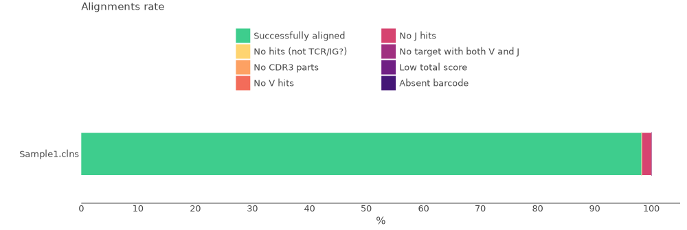
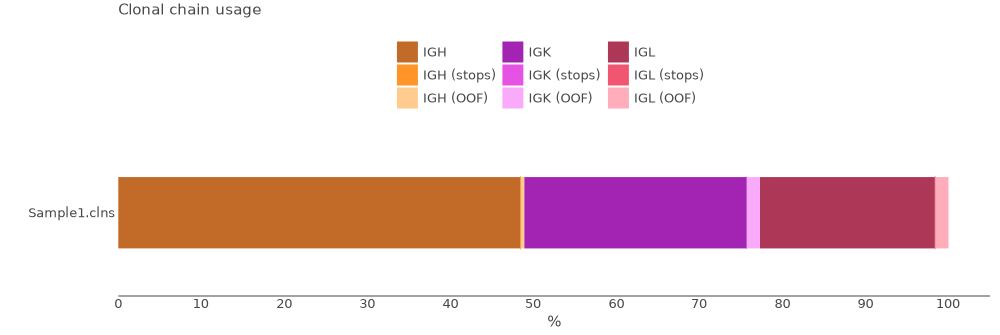
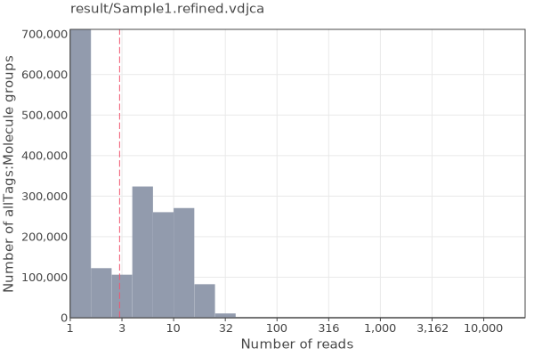

# DriverMap AIR TCR-BCR (Full-Length Variable Region) Profiling

The DriverMap™ AIR TCR-BCR Profiling Kit combines multiplexed RT-PCR amplification with the depth and precision of Next-Generation Sequencing (NGS) to quantitatively measure gene expression and analyze RNA sequences of all functional immune receptor mRNA isoforms for TCR chains (TRA, TRB, TRD, TRG) and BCR chains (IGH, IGK, and IGL) with the exclusion of non-functional pseudogenes and ORFs.

The AIR assay allows profiling the repertoire of full-length receptor regions (CDR1, CDR2, and CDR3) using a set of experimentally validated forward primers (designed for variable FR1 region), and reverse primers (designed for the conserved C region) of TCR and BCR mRNAs. Two sets of AIR primers specific for TCR (TRA, TRB, TRD, and TRG) and BCR (IGH, IGL, and IGK) chains are provided separately in AIR reagent kits to allow profiling AIR repertoires individually for TCRs or BCRs or together in a single reaction. Profiling the full-length receptor region gives a complete picture of all the CDR1, CDR2, and CDR3 variable region repertoire diversity which is useful for understanding epitope recognition for T-cells and antibody discovery applications for B cells.

Bellow you can see the structure of cDNA library.


The data for this tutorial consists of one sample prepared according to the manufacturer's protocol.

All data may be downloaded using the script bellow.

??? tip "Use [aria2c](https://aria2.github.io) for efficient download of the full dataset with the proper filenames:"
    ```shell title="download.sh"
    --8<-- "guides/cellecta-human-rna-xcr-full-length-umi-drivermap-air/scripts/010-download-aria2c.sh"
    ```
    ```shell title="download-list.txt"
    --8<-- "guides/cellecta-human-rna-xcr-full-length-umi-drivermap-air/scripts/download-list.txt"
    ```
## Upstream analysis

MiXCR has a dedicated preset for this protocol, thus analysing the data is as easy as:

```shell
--8<-- "guides/cellecta-human-rna-xcr-full-length-umi-drivermap-air/scripts/020-upstream-preset.sh"
```

Running the command above will generate the following files:

```shell
> ls result/

# human-readable reports 
Sample1.align.report.txt
Sample1.align.report.json
Sample1.refine.report.txt
Sample1.refine.report.json
Sample1.assemble.report.txt
Sample1.assemle.report.json

# raw alignments (highly compressed binary file)
Sample1.vdjca

#Alignments with corrected barcode after ```mixcr refineTagsAndSort```
Sample1.refined.vdjca

# TCR and BCR CDR3 clonotypes (highly compressed binary file)
Sample1.clns

# TCR and BCR CDR3 clonotypes exported in tab-delimited txt
Sample1.clones_IGH.tsv
Sample1.clones_IGK.tsv
Sample1.clones_IGL.tsv
Sample1.clones_TRAD.tsv
Sample1.clones_TRB.tsv
```

While `.clns` file holds all data and is used for downstream analysis using [`mixcr postanalisis`](../reference/mixcr-postanalysis.md), the output `.txt` clonotype table will contain exhaustive information about each clonotype as well:

??? tip "See the top 500 records from Sample1.clones_IGH.tsv clonotype table"
    {{ read_csv('docs/mixcr/guides/cellecta-human-rna-xcr-full-length-umi-drivermap-air/figs/Sample1.clones_IGH.tsv', engine='python', sep='\t') }}


## Quality control

Now let's look at the QC plots. That can be easily done using [`mixcr exportQc`](../reference/mixcr-exportQc.md)
function.

First we will look at the alignment report:

```shell
--8<-- "guides/cellecta-human-rna-xcr-full-length-umi-drivermap-air/scripts/070-qc-align.sh"
```



From this plot we can tell that all samples have high alignment rate and nearly 90% of all reads from each sample have been successfully aligned to the reference sequences and CDR3 has been established. 

Now we can check chains distribution plot:

```shell
--8<-- "guides/cellecta-human-rna-xcr-full-length-umi-drivermap-air/scripts/080-qc-chainUsage.sh"
```



Finally, we can take a look at the reads per UMI distribution.

```shell
--8<-- "guides/cellecta-human-rna-xcr-full-length-umi-drivermap-air/scripts/090-qc-tags.sh"
```




## Reports
Finally, MiXCR provides a very convenient way to look at the reports generated at ech step. Every `.vdjca`, `.clns` and `.clna` file holds all the reports for every MiXCR function that has been applied to this sample. E.g. in our case `.clns` file contains reports for `mixcr align` and `mixcr assemble`. To output this report use [`mixcr exportReports`](../reference/mixcr-exportReports.md) as shown bellow. Note `--json` parameter will output a JSON-formatted report.

```shell
--8<-- "guides/cellecta-human-rna-xcr-full-length-umi-drivermap-air/scripts/100-qc-exportReports.sh"
```

```shell
--8<-- "guides/cellecta-human-rna-xcr-full-length-umi-drivermap-air/scripts/101-qc-exportReports-json.sh"
```

??? "Show report file"
    === "`.txt`"
        ```shell
        --8<-- "guides/cellecta-human-rna-xcr-full-length-umi-drivermap-air/figs/Sample1.report.txt"
        ```
    === "`.json`"
        ```json
        --8<-- "guides/cellecta-human-rna-xcr-full-length-umi-drivermap-air/figs/Sample1.report.json"
        ```