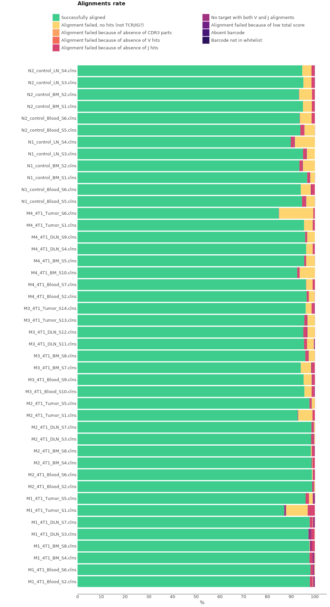
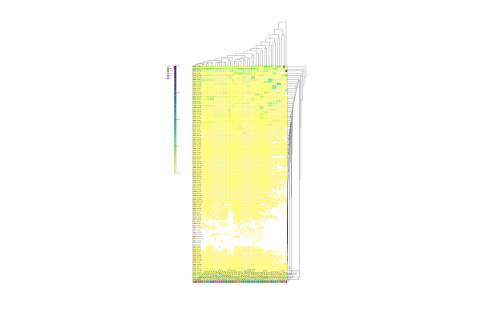

# Multiplex BCR cDNA libraries

For this tutorial we will use the data published in the following article:

Aizik L, Dror Y, Taussig D, Barzel A, Carmi Y, Wine Y. Antibody *Repertoire Analysis of Tumor-Infiltrating B Cells Reveals Distinct Signatures and Distributions Across Tissues.* Front Immunol. 2021 Jul 19;12:705381. [doi: 10.3389/fimmu.2021.705381](https://doi.org/10.3389%2Ffimmu.2021.705381). PMID: 34349765; PMCID: PMC8327180.

## Experiment setting

BALB/C mice were injected subcutaneously into mammary fat-pad number five with 2×105 4T1 cells suspended in 30 µl of DMEM (Gibco, Thermo Fisher Scientific). The induced tumors were monitored by measuring their size twice a week using calipers. After 23 days, mice were sacrificed, and B cells were isolated from four tissue types, namely, bone marrow, blood, DLNs, and tumors. For the control mice, three tissue types were collected - bone marrow, blood, and lymph nodes. Lymphocytes were isolated from every sample. For all tissues, cells were then incubated with a mixture of anti-IgG, anti-IgM, anti-CD138 magnetic beads. Later, total RNA was isolated following by first-strand cDNA synthesis using SuperScript™ III First-Strand Synthesis System with 200 ng RNA as the template and Oligo (dT) primers. After cDNA synthesis, PCR amplification of the variable heavy Ig genes was performed using a set of 19 forward primers with the gene-specific regions annealing to framework 1 of the VDJ-region and two reverse primers with the gene-specific region binding to the IgG and IgM constant regions. Recovered DNA products from the first PCR was applied to a second PCR amplification to attach Illumina adaptors to the amplified VH genes using the primer extension method.
Technical replicates (two per sample) of BCR-Seq libraries were prepared based on cDNA from each mouse/tissue. cDNA was split, and library preparation was performed in parallel with different Illumina indices as described above. cDNA libraries were subjected to NGS on the MiSeq platform with the reagent kit V3 2 × 300 bp paired-end (Illumina).


??? note "Show primers"
    ```shell
    # PCR1 Forward primers
    # Primers include step-out(glue) sequence and gene specific region
    
    m-VH-glue-Fw1   CCCTCCTTTAATTCCCGAKGTRMAGCTTCAGGAGTC
    m-VH-glue-Fw2   CCCTCCTTTAATTCCCGAGGTBCAGCTBCAGCAGTC
    m-VH-glue-Fw3   CCCTCCTTTAATTCCCCAGGTGCAGCTGAAGSASTC
    m-VH-glue-Fw4   CCCTCCTTTAATTCCCGAGGTCCARCTGCAACARTC
    m-VH-glue-Fw5   CCCTCCTTTAATTCCCCAGGTYCAGCTBCAGCARTC
    m-VH-glue-Fw6   CCCTCCTTTAATTCCCCAGGTYCARCTGCAGCAGTC
    m-VH-glue-Fw7   CCCTCCTTTAATTCCCCAGGTCCACGTGAAGCAGTC
    m-VH-glue-Fw8   CCCTCCTTTAATTCCCGAGGTGAASSTGGTGGAATC
    m-VH-glue-Fw9   CCCTCCTTTAATTCCCGAVGTGAWGYTGGTGGAGTC
    m-VH-glue-Fw10  CCCTCCTTTAATTCCCGAGGTGCAGSKGGTGGAGTC
    m-VH-glue-Fw11  CCCTCCTTTAATTCCCGAKGTGCAMCTGGTGGAGTC
    m-VH-glue-Fw12  CCCTCCTTTAATTCCCGAGGTGAAGCTGATGGARTC
    m-VH-glue-Fw13  CCCTCCTTTAATTCCCGAGGTGCARCTTGTTGAGTC
    m-VH-glue-Fw14  CCCTCCTTTAATTCCCGARGTRAAGCTTCTCGAGTC
    m-VH-glue-Fw15  CCCTCCTTTAATTCCCGAAGTGAARSTTGAGGAGTC
    m-VH-glue-Fw16  CCCTCCTTTAATTCCCCAGGTTACTCTRAAAGWGTSTG
    m-VH-glue-Fw17  CCCTCCTTTAATTCCCCAGGTCCAACTVCAGCARCC
    m-VH-glue-Fw18  CCCTCCTTTAATTCCCGATGTGAACTTGGAAGTGTC
    m-VH-glue-Fw19  CCCTCCTTTAATTCCCGAGGTGAAGGTCATCGAGTC
    
    # PCR1 Reverse primers
    # Primers inglude step-out(glue) sequence and gene specific region
    
    m-IgMC-BC-glue-REV      GAGGAGAGAGAGAGAGCGTGATCGAGGGGGAAGACATTTGGG
    m-IgGall-BC-glue-REV    GAGGAGAGAGAGAGAGACATCGCCARKGGATAGACHGATGGG
    
    # PCR2 Forward primer
    # Primer ingludes Universal trueSeq Illumina adaptor and glue sequence from PCR1 forward primers
    
    PE-IgALL-Univ-FW    AATGATACGGCGACCACCGAGATCTACACTCTTTCCCTACACGACGCTCTTCCGATCTNNNNCCCTCCTTTAATTCCC
    
    # PCR2 Reverse primer
    # Primer ingludes Universal trueSeq Illumina adaptor and glue sequence from PCR1 reverse primers
    
    YW23X_PE-Idx-REV    CAAGCAGAAGACGGCATACGAGATNNNNNNGTGACTGGAGTTCAGACGTGTGCTCTTCCGATCTNNNNGAGGAGAGAGAGAGAG
    ```

All data may be downloaded using the script bellow.

??? tip "Use [aria2c](https://aria2.github.io) for efficient download of the full dataset with the proper filenames:"
    ```shell title="download.sh"
    --8<-- "guides/generic-multiplex-bcr/scripts/010-download-aria2c.sh"
    ```
    ```shell title="download-list.txt"
    --8<-- "guides/generic-multiplex-bcr/scripts/download-list.txt"
    ```

## One command Solution

The easiest way to obtain clonotype tables for this type of data is to use a universal [`mixcr analyze`](../reference/mixcr-analyze.md) command.
This is a BCR data, so we will use a preset called `generic-amplicon`.

The exact command for a single sample you can see bellow:

```shell
--8<-- "guides/generic-multiplex-bcr/scripts/020-upstream-example.sh"
```

The meaning of these options is the following.

`--species`
:   is set to `mmu` for _Mus Musculus_

`--rna`
:   corresponds to `VTranscriptWithout5UTRWithP` alignment feature for V-gene (see [Gene features and anchor points](../reference/ref-gene-features.md) for details)

`--rigid-left-alignment-boundary`
:   leads to a global alignment algorithms to align the left bound of V gene because primer sequences are trimmed with tagPattern. This options sets
`-OvParameters.parameters.floatingLeftBound=false` for `mixcr align` step of the pipeline.

`--rigid-right-alignment-boundary`
:  sets `-OjParameters.parameters.loatingRightBound=false -OcParameters.parameters.floatingRightBound=true` for `mixcr align` step of the pipeline to ensure global alignment on the right bound of bot J and C gene. Global alignment should be used when primer sequences have been trimmed.

`--tag-pattern ^N{4}ccctcctttaattcccN{22}(R2:*)\^N{4}gaggagagagagagagN{26}(R1:*)`
:  This tag-pattern trims all adapter and primer sequences from both reads.

`--assemble-clonotypes-by {CDR1Begin:FR4End}`
:  sets `-OassemblingFeatures={CDR1Begin:FR4End}` for [`mixcr assemble`](../reference/mixcr-assemble.md) step. We extend the assembling feature to start from `CDR1`. That is because this is BCR data, where hypermutations occur throughout V gene, and we want to capture as much as we can.

`raw/M1_4T1_replica1_Blood_R1.fastq.gz raw/M1_4T1_replica1_Blood_R2.fastq.gz results/M1_4T1_replica1_Blood`
:   Finally, we provide the names of input files and an output prefix:


Running the command above will generate the following files:
```shell
> ls result/

# human-readable reports 
M1_4T1_replica1_Blood.align.report.txt
M1_4T1_replica1_Blood.align.report.json
M1_4T1_replica1_Blood.assemble.report.txt
M1_4T1_replica1_Blood.assemble.report.json

# raw alignments (highly compressed binary file)
M1_4T1_replica1_Blood.vdjca

# CDR3 clonotypes (highly compressed binary file)
M1_4T1_replica1_Blood.clns

# CDR3 clonotypes exported in tab-delimited txt
M1_4T1_replica1_Blood.clones.tsv
```

While `.clns` file holds all data and is used for downstream analysis using [`mixcr postanalisis`](../reference/mixcr-postanalysis.md), the output `.tsv` clonotype table will contain exhaustive information about each clonotype as well:

??? tip "See first 100 records from FebControl1.clones.IGH.tsv clonotype table"
    {{ read_csv('docs/mixcr/guides/generic-multiplex-bcr/figs/M1_4T1_replica1_Blood.clones.tsv', engine='python', sep='\t', nrows=100) }}

Now, since we have multiple files ist easier to process them all together instead of running the same command multiple times. One of the ways to achieve it is to use [GNU Parallel](https://www.gnu.org/software/parallel/): 

```shell
--8<-- "guides/generic-multiplex-bcr/scripts/030-upstream-parallel.sh"
```

## Under the hood

Under the hood, the command from above actually executes the following pipeline of MiXCR actions:

#### `align`

[Performs](../reference/mixcr-align.md):

- alignment of raw sequencing reads against reference database of V-, D-, J- and C- gene segments
- pattern matching of tag pattern sequence and extraction of barcodes


```shell
--8<-- "guides/generic-multiplex-bcr/scripts/040-upstream-align.sh"
```

Options `--report` and `--json-report` are specified here explicitly. 

This step utilizes all available CPUs and scales perfectly. When there are a lot of CPUs, the only limiting factor is the speed of disk I/O. To limit the number of used CPUs one can pass `--threads N` option.

#### `assemble`

[Assembles](../reference/mixcr-assemble.md) clonotypes and applies several layers of errors correction:

- assembly consensus CDR3 sequence
- quality-awared correction for sequencing errors
- clustering to correct for PCR errors

```shell
--8<-- "guides/generic-multiplex-bcr/scripts/060-upstream-assemble.sh"
```

Options `--report` and `--json-report` are specified here explicitly so that the report files will be appended with assembly report.

#### `exportClones`

Finally, to [export](../reference/mixcr-export.md#clonotype-tables) clonotype tables in tabular form `exportClones` is used:

```shell
--8<-- "guides/generic-multiplex-bcr/scripts/070-upstream-exportClones.sh"
```

## Quality control

Now when the upstream analysis is finished we can move on to quality control. First lets look at the alignment report plot.

```shell
--8<-- "guides/generic-multiplex-bcr/scripts/080-qc-align.sh"
```



We see that all samples have a very high score of successfully aligned reads. No significant issues present.

Next, lets look at the chain usage distribution.

```shell
--8<-- "guides/generic-multiplex-bcr/scripts/120-qc-chainUsage.sh"
```


We don't see any contamination from other Ig chains. As expected, all samples consist only of IGH chains.

## Downstream analysis

There are two types of basic downstream analysis: _individual_ and _overlap_. Individual computes CDR3 metrics, diversity  and gene usage metrics for each dataset. Overlap computes statistical metrics of repertoire overlap. In both cases MiXCR applies appropriate sample normalization.

To run postanalysis routines we need to prepare a metadata file in a .tsv or .csv form. Metadata must contain a `sample` column which will be used to match metadata with cloneset files. Bellow you can find a metadata table for our samples.

??? note "Metadata"
    {{ read_csv('docs/mixcr/guides/generic-multiplex-bcr/scripts/metadata.tsv', engine='python', sep='\t') }}
 

### Individual postanalysis

To compute a set of individual metrics we run the following command:

```shell
--8<-- "guides/generic-multiplex-bcr/scripts/130-pa-individual.sh"
```

The meaning of specified options is the following:

`--metadata`
:   specified metadata file to use

`--default-downsampling`
:   downsampling applied to normalize the clonesets. Without appropriate normalization it is not possible to make a  statistical comparisons between datasets. In the considered case we normalize data to the same number of reads, and this  number is computed automatically based on the number of unique reads in each clone in each dataset. See [reference](../reference/mixcr-postanalysis.md#downsampling) for all downsampling options. Default downsampling may be overridden for individual metrics.

`--default-weight-function`
:   defines weight of each clonotype. Set `read` beacause there are no barcodes in the data.

`--only-productive`
:   drop clonotypes with out-of-frame CDR3 sequences or containing stop codons

`--tables`
:   path for postanalysis metrics in a tabular form

`--preproc-tables`
:   path for tabular summary of the applied downsampling and other samples preprocessing (for example filtering productive clonotypes)

`--chains`
: Since only `IGH` chain is present in the samples we can specify it directly.

After execution, we will have the following files:

```shell
> ls pa/

# gzipped JSON with all results 
individual.json.gz

# summary of applied preprocessors
preproc.i.IGH.tsv

# diversity tables
pa.i.diversity.IGH.tsv

# CDR3 metrics tables & CDR3 properties
pa.i.cdr3metrics.IGH.tsv

# V- / J- / VJ- usage tables
pa.i.vUsage.IGH.tsv
pa.i.JUsage.IGH.tsv
pa.i.VJUsage.IGH.tsv

# Isotype usage table
pa.i.IsotypeUsage.IGH.tsv

#V Spectratype tables
pa.i.VSpectratype.IGH.tsv
pa.i.VSpectratypeMean.IGH.tsv
```

Preprocessing summary tables (e.g. `preproc.i.IGH.tsv`) contain detailed information on how downsampling was applied for each metric (the table bellow shows first 10 rows):

{{ read_csv('docs/mixcr/guides/generic-multiplex-bcr/figs/preproc.i.IGH.tsv',  engine='python', sep='\t', nrows=5) }}

??? tip "See full preprocessing summary:"
    {{ read_csv('docs/mixcr/guides/generic-multiplex-bcr/figs/preproc.i.IGH.tsv', engine='python', sep='\t') }}

Columns explained:

`characteristic`
:   metrics name (ex.`IsotypeUsage`)

`sample`
: name of the `.clns` file (ex. `M2_4T1_BM_S8.clns`)

`preprocessor`
:   the name of the _overall_ preprocessors chain applied to the dataset. `FilterIGHchains|FilterstopsinCDR3,OOFinCDR3|Downsampleautomatic` means the data has been subjected to three consecutive preprocessors:

    - Only IGH chains were filtered
    - Non-functional clonotypes containing stop-codons and OOF clones were filltered out and only functional were left
    - Automatic Downsampling function has been applied to normalize sample sizes

`nElementsBefore`
:   number of clonotypes before any preprocessing applied (that is in the initial dataset) (ex. `72121` clones)

`sumWeightBefore`
:   total weight of all clonotypes before any preprocessing applied. The weight may be either number of reads, UMIs or cells, depending on the selected downsampling. In this case it represents the total number of reads that contribute to clonotypes (ex.`1120769` reads)

`nElementsAfter`
:   number of clonotypes in the dataset after all preprocessors have been applied (ex.`30741` clones)

`sumWeightBefore`
:   total weight of all clonotypes after all preprocessors have been applied (ex. `125550`). Note that all samples will have the same value for `sumWeightBefore` in this case, because downsampling was applied, thus all samples have been normalized to the same weight.

`preprocessor#i`
:   i-th part of the preprocessing chain (ex. `preprocessor#1`: `Filter IGH chains`)

`nElementsBefore#i`
:   number of clonotypes before i-th preprocessor has been applied (ex. `nElementsBefore#1`: `72121`)

`sumWeightBefore#i`
:   total weight of all clonotypes before i-th preprocessor has been applied (ex. `sumWeightBefore#1`: `1120769`)

`nElementsAfter#i`
:   number of clonotypes after i-th preprocessor has been applied (ex. `nElementsAfter#1`: `30741`)

`sumWeightAfter#i`
:   total weight of all clonotypes after i-th preprocessor has been applied (ex. `sumWeightAfter#1`: `125550`)

.
.
.

Various postanalysis tables contain information about each metric computed for each sample. For
example, let's have a look inside `pa.i.JUsage.IGH.tsv`. This table contains frequencies for each J segment present in the sample :

{{ read_csv('docs/mixcr/guides/generic-multiplex-bcr/figs/pa.i.JUsage.IGH.tsv',  engine='python', sep='\t', nrows=5) }}

??? tip "See full JUsage summary:"
    {{ read_csv('docs/mixcr/guides/generic-multiplex-bcr/figs/pa.i.JUsage.IGH.tsv', engine='python', sep='\t') }}


#### Graphical output

MiXCR allows to export graphical results in PDF, EPS, PNG and SVG formats using `exportPlots` command.

For diversity metrics and CDR3 properties MiXCR allows to group data in different ways according to the submitted `metadata.tsv` and apply various statistical tests for group comparison.

##### Diversity
Let's reconstruct one of the figures from the paper. Let's say we want to look at the Normalized ShannonWiener diversity index. We will group samples by tissues and use separate facets for contol and experiment group. That can be easily done with a single command:

```shell
--8<-- "guides/generic-multiplex-bcr/scripts/140-pa-diversity.sh"
```


Arguments explained:

`--metadata`
: `metadata.tsv` is the name of metadata file.

`--plot-type`
: `boxplot` is the type of plot to generate. See [`mixcr exportPlots`](../reference/mixcr-exportPlots.md) for other options.

`--metric`:
: `normalizedShannonWienerIndex` is the name of the metric to visualize. See [`diversity metrics`](../reference/mixcr-exportPlots.md#diversity-and-cdr3-metrics) for other options. If not specified multiple plots will be generated for each available diversity metric.

`--primary-group`
: `tissue` is name of the column with metadata values from `metadata.tsv` to group samples by.

`--primary-group-values`
: `Tumor,LN,DLN,Blood,BM` represents the order of `--primary-group` values on the plot (`tissue` in this case)

`--facet-by`
: `condition` is name of the column with metadata values from `metadata.tsv` to group samples and represent on separate facets for each group.

`postanalysis/individual.json.gz`
: the name of gzipped JSON file with all postanalysis results generated by [`mixcr postanalysis individual](../reference/mixcr-postanalysis.md#individual-postanalysis)

`normalizedShannonWienerIndex.pdf`
: the name of output file. Also specifies the extension of the output file. One can use one of the following graphical out formats: `.pdf`, `.eps`, `.png` and `.svg`.

##### V usage

Now lets look at the J gene distribution among all samples.

```shell
--8<-- "guides/generic-multiplex-bcr/scripts/160-pa-vUsage.sh"
```

`--palette`
: `sequential`. Determines color palette to be used for the heatmap. See [gene segment usage plots](../reference/mixcr-exportPlots.md#gene-segment-usage) for other options.

`--color-key`
: `tissue`. Metadata column name.




### Overlap postanalysis

#### Two samples overlap

Since our samples were prepared in replicas, it is often usefully to check if clone frequencies correlate between replicas. Let's take two replicas of one biological sample and overlap two repertoires. We will use [`mixcr overlapScatterPlot` function](../reference/mixcr-overlapScatterPlot.md):

```shell
--8<-- "guides/generic-multiplex-bcr/scripts/170-pa-overlap-scatter.sh"
```


#### All-vs-All overlap

MiXCR also allows performing an overall overlap analysis using [`mixcr postanalysis overlap`](../reference/mixcr-postanalysis.md#overlap-postanalysis). But here, since there are a lot of samples we want to actually overlap groups of samples. Running the following command will perform pairwise overlap comparison between groups of samples with different `tissue` and `condition` values.

```shell
--8<-- "guides/generic-multiplex-bcr/scripts/180-pa-overlap.sh"
```

`--factor-by`
: `tissue,condition` defines the set of metadata columns for which a list of unique intersections will be created and used for group comparison

Other arguments are same as for individual postanalysis mentioned above.

This command will generate a set of files:

```shell
#Tsv files for every metric
postanalysis.overlap.F1Index.IGH.tsv
postanalysis.overlap.F2Index.IGH.tsv
postanalysis.overlap.JaccardIndex.IGH.tsv
postanalysis.overlap.PearsonAll.IGH.tsv
postanalysis.overlap.Pearson.IGH.tsv
postanalysis.overlap.RelativeDiversity.IGH.tsv
postanalysis.overlap.SharedClonotypes.IGH.tsv

# summary of applied preprocessors
preproc.overlap.IGH.tsv

# gzipped JSON with all results 
overlap.tissue_condition.json.gz
```

The tabular output for example for F2 metric will look like:

{{ read_csv('docs/mixcr/guides/generic-multiplex-bcr/figs/postanalysis.overlap.F2Index.IGH.tsv', engine='python', sep='\t') }}

Every overlap metric is also possible to present in a graphical format:

```shell
--8<-- "guides/generic-multiplex-bcr/scripts/190-pa-overlap-plot-f2.sh"
```
For list of available metrics see [`mixcr exportPlots overlap`](../reference/mixcr-exportPlots.md#overlap)


For further details see [overlap postanalysis reference](../reference/mixcr-exportPlots.md).


