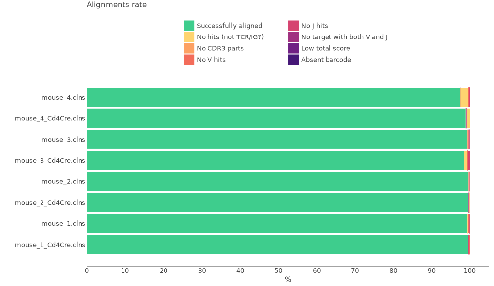
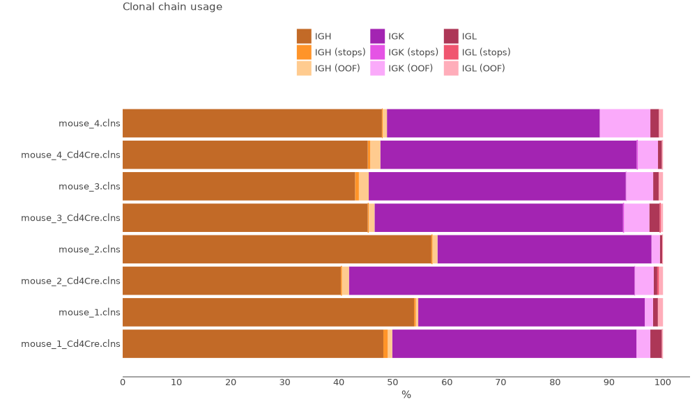
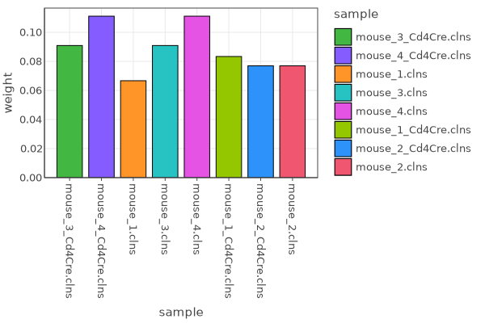
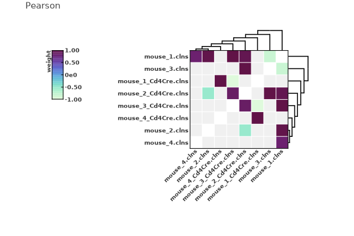

# Multiplex BCR UMI cDNA libraries

For this tutorial we will use the data published in the following article:

Chen JS, Chow RD, Song E, Mao T, Israelow B, Kamath K, Bozekowski J, Haynes WA, Filler RB, Menasche BL, Wei J, Alfajaro MM, Song W, Peng L, Carter L, Weinstein JS, Gowthaman U, Chen S, Craft J, Shon JC, Iwasaki A, Wilen CB, Eisenbarth SC. *High-affinity, neutralizing antibodies to SARS-CoV-2 can be made without T follicular helper cells.* Sci Immunol. 2022 Feb 4;7(68):eabl5652. doi: [10.1126/sciimmunol.abl5652](https://www.science.org/doi/10.1126/sciimmunol.abl5652). Epub 2022 Feb 4. PMID: 34914544; PMCID: PMC8977051.

## Experiment setting

The experiment includes 8 mice that express angiotensin-converting enzyme 2 (ACE2) in epithelial cells thus  vulnerable to SARS-CoV-2.  4 K18-hACE2 Bcl6fl/fl mice and 4 Bcl6fl/flCd4Cre (T~FH~ cell deficiency model) mice. Mice were infected intranasally with SARS-CoV-2 (isolate USA-WA1/2020) and 14 days post-infection S-specific plasmablasts were isolated. RNA from spike-specific B cells was isolated using the RNeasy Plus Micro Kit (Qiagen) following the manufacturer’s instructions. BCR libraries were prepared using the NEBNext Single Cell/Low Input cDNA Synthesis & Amplification Module (New England Biolabs (NEB), E6421) and NEBNext Immune Sequencing Kit (NEB, E6330), with additional reagents provided by NEB to integrate the two kits. High-quality RNA (1 to 20 ng) with RNA integrity number ≥ 8 was used as input. Libraries were analyzed by Bioanalyzer High Sensitivity DNA assay, pooled in equal amounts with PhiX spike-in, and sequenced on an Illumina MiSeq using the V3 kit, with 325 base pairs (bp) for read 1 and 275 bp for read 2.


All data may be downloaded directly from SRA (PRJNA780318) using e.g. [SRA Explorer](https://sra-explorer.info).
??? tip "Use [aria2c](https://aria2.github.io) for efficient download of the full dataset with the proper filenames:"
    ```shell title="download.sh"
    --8<-- "guides/generic-umi-bcr/scripts/010-download-aria2c.sh"
    ```
    ```shell title="download-list.txt"
    --8<-- "guides/generic-umi-bcr/scripts/download-list.txt"
    ```

## One command Solution

The data was obtained using NEBNext Immune Sequencing Kit for BCR repertoire. The easiest way to perform upstream analysis for this data would be to use a dedicated [mixcr preset](../reference/overview-built-in-presets.md#nebnext-immune-sequencing-kit-mouse-bcr--tcrhttpswwwnebcomproductse6330-nebnext-immune-sequencing-kit-mouseproduct20information) `neb-mouse-rna-xcr-umi-nebnext` with [`mixcr analyze`](../reference/mixcr-analyze.md) command. This preset was spesifically designed for this kit and includes UMI correction, primer sequences trimming and assembles clonotypes by [`VDJRegion`](../reference/ref-gene-features.md).

The exact command for a single sample you can see bellow:

```shell
--8<-- "guides/generic-umi-bcr/scripts/020-upstream-example.sh"
```

The command above will generate the following output files:

```shell
> ls results/

# human-readable reports for every step of the pipeline in txt and json formats
mouse_3_Cd4Cre.align.report.txt
mouse_3_Cd4Cre.align.report.json
mouse_3_Cd4Cre.refine.report.txt
mouse_3_Cd4Cre.refine.report.json
mouse_3_Cd4Cre.assemble.report.txt
mouse_3_Cd4Cre.assemble.report.json

# raw alignments (highly compressed binary file)
mouse_3_Cd4Cre.vdjca

# alignments with corrected UMI barcode sequences 
mouse_3_Cd4Cre.refined.vdjca

# IG clonotypes (highly compressed binary file)
mouse_3_Cd4Cre.clns

# IG clonotypes exported in tab-delimited tsv
mouse_3_Cd4Cre.clones_IGH.tsv
mouse_3_Cd4Cre.clones_IGK.tsv 
mouse_3_Cd4Cre.clones_IGL.tsv   
```

Clonotype tables is the main result of the upstream analysis. They are stored in a highly compressed and efficient binary `.clns` file and can be exported in many ways: detailed [tab-delimited format](../reference/mixcr-export.md) with dozens of customizable columns, [human-readable](../reference/mixcr-exportPretty.md) for manual inspection, and [AIRR format](../reference/mixcr-exportAirr.md) suitable for many scientific downstream analysis tools. `.clns` files can be also used for downstream analysis using [`mixcr postanalisis`](../reference/mixcr-postanalysis.md).

By default, MiXCR exports clonotypes in a tab-delimited format separately for each immunological chain.
??? tip "See first 500 records from mouse_3_Cd4Cre.clones_IGH clonotype table"
    {{ read_csv('docs/mixcr/guides/generic-umi-bcr/figs/mouse_3_Cd4Cre.clones_IGH.tsv', engine='python', sep='\t') }}


In order to run the analysis for all samples in the project on Linux we can use [GNU Parallel](https://www.gnu.org/software/parallel/) in the following way:

```shell
--8<-- "guides/generic-umi-bcr/scripts/030-upstream-parallel.sh"
```

## Under the hood of `mixcr analyze` pipeline

Under the hood, `mixcr analyze nebnext-mouse-bcr-full-length` command that we use above actually executes the following pipeline of MiXCR actions:

#### `align`

[Performs](../reference/mixcr-align.md):

- alignment of raw sequencing reads against reference database of V-, D-, J- and C- gene segments
- pattern matching of tag pattern sequence and extraction of barcodes

```shell
--8<-- "guides/generic-umi-bcr/scripts/040-upstream-align.sh"
```

Options `--report` and `--json-report` are specified here explicitly. Since we start from RNA data we use `VTranscriptWithout5UTRWithP` for the alignment of V segments (see [Gene features and anchor points](../reference/ref-gene-features.md).

`--tagPattern "^N{22}(R1:*) \ ^(UMI:N{17})(R2:*)"`
: this pattern sets the UMI location and also trims C-gene primer sequences.

`-OvParameters.parameters.floatingLeftBound=false -OjParameters.parameters floatingRightBound=false -OcParameters.parameters.floatingRightBound=false`
: These options determine global vs local alignment algorithm on the bounds of gene segments. We want to use global alignment on all gene-segments bounds because no V-gene primers were used and C-gene primers were trimmed using `--tagPattern`. 

This step utilizes all available CPUs and scales perfectly. When there are a lot of CPUs, the only limiting factor is the speed of disk I/O. To limit the number of used CPUs one can pass `--threads N` option.

#### `refineTagsAndSort`

[Corrects](../reference/mixcr-refineTagsAndSort.md) sequencing and PCR errors _inside_ barcode sequences. This step does extremely important job by correcting artificial diversity caused by errors in barcodes. In the considered example project it corrects only sequences of UMIs.

```shell
--8<-- "guides/generic-umi-bcr/scripts/050-upstream-refine.sh"
```

#### `assemble`

[Assembles](../reference/mixcr-assemble.md) clonotypes and applies several layers of errors correction:

- assembly consensus CDR3 sequence
- quality-awared correction for sequencing errors
- clustering to correct for PCR errors

```shell
--8<-- "guides/generic-umi-bcr/scripts/060-upstream-assemble.sh"
```

`-OassemblingFeatures=VDJRegion`
: By default `nebnext-mouse-bcr-full-length` preset assembles clones by `VDJRegion`. There is also an alternative preset `nebnext-mouse-bcr-cdr3` which assembles clones only by `CDR3` sequence.

`-separateByC: true`
: Separate clones with the same assembling feature, but different C-genes, which is essential for isotype identification.

Options `--report` and `--json-report` are specified here explicitly so that the report files will be appended with assembly report.

#### `exportClones`

Finally, to [export](../reference/mixcr-export.md#clonotype-tables) clonotype tables in tabular form `exportClones` is used. By default `mixcr analyze` will export all available chains into separate files which is equivalent to running a set of the following commands :

```shell
--8<-- "guides/generic-umi-bcr/scripts/070-upstream-exportClones.sh"
```
By default `mixcr export` will create separate files for every receptor chain. To change this behavior and export all chains in a single file use `--dont-split-files` option, or export only a desired set of chains using `--chains` option.

## Quality control

Now when the upstream analysis is finished we can move on to quality control. First lets look at the alignment report plot.

```shell
--8<-- "guides/generic-umi-bcr/scripts/080-qc-align.sh"
```



We see that all samples have a very high score of successfully aligned reads. No significant issues present.

Next, lets examine chain usage distribution:

```shell
--8<-- "guides/generic-umi-bcr/scripts/120-qc-chainUsage.sh"
```



This plot tells us that all samples mostly consist of IGH and IGK with relatively small numbers of IGL, which is pretty much what we would expect.
Thus, quality reports look good, and we can move on to downstream analysis.

## Downstream analysis

There are two types of basic downstream analysis: _individual_ and _overlap_. Individual computes CDR3 metrics, diversity  and gene usage metrics for each dataset. Overlap computes statistical metrics of repertoires overlap. In both cases MiXCR applies appropriate sample normalization.

To run postanalysis routines we need to prepare a metadata file in a .tsv or .csv format. Metadata must contain a `sample` column which will be used to match metadata with cloneset files. Bellow you can find a metadata table for our samples.

??? note "Metadata"
    {{ read_csv('docs/mixcr/guides/generic-umi-bcr/scripts/metadata.tsv', engine='python', sep='\t') }}
    

### Individual postanalysis

To compute a set of individual metrics run the following command:

```shell
--8<-- "guides/generic-umi-bcr/scripts/130-pa-individual.sh"
```

The meaning of specified options is the following:

`--metadata`
:   specified metadata file to use

`--default-downsampling`
:   downsampling applied to normalize the clonesets. Without appropriate normalization it is not possible to make a  statistical comparisons between datasets. In the considered case we normalize data to the same number of UMIs, and this  number is computed automatically. See [reference](../reference/mixcr-postanalysis.md#downsampling) for all downsampling options. Default downsampling may be overridden for individual metrics.

`--default-weight-function`
:   defines weight of each clonotype. Set `umi` because our data is barcoded and instead of using reads count we can use UMIs count for every clone as a precise measure.

`--only-productive`
:   drop clonotypes with out-of-frame CDR3 sequences or containing stop codons

`--tables`
:   path for postanalysis metrics in a tabular form

`--preproc-tables`
:   path for tabular summary of the applied downsampling and other samples preprocessing (for example filtering productive clonotypes)


After execution, we will have the following files:

```shell
> ls pa/

# gzipped JSON with all results 
individual.json.gz

# summary of applied preprocessors
preproc.i.IGH.tsv
preproc.i.IGK.tsv
preproc.i.IGL.tsv

# diversity tables
pa.i.diversity.IGH.tsv
pa.i.diversity.IGK.tsv
pa.i.diversity.IGL.tsv

# CDR3 metrics tables & CDR3 properties
pa.i.cdr3metrics.IGH.tsv
pa.i.cdr3metrics.IGK.tsv
pa.i.cdr3metrics.IGL.tsv


# V- / J- / VJ- usage tables
pa.i.vUsage.IGH.tsv
pa.i.JUsage.IGH.tsv
pa.i.VJUsage.IGK.tsv
pa.i.vUsage.IGH.tsv
pa.i.JUsage.IGK.tsv
pa.i.VJUsage.IGL.tsv
pa.i.vUsage.IGH.tsv
pa.i.JUsage.IGK.tsv
pa.i.VJUsage.IGL.tsv

# Isotype usage table
pa.i.IsotypeUsage.IGH.tsv
pa.i.IsotypeUsage.IGK.tsv
pa.i.IsotypeUsage.IGL.tsv


#V Spectratype tables
pa.i.VSpectratype.IGH.tsv
pa.i.VSpectratypeMean.IGH.tsv
pa.i.VSpectratype.IGK.tsv
pa.i.VSpectratypeMean.IGK.tsv
pa.i.VSpectratype.IGL.tsv
pa.i.VSpectratypeMean.IGL.tsv
```

Preprocessing summary tables (e.g. `preproc.i.IGH.tsv`) contain detailed information on how downsampling was applied for each metric:

{{ read_csv('docs/mixcr/guides/generic-umi-bcr/figs/preproc.i.IGH.tsv',  engine='python', sep='\t', nrows=8) }}

??? tip "See full preprocessing summary:"
    {{ read_csv('docs/mixcr/guides/generic-umi-bcr/figs/preproc.i.IGH.tsv', engine='python', sep='\t') }}

Columns explained:

`characteristic`
:   metrics name (ex.`IsotypeUsage`)

`sample`
: name of the `.clns` file (ex. `mouse_4_Cd4Cre.clns`)

`preprocessor`
:   the name of the _overall_ preprocessors chain applied to the dataset. `Filter[IGH]|Filter stops in CDR3, OOF in CDR3 | Downsample by umi automatic` means the data has been subjected to three consecutive preprocessors:

    - Only IGH chains were filtered
    - Non-functional clonotypes containing stop-codons and OOF clones were filltered out and only functional were left
    - Automatic Downsampling function has been applied to normalize sample sizes

`nElementsBefore`
:   number of clonotypes before any preprocessing applied (that is in the initial dataset) (ex. `430` clones)

`sumWeightBefore`
:   total weight of all clonotypes before any preprocessing applied. The weight may be either number of reads, UMIs or cells, depending on the selected downsampling. In this case it represents the total number of reads that contribute to clonotypes (ex.`70935` UMIs)

`nElementsAfter`
:   number of clonotypes in the dataset after all preprocessors have been applied (ex.`184` clones)

`sumWeightAfter`
:   total weight of all clonotypes after all preprocessors have been applied (ex. `20235`). Note that not all samples have the same value for `sumWeightAfter`. Because automatic downsampling was applied, the optimal threshold was evaluated, but some samples can be left out. We can other proceed with the analysis as is, we can also change the `--default-downsampling` parameter to `count-umi-min` which will downsample all samples to the smallest number of UMIs among all samples, or we can use `--drop-outliers` option to filter out samples with lower UMIs numbers then automatically calculated threshold.

`preprocessor#i`
:   i-th part of the preprocessing chain (ex. `preprocessor#1`: `Filter [IGH]`)

`nElementsBefore#i`
:   number of clonotypes before i-th preprocessor has been applied (ex. `nElementsBefore#1`: `430`)

`sumWeightBefore#i`
:   total weight of all clonotypes before i-th preprocessor has been applied (ex. `sumWeightBefore#1`: `70935.0`)

`nElementsAfter#i`
:   number of clonotypes after i-th preprocessor has been applied (ex. `nElementsAfter#1`: `205`)

`sumWeightAfter#i`
:   total weight of all clonotypes after i-th preprocessor has been applied (ex. `sumWeightAfter#1`: `20263.0`)

.
.
.

Various postanalysis tables contain information about each metric computed for each sample. For
example, let's have a look inside `pa.i.diversity.IGK.tsv`. This table contains frequencies for each J segment present in the sample :


{{ read_csv('docs/mixcr/guides/generic-umi-bcr/figs/pa.i.diversity.IGK.tsv',  engine='python', sep='\t') }}


#### Graphical output

MiXCR allows to export graphical results in PDF, EPS, PNG and SVG formats using `exportPlots` command.

For diversity metrics and CDR3 properties MiXCR allows to group data in different ways according to the submitted `metadata.tsv` and apply various statistical tests for group comparison.

##### Diversity
We are going to construct a box plot to compare inverse Simpson diversity Index between two groups of mice. That can be easily done with a single command:

```shell
--8<-- "guides/generic-umi-bcr/scripts/140-pa-diversity.sh"
```


Arguments explained:

`--metadata`
: `metadata.tsv` is the name of metadata file.

`--plot-type`
: `boxplot` is the type of plot to generate. See [`mixcr exportPlots`](../reference/mixcr-exportPlots.md) for other options.

`--metric`:
: `inverseSimpsonIndex` is the name of the metric to visualize. See [`diversity metrics`](../reference/mixcr-exportPlots.md#diversity-and-cdr3-metrics) for other options. If not specified multiple plots will be generated for each available diversity metric.

`--primary-group`
: `genotype` is name of the column with metadata values from `metadata.tsv` to group samples by.

`pa/individual.json.gz`
: the name of gzipped JSON file with all postanalysis results generated by [`mixcr postanalysis individual](../reference/mixcr-postanalysis.md#individual-postanalysis)


##### V usage

Next lets create a V-usage plot.

```shell
--8<-- "guides/generic-umi-bcr/scripts/160-pa-vUsage.sh"
```

`--bar-plot`
: create a bar-plot instead of heatmap

`--family-usage`
: merge V-genes by family



### Overlap postanalysis

MiXCR also allows performing an overall overlap analysis using [`mixcr postanalysis overlap`](../reference/mixcr-postanalysis.md#overlap-postanalysis). But here, since there are a lot of samples we want to actually overlap groups of samples. Running the following command will perform pairwise overlap comparison between groups of samples with different `tissue` and `condition` values.

```shell
--8<-- "guides/generic-umi-bcr/scripts/180-pa-overlap.sh"
```

This command will generate a set of files:

```shell
#Tsv files for every metric
postanalysis.overlap.F1Index.IGH.tsv
postanalysis.overlap.F2Index.IGH.tsv
postanalysis.overlap.JaccardIndex.IGH.tsv
postanalysis.overlap.PearsonAll.IGH.tsv
postanalysis.overlap.Pearson.IGH.tsv
postanalysis.overlap.RelativeDiversity.IGH.tsv
postanalysis.overlap.SharedClonotypes.IGH.tsv

# summary of applied preprocessors
preproc.overlap.IGH.tsv

# gzipped JSON with all results 
overlap.tissue_condition.json.gz
```

The tabular output for example for F2 metric will look like:

{{ read_csv('docs/mixcr/guides/generic-umi-bcr/figs/postanalysis.overlap.F2Index.IGH.tsv',  engine='python', sep='\t') }}

Every overlap metric can be exported in a graphical format:

```shell
--8<-- "guides/generic-umi-bcr/scripts/180-pa-overlap-export.sh"
```

For list of available parameters see [`mixcr exportPlots overlap`](../reference/mixcr-exportPlots.md#overlap)



For further details see [overlap postanalysis reference](../reference/mixcr-exportPlots.md).


