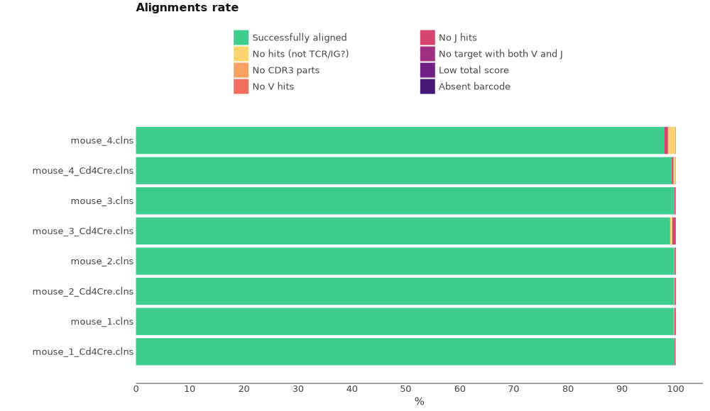
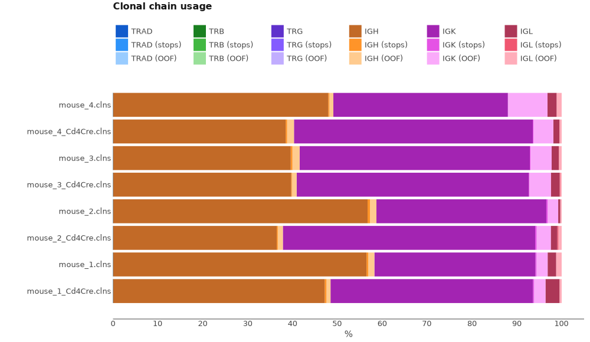

# Multiplex BCR UMI cDNA libraries

For this tutorial we will use the data published in the following article:

Chen JS, Chow RD, Song E, Mao T, Israelow B, Kamath K, Bozekowski J, Haynes WA, Filler RB, Menasche BL, Wei J, Alfajaro MM, Song W, Peng L, Carter L, Weinstein JS, Gowthaman U, Chen S, Craft J, Shon JC, Iwasaki A, Wilen CB, Eisenbarth SC. *High-affinity, neutralizing antibodies to SARS-CoV-2 can be made without T follicular helper cells.* Sci Immunol. 2022 Feb 4;7(68):eabl5652. doi: 10.1126/sciimmunol.abl5652. Epub 2022 Feb 4. PMID: 34914544; PMCID: PMC8977051.

## Experiment setting

The experiment includes 8 mice that express angiotensin-converting enzyme 2 (ACE2) in epithelial cells thus  vulnerable to SARS-CoV-2.  4 K18-hACE2 Bcl6fl/fl mice and 4 Bcl6fl/flCd4Cre (T~FH~ cell deficiency model) mice. Mice were infected intranasally with SARS-CoV-2 (isolate USA-WA1/2020) and 14 days post-infection S-specific plasmablasts were isolated. RNA from spike-specific B cells was isolated using the RNeasy Plus Micro Kit (Qiagen) following the manufacturer’s instructions. BCR libraries were prepared using the NEBNext Single Cell/Low Input cDNA Synthesis & Amplification Module (New England Biolabs (NEB), E6421) and NEBNext Immune Sequencing Kit (NEB, E6330), with additional reagents provided by NEB to integrate the two kits. High-quality RNA (1 to 20 ng) with RNA integrity number ≥ 8 was used as input. Libraries were analyzed by Bioanalyzer High Sensitivity DNA assay, pooled in equal amounts with PhiX spike-in, and sequenced on an Illumina MiSeq using the V3 kit, with 325 base pairs (bp) for read 1 and 275 bp for read 2.

<figure markdown>

</figure>

All data may be downloaded directly from SRA using e.g. [SRA Explorer](https://sra-explorer.info) and PRJNA780318 project id
:
??? tip "Use this script to download the full data set with the proper filenames for the tutorial:"
    ```shell
    #!/usr/bin/env bash
    curl -L ftp://ftp.sra.ebi.ac.uk/vol1/fastq/SRR169/022/SRR16943422/SRR16943422_1.fastq.gz -o mouse_3_Cd4Cre_R1.fastq.gz
    curl -L ftp://ftp.sra.ebi.ac.uk/vol1/fastq/SRR169/022/SRR16943422/SRR16943422_2.fastq.gz -o mouse_3_Cd4Cre_R2.fastq.gz
    curl -L ftp://ftp.sra.ebi.ac.uk/vol1/fastq/SRR169/025/SRR16943425/SRR16943425_1.fastq.gz -o mouse_4_R1.fastq.gz
    curl -L ftp://ftp.sra.ebi.ac.uk/vol1/fastq/SRR169/025/SRR16943425/SRR16943425_2.fastq.gz -o mouse_4_R2.fastq.gz
    curl -L ftp://ftp.sra.ebi.ac.uk/vol1/fastq/SRR169/028/SRR16943428/SRR16943428_1.fastq.gz -o mouse_1_R1.fastq.gz
    curl -L ftp://ftp.sra.ebi.ac.uk/vol1/fastq/SRR169/028/SRR16943428/SRR16943428_2.fastq.gz -o mouse_1_R2.fastq.gz
    curl -L ftp://ftp.sra.ebi.ac.uk/vol1/fastq/SRR169/021/SRR16943421/SRR16943421_1.fastq.gz -o mouse_4_Cd4Cre_R1.fastq.gz
    curl -L ftp://ftp.sra.ebi.ac.uk/vol1/fastq/SRR169/021/SRR16943421/SRR16943421_2.fastq.gz -o mouse_4_Cd4Cre_R2.fastq.gz
    curl -L ftp://ftp.sra.ebi.ac.uk/vol1/fastq/SRR169/023/SRR16943423/SRR16943423_1.fastq.gz -o mouse_2_Cd4Cre_R1.fastq.gz
    curl -L ftp://ftp.sra.ebi.ac.uk/vol1/fastq/SRR169/023/SRR16943423/SRR16943423_2.fastq.gz -o mouse_2_Cd4Cre_R2.fastq.gz
    curl -L ftp://ftp.sra.ebi.ac.uk/vol1/fastq/SRR169/027/SRR16943427/SRR16943427_1.fastq.gz -o mouse_2_R1.fastq.gz
    curl -L ftp://ftp.sra.ebi.ac.uk/vol1/fastq/SRR169/027/SRR16943427/SRR16943427_2.fastq.gz -o mouse_2_R2.fastq.gz
    curl -L ftp://ftp.sra.ebi.ac.uk/vol1/fastq/SRR169/024/SRR16943424/SRR16943424_1.fastq.gz -o mouse_1_Cd4Cre_R1.fastq.gz
    curl -L ftp://ftp.sra.ebi.ac.uk/vol1/fastq/SRR169/024/SRR16943424/SRR16943424_2.fastq.gz -o mouse_1_Cd4Cre_R2.fastq.gz
    curl -L ftp://ftp.sra.ebi.ac.uk/vol1/fastq/SRR169/026/SRR16943426/SRR16943426_1.fastq.gz -o mouse_3_R1.fastq.gz
    curl -L ftp://ftp.sra.ebi.ac.uk/vol1/fastq/SRR169/026/SRR16943426/SRR16943426_2.fastq.gz -o mouse_3_R2.fastq.gz
    ```

## One command Solution

The easiest way to obtain clonotype tables for this type of data is to use a universal [`mixcr analyze`](../reference/mixcr-analyze.md) command.

The exact command for a single sample you can see bellow:

```shell
'> mixcr analyze amplicon \
    --species mmu \
    --starting-material rna \
    --receptor-type bcr \
    --5-end no-v-primers \
    --3-end c-primers \
    --adapters adapters-present \
    --assemble "-OassemblingFeatures={CDR1Begin:FR4End} -OseparateByC=true" \
    mouse_3_Cd4Cre_R1.fastq.gz \
    mouse_3_Cd4Cre_R2.fastq.gz \
    mouse_3_Cd4Cre
```

The meaning of these options is the following.

`--species`
:   is set to `mmu` for _Mus Musculus_

`--starting-material`
:   is set to `rna` and corresponds to `VTranscriptWithout5UTRWithP` alignment feature for V-gene (see [Gene features and anchor points](../reference/ref-gene-features.md) for details)

`--receptor-type`
:  `bcr`. It affects the choice of alignment algorithms. MiXCR uses a specific set of algorithms for BCR data.

`--5-end`
:   is set to `no-v-primers` because NEBNext Immune Sequencing Kit uses a 5'RACE technology that does not require V gene region primers . This leads to a global alignment algorithms to align the left bound of V gene.

`--3-end-primers`
:  is set to `c-primers`. Here, C primers were used in cDNA synthesis and these primers are isotype specific. This choice leads to a global alignment algorithms to align the right bound of J gene and a local alignment algorithm for the left bound of C-gene.

`--adapers`
:   `adapters-present` because we still have C-primer sequences in our data.

`--assemble`
:  `"-OassemblingFeatures={CDR1Begin:FR4End} -OseparateByC=true"`. Here we pass two extra arguments for [`mixcr assemble`](../reference/mixcr-assemble.md) step of the pipeline. First we extend the assembling feature to start from `CDR1`. That is because this is BCR data, where hypermutations occur throughout V gene, and we want to capture as much as we can. Second, we use `-OseparateByC=true` option to separate clones with the same assembling feature sequence but different C genes, which is essential for isotype identification.

`mouse_3_Cd4Cre_R1.fastq.gz mouse_3_Cd4Cre_R2.fastq.gz mouse_3_Cd4Cre`
: Finally, we provide the names of input files and an output prefix:


Now, since we have multiple files ist easier to process them all together instead of running the same command multiple times. One of the ways to achieve it is to use [GNU Parallel](https://www.gnu.org/software/parallel/):

```shell
> fastq/*R1* | 
  parallel -j4 \
  'mixcr analyze amplicon \
    --species mmu \
    --starting-material rna \
    --receptor-type bcr \
    --5-end no-v-primers \
    --3-end c-primers \
    --adapters adapters-present \
    --umi-pattern "^(R1:*)\^(UMI:N{"17"})(R2:*)" \
    --assemble "-OassemblingFeatures={FR1Begin:FR4End} -OseparateByC=true"\
    {} \
    {=s:R1:R2:=} \
    {=s:.*/:results/:;s:_R1.*::=}'
```

## Under the hood of `mixcr analyze` pipeline

Under the hood, `mixcr analyze amplicon` command that we use above actually executes the following pipeline of MiXCR actions:

#### `align`

[Performs](../reference/mixcr-align.md):

- alignment of raw sequencing reads against reference database of V-, D-, J- and C- gene segments
- pattern matching of tag pattern sequence and extraction of barcodes

```shell
 > mixcr align \
    --species mmu \
    --report result/Multi_TRA_10ng_3.report \
    --json-report result/Multi_TRA_10ng_3.report.json \
    -OvParameters.geneFeatureToAlign={CDR1Begin:VEnd}+{VEnd:VEnd(-20)} \
    -OvParameters.parameters.floatingLeftBound=false \
    -OjParameters.parameters.floatingRightBound=false \
    -OcParameters.parameters.floatingRightBound=true \
    fastq/mouse_3_Cd4Cre_R1.fastq.gz \
    fastq/mouse_3_Cd4Cre_R2.fastq.gz \
    results/mouse_3_Cd4Cre.vdjca
```

Options `--report` and `--json-report` are specified here explicitly. Since we start from RNA data we use `VTranscriptWithout5UTRWithP` for the alignment of V segments (see [Gene features and anchor points](../reference/ref-gene-features.md).

`-OvParameters.parameters.floatingLeftBound=false -OjParameters.parameters floatingRightBound=false -OcParameters.parameters.floatingRightBound=true`
: These options determine global vs local alignment algorithm on the bounds of gene segments. As have been mentioned above we will use global alignment on the left bound of V gene and right bound of J gene. The alignment on the right bound of C gene will be local due to the presence of primer sequence.

This step utilizes all available CPUs and scales perfectly. When there are a lot of CPUs, the only limiting factor is the speed of disk I/O. To limit the number of used CPUs one can pass `--threads N` option.

#### `correctAndSortTags`

[Corrects](../reference/mixcr-correctAndSortTags.md) sequencing and PCR errors _inside_ barcode sequences. This step does extremely important job by correcting artificial diversity caused by errors in barcodes. In the considered example project it corrects only sequences of UMIs.

```shell
> mixcr correctAndSortTags \
    --report results/mouse_3_Cd4Cre.report \
    --json-report results/mouse_3_Cd4Cre.json \
    mouse_3_Cd4Cre.vdjca \
    mouse_3_Cd4Cre.corrected.vdjca
```

Options `--report` and `--json-report` are specified here explicitly so that the report files will be appended with the barcode correction report.


#### `assemble`

[Assembles](../reference/mixcr-assemble.md) clonotypes and applies several layers of errors correction:

- assembly consensus CDR3 sequence
- quality-awared correction for sequencing errors
- clustering to correct for PCR errors

```shell
> mixcr assemble \
    --report results/mouse_3_Cd4Cre.report \
    --json-report results/mouse_3_Cd4Cre.report.json \
    -OassemblingFeatures={CDR1Begin:FR4End} \
    -OseparateByC=true \
    mouse_3_Cd4Cre.corrected.vdjca \
    mouse_3_Cd4Cre.clns
```

Options `--report` and `--json-report` are specified here explicitly so that the report files will be appended with assembly report.

#### `exportClones`

Finally, to [export](../reference/mixcr-export.md#clonotype-tables) clonotype tables in tabular form `exportClones` is used. By default `mixcr analyze` will export all availible chains into separate files which is equivalent to running a set of the following commands :

```shell
> mixcr exportClones \
    -p full \
    -c IGH \
    mouse_3_Cd4Cre.clns \
    mouse_3_Cd4Cre.clonotypes.IGH.tsv

> mixcr exportClones \
    -p full \
    -c IGK \
    mouse_3_Cd4Cre.clns \
    mouse_3_Cd4Cre.clonotypes.IGK.tsv
    
> mixcr exportClones \
    -p full \
    -c IGL \
    mouse_3_Cd4Cre.clns \
    mouse_3_Cd4Cre.clonotypes.IGL.tsv
```

Here `-p full` is a shorthand for the full preset of common export columns.

## Quality control

Now when the upstream analysis is finished we can move on to quality control. First lets look at the alignment report plot.

```shell
# obtain alignment quality control
> mixcr exportQc align \
    result/*.vdjca \
    alignQc.pdf
```
<figure markdown>

</figure>

We see that all samples have a very high score of successfully aligned reads. No significant issues present.

Next, lets examine chain usage distribution

<figure markdown>

</figure>

This plot tells us that all samples mostly consist of IGH and IGK with relatively small numbers of IGL, which is pretty much what we would expect.
Thus, quality reports look good and we can move on to downstream analysis.

## Downstream analysis

There are two types of basic downstream analysis: _individual_ and _overlap_. Individual computes CDR3 metrics, diversity  and gene usage metrics for each dataset. Overlap computes statistical metrics of repertoires overlap. In both cases MiXCR applies appropriate sample normalization.

To run postanalysis routines we need to prepare a metadata file in a .tsv or .csv form. Metadata must contain a `sample` column which will be used to match metadata with cloneset files. Bellow you can find a metadata table for our samples.

??? note "Metadata"

    | sample              | genotype |
    |---------------------|----------|
    | mouse_1_Cd4Cre      | Bcl6fl/flCd4Cre       |
    | mouse_1             | Bcl6fl/fl       |
    | mouse_2_Cd4Cre      | Bcl6fl/flCd4Cre       |
    | mouse_2             | Bcl6fl/fl       |
    | mouse_3_Cd4Cre      | Bcl6fl/flCd4Cre       |
    | mouse_3             | Bcl6fl/fl       |
    | mouse_4_Cd4Cre      | Bcl6fl/flCd4Cre       |
    | mouse_4             | Bcl6fl/fl       |
    

### Individual postanalysis

To compute a set of individual metrics we run the following command:

```shell
> mixcr postanalysis individual \
    --metadata metadata.tsv \
    --default-downsampling count-umi-auto \
    --default-weight-function umi \
    --only-productive \
    --tables postanalysis/pa.i.tsv \
    --chains IG \
    --preproc-tables postanalysis/preproc.i.tsv \
    results/*.clns \
    postanalysis/individual.json.gz
```

The meaning of specified options is the following:

`--metadata`
:   specified metadata file to use

`--default-downsampling`
:   downsampling applied to normalize the clonesets. Without appropriate normalization it is not possible to make a  statistical comparisons between datasets. In the considered case we normalize data to the same number of UMIs, and this  number is computed automatically. See [reference](../reference/mixcr-postanalysis.md#downsampling) for all downsampling options. Default downsampling may be overridden for individual metrics.

`--default-weight-function`
:   defines weight of each clonotype. Set `umi` because our data is barcoded and instead of using reads count we can use UMIs count for every clone.

`--only-productive`
:   drop clonotypes with out-of-frame CDR3 sequences or containing stop codons

`--tables`
:   path for postanalysis metrics in a tabular form

`--preproc-tables`
:   path for tabular summary of the applied downsampling and other samples preprocessing (for example filtering productive clonotypes)


After execution, we will have the following files:

```shell
> ls postanalysis/

# gzipped JSON with all results 
individual.json.gz

# summary of applied preprocessors
preproc.i.IGH.tsv
preproc.i.IGK.tsv
preproc.i.IGL.tsv

# diversity tables
pa.i.diversity.IGH.tsv
pa.i.diversity.IGK.tsv
pa.i.diversity.IGL.tsv

# CDR3 metrics tables & CDR3 properties
pa.i.cdr3metrics.IGH.tsv
pa.i.cdr3metrics.IGK.tsv
pa.i.cdr3metrics.IGL.tsv


# V- / J- / VJ- usage tables
pa.i.vUsage.IGH.tsv
pa.i.JUsage.IGH.tsv
pa.i.VJUsage.IGK.tsv
pa.i.vUsage.IGH.tsv
pa.i.JUsage.IGK.tsv
pa.i.VJUsage.IGL.tsv
pa.i.vUsage.IGH.tsv
pa.i.JUsage.IGK.tsv
pa.i.VJUsage.IGL.tsv

# Isotype usage table
pa.i.IsotypeUsage.IGH.tsv
pa.i.IsotypeUsage.IGK.tsv
pa.i.IsotypeUsage.IGL.tsv


#V Spectratype tables
pa.i.VSpectratype.IGH.tsv
pa.i.VSpectratypeMean.IGH.tsv
pa.i.VSpectratype.IGK.tsv
pa.i.VSpectratypeMean.IGK.tsv
pa.i.VSpectratype.IGL.tsv
pa.i.VSpectratypeMean.IGL.tsv
```

Preprocessing summary tables (e.g. `preproc.i.IGH.tsv`) contain detailed information on how downsampling was applied for each metric:

| characteristic | sample              | preprocessor                                                                        | nElementsBefore | sumWeightBefore | nElementsAfter | sumWeightAfter | preprocessor#1    | nElementsBefore#1 | sumWeightBefore#1 | nElementsAfter#1 | sumWeightAfter#1 | preprocessor#2                    | nElementsBefore#2 | sumWeightBefore#2 | nElementsAfter#2 | sumWeightAfter#2 | preprocessor#3              | nElementsBefore#3 | sumWeightBefore#3 | nElementsAfter#3 | sumWeightAfter#3 | preprocessor#4 | nElementsBefore#4 | sumWeightBefore#4 | nElementsAfter#4 | sumWeightAfter#4 |
|----------------|---------------------|-------------------------------------------------------------------------------------|-----------------|-----------------|----------------|----------------|-------------------|-------------------|-------------------|------------------|------------------|-----------------------------------|-------------------|-------------------|------------------|------------------|-----------------------------|-------------------|-------------------|------------------|------------------|----------------|-------------------|-------------------|------------------|------------------|
| IsotypeUsage   | mouse_4_Cd4Cre.clns | Filter IGH chains | Filter stops in CDR3, OOF in CDR3 | Downsample by umi automatic | 590             | 172729.0        | 213            | 30927.0        | Filter IGH chains | 590               | 172729.0          | 238              | 30975.0          | Filter stops in CDR3, OOF in CDR3 | 238               | 30975.0           | 213              | 30927.0          | Downsample by umi automatic | 213               | 30927.0           | 213              | 30927.0          |                |                   |                   |                  |                  |
| IsotypeUsage   | mouse_3_Cd4Cre.clns | Filter IGH chains | Filter stops in CDR3, OOF in CDR3 | Downsample by umi automatic | 667             | 195492.0        | 240            | 46633.0        | Filter IGH chains | 667               | 195492.0          | 273              | 46724.0          | Filter stops in CDR3, OOF in CDR3 | 273               | 46724.0           | 240              | 46633.0          | Downsample by umi automatic | 240               | 46633.0           | 240              | 46633.0          |                |                   |                   |                  |                  |
| IsotypeUsage   | mouse_3.clns        | Filter IGH chains | Filter stops in CDR3, OOF in CDR3 | Downsample by umi automatic | 1565            | 347309.0        | 530            | 46633.0        | Filter IGH chains | 1565              | 347309.0          | 651              | 65731.0          | Filter stops in CDR3, OOF in CDR3 | 651               | 65731.0           | 596              | 65563.0          | Downsample by umi automatic | 596               | 65563.0           | 530              | 46633.0          |                |                   |                   |                  |                  |
| ...            | ...                 | ...                                                                                 | ...             | ...             | ...            | ...            | ...               | ...               | ...               | ...              | ...              | ...                               | ...               | ...               | ...              | ...              | ...                         | ...               | ...               | ...              | ...              | ...            | ...               | ...               | ...              | ...              |


Columns explained:

`characteristic`
:   metrics name (ex.`IsotypeUsage`)

`sample`
: name of the `.clns` file (ex. `mouse_4_Cd4Cre.clns`)

`preprocessor`
:   the name of the _overall_ preprocessors chain applied to the dataset. `FilterIGHchains|FilterstopsinCDR3,OOFinCDR3|Downsampleautomatic` means the data has been subjected to three consecutive preprocessors:

    - Only IGH chains were filtered
    - Non-functional clonotypes containing stop-codons and OOF clones were filltered out and only functional were left
    - Automatic Downsampling function has been applied to normalize sample sizes

`nElementsBefore`
:   number of clonotypes before any preprocessing applied (that is in the initial dataset) (ex. `590` clones)

`sumWeightBefore`
:   total weight of all clonotypes before any preprocessing applied. The weight may be either number of reads, UMIs or cells, depending on the selected downsampling. In this case it represents the total number of reads that contribute to clonotypes (ex.`172729.0` reads)

`nElementsAfter`
:   number of clonotypes in the dataset after all preprocessors have been applied (ex.`213` clones)

`sumWeightAfter`
:   total weight of all clonotypes after all preprocessors have been applied (ex. `30927.0`). Note that all samples will have the same value for `sumWeightAfter` in this case, because downsampling was applied, thus all samples have been normalized to the same weight.

`preprocessor#i`
:   i-th part of the preprocessing chain (ex. `preprocessor#1`: `Filter IGH chains`)

`nElementsBefore#i`
:   number of clonotypes before i-th preprocessor has been applied (ex. `nElementsBefore#1`: `590`)

`sumWeightBefore#i`
:   total weight of all clonotypes before i-th preprocessor has been applied (ex. `sumWeightBefore#1`: `172729.0`)

`nElementsAfter#i`
:   number of clonotypes after i-th preprocessor has been applied (ex. `nElementsAfter#1`: `238`)

`sumWeightAfter#i`
:   total weight of all clonotypes after i-th preprocessor has been applied (ex. `sumWeightAfter#1`: `30975.0`)

.
.
.

Various postanalysis tables contain information about each metric computed for each sample. For
example, let's have a look inside `pa.i.diversity.IGK.tsv`. This table contains frequencies for each J segment present in the sample :

| Observed diversity  | Shannon-Wiener diversity | Normalized Shannon-Wiener index | Inverse Simpson index | Gini index         | Chao1 estimate     | Efron-Thisted estimate | d50     |      |
|---------------------|--------------------------|---------------------------------|-----------------------|--------------------|--------------------|------------------------|---------|------|
| mouse_1_Cd4Cre.clns | 354.0                    | 353.99999999999994              | 1.0                   | 354.0              | 1.002824858757062  | 62835.0                | 6018.0  | 6.0  |
| mouse_1.clns        | 731.0                    | 730.9999999999997               | 1.0                   | 731.0              | 1.0013679890560876 | 267546.0               | 15351.0 | 15.0 |
| mouse_2_Cd4Cre.clns | 393.0                    | 393.0                           | 1.0                   | 392.99999999999994 | 1.0025445292620865 | 77421.0                | 8253.0  | 7.0  |
| mouse_2.clns        | 751.0                    | 750.9999999999998               | 1.0                   | 751.0              | 1.0013315579227697 | 282376.0               | 15771.0 | 11.0 |
| mouse_3_Cd4Cre.clns | 304.0                    | 304.00000000000006              | 1.0                   | 304.0              | 1.0032894736842106 | 46360.0                | 2432.0  | 10.0 |
| mouse_3.clns        | 472.0                    | 471.99999999999983              | 1.0                   | 472.0              | 1.0021186440677967 | 111628.0               | 9912.0  | 6.0  |
| mouse_4_Cd4Cre.clns | 257.0                    | 257.00000000000006              | 1.0                   | 257.0              | 1.0038910505836576 | 33153.0                | 1542.0  | 8.0  |
| mouse_4.clns        | 263.0                    | 263.00000000000006              | 1.0                   | 263.0              | 1.0038022813688212 | 34716.0                | 1578.0  | 5.0  |


#### Graphical output

MiXCR allows to export graphical results in PDF, EPS, PNG and SVG formats using `exportPlots` command.

For diversity metrics and CDR3 properties MiXCR allows to group data in different ways according to the submitted `metadata.tsv` and apply various statistical tests for group comparison.

##### Diversity
Let's reconstruct one of the figures from the paper. Let's say we want to look at the Normalized ShannonWiener diversity index. We will group samples by tissues and use separate facets for contol and experiment group. That can be easily done with a single command:

```shell
> mixcr exportPlots diversity \
    --metadata metadata.tsv \
    --plot-type boxplot \
    --metric normalizedShannonWienerIndex \ 
    --primary-group genotype \
    postanalysis/individual.json.gz \
    normalizedShannonWienerIndex.pdf
```
<figure markdown>

</figure>

Arguments explained:

`--metadata`
: `metadata.tsv` is the name of metadata file.

`--plot-type`
: `boxplot` is the type of plot to generate. See [`mixcr exportPlots`](../reference/mixcr-exportPlots.md) for other options.

`--metric`:
: `normalizedShannonWienerIndex` is the name of the metric to visualize. See [`diversity metrics`](../reference/mixcr-exportPlots.md#diversity-and-cdr3-metrics) for other options. If not specified multiple plots will be generated for each available diversity metric.

`--primary-group`
: `genotype` is name of the column with metadata values from `metadata.tsv` to group samples by.

`postanalysis/individual.json.gz`
: the name of gzipped JSON file with all postanalysis results generated by [`mixcr postanalysis individual](../reference/mixcr-postanalysis.md#individual-postanalysis)

`normalizedShannonWienerIndex.pdf`
: the name of output file. Also specifies the extension of the output file. One can use one of the following graphical out formats: `.pdf`, `.eps`, `.png` and `.svg`.

##### V usage

Now lets look at the J gene distribution among all samples.

```shell
> mixcr exportPlots jUsage \
    --metadata metadata.tsv \
    --chains IGH \
    --palette sequential \
    --color-key tissue \
    postanalysis/individual.json.gz \
    jUsage.pdf  
```

`--palette`
: `sequential`. Determines color palette to be used for the heatmap. See [gene segment usage plots](../reference/mixcr-exportPlots.md#gene-segment-usage) for other options.

`--color-key`
: `tissue`. Metadata column name.

<figure markdown>

</figure>

### Overlap postanalysis

#### Two samples overlap

Since our samples were prepared in replicas, it is often usefully to check if clone frequencies correlate between replicas. Let's take two replicas of one biological sample and overlap two repertoires. We will use [`mixcr overlapScatterPlot` function](../reference/mixcr-overlapScatterPlot.md):

```shell
> mixcr overlapScatterPlot \
    --downsampling none \
    --chains IGH \
    results/M1_4T1_Blood_S2.clns results/M1_4T1_Blood_S6.clns \
    M1_4T1_Blood.overlap.pdf
```
<figure markdown>

</figure>

#### All-vs-All overlap

MiXCR also allows performing an overall overlap analysis using [`mixcr postanalysis overlap`](../reference/mixcr-postanalysis.md#overlap-postanalysis). But here, since there are a lot of samples we want to actually overlap groups of samples. Running the following command will perform pairwise overlap comparison between groups of samples with different `tissue` and `condition` values.

```shell
> mixcr postanalysis overlap -f \
   --factor-by tissue,condition \
   --metadata metadata.tsv \
   --default-downsampling count-reads-auto \
   --default-weight-function read \
   --only-productive \
   --tables postanalysis/postanalysis.overlap.tsv \
   --preproc-tables postanalysis/preproc.overlap.tsv \
   results/*.clns \
   postanalysisls /overlap.tissue_condition.json.gz
```

This command will generate a set of files:

```shell
#Tsv files for every metric
postanalysis.overlap.F1Index.IGH.tsv
postanalysis.overlap.F2Index.IGH.tsv
postanalysis.overlap.JaccardIndex.IGH.tsv
postanalysis.overlap.PearsonAll.IGH.tsv
postanalysis.overlap.Pearson.IGH.tsv
postanalysis.overlap.RelativeDiversity.IGH.tsv
postanalysis.overlap.SharedClonotypes.IGH.tsv

# summary of applied preprocessors
preproc.overlap.IGH.tsv

# gzipped JSON with all results 
overlap.tissue_condition.json.gz
```

The tabular output for example for F2 metric will look like:

||LN,control|BM,4T1|BM,control|DLN,4T1|Blood,4T1|Blood,control|Tumor,4T1|
|-|----------|------|----------|-------|---------|-------------|---------|
|**LN,control**|1.0|0.013774364765374518|0.04650437588957222|0.014099278585204775|0.031036354127937787|0.027203139358090662|0.010163687504766344|
|**BM,4T1**|0.013774364765374518|1.0|0.05529474567524548|0.04405383350942532|0.10645680248929848|0.07417602888238424|0.09466939004888049|
|**BM,control**|0.04650437588957222|0.05529474567524548|1.0|0.03286381709464843|0.233349361966603|0.11870207376989239|0.06314011150401469|
|**DLN,4T1**|0.014099278585204775|0.04405383350942532|0.03286381709464843|1.0|0.1768279650269904|0.0188038306990065|0.10982393111366022|
|**Blood,4T1**|0.031036354127937787|0.10645680248929848|0.233349361966603|0.1768279650269904|1.0|0.0634481121480744|0.13415831269714423|
|**Blood,control**|0.027203139358090662|0.07417602888238424|0.11870207376989239|0.0188038306990065|0.0634481121480744|1.0|0.03867881035646659|
|**Tumor,4T1**|0.010163687504766344|0.09466939004888049|0.06314011150401469|0.10982393111366022|0.13415831269714423|0.03867881035646659|1.0|

Every overlap metric is also possible to present in a graphical format:

```shell
> mixcr exportPlots overlap \
    --chains IGH \
    --palette density \
    --metric f2Index \
    postanalysis/overlap.tissue_condition.json.gz \
    overlap.time_marker.pdf
```

For list of available metrics see [`mixcr exportPlots overlap`](../reference/mixcr-exportPlots.md#overlap)

<figure markdown>

</figure>

For further details see [overlap postanalysis reference](../reference/mixcr-exportPlots.md).


