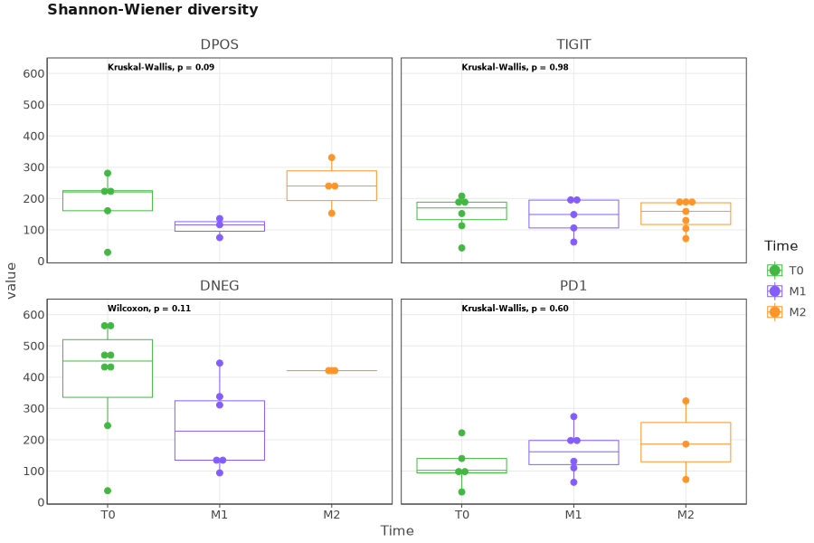
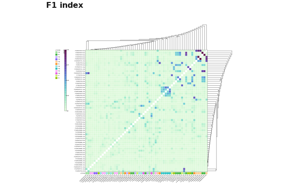

# Analysis of TCR amplicon libraries with UMIs

## Data libraries

This tutorial uses the data from the publication: Simon S, Voillet V, Vignard V, et al, _PD-1 and TIGIT coexpression identifies a circulating CD8 T cell subset predictive of response to anti-PD-1 therapy_, Journal for ImmunoTherapy of Cancer 2020;8:e001631. [doi: 10.1136/jitc-2020-001631](https://jitc.bmj.com/content/8/2/e001631)

The data was collected from 12 patients. PBMC samples were obtained at three time points for each patient. The libraries were generated using _Human TCR Panel QIAseq Immune Repertoire RNA Library Kit (QIAGEN&trade;)_. Sequencing was performed using Illumina NextSeq&trade; sequencing machine. Each samples contain sequences of TCRα and TCRβ chains enriched cDNA libraries of human. 261bp Read 1 holds CDR3 region and 41bp Read 2 with UMI (first 12bp):

<figure markdown>

</figure>

All data may be downloaded directly from SRA using e.g. [SRA Explorer](https://sra-explorer.info):

```shell
> curl -L ftp://ftp.sra.ebi.ac.uk/vol1/fastq/SRR105/059/SRR10545759/SRR10545759_1.fastq.gz -o SRR10545759_GSM4195469_TCR-seq_P15-M2-TIGIT_Homo_sapiens_OTHER_1.fastq.gz
> curl -L ftp://ftp.sra.ebi.ac.uk/vol1/fastq/SRR105/059/SRR10545759/SRR10545759_2.fastq.gz -o SRR10545759_GSM4195469_TCR-seq_P15-M2-TIGIT_Homo_sapiens_OTHER_2.fastq.gz
...
```

The project contains 544 paired fastq files, separated in multiple lanes and biosample ids:

```shell
> ls fastq/

SRR10545725_GSM4195461_TCR-seq_P15-T0-TIGIT_Homo_sapiens_OTHER_1.fastq.gz
SRR10545725_GSM4195461_TCR-seq_P15-T0-TIGIT_Homo_sapiens_OTHER_2.fastq.gz
SRR10545726_GSM4195461_TCR-seq_P15-T0-TIGIT_Homo_sapiens_OTHER_1.fastq.gz
SRR10545726_GSM4195461_TCR-seq_P15-T0-TIGIT_Homo_sapiens_OTHER_2.fastq.gz
SRR10545727_GSM4195461_TCR-seq_P15-T0-TIGIT_Homo_sapiens_OTHER_1.fastq.gz
SRR10545727_GSM4195461_TCR-seq_P15-T0-TIGIT_Homo_sapiens_OTHER_2.fastq.gz
SRR10545728_GSM4195461_TCR-seq_P15-T0-TIGIT_Homo_sapiens_OTHER_1.fastq.gz
SRR10545728_GSM4195461_TCR-seq_P15-T0-TIGIT_Homo_sapiens_OTHER_2.fastq.gz
...
```

Each file name encodes the information about lane, biosample id, metadata, R1 or R2. For example for the first file from
above listing: 

- `SRR10545497` - lane
- `GSM4195404` - biosample id
- `P5` - patient id
- `T0` - time point
- `DPOS` - double positive
- `OTHER_1` - first mate of paired-end data.

## Upstream analysis

The most straightforward way to get clonotype tables is to use a
universal [`mixcr analyze`](../reference/mixcr-analyze.md) command.

According to the library preparation protocol, the library has V primers on 5'-end and C primers on 3', so the command
for a single sample is the following:

```shell
> mixcr analyze amplicon \
    --species hsa \
    --starting-material rna \
    --receptor-type tcr \
    --5-end no-v-primers \
    --3-end c-primers \
    --adapters adapters-present \
    --umi-pattern '^(R1:*)\^(UMI:N{12})' \
    fastq/SRR{{n}}_GSM4195461_TCR-seq_P15-T0-TIGIT_Homo_sapiens_OTHER_1.fastq.gz \
    fastq/SRR{{n}}_GSM4195461_TCR-seq_P15-T0-TIGIT_Homo_sapiens_OTHER_2.fastq.gz \
    results/P15-T0-TIGIT
```

The meaning of these options is the following.

`--species`
:   is set to `hsa` for _Homo Sapience_

`--starting-material`
:   RNA or DNA. It affects the choice of V gene region which will be used as target in [`align`](../reference/mixcr-align.md) step (`vParameters.geneFeatureToAlign`, see [`align` documentation](../../reference/mixcr-align.md)): `rna` corresponds to the `VTranscriptWithout5UTRWithP` and `dna` to `VGeneWithP` (see [Gene features and anchor points](../reference/geneFeatures.md) for details)

`--receptor-type`
:   TCR or BCR. It affects the choice of underlying alignment algorithms: MiXCR uses fundamentally different algorithms
for TCRs and BCRs because BCRs have somatic hypermutations and long indels.

`--5-end`
:   may be `no-v-primers` or `v-primers`. For this library structure we use `no-v-primers` while e.g. Depending on the presence of primers or adapters at 5'-end MiXCR uses either global or local alignment algorithm to align the left bound of V.

`--3-end-primers`
:   may be `j-primers`, `j-c-intron-primers` or `c-primers`. Here we use `c-primers` since the primer used for library preparation is complimentary to C-region of TCR genes. Depending on the presence of primers or adapters at 3'-end MiXCR uses either global or local alignment algorithms to align the right bound of J and C gene segments.

`--adapers`
:   may be `adapters-present` or `no-adapters`. We use `adapters-present` because primer sequence is present in the data and has not been cut prior to. Presence or absence of adapter sequences results in the choice between local and global alignment algorithms on the edges of the target sequence.

`--umi-pattern`
:   is used to specify UMI pattern for the library. MiXCR provides a powerful
regex-like [language](../reference/tag-pattern.md) allowing to specify almost arbitrary barcode structure. Here we use `^(R1:*)\^(UMI:N{12})` pattern to specify that R1 should be used as is, UMI spans the first 12 letters of R2 and the rest of R2 is ignored.

Finally we specify paths for both input files and a path to output folder with prefix describing the sample. Note that `{{n}}` syntax is similar to Linux wildcard behaviour: it will concatenate all fastq files matching this pattern into one sample. This is very useful when you have for example multiple lanes.

Running the command above will generate the following files:

```shell
> ls result/

# human-readable reports 
P15-T0-TIGIT.report
# raw alignments (highly compressed binary file)
P15-T0-TIGIT.vdjca
# alignments with corrected UMI barcode sequences 
P15-T0-TIGIT.corrected.vdjca
# TCRα & TCRβ CDR3 clonotypes (highly compressed binary file)
P15-T0-TIGIT.clns
# TCRα & TCRβ CDR3 clonotypes exported in tab-delimited txt
P15-T0-TIGIT.clonotypes.TRA.tsv
P15-T0-TIGIT.clonotypes.TRB.tsv  
```

Clonotype tables is the main result of the upstream analysis. They are stored in a highly compressed and efficient binary `.clns` file and can be exported in many ways: detailed [tab-delimited format](../reference/mixcr-export.md) with dozens of customizable columns, [human readable](../reference/mixcr-exportPretty.md) for manual inspection, and [AIRR format](../reference/mixcr-exportAirr.md) suitable for many scientific downstream analysis tools. By default, MiXCR exports clonotypes in a tab-delimited format separately for each immunological chain.

In order to run the analysis for all samples in the project on Linux we can for example
use [GNU Parallel](https://www.gnu.org/software/parallel/) in the following way:

```shell
> ls /fastq/*_1* | \
  sed 's:SRR[0-9]*_:SRR\{\{n\}\}_:g' | \
  uniq | \
  parallel -j2  \
  'mixcr analyze amplicon \
    --species hsa \
    --starting-material rna \
    --receptor-type tcr \
    --5-end v-primers \
    --3-end c-primers \
    --adapters adapters-present \
    --tag-pattern '^(R1:*)\^(UMI:N{12})' \
    {} \
    {=s:OTHER_1:OTHER_2:=} \
    results/{=s:.*TCR-seq_:PRJNA592172/:; s:_Homo.*::=}'
```
Briefly, we list all R1 files in the fastq directory, replace lane specifications with MiXCR `{{n}}` wildcard, pipe the list to parallel, then run `mixcr analyze` for each pair, again using sed to obtain R2 filename from R1 and the name of output.

### Details and fine-tuning

Under the hood, `mixcr analyze amplicon` executes the following pipeline of MiXCR actions:
<figure markdown>

</figure>

Each step in this pipeline is executed with a specific options inherited from the options supplied to `mixcr analyze amplicon`. Instead of running `analyze` one can run the whole pipeline step by step and additionally fine tune the analysis parameters at each step. Another reason why sometimes it is better to execute the pipeline step by step is the ability to better manage hardware resources allocated to each step, because some steps are memory intensive and less CPU intensive, while others are vice a versa.

Let's go throw each step executed in the considered case.

#### `align`

[Performs](../reference/mixcr-align.md):

- alignment of raw sequencing reads against reference database of V-, D-, J- and C- gene segments
- pattern matching of tag pattern sequence and extraction of barcodes

```shell
 > mixcr align \
    --species hsa \
    --tag-pattern '^(R1:*)\^(UMI:N{12})' \
    --report result/P15-T0-TIGIT.report \
    --json-report result/P15-T0-TIGIT.report.json \
    -OvParameters.geneFeatureToAlign="VTranscriptWithout5UTRWithP" \
    -OvParameters.parameters.floatingLeftBound=false \
    -OjParameters.parameters.floatingRightBound=false \
    -OcParameters.parameters.floatingRightBound=true \
    fastq/SRR{{n}}_GSM4195461_TCR-seq_P15-T0-TIGIT_Homo_sapiens_OTHER_1.fastq.gz \
    fastq/SRR{{n}}_GSM4195461_TCR-seq_P15-T0-TIGIT_Homo_sapiens_OTHER_2.fastq.gz \
    results/P15-T0-TIGIT.vdjca
```

Options `--report` and `--json-report` are specified here explicitly. Since we start from RNA data we use `VTranscriptWithout5UTRWithP` for the alignment of V segments (see [Gene features and anchor points](../reference/geneFeatures.md). Because we have primers on V segment, we use local alignment on the left bound of V and since we have primers on C segment, we use global alignment for J and local on the right bound of C.

This step utilizes all available CPUs and scales perfectly. When there are a lot of CPUs, the only limiting factor is the speed of disk I/O. To limit the number of used CPUs one can pass `--threads N` option.

#### `correctAndSortTags`

[Corrects](../reference/mixcr-correctAndSortTags.md) sequencing and PCR errors _inside_ barcode sequences. This step does extremely important job by correcting artificial diversity caused by errors in barcodes. In the considered example project it corrects only sequences of UMIs.

```shell
> mixcr correctAndSortTags \
    --report results/P15-T0-TIGIT.report \
    --json-report results/P15-T0-TIGIT.report.json \
    P15-T0-TIGIT.vdjca \
    P15-T0-TIGIT.corrected.vdjca
```

Options `--report` and `--json-report` are specified here explicitly so that the report files will be appended with the barcode correction report.

#### `assemble`

[Assembles](../reference/mixcr-assemble.md) clonotypes and applies several layers of errors correction. In the current example project we consider TCRα & TCRβ separately and clonotype by its CDR3 sequence. The layers of correction applied in this example are:

- assembly consensus CDR3 sequence for each UMI
- quality-awared correction for sequencing errors
- clustering to correct for PCR errors, which still may present even in the case of UMI data, since a error may be introduced e.g. on the first reverse-transcription cycle

```shell
> mixcr assemble \
    --report results/P15-T0-TIGIT.report \
    --json-report results/P15-T0-TIGIT.report.json \
    P15-T0-TIGIT.corrected.vdjca \
    P15-T0-TIGIT.clns
```

Options `--report` and `--json-report` are specified here explicitly so that the report files will be appended with assembly report.

Assembly step may be quite memory consuming for very big datasets. MiXCR offloads memory intensive computations to disk and does it in a highly efficient and parallelized way, fully utilizing all hardware facilities. For such big samples it may be worth to control the amount of RAM provided to MiXCR using `-Xmx` JVM option (the more RAM supplied the faster execution):

```shell
> mixcr -Xmx16g assemble ...
```

#### `exportClones`

Finally, to [export](../reference/mixcr-export.md#clonotype-tables) clonotype tables in tabular form `exportClones` is used:

```shell
> mixcr exportClones \
    -p full \
    -uniqueTagCount UMI \
    P15-T0-TIGIT.clns \
    P15-T0-TIGIT.tsv
```

Here `-p full` is a shorthand for the full preset of common export columns and `-uniqueTagCount UMI` adds a column with the UMI count for each clone.

## Quality controls

MiXCR generates comprehensive reports for each step of the pipeline, containing exhaustive information about quality of
the library and performance of the algorithms. These reports are a primary source of the feedback to the wet lab, and
also may be used to tune the parameters of the pipeline.

The very basic overview of the library performance may be generated in a graphical form using `mixcr exportQc align`
command:

```shell
> mixcr exportQc align results/*.clns alignQc.pdf
```
<figure markdown>

</figure>

This plot shows the fraction of raw reads that were successfully aligned against reference V/D/J/C-gene segment library. Rate of successful alignments is expected to be higher than 90% for a high quality targeted TCR library. So in the considered example something went not as expected.

In most cases when we observe low alignment rate for amplicon library, the reason lies either in a wrong understanding of the library architecture or some sample preparation artefacts. From the plot we see two primary reasons for failed alignments:

- Alignment failed, no any hits (not TCR/IG) - read was not covered by any part of V/D/J/C-gene segments, which is probably due to a contamination in the lab
- Alignments failed because of absence of J hits - read was covered by V segment, but not by J

To dig deeper one can re-align one problematic sample with the options to preserve partial alignments and save not-aligned reads:

```shell
> mixcr align \
    --species hsa \
    --tag-pattern '^(R1:*)\^(UMI:N{12})' \
    -OvParameters.geneFeatureToAlign="VTranscriptWithout5UTRWithP" \
    -OvParameters.parameters.floatingLeftBound=true \
    -OjParameters.parameters.floatingRightBound=false \
    -OcParameters.parameters.floatingRightBound=true \
    -OallowNoCDR3PartAlignments=true \
    -OallowPartialAlignments=true \
    --not-aligned-R1 na.fastq \
    SRR{{n}}_GSM4195532_TCR-seq_P23-T0-DPOS_Homo_sapiens_OTHER_1.fastq.gz \
    SRR{{n}}_GSM4195532_TCR-seq_P23-T0-DPOS_Homo_sapiens_OTHER_2.fastq.gz \
    P23-T0-DPOS_debug.vdjca
```

Additional options are:

`-OallowNoCDR3PartAlignments`
:   preserve alignments that do not fully cover CDR3 region in the output

`-OallowPartialAlignments`
:    preserve alignments that lack either V or J hit in the output

`--not-aligned-R1`
:   save all not aligned reads to `na.fastq`

Now one can check how reads cover V-D-J region using `exportQc coverage` command:

```shell
> mixcr exportQc coverage \
    P23-T0-DPOS_debug.vdjca \
    P23-T0-DPOS_debug.coverage.pdf
```
<figure markdown>

</figure>

From this plot it is seen that there are nearly 50% of not-spliced reads in the data, which is a clear signal of some library preparation artefacts.

To dig even deeper one can also export raw alignments in a human-readable way for further manual inspection:

```shell
> mixcr exportAlignmentsPretty P23-T0-DPOS_debug.vdjca
```

Some examples from the output illustrating wet lab artefacts:

```
>>> Read ids: 1

   Quality    22222224225262622222222727222
   Target0  0 CATAAAATCATCGTGTCAGAGAAGGGAAA 28   Score
TRBV7-2*00 94                 cagagaagggaaa 106  65
TRBV7-3*00 94                 cagagaagggaaa 106  65


          _ T  P  H  P  P  P  H  P  A  A  P  D  P  P  P  P  T  P  P  L  H  P  P  P  P  P
Quality   26222554266244522552226622622255252424222424522222224572655225265422265622726222
Target1 0 CACACCCCACCCCCCCCCCCACCCCGCCGCCCCCGACCCCCCTCCCCCGACCCCCCCCCTCCACCCCCCCCCCCCCCCCC 79  Score

                                                                                     <J     CD
              P  H  P  P  P  P  P  P  H  A  P  P  P  P  P  P  P  P  P  R  A  G  R  H  T  Q  Y
   Quality    56264672227222227277727225222242256272762722222226222262222222222222222767777752
   Target1 80 CCCACCCCCCCCCCCCCCCCCCCCACGCGCCCCCCCCCCCCCCCCCCCCCCCCCCCCGCGCCGGCCGCCACACCCAGTAC 159  Score
TRBJ2-5*00 28                                                                        acccagtac 36   186

               R3><FR4                    FR4><C
                F  G  P  G  T  R  L  L  V  L  E  D  L  K  N  V  F  P  P  E  V  A  V  F  E  P  S
   Quality     77462776776777222727275627625777775676777777767777772727666777767577676777777777
   Target1 160 TTCGGGCCAGGCACGCGGCTACTGGTGCTCGAGGACCTGAAAAACGTGTTCCCACCCGAGGTCGCTGTGTTTGAGCCATC 239  Score
TRBJ2-5*00  37 ttcgggccaggcacgcggctCctggtgctcg                                                  67   186
  TRBC2*00   0                                aggacctgaaaaacgtgttcccacccgaggtcgctgtgtttgagccatc 48   330
  TRBC1*00   0                                aggacctgaaCaaGgtgttcccacccgaggtcgctgtgtttgagccatc 48   302
  
  
>>> Read ids: 17

Quality   22222222222777777727776774777
Target0 0 ACTAGAGGTGGTCTTAATAACATCAGGGA 28  Score


             _ E  S  I  I  R  Q  L  Y  S  L  L  I  T  S  G  K  S  L  K  F  I  L  E  N  L  I
 Quality     24624425222562545262542222265255252255252252467657526665566526226544775226266625
 Target1   0 TGAGAGCATAATTAGACAATTGTATTCCTTATTAATAACATCAGGGAAAAGCCTTAAATTTATACTGGAAAATCTAATTG 79   Score
TRGV8*00 274                                          cagggaaGagccttaaatttatactggaaaatctaattg 312  356

                                 FR3><CDR3     V>         <J               CDR3><FR4
              E  R  D  S  G  V  Y  Y  C  A  T  W  I  Q  G _ T  G  W  F  K  I  F  A  E  G  T  K
  Quality     66446666665444255226265657272527756756665255757525576277277777766767777777677777
  Target1  80 AACGTGACTCTGGGGTCTATTACTGTGCCACCTGGATTCAGGGGCACTGGTTGGTTCAAGATATTTGCTGAAGGGACTAA 159  Score
 TRGV8*00 313 aacgtgactctggggtctattactgtgccacctgg                                              347  356
TRGJP1*00  24                                             cactggttggttcaagatatttgctgaagggactaa 59   280

                              FR4><C
                L  I  V  T  S  P  D  K  Q  L  D  A  D  V  S  P  K  P  T  I  F  L  P  S  I  A
  Quality     77777777777577776777777777777776767777776677777677777777777777777777767777777777
  Target1 160 GCTCATAGTAACTTCACCTGATAAACAACTTGATGCAGATGTTTCCCCCAAGCCCACTATTTTTCTTCCTTCAATTGCTG 239  Score
TRGJP1*00  60 gctcatagtaacttcacctg                                                             79   280
 TRGC1*00   0                     ataaacaacttgatgcagatgtttcccccaagcccactatttttcttccttcaattgctg 59   391
 TRGC2*00   0                     ataaacaacttgatgcagatgtttcccccaagcccactatttttcttccttcaattgctg 59   377

```

Finally, one can use `na.fastq` to blast not aligned sequences and precisely determine the source of not aligned reads: contamination, artefacts in the library preparation etc.

Another useful report is a chain usage report:

```shell
> mixcr exportQc chainUsage results/*.clns chainUsage.pdf 
```
<figure markdown>

</figure>

Here we see a small fraction of TRG sequences, which are not supposed to be present in the library, thus the initial cell selection probably was not ideal.

Individual reports generated at each step of MiXCR pipeline can be exported either in JSON or text form using [`exportReports`](../reference/mixcr-exportReports.md) command:

```shell
> mixcr exportReports \
    --json \
    results/P15-T0-TIGIT.clns \
    results/P15-T0-TIGIT.report.json 
```

Detailed description of each report can be found in [TODO].

## Downstream analysis

There are two types of basic downstream analysis: _individual_ and _overlap_. Individual computes CDR3 metrics, diversity and gene usage metrics for each dataset. Overlap computes statistical metrics of repertoire overlap. In both cases MiXCR applies appropriate sample normalization.

To run postanalysis routines we need to prepare a metadata file in a .tsv or .csv form. Table must contain `sample` column which will be used to match metadata with cloneset files. For our project metadata table looks like:

| Sample       | Patient | Time | Marker |
|--------------|---------|------|--------|
| P14-M1-DNEG  | P14     | M1   | DNEG   |
| P14-M1-DPOS  | P14     | M1   | DPOS   |
| P14-M2-TIGIT | P14     | M2   | TIGIT  |
| ...          | ...     | ...  | ...    |

### Individual metrics

To compute individual metrics of datasets we run

```shell
> mixcr postanalysis individual \
    --metadata metadata.tsv \
    --default-downsampling count-umi-auto \
    --default-weight-function umi \
    --only-productive \
    --tables pa/pa.i.tsv \
    --preproc-tables pa/preproc.i.tsv \
    results/*.clns \
    pa/i.json.gz
```

The meaning of specified options is the following:

`--metadata`
:   specified metadata file to use

`--default-downsampling`
:   downsampling applied to normalize the clonesets. Without appropriate normalization it is not possible to make a statistical comparisons between datasets. In the considered case we normalize data to the same number of UMIs, and this number is computed automatically based on the number of unique UMIs in each clone in each dataset. For all downsampling options see [TODO]. Default downsampling may be overridden for individual metrics.

`--default-weight-function`
:   defines weight of each clonotype. May be `read`, `umi` or `cell`

`--only-productive`
:   drop clonotypes with out-of-frame CDR3 sequences or containing stop codons

`--tables`
:   path for postanalysis metrics in a tabular form

`--preproc-tables`
:   path for tabular summary of the applied downsampling and other samples preprocessing (for example filtering productive clonotypes)

After execution, we will have the following files:

```shell
> ls pa/

# gzipped JSON with all results 
i.json.gz

# summary of applied downsampling
i.pa.preproc.TRAD.tsv
i.pa.preproc.TRB.tsv
# diversity tables
i.pa.diversity.TRAD.tsv
i.pa.diversity.TRB.tsv
# CDR3 metrics tables & CDR3 properties
i.pa.cdr3metrics.TRAD.tsv
i.pa.cdr3metrics.TRB.tsv
# V-gene usage
i.pa.vUsage.TRAD.tsv
i.pa.vUsage.TRB.tsv

...
```

MiXCR runs postanalysis for each chain individually, so we have result per each chain in the output. One can specify `--chains` option to select specific chains for the analysis. Also in case if you have separate .fastq files for separate chains, it is possible to specify `chains` metadata column.

Preprocessing summary tables (e.g. `i.pa.preproc.TRAD.tsv`) contain detailed information on how downsampling was applied for each metric:

| characteristic                   | sample            | preprocessor  | nElementsBefore | sumWeightBefore | nElementsAfter | sumWeightAfter | preprocessor#1        | nElementsBefore#1 | sumWeightBefore#1 | nElementsAfter#1 | sumWeightAfter#1 | preprocessor#2                    | nElementsBefore#2 | sumWeightBefore#2 | nElementsAfter#2 | sumWeightAfter#2 | preprocessor#3              | nElementsBefore#3 | sumWeightBefore#3 | nElementsAfter#3 | sumWeightAfter#3 | 
|----------------------------------|-------------------|---------------|-----------------|-----------------|----------------|----------------|-----------------------|-------------------|-------------------|------------------|------------------|-----------------------------------|-------------------|-------------------|------------------|------------------|-----------------------------|-------------------|-------------------|------------------|------------------|
| Diversity ShannonWiener,Chao1... | P21-M1-PD1.clns   | Filter TRA... | 309             | 2141.0          | 110            | 796.0          | Filter TRA,TRD chains | 309               | 2141.0            | 162              | 1186.0           | Filter stops in CDR3, OOF in CDR3 | 162               | 1186.0            | 139              | 1143.0           | Downsample by umi automatic | 139               | 1143.0            | 110              | 796.0            |  
| Diversity ShannonWiener,Chao1... | P14-T0-TIGIT.clns | Filter TRA... | 863             | 8478.0          | 189            | 796.0          | Filter TRA,TRD chains | 863               | 8478.0            | 412              | 3688.0           | Filter stops in CDR3, OOF in CDR3 | 412               | 3688.0            | 311              | 3071.0           | Downsample by umi automatic | 311               | 3071.0            | 189              | 796.0            | 
| ...                              | ...               | ...           | ...             | ...             | ...            | ...            | ...                   | ...               | ...               | ...              | ...              | ...                               | ...               | ...               | ...              | ...              | ...                         | ...               | ...               | ...              | ...              | 

The meaning of the columns is the following:

`characteristic`
:   name for a set of metrics

`preprocessor`
:   the name of the _overall_ preprocessor chain applied to the dataset

`nElementsBefore`
:   number of clonotypes before any preprocessing applied (that is in the initial dataset)

`sumWeightBefore`
:   total weight of all clonotypes before any preprocessing applied. The weight may be either number of reads or UMIs or cells, depending on the selected downsampling.

`nElementsAfter`
:   number of clonotypes in the dataset after all preprocessing applied

`sumWeightBefore`
:   total weight of all clonotypes after all preprocessing applied.

`preprocessor#i`
:   i-th part of the preprocessing chain

Finally, tabular results for postonalysis metrics contain information about each metric computed for each sample. For example, for diversity metrics:

| Sample            | Observed | ShannonWiener      | NormalizedShannonWeinerIndex | InverseSimpson     | Gini               | Chao1              | EfronThisted | d50  |
|-------------------|----------|--------------------|------------------------------|--------------------|--------------------|--------------------|--------------|------|
| P14-M1-DNEG.clns  | 338.0    | 200.6799343900461  | 0.9104704595906409           | 120.45605983947769 | 1.00830178242035   | 344.42857142857144 | 361.0        | 60.0 |
| P14-T0-PD1.clns   | 94.0     | 37.018756276701254 | 0.7948911271817959           | 19.176578099078075 | 1.052146946907492  | 103.0              | 109.0        | 10.0 |
| P14-T0-TIGIT.clns | 189.0    | 76.93036805538294  | 0.82852161488747             | 32.93252403521533  | 1.030365118656884  | 189.25             | 183.0        | 19.0 |
| P15-M2-DNEG.clns  | 415.0    | 105.62518891441341 | 0.7730062336330527           | 14.285608639572564 | 1.0700005176699228 | 421.0              | 426.0        | 39.0 |
| ...               | ...      | ...                | ...                          | ...                | ...                | ...                | ...          | ...  |

#### Graphical output

MiXCR allows to export graphical results in PDF, EPS, PNG and SVG formats using `exportPlots` command.

For diversity metrics and CDR3 properties MiXCR allows to group data in a different ways and apply various statistical tests.

For example, if one interested in how diversity metrics are changed between time points for different markers we can use a combination of primary grouping and faceting:

```shell
> mixcr exportPlots diversity -f \
    --plot-type boxplot-bindot \
    --primary-group Time \
    --primary-group-values T0,M1,M2 \
    --facet-by Marker \
    pa/i.json.gz \
    plots/diversity_facets.pdf
```
<figure markdown>

</figure>

Or using secondary grouping:

```shell
> mixcr exportPlots diversity -f \
    --primary-group Marker \
    --secondary-group Time \
    --secondary-group-values T0,M1,M2 \
    pa/i.json.gz \
    plots/diversity.pdf
```
<figure markdown>

</figure>

For further details see [exportPlots reference](../reference/mixcr-exportPlots.md).

Gene usage plots may be exported as heatmaps:

```shell
> mixcr exportPlots vUsage -f \
    --palette density \
    --color-key Patient \
    pa/i.json.gz \
    plots/vUsage.pdf
```
<figure markdown>

</figure>

For further details see [gene usage plots reference](../reference/mixcr-exportPlots.md).

### Overlap metrics 

To compute samples pairwise overlap metrics we run

```shell
> mixcr postanalysis overlap \
    --metadata metadata.tsv \
    --default-downsampling count-umi-auto \
    --default-weight-function umi \
    --only-productive \
    --tables pa/pa.o.tsv \
    --preproc-tables pa/preproc.o.tsv \
    results/*.clns \
    pa/o.json.gz
```

Then we can export graphical heatmap using `exportPlots` command: 

```shell    
> mixcr exportPlots overlap \
    --palette density \
    --color-key Patient \
    pa/o.json.gz \
    plots/overlap.pdf
```
<figure markdown>

</figure>

However, when there are many samples such representation may be not very informative. In this case it may be worth to factor data by specific columns. For example, in the considered project we might be interested in the overlap between different groups of samples (`Time`, `Marker`):

```shell
> mixcr postanalysis overlap -f \
   --factor-by Time,Marker \
   --metadata metadata.tsv \
   --default-downsampling count-umi-auto \
   --default-weight-function umi \
   --only-productive \
   --tables pa/pa.o.tsv \
   --preproc-tables pa/preproc.o.tsv \
   results/*.clns \
   pa/o.time_marker.json.gz
```

This way MiXCR will perform pairwise overlap comparison between groups of samples with different `Time` and `Marker` values. 

The tabular output for example for F1 metric will look like:

|          | DPOS,T0              | DNEG,T0              | PD1,T0               | TIGIT,T0             | TIGIT,M2             | DPOS,M2              | DNEG,M2              | DPOS,M1              | PD1,M1               | DNEG,M1              | PD1,M2               | TIGIT,M1             |
|----------|----------------------|----------------------|----------------------|----------------------|----------------------|----------------------|----------------------|----------------------|----------------------|----------------------|----------------------|----------------------|
| DPOS,T0  | 1.0                  | 0.03337746793790493  | 0.058259182976542534 | 0.09059870818406711  | 0.12825009669622267  | 0.2176144334484892   | 0.029410436004617048 | 0.017359209495845872 | 0.05243553676756904  | 0.03135826827728167  | 0.04738844004159216  | 0.1280522128472063   |
| DNEG,T0  | 0.03337746793790493  | 1.0                  | 0.03418407490877663  | 0.03943250459863671  | 0.05276250161505157  | 0.02475362086174232  | 0.06687176001770796  | 0.026595059180080732 | 0.037806308652629184 | 0.06568054893303528  | 0.07938598190295898  | 0.043573513512455364 |
| PD1,T0   | 0.058259182976542534 | 0.03418407490877663  | 1.0                  | 0.07081800787700983  | 0.05257217115262162  | 0.008369965023759815 | 0.01740459412145581  | 0.02976807296962157  | 0.14421349623438343  | 0.03627398674451592  | 0.045755508326405306 | 0.060122381269133274 |
| TIGIT,T0 | 0.09059870818406711  | 0.03943250459863671  | 0.07081800787700983  | 1.0                  | 0.1559641607179412   | 0.05807983343291177  | 0.05141606811763911  | 0.0099082284353018   | 0.05451451650549572  | 0.06538903208414093  | 0.018551059616619254 | 0.18874888313779933  |
| TIGIT,M2 | 0.12825009669622267  | 0.05276250161505157  | 0.05257217115262162  | 0.1559641607179412   | 1.0                  | 0.06829564533263949  | 0.027036490155762566 | 0.015149807342004265 | 0.07420432828043542  | 0.03379890430872591  | 0.07419991243609103  | 0.19900355943180156  |
| DPOS,M2  | 0.2176144334484892   | 0.02475362086174232  | 0.008369965023759815 | 0.05807983343291177  | 0.06829564533263949  | 1.0                  | 0.025777032230044617 | 0.011760089771440219 | 0.047941595476748186 | 0.03479551709273049  | 0.04834321413689425  | 0.05004620399157923  |
| DNEG,M2  | 0.029410436004617048 | 0.06687176001770796  | 0.01740459412145581  | 0.05141606811763911  | 0.027036490155762566 | 0.025777032230044617 | 1.0                  | 0.009463737972892084 | 0.04004526421608648  | 0.08755823985957366  | 0.0278548970518577   | 0.051006595559291074 |
| DPOS,M1  | 0.017359209495845872 | 0.026595059180080732 | 0.02976807296962157  | 0.0099082284353018   | 0.015149807342004265 | 0.011760089771440219 | 0.009463737972892084 | 1.0                  | 0.02475957071676367  | 0.019956678578503    | 0.0912924918437169   | 0.014785678846985591 |
| PD1,M1   | 0.05243553676756904  | 0.037806308652629184 | 0.14421349623438343  | 0.05451451650549572  | 0.07420432828043542  | 0.047941595476748186 | 0.04004526421608648  | 0.02475957071676367  | 1.0                  | 0.06654790587516789  | 0.05848890523340021  | 0.12451702042730313  |
| DNEG,M1  | 0.03135826827728167  | 0.06568054893303528  | 0.03627398674451592  | 0.06538903208414093  | 0.03379890430872591  | 0.03479551709273049  | 0.08755823985957366  | 0.019956678578503    | 0.06654790587516789  | 1.0                  | 0.039832887864485626 | 0.06412844422925826  |
| PD1,M2   | 0.04738844004159216  | 0.07938598190295898  | 0.045755508326405306 | 0.018551059616619254 | 0.07419991243609103  | 0.04834321413689425  | 0.0278548970518577   | 0.0912924918437169   | 0.05848890523340021  | 0.039832887864485626 | 1.0                  | 0.027777591048667595 |
| TIGIT,M1 | 0.1280522128472063   | 0.043573513512455364 | 0.060122381269133274 | 0.18874888313779933  | 0.19900355943180156  | 0.05004620399157923  | 0.051006595559291074 | 0.014785678846985591 | 0.12451702042730313  | 0.06412844422925826  | 0.027777591048667595 | 1.0                  |

The graphical output will be more informative as well:

```shell
> mixcr exportPlots overlap \
    --palette density \
    pa/o.time_marker.json.gz \
    plots/overlap.time_marker.pdf
```
<figure markdown>

</figure>

For further details see [overlap postanalysis reference](../reference/mixcr-exportPlots.md).
