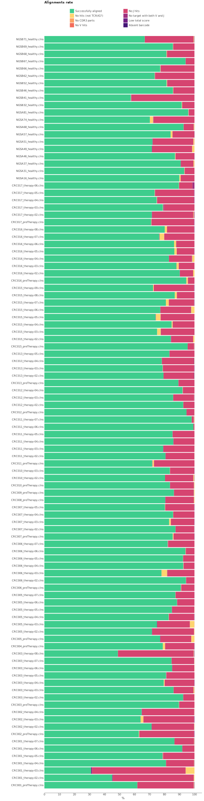

# iRepertoire

Here we will discuss how to process the data obtained using iRepertoire TCR LR kit. This is a multiplex protocol designed in such a way that forward primers are located in FR1 region of V gene and reverse primers are complimentary to constant region. 

## Data libraries

This tutorial uses the data from the following publication: *Longitudinal High-Throughput Sequencing of the T-Cell Receptor Repertoire Reveals Dynamic Change and Prognostic Significance of Peripheral Blood TCR Diversity in Metastatic Colorectal Cancer During Chemotherapy* Yi-Tung Chen et al., Front. Immunol., 2022 Jan;12:743448 [doi: 10.3389/fimmu.2021.743448](https://doi.org/10.3389/fimmu.2021.743448)

A total of 36 subjects, including 20 healthy controls and 16 metastatic CRC patients, were enrolled in this study.Peripheral blood samples were obtained from 20 age-matched healthy controls (62.6 ± 10.48 years old) and 16 CRC patients (62.38 ± 12.62 years old) before therapy. Among the 16 CRC patients, 67 peripheral blood samples were collected from 13 patients with follow-up every two months for approximately 98 to 452 days. 103 samples in total. Peripheral blood mononuclear cells (PBMCs) were isolated following the standard procedure, and total RNA from PBMCs was extracted using TRIzol reagent (Invitrogen, Carlsbad, CA) according to the manufacturer’s protocol. A multiplex PCR amplification reaction was used to amplify the TCR immune repertoire. Human TCRα and TCRβ libraries were prepared using the HTAI-M and HTBI-M Kits (iRepertoire, Inc.) according to the manufacturer’s instructions and 2 × 250 bp paired-end sequenced was performed on the Illumina MiSeq platform.

All data is available from SRA (PRJNA754274) using e.g. [SRA Explorer](https://sra-explorer.info).

??? tip "Use [aria2c](https://aria2.github.io) for efficient download of the full dataset with the proper filenames:"
    ```shell title="download.sh"
    --8<-- "guides/biomed2-bcr/scripts/010-download-aria2c.sh"
    ```
    ```shell title="download-list.txt"
    --8<-- "guides/biomed2-bcr/scripts/download-list.txt"
    ```

The project contains 103 FASTQ file pairs. For the purpose of this tutorial we assume that all fastq files are stored  in `fastq/` folder. The structure of sequences is shown on the picture bellow. The data was obtained using multiplex primers for V and J genes. Below you can see the structure of cDNA library.


## Upstream analysis

MiXCR has a dedicated preset for this protocol, thus analysing the data ia as easy as:

```shell
--8<-- "guides/irepertoire-tcr-lr/scripts/020-upstream-preset.sh"
```

One might also use [GNU Parallel](https://www.gnu.org/software/parallel/) to process all samples at once:

```shell
--8<-- "guides/irepertoire-tcr-lr/scripts/020-upstream-preset-parallel.sh"
```

### Under the hood pipeline:

Under the hood `irepertoire-human-rna-xcr-repseq-sr` executes the following pipeline:

#### `align`
Alignment of raw sequencing reads against reference database of V-, D-, J- and C- gene segments.

```shell
--8<-- "guides/irepertoire-tcr-lr/scripts/040-upstream-align.sh"
```

Option `--report` is specified here explicitly.

`--species hsa`
: determines the organism species.

`-p`
: `generic-amplicon` a preset of MiXCR parameters for amplicon data .


`-OvParameters.geneFeatureToAlign="VTranscriptWithout5UTRWithP"`
: Sets a V gene feature to align. Check [gene features](../reference/ref-gene-features.md) for more info.

`-OvParameters.parameters.floatingLeftBound=true`
: Results in a local alignment algorithm for V gene left bound due to the presence of primer sequences in V-gene region.

`-OjParameters.parameters.floatingRightBound=false -OcParameters.parameters.floatingRightBound=true`
: Results in a global alignment algorithm for J gene right bound and a local alignment algorithm for C-gene right bound due to the presence of primer sequences. 

#### `assemble`
Assembles alignments into clonotypes and applies several layers of errors correction(ex. quality-awared correction for sequencing errors, clustering to correct for PCR errors). Check [`mixcr assemble`](../reference/mixcr-assemble.md) for more information. By default, clones will be assembled by `CDR3` gene feature.

`-OseparateByJ=true`
: Split clones with the same `CDR3` sequence and different J-genes

```shell
--8<-- "guides/irepertoire-tcr-lr/scripts/050-upstream-assemble.sh"
```

#### `export`
Exports clonotypes from .clns file into human-readable tables.

```shell
--8<-- "guides/irepertoire-tcr-lr/scripts/060-upstream-exportClones.sh"
```

`-с <chain>`
: defines a specific chain to be exported.

After execution is complete the following list of files is generated for every sample:

```shell
# human-readable reports 
CRC016_preTherapy.report

# raw alignments (highly compressed binary file)
CRC016_preTherapy.vdjca

# TRA, TRB CDR3 clonotypes (highly compressed binary file)
CRC016_preTherapy.clns

# TRA, TRB CDR3 clonotypes exported in tab-delimited txt
CRC016_preTherapy.TRA.tsv
CRC016_preTherapy.TRB.tsv  
```

While `.clns` file holds all data and is used for downstream analysis using [`mixcr postanalisis`](../reference/mixcr-postanalysis.md), the output `.tsv` clonotype table will contain exhaustive information about each clonotype as well:

??? tip "See first 100 records from clonotype table CRC016_preTherapy:"
    {{ read_csv('docs/mixcr/guides/irepertoire-tcr-lr/figs/CRC016_preTherapy.clones.tsv', engine='python', sep='\t', nrows=100) }}

## Quality control

Now when we have all files processed lets perform Quality Control. The first thing to check is the alignment rate. That can be easily done using [`mixcr exportQc align`](../reference/mixcr-exportQc.md#alignment-reports) function.

```shell
--8<-- "guides/irepertoire-tcr-lr/scripts/080-qc-align.sh"
```




From this plot we can clearly see some issues with the libraries. A lot of the samples have a relatively big fraction of not aligned reads primarily due to the absence of J hits. 

MiXCR is a powerful tool that allows us to investigate further. Let's pick one of the samples where the issue is most obvious. (ex. CRC00308 ). To look at the reads' alignments for that sample we first will run [`mixcr align`](../reference/mixcr-align.md) command for that sample once again, but this time we will specify additional options - `-OallowPartialAlignments=true -OallowNoCDR3PartAlignments=true`, that will preserve partially aligned reads (ex. reads that may lack J gene) and reads that lack `CDR3` sequence.

```shell
--8<-- "guides/irepertoire-tcr-lr/scripts/090-qc-debug-align.sh"
```


Now we can look at raw alignments itself using [`mixcr exportAlignmentsPretty`](../reference/mixcr-exportPretty.md#raw-alignments).

The function bellow will generate a `.txt` human-readable file with alignments. We use parameter `--skip 1000` to skip first 1000 reads, as first reads usually have bad quality, and `--limit 100` will export only 100 alignments as we usually don't need to examine every alignment to see the issue.

```shell
--8<-- "guides/irepertoire-tcr-lr/scripts/110-qc-exportAlignmentsPretty.sh"
```

Bellow you can see a few alignments from the generated file. The first one is an example of well aligned reads.

```shell
>>> Read ids: 1113


                                            FR1><CDR1     CDR1><FR2
              _ E  K  P  V  T  L  S  C  S  Q  T  L  N  H  N  V  M  Y  W  Y  Q  Q  K  S  S  Q
  Quality     66666767777777777777777777777777777777777777777777777777777777777777777777777777
  Target0   0 AGAAAAGCCAGTGACCCTGAGTTGTTCTCAGACTTTGAACCATAACGTCATGTACTGGTACCAGCAGAAGTCAAGTCAGG 79   Score
TRBV15*00 104    aaagccagtgaccctgagttgttctcagactttgaaccataacgtcatgtactggtaccagcagaagtcaagtcagg 180  1148

                              FR2><CDR2        CDR2><FR3
              A  P  K  L  L  F  H  Y  Y  D  K  D  F  N  N  E  A  D  T  P  D  N  F  Q  S  R  R
  Quality     77777777777777777777777777777777777777777777777777777777777777777777777777777777
  Target0  80 CCCCAAAGCTGCTGTTCCACTACTATGACAAAGATTTTAACAATGAAGCAGACACCCCTGATAACTTCCAATCCAGGAGG 159  Score
TRBV15*00 181 ccccaaagctgctgttccactactatgacaaagattttaacaatgaagcagacacccctgataacttccaatccaggagg 260  1148

                                                                            FR3><CDR3        V
               P  N  I  S  F  C  F  L  D  I  R  S  P  G  L  G  D  A  A  M  Y  L  C  A  T  S  G
  Quality     77777777777777777777777777777777777777777777777777777777777777777777777777777777
  Target0 160 CCGAACATTTCTTTCTGCTTTCTTGACATCCGCTCACCAGGCCTGGGGGACGCAGCCATGTACCTGTGTGCCACCAGCGG 239  Score
TRBV15*00 261 ccgaacaCttctttctgctttcttgacatccgctcaccaggcctgggggacAcagccatgtacctgtgtgccaccagcAg 340  1148

               >      <J        CDR3><FR4                    FR4><C
                 L  G  D  T  Q  Y  F  G  P  G  T  R  L  T  V  L  E  D  L  K  N  V  F  P  P  E
   Quality     77777777777777777777777777777777777777777777777777777777777777777777777777777777
   Target0 240 ACTAGGGGATACGCAGTATTTTGGCCCAGGCACCCGGCTGACAGTGCTCGAGGACCTGAAAAACGTGTTCCCACCCGAGG 319  Score
 TRBV15*00 341 a                                                                                341  1148
TRBJ2-3*00  26        gatacgcagtattttggcccaggcacccggctgacagtgctcg                               68   215
  TRBC2*00   0                                                   aggacctgaaaaacgtgttcccacccgagg 29   260


             V  A  V  F  E  P  S  D  S  Q _
 Quality     7777777777777777777777777766666
 Target0 320 TCGCTGTGTTTGAGCCATCAGATAGTCAATG 350  Score
TRBC2*00  30 tcgctgtgtttgagccatcaga          51   260
```

Now, the following pair of reads failed to align.

```shell
>>> Read ids: 1115


          _  N  P  V  G  L  R  C  Y  P  T  S  V  F  F  C  V  Y  L  Y  Q  Q  K  P  F  P  C
Quality   33553553353536366363363333633322336733363663633333633633733363222632222333655322
Target0 0 CAAACCCCGTGGGGCTGAGGTGCTACCCAACCTCTGTCTTTTTCTGTGTGTACTTGTACCAACAAAAACCCTTCCCCTGC 79  Score


            P  G  S  P  S  K  N  Y  Q  A  E  G  G  G  D  G  E  G  E  E  G  V  S  G  G  R  R
Quality    62222252552522333333633336333225522622222222252522525222222222222233522525222522
Target0 80 CCCGGGTCCCCCAGTAAGAATTATCAGGCCGAAGGGGGAGGAGACGGGGAGGGGGAAGAAGGAGTATCCGGGGGGCGGCG 159  Score

                                                                         FR3><CDR3
               V  V  L  K  K  K  L  N  L  S  S  L  E  L  V  D  S  A  L  Y  F  C  A  S  V  G
 Quality     22242225222672224452252522242225242626256626244262222424525222625452225222252225
 Target0 160 CGTTGTCTTAAAAAAAAAACTAAACCTGAGCTCTCTGGAGCTGGTGGACTCAGCTTTGTATTTCTGTGCCAGCGTCGGGT 239  Score
TRBV9*00 280                  aactaaacctgagctctctggagctggGggactcagctttgtatttctgtgccagc--AgCgt 340  200

             V><VP     VP>
             S   H   H  I
 Quality     242 22 252224
 Target0 240 CGC-AC-CACATA 250  Score
TRBV9*00 341 AgcTacGcTGCtG 353  200

             <CDR2        CDR2><FR3
              Y  H  K  G  E  E  R  A  K  G  N  I  L  E  R  F  S  A  Q  Q  F  P  D  F  L  F  F
 Quality     22224664272772777762664467626552222267767777765422666277777777766636665226665653
 Target1   0 TATCATAAAGGAGAAGAGAGAGCAAAAGGAAACATTCTTGAACGATTCTCCGCACAACAGTTCCCTGACTTTCTTTTTTT 79   Score
TRBV9*00 201 tatTataaTggagaagagagagcaaaaggaaacattcttgaacgattctccgcacaacagttccctgactt          271  327


             Q  A  E  D  G  I  R  H  R  S  R  H  S  C  *  T  A  L  P  I  *  T  P  V  E  L
Quality    27773753566265533552552226776565636377677777752777762626237777377772777667667733
Target1 80 TCAAGCAGAAGACGGCATACGACATCGGTCTCGGCATTCCTGCTGAACCGCTCTTCCGATTTGAACCCCTGTGGAGCTGA 159  Score


            R  C  N  Y  S  S  S  V  S  V  Y  L  F  *  Y  P  E  P  *  P  C  R  V  P  A  E  R
Quality     67777776777762277637766776776776667776676776636666776636366767337776636766636367
Target1 160 GGTGCAACTACTCATCGTCTGTTTCAGTGTATCTCTTCTGATATCCAGAACCCTGACCCTGCCGTGTACCAGCTGAGAGA 239  Score


             L  S  Q _
Quality     66776666366
Target1 240 CTTAGTCAGCC 250  Score
```

One can use BLAST and search for the not aligned parts of sequence in order to find out its origin.

Another quality report we should investigate is a chain abundance plot.

```shell
--8<-- "guides/irepertoire-tcr-lr/scripts/120-qc-chainUsage.sh"
```


Most of the samples are more or less equally consist of TRA and TRB chains. Although we can also see a few samples (ex. CRC013_therapy-02) with no TRA chain wich might indicate some cDNA library reparation issues and needs further investigation.

## Full-length clonotype assembly

iRepertoire protocol allows to recover a broader BCR receptor sequence then just `CDR3` region. According to the protocol, forward primers are located in `FR1` region, thus we can safely use an assembling feature that starts from `CDR1` and be sure that no primers will affect the original sequence. The reverse primers are located in `FR4` region very close to `CDR3`, thus there is not much left from to include in clone assembly.

Taking into account what is mentioned above, the longest possible assembling feature for this protocol is `"{CDR1Begin:CDR3End}"`.

MiXCR has a specific preset to obtain full-length BCR clones with Biomed2 protocol:

```shell
--8<-- "guides/irepertoire-tcr-lr/scripts/130-upstream-preset-full-length.sh"
```

The `mixcr assemble` step in this preset differs from the one above in the following manner:

```shell
--8<-- "guides/irepertoire-tcr-lr/scripts/140-upstream-assemble-full-length.sh"
```

`-OassemblingFeatures="{CDR1Begin:CDR3End}"`
: sets the assembling feature to the region which starts from `CDR1Begin` and ends at the end of `CDR3`.


## Reports

Finally, MiXCR provides a very convenient way to look at the reports generated at ech step. Every `.vdjca`, `.clns` and `.clna` file holds all the reports for every MiXCR function that has been applied to this sample. E.g. in our case `.clns` file contains reports for `mixcr align` and `mixcr assemble`. To output this report use [`mixcr exportReports`](../reference/mixcr-exportReports.md) as shown bellow. Note `--json` parameter will output a JSON-formatted report.

```shell
--8<-- "guides/irepertoire-tcr-lr/scripts/125-qc-exportReports.sh"
```

```shell
--8<-- "guides/irepertoire-tcr-lr/scripts/125-qc-exportReports-json.sh"
```

??? "Show report file"
    === "`.txt`"
        ```shell
        --8<-- "guides/irepertoire-tcr-lr/figs/CRC016_preTherapy.report.txt"
        ```
    === "`.json`"
        ```json
        --8<-- "guides/irepertoire-tcr-lr/figs/CRC016_preTherapy.report.json"
        ```
