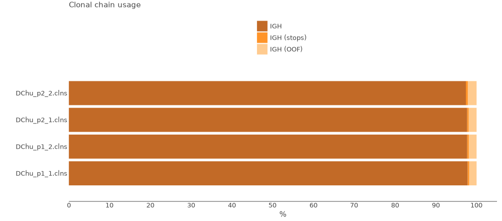

# MiLaboratories Human BCR Multiplex kit

This kit allows to obtain TCR alpha and beta repertoires for different types of available RNA material, with high sensitivity and UMI-based accuracy.

Bellow you can see the structure of cDNA library.


The data for this tutorial consists of four samples. Total RNA was isolated from human PBMC. cDNA libraries were prepared for each sample according to MiLaboratories Human BCR RNA Multiplex kit protocol for all IGH chain. Sequencing was performed on an Illumina NextSeq500 sequencer paired-end 2x250 bp reads.

All data may be downloaded using the script bellow.

??? tip "Use [aria2c](https://aria2.github.io) for efficient download of the full dataset with the proper filenames:"
    ```shell title="download.sh"
    --8<-- "milaboratories-human-tcr-dna-multi/scripts/010-download-aria2c.sh"
    ```
    ```shell title="download-list.txt"
    --8<-- "milaboratories-human-tcr-dna-multi/scripts/download-list.txt"
    ```
## Upstream analysis

### One-line solution

MiXCR has a dedicated preset for this protocol, thus analysing the data is as easy as:

```shell
--8<-- "milaboratories-human-bcr-rna-multi/scripts/020-upstream-preset.sh"
```

Running the command above will generate the following files:

```shell
> ls result/

# human-readable reports 
DChu_p1_1.align.report.txt
DChu_p1_1.align.report.json
DChu_p1_1.refine.report.txt
DChu_p1_1.refine.report.json
DChu_p1_1.assemble.report.txt
DChu_p1_1.assemle.report.json

# raw alignments (highly compressed binary file)
DChu_p1_1.vdjca

#Alignments with corrected barcode after ```mixcr refineTagsAndSort```
DChu_p1_1.vdjca

# TRA, TRB CDR3 clonotypes (highly compressed binary file)
DChu_p1_1.clns

# TRA,TRB CDR3 clonotypes exported in tab-delimited txt
DChu_p1_1.clones_IGH.tsv
```

While `.clns` file holds all data and is used for downstream analysis using [`mixcr postanalisis`](../reference/mixcr-postanalysis.md), the output `.txt` clonotype table will contain exhaustive information about each clonotype as well:

??? tip "See first 500 records from DNA77_repl1.clones_TRAD.tsv clonotype table"
    {{ read_csv('docs/mixcr/guides/milaboratories-human-bcr-rna-multi/figs/DChu_p1_1.clones_IGH.tsv', engine='python', sep='\t') }}

In order to run the analysis for all samples in the project on Linux we can use [GNU Parallel](https://www.gnu.org/software/parallel/) in the following way:

```shell
--8<-- "milaboratories-human-bcr-rna-multi/scripts/021-upstream-preset-parallel.sh"
```

### Under the hood pipeline

Under the hood `milab-human-bcr-multiplex-cdr3` preset actually executes the following pipeline:

#### `align`
[Alignment](../reference/mixcr-align.md) of raw sequencing reads against reference database of V-, D-, J- and C- gene segments.

```shell
--8<-- "milaboratories-human-bcr-rna-multi/scripts/030-upstream-align.sh"
```

Option `--report` and `--json-report` are specified here explicitly.

`--species hsa`
: determines the organism species (hsa for _Homo Sapiens_).

`-p bundle-umi-kaligner2-v1-base`
:  a preset of MiXCR parameters which includes a dedicated BCR aligner and defines required parameters for UMI correction.

`-tag-pattern '^N{0:2}tggtatcaacgcagagt(UMI:N{14})N{20}(R1:*) \ ^N{22}(R2:*)'`
: this pattern marks the UMI region and ensures primer sequences trimming. 

`-OvParameters.geneFeatureToAlign="VTranscriptWithP"`
: Sets a V gene feature to align to VTranscriptWithP. Check [gene features](../reference/ref-gene-features.md) for more info.

`-OvParameters.parameters.floatingLeftBound=false`
: Results in a global alignment algorithm for V gene left bound.

`-OjParameters.parameters.floatingRightBound=false`
: Results in a global alignment algorithm for J gene right bound.

`-OcParameters.parameters.floatingRightBound=false`
: Results in a global alignment algorithm for C gene right bound.


#### `refineTagsAndSort`

[Corrects](../reference/mixcr-refineTagsAndSort.md) sequencing and PCR errors _inside_ barcode sequences. This step does extremely important job by correcting artificial diversity caused by errors in barcodes. In the considered example project it corrects only sequences of UMIs.

!!! note
    The `bundle-umi-kaligner2-v1-base` preset specified at the `mixcr align` step will turn on the automatic filtering of reads during this step. The filtering is based on the Otsu's method and automatically sets the threshold for number of reads per UMI. Only those UMIs that pass the threshold will be used in further analysis.

```shell
--8<-- "milaboratories-human-bcr-rna-multi/scripts/040-upstream-refineTagsAndSort.sh"
```

#### `assemble`
[Assembles](../reference/mixcr-assemble.md) clonotypes and applies several layers of errors correction:

- quality-dependent correction for sequencing errors
- PCR-error correction by clustering
- UMI-based error correction

Check [`mixcr assemble`](../reference/mixcr-assemble.md) for more information.


```shell
--8<-- "milaboratories-human-bcr-rna-multi/scripts/050-upstream-assemble.sh"
```

Options `--report` and `--json-report` are specified here explicitly so that the report files will be appended with assembly report.

`-OassemblingFeatures=CDR3`
: This option is specified here explicitly as by default the clones are assembled by `CDR3` sequence.

`-OseparateByV=true`
: separate clones with the same  `CDR3` region, but different V-genes.

`-OseparateByJ=true`
: separate clones with the same  `CDR3` region, but different J-genes.

`-OseparateByC=true`
: separate clones with the same  `CDR3` region, but different C-genes. This option is required to separate different Ig isotypes.

`-OseparateBy` options above should only be used when the primer sequences were trimmed.


#### `export`
Exports clonotypes from .clns file into human-readable tables. The preset used at the alignment step also modifies this command to export UMIs counts and fraction for each clone.

```shell
--8<-- "milaboratories-human-bcr-rna-multi/scripts/060-upstream-exportClones.sh"
```

## Quality control

Now when we have all files processed lets perform Quality Control. That can be easily done using [`mixcr exportQc`](../reference/mixcr-exportQc.md)
function.

First we will look at the alignment report:

```shell
--8<-- "milaboratories-human-bcr-rna-multi/scripts/070-qc-align.sh"
```


From this plot we can tell that all samples have high alignment rate and almost all reads from each sample have been successfully aligned to the reference sequences and CDR3 has been established. 
Now we can check chain distribution plot:

```shell
--8<-- "milaboratories-human-bcr-rna-multi/scripts/080-qc-chainUsage.sh"
```



Every sample consist solely of IGH chain.

## Reports
Finally, MiXCR provides a very convenient way to look at the reports generated at ech step. Every `.vdjca`, `.clns` and `.clna` file holds all the reports for every MiXCR function that has been applied to this sample. E.g. in our case `.clns` file contains reports for `mixcr align` and `mixcr assemble`. To output this report use [`mixcr exportReports`](../reference/mixcr-exportReports.md) as shown bellow. Note `--json` parameter will output a JSON-formatted report.

```shell
--8<-- "milaboratories-human-bcr-rna-multi/scripts/100-qc-exportReports.sh"
```

```shell
--8<-- "milaboratories-human-bcr-rna-multi/scripts/101-qc-exportReports-json.sh"
```

??? "Show report file"
    === "`.txt`"
        ```shell
        --8<-- "milaboratories-human-bcr-rna-multi/figs/DChu_p1_1.report.txt"
        ```
    === "`.json`"
        ```json
        --8<-- "milaboratories-human-bcr-rna-multi/figs/DChu_p1_1.report.json"
        ```