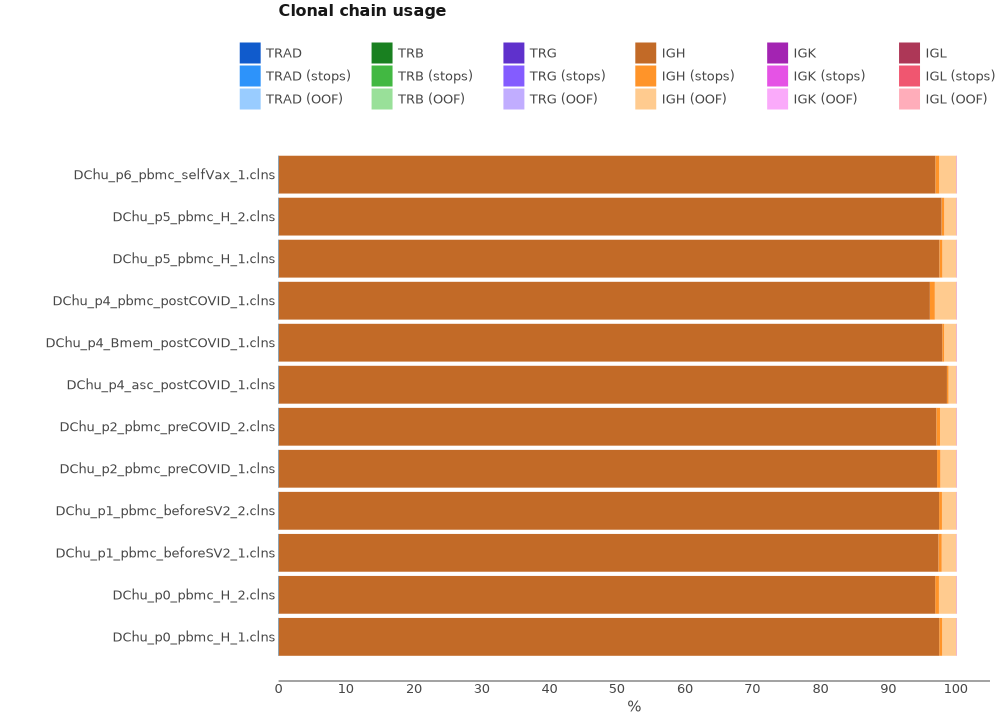

# MiLaboratories Human Ig Repertoire RNA Multiplex Kit

This kit allows to obtain full length IG heavy and light chain repertoires with UMI-based accuracy. Discriminates all IGH isotypes including IgM, IgD, IgG3, IgG1, IgA1, IgG2, IgG4, IgE, and IgA2.

Bellow you can see the structure of cDNA library.

<figure markdown>

</figure>

## Upstream analysis

### One-line solution

The most straightforward way to get clonotype tables is to use a universal [`mixcr analyze`](../../reference/mixcr-analyze.md) command in the following manner:

```shell
'>mixcr analyze amplicon \
    --species hsa \
    --starting-material rna \
    --receptor-type bcr \
    --umi-pattern-name MiLaboratoriesMultiplexBCR \
    --5-end no-v-primers \
    --3-end c-primers \
    --adapters no-adapters \
    --assemble "-OassemblingFeatures={CDR1Begin:FR4End} -OseparateByC=true" \
    M1_4T1_Blood_S2_L001_R1_001_B3.1.fastq.gz \
    M1_4T1_Blood_S2_L001_R1_001_B3.1.fastq.gz \
    M1_4T1_Blood_S2
```

The meaning of these options is the following.

`--species`
:   is set to `hsa` for _Homo Sapiens_

`--starting-material`
:   is set to `rna` and corresponds to `VTranscriptWithout5UTRWithP` alignment feature for V-gene (see [Gene features and anchor points](../../reference/geneFeatures.md) for details)

`--receptor-type`
:  `bcr`. It affects the choice of alignment algorithms. MiXCR uses a specific set of algorithms for BCR data.

`--umi-pattern-name`
: `MiLaboratoriesMultiplexBCR`. This is a build in MiXCR [umi-pattern](../../reference/tag-pattern.md) that stands for `"^N{0:2}tggtatcaacgcagagt(UMI:NNNNTNNNNTNNNN)N{20}(R1:*) \ ^N{22}(R2:*)"`. This pattern sets the UMI location in the read and is also written in a way that primers locations will be excluded from the sequences during the analysis.

`--5-end`
:   is set to `no-v-primers` because we specified umi-pattern in such a way that primers locations will be excluded from the sequences during the analysis. This leads to a global alignment algorithms to align the left bound of V gene.

`--3-end-primers`
:  is set to `c-primers`. 

`--adapers`
:   `no-adapters` because we specified umi-pattern in such a way that primers locations will be excluded from the sequences during the analysis.

`--assemble`
:  `"-OassemblingFeatures={CDR1Begin:FR4End} -OseparateByC=true"`. Here we pass two extra arguments for [`mixcr assemble`](../../reference/mixcr-assemble.md) step of the pipeline. First we extend the assembling feature to start from `CDR1`. That is because this is BCR data, where hypermutations occur throughout V gene, and we want to capture as much as we can. Second, we use `-OseparateByC=true` option to separate clones with the same assembling feature sequence but different C genes, which is essential for isotype identification.

`M1_4T1_Blood_S2_L001_R1_001_B3.1.fastq.gz M1_4T1_Blood_S2_L001_R1_001_B3.1.fastq.gz M1_4T1_Blood_S2`
: Finally, we provide the names of input files and an output prefix:


Now, since we have multiple files ist easier to process them all together instead of running the same command multiple times. One of the ways to achieve it is to use [GNU Parallel](https://www.gnu.org/software/parallel/):

```shell
> fastq/*R1* | 
  parallel -j2 \
   '~/mixcr-private/mixcr analyze amplicon \
        --species hsa \
        --starting-material rna \
        --receptor-type bcr \
        --umi-pattern-name MiLaboratoriesMultiplexBCR \
        --5-end no-v-primers \
        --3-end c-primers \
        --adapters no-adapters \
        --assemble "-OassemblingFeatures={CDR1Begin:FR4End} -OseparateByC=true" \
        {} \
        {=s:R1:R2:=} \
        {=s:.*/:results/:;s:_L001.*::=}'
```

### Under the hood of `mixcr analyze` pipeline

Under the hood, `mixcr analyze amplicon` command that we use above actually executes the following pipeline of MiXCR actions:

#### `align`

[Performs](../../reference/mixcr-align.md):

- alignment of raw sequencing reads against reference database of V-, D-, J- and C- gene segments
- pattern matching of tag pattern sequence and extraction of barcodes

```shell
 > mixcr align \
    --species hsa \
    --report result/Multi_TRA_10ng_3.report \
    --json-report result/Multi_TRA_10ng_3.report.json \
    -OvParameters.geneFeatureToAlign=`VTranscriptWithout5UTRWithP` \
    -OvParameters.parameters.floatingLeftBound=false \
    -OjParameters.parameters.floatingRightBound=false \
    -OcParameters.parameters.floatingRightBound=false \
    fastq/M1_4T1_Blood_S2_L001_R1_001_B3.1.fastq.gz \
    fastq/M1_4T1_Blood_S2_L001_R2_001_B3.1.fastq.gz \
    results/M1_4T1_Blood_S2.vdjca
```

Options `--report` and `--json-report` are specified here explicitly. Since we start from RNA data we use `VTranscriptWithout5UTRWithP` for the alignment of V segments (see [Gene features and anchor points](../../reference/geneFeatures.md).

`-OvParameters.parameters.floatingLeftBound=false -OjParameters.parameters floatingRightBound=false -OcParameters.parameters.floatingRightBound=false`
: These options determine global vs local alignment algorithm on the bounds of gene segments. As have been mentioned above we bypass primer sequences by means of the umi-pattern. Thus all segment bouns should be aligned globally.

This step utilizes all available CPUs and scales perfectly. When there are a lot of CPUs, the only limiting factor is the speed of disk I/O. To limit the number of used CPUs one can pass `--threads N` option.

#### `assemble`

[Assembles](../../reference/mixcr-assemble.md) clonotypes and applies several layers of errors correction:

- assembly consensus CDR3 sequence
- quality-awared correction for sequencing errors
- clustering to correct for PCR errors

```shell
> mixcr assemble \
    --report results/Multi_TRA_10ng_3.report \
    --json-report results/Multi_TRA_10ng_3.report.json \
    -OassemblingFeatures={CDR1Begin:FR4End} \
    -OseparateByC=true \
    M1_4T1_Blood_S2.vdjca \
    M1_4T1_Blood_S2.clns
```

Options `--report` and `--json-report` are specified here explicitly so that the report files will be appended with assembly report.

#### `exportClones`

Finally, to [export](../../reference/mixcr-export.md#clonotype-tables) clonotype tables in tabular form `exportClones` is used:

```shell
> mixcr exportClones \
    -p full \
    M1_4T1_Blood_S2.clns \
    M1_4T1_Blood_S2.tsv
```

Here `-p full` is a shorthand for the full preset of common export columns.

## Quality control

Now when the upstream analysis is finished we can move on to quality control. First lets look at the alignment report plot.

```shell
# obtain alignment quality control
> mixcr exportQc align \
    result/*.vdjca \
    alignQc.pdf
```
<figure markdown>

</figure>

We see that all samples have a very high score of successfully aligned reads. No signficat issues present.

Next, lets examine chane usage distribution

<figure markdown>

</figure>

We don't see any contamination from other Ig chains. As expected, all samples consist only of IGH chains.

