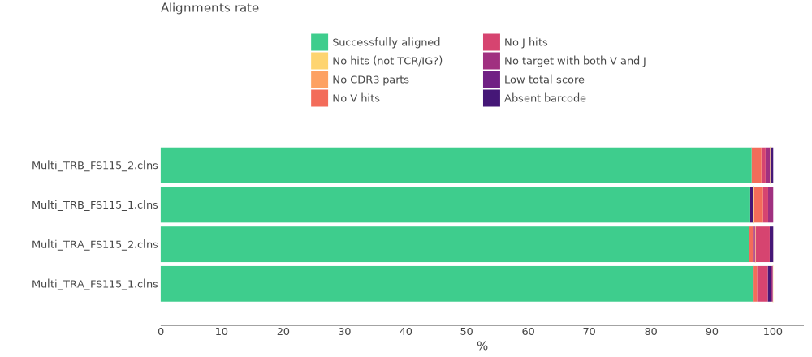
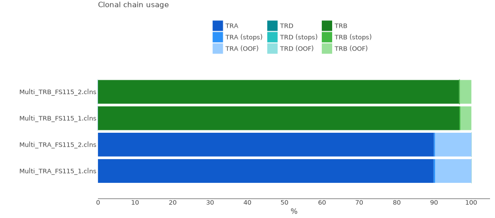

# MiLaboratories Human TCR RNA Multiplex kit

This kit allows to obtain TCR alpha and beta repertoires for different types of available RNA material, with high sensitivity and UMI-based accuracy.

Bellow you can see the structure of cDNA library.


The data for this tutorial consists of two samples that represent two replicas of the same biological sample. Total RNA was isolated from PBMC and 25ng were used for each cDNA synthesis. Two cDNA libraries were prepared for each sample (one for TCR alpha and one for TCR betta) according to MiLaboratories Human TCR Repertoire RNA Multiplex Kit protocol. TCR sequencing was performed on an Illumina Miseq sequencer using the 300-cycle Miseq reagent kit(Illumina) with pair-end, 2x150 base pair reads.

All data may be downloaded using the script bellow.

??? tip "Use [aria2c](https://aria2.github.io) for efficient download of the full dataset with the proper filenames:"
    ```shell title="download.sh"
    --8<-- "guides/milaboratories-human-tcr-rna-multi/scripts/010-download-aria2c.sh"
    ```
    ```shell title="download-list.txt"
    --8<-- "guides/milaboratories-human-tcr-rna-multi/scripts/download-list.txt"
    ```
## Upstream analysis

### One-line solution

MiXCR has a dedicated preset for this protocol, thus analysing the data is as easy as:

```shell
--8<-- "guides/milaboratories-human-tcr-rna-multi/scripts/020-upstream-preset.sh"
```

Running the command above will generate the following files:

```shell
> ls result/

# human-readable reports 
Multi_TRA_FS115_1.report
# raw alignments (highly compressed binary file)
Multi_TRA_FS115_1.vdjca
# alignments with refined UMI barcode sequences 
Multi_TRA_FS115_1.refined.vdjca
# TRA, TRB CDR3 clonotypes (highly compressed binary file)
Multi_TRA_FS115_1.clns
# TRA,TRB CDR3 clonotypes exported in tab-delimited txt
Multi_TRA_FS115_1.clonotypes.TRA.tsv
Multi_TRA_FS115_1.clonotypes.TRB.tsv
```

While `.clns` file holds all data and is used for downstream analysis using [`mixcr postanalisis`](../reference/mixcr-postanalysis.md), the output `.txt` clonotype table will contain exhaustive information about each clonotype as well:

??? tip "See first 100 records from FebControl1.clones.IGH.tsv clonotype table"
    {{ read_csv('docs/mixcr/guides/milaboratories-human-tcr-rna-multi/figs/Multi_TRA_FS115_1.clones.tsv', engine='python', sep='\t', nrows=100) }}

In order to run the analysis for all samples in the project on Linux we can use [GNU Parallel](https://www.gnu.org/software/parallel/) in the following way:

```shell
--8<-- "guides/milaboratories-human-tcr-rna-multi/scripts/020-upstream-preset-parallel.sh"
```

### Under the hood pipeline

Under the hood `milab-human-rna-tcr-umi-multiplex` preset actually executes the following pipeline:

#### `align`
[Alignment](../reference/mixcr-align.md) of raw sequencing reads against reference database of V-, D-, J- and C- gene segments.

```shell
--8<-- "guides/milaboratories-human-tcr-rna-multi/scripts/040-upstream-align.sh"
```

Option `--report` is specified here explicitly.

`--species hsa`
: determines the organism species (hsa for _Homo Sapiens_).

`-p generic-amplicon`
:  a generic preset of MiXCR parameters for amplicon data.

`-OvParameters.geneFeatureToAlign="VTranscriptWithout5UTRWithP"`
: Sets a V gene feature to align. Check [gene features](../reference/ref-gene-features.md) for more info.

`-OvParameters.parameters.floatingLeftBound=false`
: Results in a global alignment algorithm for V gene left bound. We use it because primer sequences were trimmed with `--tagPattern`.

`-OjParameters.parameters.floatingRightBound=false`
: Results in a global alignment algorithm for J gene right bound due to the absence of primer sequences.

`-OcParameters.parameters.floatingRightBound=false`
: Results in a local alignment algorithm for C gene right bound.We use it because primer sequences were trimmed with `--tagPattern`.

`--tagPattern "^N{0:2}tggtatcaacgcagagt(UMI:N{14})N{21}(R1:*) \ ^N{20}(R2:*)"`
: tag pattern specifies the location of the UMI barcode according to the library structure and trims primers sequences.


#### `refineTagsAndSort`

[Corrects](../reference/mixcr-refineTagsAndSort.md) sequencing and PCR errors _inside_ barcode sequences. This step does extremely important job by correcting artificial diversity caused by errors in barcodes. In the considered example project it corrects only sequences of UMIs.

```shell
--8<-- "guides/milaboratories-human-tcr-rna-multi/scripts/045-upstream-refineTagsAndSort.sh"
```

#### `assemble`
[Assembles](../reference/mixcr-assemble.md) clonotypes and applies several layers of errors correction:

- quality-dependent correction for sequencing errors
- PCR-error correction by clustering
- UMI-based error correction)

Check [`mixcr assemble`](../reference/mixcr-assemble.md) for more information.


```shell
--8<-- "guides/milaboratories-human-tcr-rna-multi/scripts/050-upstream-assemble.sh"
```

Options `--report` and `--json-report` are specified here explicitly so that the report files will be appended with assembly report.

`-OassemblingFeatures=CDR3`
: By default `qiaseq-human-tcr-cdr3` preset assembles clones by `CDR3` sequence.

`-separateByJ: true`
: Separate clones with the same assembling feature, but different V-genes.

`-separateByV: true`
: Separate clones with the same assembling feature, but different J-genes.

#### `export`
Exports clonotypes from .clns file into human-readable tables.

```shell
--8<-- "guides/milaboratories-human-tcr-rna-multi/scripts/060-upstream-exportClones.sh"
```

`-с TRA`
: defines a specific chain to be exported.

`-uniqueTagCount UMI`
: adds a column with the number of UMIs for each clone.


## Quality control

Now when we have all files processed lets perform Quality Control. That can be easily done using [`mixcr exportQc`](../reference/mixcr-exportQc.md)
function.

```shell
--8<-- "guides/milaboratories-human-tcr-rna-multi/scripts/080-qc-align.sh"
```



From this plot we can tell that all samples have high alignment rate, more than 90% of reads have been successfully aligned to the reference sequences and CDR3 has been established.

Now we can check chain distribution plot:

```shell
--8<-- "guides/milaboratories-human-tcr-rna-multi/scripts/120-qc-chainUsage.sh"
```



Here we can see that no cross-contamination has occurred. TCR alpha samples consist only of TRA clones, and TCR betta only of TRB.

## Reports
Finally, MiXCR provides a very convenient way to look at the reports generated at ech step. Every `.vdjca`, `.clns` and `.clna` file holds all the reports for every MiXCR function that has been applied to this sample. E.g. in our case `.clns` file contains reports for `mixcr align` and `mixcr assemble`. To output this report use [`mixcr exportReports`](../reference/mixcr-exportReports.md) as shown bellow. Note `--json` parameter will output a JSON-formatted report.

```shell
--8<-- "guides/milaboratories-human-tcr-rna-multi/scripts/125-qc-exportReports.sh"
```

```shell
--8<-- "guides/milaboratories-human-tcr-rna-multi/scripts/125-qc-exportReports-json.sh"
```

??? "Show report file"
    === "`.txt`"
        ```shell
        --8<-- "guides/milaboratories-human-tcr-rna-multi/figs/Multi_TRA_FS115_1.report.txt"
        ```
    === "`.json`"
        ```js
        --8<-- "guides/milaboratories-human-tcr-rna-multi/figs/Multi_TRA_FS115_1.report.json"
        ```