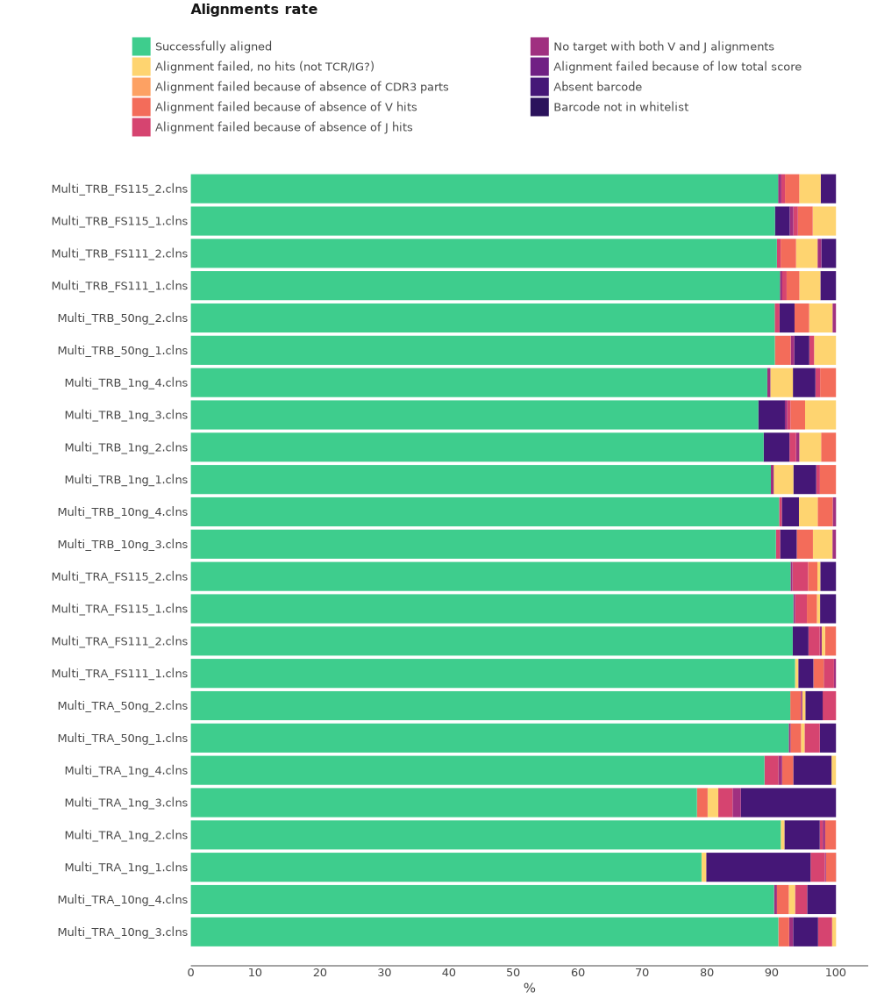

# MiLaboratories RNA 5'RACE TCR repertoire kit

In this tutorial we are going to analyze data generated using MiLaboratories HUMAN RNA 5'RACE TCR repertoire kit.
The data for this tutorial consists of 12 samples. For each sample two cDNA libraries were prepared one for each TCR chain (TRA,TRB). Samples differ among ech other by the amount of RNA used for 1st strand cDNA synthesis.

Bellow you can see the structure of cDNA library.

<figure markdown>

</figure>

## Upstream analysis

### One-line solution

The most straightforward way to get clonotype tables is to use a universal [`mixcr analyze`](../../reference/mixcr-analyze.md) command.

According to the library preparation protocol, the library has V primers on 5'-end and C primers on 3', so the command for a single sample is the following:

```shell
> mixcr analyze amplicon \
    --species mmu \
    --starting-material hsa \
    --receptor-type tcr \
    --umi-pattern-name MiLaboratoriesRACETCR \
    --5-end no-v-primers \
    --3-end c-primers \
    --adapters adapters-present \
    --report Multi_TRA_10ng_3.report:= \
    fastq/RACE_TRA_10ng_3_S167_R1_001.fastq.gz \
    fastq/RACE_TRA_10ng_3_S167_R1_001.fastq.gz \
    results/RACE_TRA_10ng_3
```

The meaning of these options is the following.

`--species`
:   is set to `hsa` for _Homo Sapiens_. You want to set this parameter to `mmu` for _Mus Musculus_

`--starting-material`
:   is set to `rna` and corresponds to `VTranscriptWithout5UTRWithP` alignment feature for V-gene (
see [Gene features and anchor points](../../reference/ref-gene-features.md) for details)

`--receptor-type`
:  `tcr`. It affects the choice of alignment algorithms.

`--umi-pattern-name`
:  `MiLaboratoriesRACETCR` specifies a build in UMI pattern for MiLaboratories RNA 5'RACE TCR repertoire kit. This name stands for the following pattern: `"^(R1:*) \ ^tggtatcaacgcagagt(UMI:NNNNTNNNNTNNNN)(R2:*)"`. It specifies the position of UMI barcode. MiXCR provides a powerful regex-like [language](../../reference/ref-tag-pattern.md) allowing to specify almost arbitrary barcode structure.

`--5-end`
:   is set to `no-v-primers` because the data was generated using 5'RACE protocol. This choice leads to a global alignment algorithm to align the left bound of V.

`--3-end-primers`
:  is set to `c-primers` since the primer used for library preparation is complimentary to C-region of TCR genes.
This leads to a global alignment algorithms to align the right bound of J and a local alignment at the right bound of C gene.

`--adapers`
:   `adapterspresent` because primer sequences were not cut off prior to.


Running the command above will generate the following files:

```shell
> ls result/

# human-readable reports 
RACE_TRA_10ng_3.report
# raw alignments (highly compressed binary file)
RACE_TRA_10ng_3.vdjca
# alignments with corrected UMI barcode sequences 
RACE_TRA_10ng_3.corrected.vdjca
# TCRα & TCRβ CDR3 clonotypes (highly compressed binary file)
RACE_TRA_10ng_3.clns
# TCRα & TCRβ CDR3 clonotypes exported in tab-delimited txt
RACE_TRA_10ng_3.clonotypes.TRA.tsv
RACE_TRA_10ng_3.clonotypes.TRB.tsv
RACE_TRA_10ng_3.clonotypes.TRD.tsv
RACE_TRA_10ng_3.clonotypes.TRG.tsv 
```

Clonotype tables is the main result of the upstream analysis. They are stored in a highly compressed and efficient
binary `.clns` file and can be exported in many ways: detailed [tab-delimited format](../../reference/mixcr-export.md) with dozens of customizable columns, [human readable](../../reference/mixcr-exportPretty.md) for manual inspection, and [AIRR format](../../reference/mixcr-exportAirr.md) suitable for many scientific downstream analysis tools. By default, MiXCR exports clonotypes in a tab-delimited format separately for each immunological chain.

In order to run the analysis for all samples in the project on Linux we can for example
use [GNU Parallel](https://www.gnu.org/software/parallel/) in the following way:

```shell
> ls /fastq/*R1* | \
  parallel -j2  \
  'mixcr analyze amplicon \
    --species hsa \
    --starting-material rna \
    --receptor-type tcr \
    --umi-pattern-name MiLaboratoriesRACETCR \
    --5-end no-v-primers \
    --3-end c-primers \
    --adapters adapters-present \
    --report {=s:.*/:results/:;s:_S.*:.report:=} \
    {} \
    {=s:R1:R2:=} \
```

### Under the hood pipeline


Under the hood, `mixcr analyze amplicon` executes the following pipeline of MiXCR actions:

#### `align`

[Performs](../../reference/mixcr-align.md):

- alignment of raw sequencing reads against reference database of V-, D-, J- and C- gene segments
- pattern matching of tag pattern sequence and extraction of barcodes

```shell
 > mixcr align \
    --species hsa \
    --tag-pattern '^(R1:*) \ ^tggtatcaacgcagagt(UMI:NNNNTNNNNTNNNN)(R2:*)' \
    --report result/RACE_TRA_10ng_3.report \
    --json-report result/RACE_TRA_10ng_3.report.json \
    -OvParameters.geneFeatureToAlign="VTranscriptWithout5UTRWithP" \
    -OvParameters.parameters.floatingLeftBound=false \
    -OjParameters.parameters.floatingRightBound=false \
    -OcParameters.parameters.floatingRightBound=true \
    fastq/RACE_TRA_10ng_3.fastq.gz \
    fastq/RACE_TRA_10ng_3.fastq.gz \
    results/RACE_TRA_10ng_3.vdjca
```

Options `--report` and `--json-report` are specified here explicitly. Since we start from RNA data we use `VTranscriptWithout5UTRWithP` for the alignment of V segments (see [Gene features and anchor points](../../reference/ref-gene-features.md). 
Because no primers were used for V segment, we use global alignment on the left bound of V and since we have primers on C segment, we use global alignment for J and local on the right bound of C. This behavior is defined by the following options: `-OvParameters.parameters.floatingLeftBound=false`, `-OjParameters.parameters.floatingRightBound=false`, `-OcParameters.parameters.floatingRightBound=true`.

This step utilizes all available CPUs and scales perfectly. When there are a lot of CPUs, the only limiting factor is the speed of disk I/O. To limit the number of used CPUs one can pass `--threads N` option.

#### `correctAndSortTags`

[Corrects](../../reference/mixcr-correctAndSortTags.md) sequencing and PCR errors _inside_ barcode sequences. This step does extremely important job by correcting artificial diversity caused by errors in barcodes. In the considered example project it corrects only sequences of UMIs.

```shell
> mixcr correctAndSortTags \
    --report results/RACE_TRA_10ng_3.report \
    --json-report results/RACE_TRA_10ng_3.report.json \
    RACE_TRA_10ng_3.vdjca \
    RACE_TRA_10ng_3.corrected.vdjca
```

Options `--report` and `--json-report` are specified here explicitly so that the report files will be appended with the barcode correction report.

#### `assemble`

[Assembles](../../reference/mixcr-assemble.md) clonotypes and applies several layers of errors correction. In the current example project we consider TCRα & TCRβ separately and clonotype by its CDR3 sequence. The layers of correction applied in this example are:

- assembly consensus CDR3 sequence for each UMI
- quality-awared correction for sequencing errors
- clustering to correct for PCR errors, which still may present even in the case of UMI data, since a error may be introduced e.g. on the first reverse-transcription cycle

```shell
> mixcr assemble \
    --report results/RACE_TRA_10ng_3.report \
    --json-report results/RACE_TRA_10ng_3.report.json \
    RACE_TRA_10ng_3.corrected.vdjca \
    RACE_TRA_10ng_3.clns
```

Options `--report` and `--json-report` are specified here explicitly so that the report files will be appended with assembly report.

#### `exportClones`

Finally, to [export](../../reference/mixcr-export.md#clonotype-tables) clonotype tables in tabular form `exportClones` is used:

```shell
> mixcr exportClones \
    -p full \
    -uniqueTagCount UMI \
    RACE_TRA_10ng_3.clns \
    RACE_TRA_10ng_3.tsv
```

Here `-p full` is a shorthand for the full preset of common export columns and `-uniqueTagCount UMI` adds a column with the UMI count for each clone.

## Quality control

Now when the upstream analysis is finished we can move on to quality control. First lets look at the alignment report plot.

```shell
# obtain alignment quality control
> mixcr exportQc align \
    result/*.vdjca \
    alignQc.pdf
```

Let's examine the plot.

<figure markdown>

</figure>

