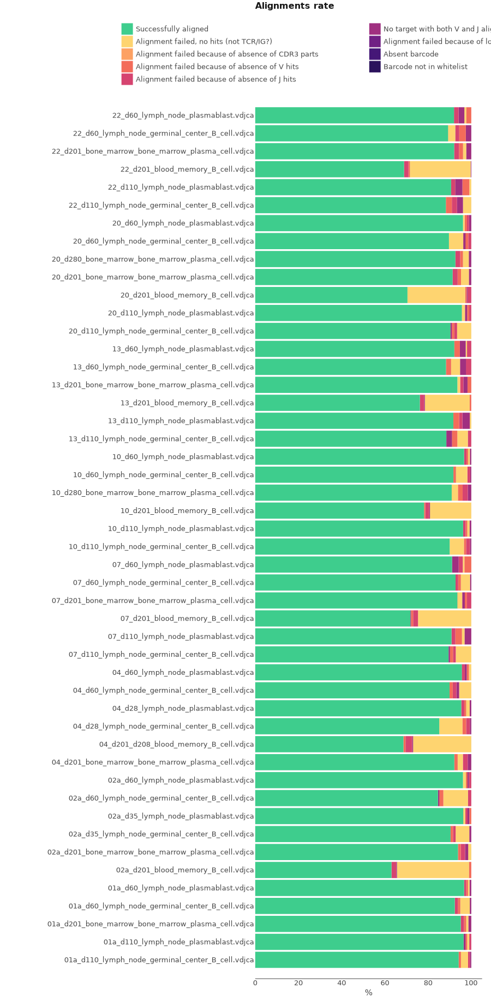
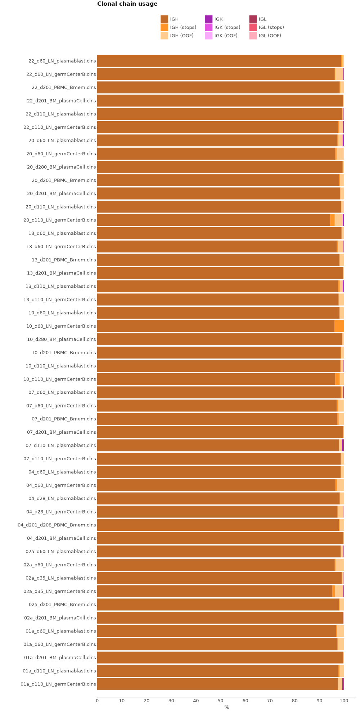

# NEBNext® Immune Sequencing

Here we will discuss how to process BCR cDNA libraries obtained with NEBNext® Immune Sequencing Kit.

## Data libraries

This tutorial uses the data from the following publication: *Germinal centre-driven maturation of B cell response to mRNA vaccination* Wooseob, et al, Nature volume 604, pages141–145 (2022)
[doi:10.1038/s41586-022-04527-1](https://doi.org/10.1038/s41586-022-04527-1)

The data includes samples taken from 8 patients before and several time points after receiving SARS-CoV-2 mRNA vaccine. Samples include: germinal center B cells from lymph node, plasmablasts from lymph node, plasma cells from bone marrow and memory B cells from blood. Sorted GC B cells and LNPCs from FNA, enriched BMPCs from bone marrow or enriched MBCs from PBMCs from blood were used for library preparation for bulk BCR sequecning. Circulating MBCs were magnetically isolated by first staining with IgD-PE and MojoSort anti-PE Nanobeads (BioLegend), and then processing with the EasySep Human B Cell Isolation Kit (StemCell Technologies) to negatively enrich IgDlo B cells. RNA was prepared from each sample using the RNeasy Plus Micro kit (Qiagen). Libraries were prepared using the NEBNext Immune Sequencing Kit for Human (New England Biolabs) according to the manufacturer’s instructions without modifications. Only heavy chain primers were used. High-throughput paired-end sequencing was performed on the Illumina MiSeq platform, 325 cycles for read 1 and 275 cycles for read 2.

On the scheme bellow you can see structure of cDNA library. UMI is located in the first 17 bp of R2, followed by 7 to 10 bp occurred in the process of template switching (TS).

??? "The set of primers used in NEBNext® Immune Sequencing Kits. The list includes primers for human and mice bcr and tcr kits."
    === "Human"
        ```shell
        >Human-IGHM
        GAATTCTCACAGGAGACGAGG
        >Human-IGHD
        TGTCTGCACCCTGATATGATGG
        >Human-IGHA
        GGGTGCTGYMGAGGCTCAG
        >Human-IGHE
        TTGCAGCAGCGGGTCAAGG
        >Human-IGHG
        CCAGGGGGAAGACSGATG
        >Human-IGK
        GACAGATGGTGCAGCCACAG
        >Human-IGL
        AGGGYGGGAACAGAGTGAC
        >Human-TRA
        CACGGCAGGGTCAGGGTTC
        >Human-TRB
        CGACCTCGGGTGGGAACAC
        ```
    === "Mouse"
        ```shell
        >Mus-p5-IgGb
        CCAGGGACCAAGGGATAGAC
        >Mus-p5-IgGa
        CCAGTGGATAGACHGATGGGG
        >Mus-p5-IgE
        GCTTTAAGGGGTAGAGCTGAG
        >Mus-p5-IgD
        CTCTGAGAGGAGGAACATGTCA
        >Mus-p5-IgM
        GGGAAGACATTTGGGAAGGAC
        >Mus-p5-IgA
        GAATCAGGCAGCCGATTATCAC
        >Mus-p5-IgK
        AGATGGATGCAGTTGGTGCA
        >Mus-p5-IgL
        TCCTCAGAGGAAGGTGGAAAC
        >Mus-p5-TRAC
        ATCTTTTAACTGGTACACAGCAGG
        >Mus-p5-TRBC
        CAAGGAGACCTTGGGTGGAG
        >Mus-p5-TRGC
        AAGGAAGAAAAATAGTGGGCTTGG
        >Mus-p5-TRDC
        CATGATGAAAACAGATGGTTTGGC        
        ```


All data may be downloaded directly from SRA (PRJNA777934) using e.g. [SRA Explorer](https://sra-explorer.info).

??? tip "Use [aria2c](https://aria2.github.io) for efficient download of the full dataset with the proper filenames:"
    ```shell title="download.sh"
    --8<-- "takara-hsa-bcr/scripts/010-download-aria2c.sh"
    ```
    ```shell title="download-list.txt"
    --8<-- "takara-hsa-bcr/scripts/download-list.txt"
    ```

The project contains 48 paired FASTQ files. Each file name encodes the information about donor, time-point relative to vaccination, tissue of origin and cell population. For example for the first file from the above listing:

13_d60_LN_germCenterB_R1.fastq.gz
- 13 - donor id
- d60 - 60 days after vaccination
- LN - lymph node (BM-bone marrow)
- germCenterB - germinal center B cell (cell population)

## Upstream analysis

MiXCR has a dedicated preset for this protocol, thus analysing the data is as easy as:

```shell
--8<-- "nebnext-bcr/scripts/020-upstream-preset.sh"
```

Running the command above will generate the following files:

```shell
> ls result/

# human-readable reports 
13_d60_LN_germCenterB.report
# raw alignments (highly compressed binary file)
13_d60_LN_germCenterB.vdjca
# alignments with corrected UMI barcode sequences 
13_d60_LN_germCenterB.refined.vdjca
# IGH, IGK and IGL CDR3 clonotypes (highly compressed binary file)
13_d60_LN_germCenterB.clns
# IGH, IGK and IGL CDR3 clonotypes exported in tab-delimited txt
13_d60_LN_germCenterB.clones.IGH.tsv
13_d60_LN_germCenterB.clones.IGK.tsv
13_d60_LN_germCenterB.clones.IGL.tsv
```

In order to run the analysis for all samples in the project on Linux we can use [GNU Parallel](https://www.gnu.org/software/parallel/) in the following way:

```shell
--8<-- "nebnext-bcr/scripts/020-upstream-preset-parallel.sh"
```

While `.clns` file holds all data and is used for downstream analysis using [`mixcr postanalisis`](../reference/mixcr-postanalysis.md), the output `.txt` clonotype table will contain exhaustive information about each clonotype as well:

??? tip "See first 100 records from FebControl1.clones.IGH.tsv clonotype table"
    {{ read_csv('docs/mixcr/guides/nebnext-bcr/figs/13_d60_LN_germCenterB.clones.tsv', engine='python', sep='\t', nrows=100) }}

### Under the hood pipeline:

Under the hood the command above actually executes the following pipeline:

#### `align`
Alignment of raw sequencing reads against reference database of V-, D-, J- and C- gene segments.

```shell
--8<-- "nebnext-bcr/scripts/040-upstream-align.sh"
```

Option `--report` is specified here explicitly.

`--species hsa`
: determines the organism species (hsa for _Homo Sapiens_).

`-p kaligner2_4.0`
:  a default preset of MiXCR parameters which includes a dedicated BCR aligner.

`-OvParameters.geneFeatureToAlign="VTranscriptWithout5UTRWithP"`
: Sets a V gene feature to align. Check [gene features](../reference/ref-gene-features.md) for more info.

`-OvParameters.parameters.floatingLeftBound=false`
: Results in a global alignment algorithm for V gene left bound. We use it because we don't have any primers covering V gene coding sequence.

`-OjParameters.parameters.floatingRightBound=false -OcParameters.parameters.floatingRightBound=false`
: Results in a global alignment algorithm for J and C gene right bound, because primer sequences have been trimmed by `--tagPattern`.

`--tagPattern "^N{22}(R1:*) \ ^(UMI:N{17})(R2:*)"`
: tag pattern specifies the location of the UMI barcode and also trims C primer sequences located in the beginning of R1 (22 b.p. is the length of the longest primer).


#### `refineTagsAndSort`

[Corrects](../reference/mixcr-refineTagsAndSort.md) sequencing and PCR errors _inside_ barcode sequences. This step does extremely important job by correcting artificial diversity caused by errors in barcodes. In the considered example project it corrects only sequences of UMIs.

```shell
--8<-- "nebnext-bcr/scripts/045-upstream-refineTagsAndSort.sh"
```

#### `assemble`
Assembles alignments into clonotypes and applies several layers of errors correction:

- quality-dependent correction for sequencing errors
- PCR-error correction by clustering 
- UMI-based error correction)

Check [`mixcr assemble`](../reference/mixcr-assemble.md) for more information.

```shell
--8<-- "nebnext-bcr/scripts/050-upstream-assemble.sh"
```

Options `--report` and `--json-report` are specified here explicitly so that the report files will be appended with assembly report.

`-OassemblingFeatures=CDR3`
: By default `nebnext-mouse-bcr-cdr3` preset assembles clones by `CDR3` sequence.

`-separateByJ: true`
: Separate clones with the same assembling feature, but different V-genes.

`-separateByV: true`
: Separate clones with the same assembling feature, but different J-genes.

`-separateByC: true`
: Separate clones with the same assembling feature, but different C-genes, which is essential for isotype identification.

#### `export`
Exports clonotypes from .clns file into human-readable tables.

```shell
--8<-- "nebnext-bcr/scripts/060-upstream-exportClones.sh"
```

`-с IGH`
: defines a specific chain to be exported.

`-uniqueTagCount UMI`
: adds a column with the number of UMIs for each clone.

## Quality control

Now when we have all files processed lets perform Quality Control. That can be easily done using [`mixcr exportQc`](../reference/mixcr-exportQc.md)
function.

```shell
--8<-- "nebnext-bcr/scripts/080-qc-align.sh"
```



Most of the samples have a high successful alignment score. But samples that come from blood memory B cells clearly have a lower percentage of aligned reads, and the major reason for that is the lack of immune receptor sequences. That might be due to some issues during sample preparation. It is recommended to realign one of these samples and save not aligned reads (see  [`mixcr align`](../reference/mixcr-align.md)) into separate file for manual inspection. That can be done with the following command:

```shell
--8<-- "nebnext-bcr/scripts/090-qc-debug-align.sh"
```

Resulting `13_d60_LN_germCenterB_notAligned_R1.fastq` and `13_d60_LN_germCenterB_notAligned_R2.fastq` files can be manually inspected. A brief [BLAST](https://blast.ncbi.nlm.nih.gov/Blast.cgi) search revealed most not aligned sequences come from DNA contamination (they align within sequence between segments) and with immunoglobulin like genes (e.g.IGLL5).

Now Lets look at the chain distribution in every sample.

```shell
--8<-- "nebnext-bcr/scripts/120-qc-chainUsage.sh"
```

If we look at the chain usage plot, we see, as expected, that the samples are almost entirely consist of IGH chains, since only heavy BCR chains we sequenced.




## Full-length clonotype assembly

In the example above, we have assembled clones by a default `CDR3` feature. But NEBNext® Immune Sequencing Kit covers the whole sequence of V and J genes, because it is a 5'RACE based protocol. And also C primers allow to capture enough sequence for isotyping. 

Taking into account what is mentioned above, the longest possible assembling feature for this protocol is `VDJRegion`.

MiXCR has a specific preset to obtain full-length BCR clones with NEBNext® Immune Sequencing Kit:

```shell
--8<-- "nebnext-bcr/scripts/130-upstream-preset-full-length.sh"
```

The `mixcr assemble` step in this preset differs from the one above in the following manner:

```shell
--8<-- "nebnext-bcr/scripts/140-upstream-assemble-full-length.sh"
```

`-OassemblingFeatures="VDJRegion"`
: sets the assembling feature to the region which starts from `FR1Begin` and ends at the end of `FR4`.

Notice we omit `-OseparateByV=true` and `-OseparateByJ=true` in this case because assembling feature already covers full V and J genes sequences, thus in case if clones have identical `CDR3` they will still be separated. We still use `-OseparateByC=true` option for isotype identification.

## Reports
Finally, MiXCR provides a very convenient way to look at the reports generated at ech step. Every `.vdjca`, `.clns` and `.clna` file holds all the reports for every MiXCR function that has been applied to this sample. E.g. in our case `.clns` file contains reports for `mixcr align` and `mixcr assemble`. To output this report use [`mixcr exportReports`](../reference/mixcr-exportReports.md) as shown bellow. Note `--json` parameter will output a JSON-formatted report.

```shell
--8<-- "nebnext-bcr/scripts/125-qc-exportReports.sh"
```

```shell
--8<-- "nebnext-bcr/scripts/125-qc-exportReports-json.sh"
```

??? "Show report file"
    === "`.txt`"
        ```shell
        --8<-- "nebnext-bcr/figs/13_d60_LN_germCenterB.report.txt"
        ```
    === "`.json`"
        ```js
        --8<-- "nebnext-bcr/figs/13_d60_LN_germCenterB.report.json"
        ```