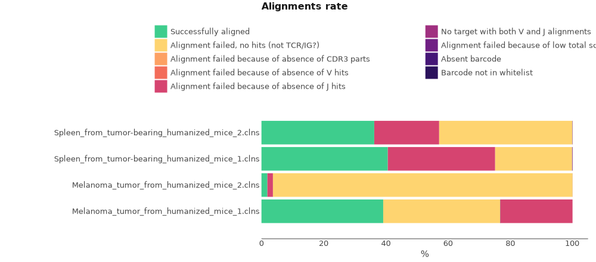
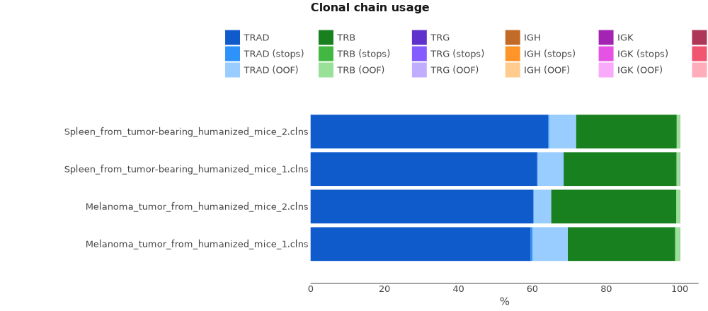

# QIAseq Immune Repertoire RNA Library kit

Here we will discuss how to process TCR cDNA libraries obtained with QIAseq Immune Repertoire RNA Library kit.

## Data libraries

This tutorial uses the data from the following publication: *"Tumor-infiltrating mast cells are associated with resistance to anti-PD-1 therapy."*,Somasundaram R et al., Nat Commun, 2021 Jan 12;12(1):346
[doi:10.1038/s41467-020-20600-7](https://doi.org/10.1038/s41467-020-20600-7)

A humanized (Hu)-mouse melanoma model was created by injecting fetal liver-derived CD34+ cells and implanting autologous thymus in immune-deficient NOD-scid IL2Rγnull (NSG) mice. Reconstituted Hu-mice were challenged with HLA-matched melanomas and treated with anti-PD-1, which resulted in restricted tumor growth but not complete regression. RNA was isolated from spleen and tumor tissues obtained from pre- and post-therapy (anti-PD-1) mice. cDNA synthesis was performed using QIAseq Immune Repertoire RNA Library prep kit (QIAGEN). Enrichment of complete TCR variable region by gene-specific primers targeting constant regions and molecular indexing (UMIs) for accurate and sensitive TCR clonotype and repertoire diversity assessment. Final libraries were sequenced on Illumina's NextSeq500 using the 300 cycles mid output sequencing kit, 261 cycles for read 1 and 41 cycles for read 2.

On the scheme bellow you can see the structure of cDNA library. UMI is located in the first 12 bp of R2.

<figure markdown>

</figure>

The data for this tutorial can be downloaded using the script bellow.

```shell
#!/usr/bin/env bash
curl -L ftp://ftp.sra.ebi.ac.uk/vol1/fastq/SRR129/087/SRR12991387/SRR12991387_1.fastq.gz -o Melanoma_tumor_from_humanized_mice_1_R1.fastq.gz
curl -L ftp://ftp.sra.ebi.ac.uk/vol1/fastq/SRR129/087/SRR12991387/SRR12991387_2.fastq.gz -o Melanoma_tumor_from_humanized_mice_1_R2.fastq.gz
curl -L ftp://ftp.sra.ebi.ac.uk/vol1/fastq/SRR129/088/SRR12991388/SRR12991388_1.fastq.gz -o Melanoma_tumor_from_humanized_mice_2_R1.fastq.gz
curl -L ftp://ftp.sra.ebi.ac.uk/vol1/fastq/SRR129/088/SRR12991388/SRR12991388_2.fastq.gz -o Melanoma_tumor_from_humanized_mice_2_R2.fastq.gz
...
```

??? note "See full script"
    ```shell
    #!/usr/bin/env bash
    curl -L ftp://ftp.sra.ebi.ac.uk/vol1/fastq/SRR129/087/SRR12991387/SRR12991387_1.fastq.gz -o Melanoma_tumor_from_humanized_mice_1_R1.fastq.gz
    curl -L ftp://ftp.sra.ebi.ac.uk/vol1/fastq/SRR129/087/SRR12991387/SRR12991387_2.fastq.gz -o Melanoma_tumor_from_humanized_mice_1_R2.fastq.gz
    curl -L ftp://ftp.sra.ebi.ac.uk/vol1/fastq/SRR129/088/SRR12991388/SRR12991388_1.fastq.gz -o Melanoma_tumor_from_humanized_mice_2_R1.fastq.gz
    curl -L ftp://ftp.sra.ebi.ac.uk/vol1/fastq/SRR129/088/SRR12991388/SRR12991388_2.fastq.gz -o Melanoma_tumor_from_humanized_mice_2_R2.fastq.gz
    curl -L ftp://ftp.sra.ebi.ac.uk/vol1/fastq/SRR129/090/SRR12991390/SRR12991390_1.fastq.gz -o Spleen_from_tumor-bearing_humanized_mice_2_R1.fastq.gz
    curl -L ftp://ftp.sra.ebi.ac.uk/vol1/fastq/SRR129/090/SRR12991390/SRR12991390_2.fastq.gz -o Spleen_from_tumor-bearing_humanized_mice_2_R2.fastq.gz
    curl -L ftp://ftp.sra.ebi.ac.uk/vol1/fastq/SRR129/089/SRR12991389/SRR12991389_1.fastq.gz -o Spleen_from_tumor-bearing_humanized_mice_1_R1.fastq.gz
    curl -L ftp://ftp.sra.ebi.ac.uk/vol1/fastq/SRR129/089/SRR12991389/SRR12991389_2.fastq.gz -o Spleen_from_tumor-bearing_humanized_mice_1_R2.fastq.gz
    ```


## Upstream analysis
The most straightforward way to get clonotype tables is to use a
universal [`mixcr analyze`](../reference/mixcr-analyze.md) command.

According to the library preparation protocol, the library has no V primers on 5'-end and has C primers on 3', so the command for a single sample is the following:

```shell
> mixcr analyze amplicon \
    --species mmu \
    --starting-material rna \
    --receptor-type tcr \
    --5-end no-v-primers \
    --3-end c-primers \
    --adapters adapters-present \
    --umi-pattern '^(R1:*)\^(UMI:N{12})' \
    fastq/Melanoma_tumor_from_humanized_mice_1_R1.fastq.gz \
    fastq/Melanoma_tumor_from_humanized_mice_1_R2.fastq.gz \
    results/Melanoma_tumor_from_humanized_mice_1
```

The meaning of these options is the following.

`--species`
:   is set to `mmu` for _Mus Musculus_

`--starting-material`
:   is set to `rna` and corresponds to `VTranscriptWithout5UTRWithP` alignment feature for V-gene (see [Gene features and anchor points](../reference/ref-gene-features.md) for details)

`--receptor-type`
:  tcr. It affects the choice of alignment algorithms.

`--5-end`
:   is set to `no-v-primers` . to a global alignment algorithm to align the left bound of V.

`--3-end-primers`
:  is set to `c-primers` since the primer used for library preparation is complimentary to C-region of TCR genes. This leads to a global alignment algorithms to align the right bound of J and a local alignment at the right bound of C gene.

`--adapers`
:   `adapters-present` because primer sequence is present in the data and has not been cut prior to. 

`--umi-pattern`
:   is used to specify UMI pattern for the library. MiXCR provides a powerful regex-like [language](../reference/ref-tag-pattern.md) allowing to specify almost arbitrary barcode structure. Here we use `^(R1:*)\^(UMI:N{12})` pattern to specify that R1 should be used as is, UMI spans the first 12 letters of R2 and the rest of R2 is ignored, because it only covers a few 5'UTR base pairs.


Running the command above will generate the following files:

```shell
> ls result/

# human-readable reports 
Melanoma_tumor_from_humanized_mice_1.report
# raw alignments (highly compressed binary file)
Melanoma_tumor_from_humanized_mice_1.vdjca
# alignments with corrected UMI barcode sequences 
Melanoma_tumor_from_humanized_mice_1.corrected.vdjca
# TCRα & TCRβ CDR3 clonotypes (highly compressed binary file)
Melanoma_tumor_from_humanized_mice_1.clns
# TCRα & TCRβ CDR3 clonotypes exported in tab-delimited txt
Melanoma_tumor_from_humanized_mice_1.clonotypes.TRA.tsv
Melanoma_tumor_from_humanized_mice_1.clonotypes.TRB.tsv  
```

Clonotype tables is the main result of the upstream analysis. They are stored in a highly compressed and efficient binary `.clns` file and can be exported in many ways: detailed [tab-delimited format](../reference/mixcr-export.md) with dozens of customizable columns, [human readable](../reference/mixcr-exportPretty.md) for manual inspection, and [AIRR format](../reference/mixcr-exportAirr.md) suitable for many scientific downstream analysis tools. By default, MiXCR exports clonotypes in a tab-delimited format separately for each immunological chain.

In order to run the analysis for all samples in the project on Linux we can for example
use [GNU Parallel](https://www.gnu.org/software/parallel/) in the following way:

```shell
> ls /fastq/*R1* | \
  parallel -j2  \
  'mixcr analyze amplicon \
    --species mmu \
    --starting-material rna \
    --receptor-type tcr \
    --5-end no-v-primers \
    --3-end c-primers \
    --adapters adapters-present \
    --umi-pattern "^(R1:*)\^(UMI:N{"12"})" \
    {} \
    {=s:R1:R2:=} \
    {=s:.*/:results/:; s:_R.*::=}'
```

### Under the hood pipeline


Under the hood, `mixcr analyze amplicon` executes the following pipeline of MiXCR actions:

#### `align`

[Performs](../reference/mixcr-align.md):

- alignment of raw sequencing reads against reference database of V-, D-, J- and C- gene segments
- pattern matching of tag pattern sequence and extraction of barcodes

```shell
 > mixcr align \
    --species mmu \
    --tag-pattern '^(R1:*)\^(UMI:N{12})' \
    --report result/P15-T0-TIGIT.report \
    --json-report result/P15-T0-TIGIT.report.json \
    -OvParameters.geneFeatureToAlign="VTranscriptWithout5UTRWithP" \
    -OvParameters.parameters.floatingLeftBound=false \
    -OjParameters.parameters.floatingRightBound=false \
    -OcParameters.parameters.floatingRightBound=true \
    fastq/Melanoma_tumor_from_humanized_mice_1_R1.fastq.gz \
    fastq/Melanoma_tumor_from_humanized_mice_1_R2.fastq.gz \
    results/Melanoma_tumor_from_humanized_mice_1.vdjca
```

Options `--report` and `--json-report` are specified here explicitly. Since we start from RNA data we use `VTranscriptWithout5UTRWithP` for the alignment of V segments (see [Gene features and anchor points](../reference/ref-gene-features.md). Because we don't have primers on V segment, we use global alignment on the left bound of V and since we have primers on C segment, we use global alignment for J and local on the right bound of C.

This step utilizes all available CPUs and scales perfectly. When there are a lot of CPUs, the only limiting factor is the speed of disk I/O. To limit the number of used CPUs one can pass `--threads N` option.

#### `correctAndSortTags`

[Corrects](../reference/mixcr-correctAndSortTags.md) sequencing and PCR errors _inside_ barcode sequences. This step does extremely important job by correcting artificial diversity caused by errors in barcodes. In the considered example project it corrects only sequences of UMIs.

```shell
> mixcr correctAndSortTags \
    --report results/Melanoma_tumor_from_humanized_mice_1.report \
    --json-report results/Melanoma_tumor_from_humanized_mice_1.report.json \
    Melanoma_tumor_from_humanized_mice_1.vdjca \
    Melanoma_tumor_from_humanized_mice_1.corrected.vdjca
```

Options `--report` and `--json-report` are specified here explicitly so that the report files will be appended with the barcode correction report.

#### `assemble`

[Assembles](../reference/mixcr-assemble.md) clonotypes and applies several layers of errors correction. In the current example project we consider TCRα & TCRβ separately and clonotype by its CDR3 sequence. The layers of correction applied in this example are:

- assembly consensus CDR3 sequence for each UMI
- quality-awared correction for sequencing errors
- clustering to correct for PCR errors, which still may present even in the case of UMI data, since a error may be introduced e.g. on the first reverse-transcription cycle

```shell
> mixcr assemble \
    --report results/Melanoma_tumor_from_humanized_mice_1.report \
    --json-report results/Melanoma_tumor_from_humanized_mice_1.report.json \
    Melanoma_tumor_from_humanized_mice_1.corrected.vdjca \
    Melanoma_tumor_from_humanized_mice_1.clns
```

Options `--report` and `--json-report` are specified here explicitly so that the report files will be appended with assembly report.

#### `exportClones`

Finally, to [export](../reference/mixcr-export.md#clonotype-tables) clonotype tables in tabular form `exportClones` is used:

```shell
> mixcr exportClones \
    -p full \
    -uniqueTagCount UMI \
    Melanoma_tumor_from_humanized_mice_1.clns \
    Melanoma_tumor_from_humanized_mice_1.tsv
```

Here `-p full` is a shorthand for the full preset of common export columns and `-uniqueTagCount UMI` adds a column with the UMI count for each clone.

## Quality control

Now when the upstream analysis is finished we can move on to quality control. First lets look at the alignment report plot.

```shell
# obtain alignment quality control
> mixcr exportQc align \
    result/*.vdjca \
    alignQc.pdf
```

Let's examine the plot.

<figure markdown>

</figure>

Judging by the alignment report we can tell some major issues occurred in sample preparation. The main problems are the absence of J hits and reads that don't have TCR/Ig sequence at all. We can take one of the samples and realign it in a way that will allow us manually investigate these issues:

```shell
>  ~/mixcr-private/mixcr align \
    --species mmu \
    --tag-pattern '^(R1:*)\^(UMI:N{12})' \
    -OvParameters.geneFeatureToAlign="VTranscriptWithout5UTRWithP" \
    -OvParameters.parameters.floatingLeftBound=false \
    -OjParameters.parameters.floatingRightBound=false \
    -OcParameters.parameters.floatingRightBound=true \
    -OallowNoCDR3PartAlignments=true \
    -OallowPartialAlignments=true \
    --not-aligned-R1 na.fastq \
    Melanoma_tumor_from_humanized_mice_1_R1.fastq.gz \
    Melanoma_tumor_from_humanized_mice_1_R2.fastq.gz \
    Melanoma_tumor_from_humanized_mice_1_debug.vdjca
```

In the command above we preserve partially aligned reads and reads that did not cover `CDR3` region (`-OallowNoCDR3PartAlignments=true`, `-OallowPartialAlignments=true`). We also save reads that didn't align to any immune gene reference at all into a separate fastq file (`--not-aligned-R1 na.fastq`).

Now we can export raw alignments using the following command and manually investigate alignments that lack J gene:

```shell
> mixcr exportAlignmentsPretty \
    Melanoma_tumor_from_humanized_mice_1_debug.vdjca
    
```

```shell
>>> Read ids: 124


Quality   72222727772277777677777252776
Target0 0 GGCAGGGCTGGGGGTCAGGGAAGAATGAT 28  Score


                                      FR2><CDR2        CDR2><FR3
                _  Q  S  P  E  L  I  M  S  I  Y  S  N  C  D  K  D  A  R  R  F  T  P  Q  L  K  K
    Quality     45265222522225247662622522422222652472225462667462625252524525522262722676662622
    Target1   0 GGCAAAGCCCTGAGCTGATAATGTCTATATACTCCAATTGTGACAAAGATGCTCGAAGGTTTACACCACAGCTCAAAAAA 79   Score
 TRAV7-2*00 181 ggAaaagcccCAagAtgCtGatgtctatCtTctccaatGgtgaAaaGgaAgAAGgCagAttCacaGTTcaCctcaaTaaa 260  222
TRAV7D-2*00 181 ggAaaagcccCAagAtgCtGatgtctatCtTctccaatGgtgaAaaGgaAgAAGgCagAttCacaGTTcaCctcaaTaaa 260  222

                                                                                  V>
                                                                           FR3><CDR3
                 A  S  K  Y  G  S  L  L  I  R  D  S  Q  P  R  D  A  A  T  Y  L  C  A  V  N  I  N
    Quality     27577525762222752262267672725254625577527722252227777245772646266762464522272767
    Target1  80 GCCAGCAAGTATGGTTCGCTGCTCATCAGAGACTCCCAGCCCAGGGATGCAGCCACCTACCTCTGTGCCGTGAACATCAA 159  Score
 TRAV7-2*00 261 gccagcCTgCatACttcCctgcAcatcagagactcccagcccagTgaCTcTgcTCTctacctctgtgc             328  222
TRAV7D-2*00 261 gccagcCTgCatACttcCctgcAcatcagagactcccagcccagTgaCTcTgcTCTctacctctgtgc             328  222

                            CDR3><FR4
                              <J                            FR4>
                F  N  K  F  Y  F  G  S  G  T  K  L  N  V  K  P _
  Quality     62272777722222277777762777777777277722767777727777777767777777777777777777777777
  Target1 160 CTTCAACAAATTTTACTTTGGATCTGGGACCAAACTCAATGTAAAACCAAATATCCAGAACCCTGACCCTGCCGTGTACC 239  Score
TRAJ13*00  43                 tttggaActgggacAaaactcCaAgtCGTTccaa                               76   58
```


We can also use BLAST to identify not aligned reads from na.fastq.

Finally, lets generate and look at chain usage report.

```shell
> mixcr exportQc chainUsage \
    results/*.clns \
    chainUsage.pdf
```
<figure markdown>

</figure>

We see that, as expected, samples consist of TRA and TRB chains.


