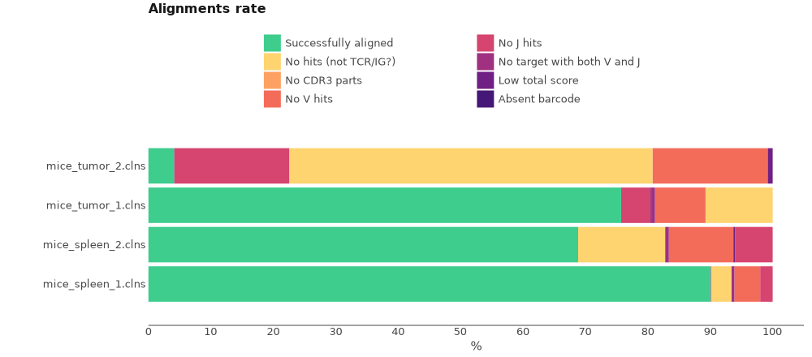
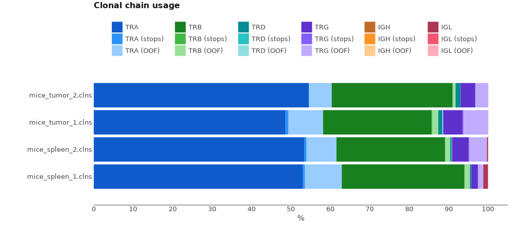

# QIAseq Immune Repertoire RNA Library kit

Here we will discuss how to process TCR cDNA libraries obtained with QIAseq Immune Repertoire RNA Library kit.

## Data libraries

This tutorial uses the data from the following publication: *"Tumor-infiltrating mast cells are associated with resistance to anti-PD-1 therapy."*,Somasundaram R et al., Nat Commun, 2021 Jan 12;12(1):346
[doi:10.1038/s41467-020-20600-7](https://doi.org/10.1038/s41467-020-20600-7)

A humanized (Hu)-mouse melanoma model was created by injecting fetal liver-derived CD34+ cells and implanting autologous thymus in immune-deficient NOD-scid IL2Rγnull (NSG) mice. Reconstituted Hu-mice were challenged with HLA-matched melanomas and treated with anti-PD-1, which resulted in restricted tumor growth but not complete regression. RNA was isolated from spleen and tumor tissues obtained from pre- and post-therapy (anti-PD-1) mice. cDNA synthesis was performed using QIAseq Immune Repertoire RNA Library prep kit (QIAGEN). Enrichment of complete TCR variable region by gene-specific primers targeting constant regions and molecular indexing (UMIs) for accurate and sensitive TCR clonotype and repertoire diversity assessment. Final libraries were sequenced on Illumina's NextSeq500 using the 300 cycles mid output sequencing kit, 261 cycles for read 1 and 41 cycles for read 2.

On the scheme bellow you can see structure of cDNA library. UMI is located in the first 12 bp of R2.


All data may be downloaded directly from SRA (PRJEB44566) using e.g. [SRA Explorer](https://sra-explorer.info).

??? tip "Use [aria2c](https://aria2.github.io) for efficient download of the full dataset with the proper filenames:"
    ```shell title="download.sh"
    --8<-- "qiaseq-tcr/scripts/010-download-aria2c.sh"
    ```
    ```shell title="download-list.txt"
    --8<-- "qiaseq-tcr/scripts/download-list.txt"
    ```

## Upstream analysis

MiXCR has a dedicated preset for this protocol, thus analysing the data is as easy as:

```shell
--8<-- "qiaseq-tcr/scripts/020-upstream-preset.sh"
```

Running the command above will generate the following files:

```shell
> ls result/

# human-readable reports 
mice_tumor_1.report
# raw alignments (highly compressed binary file)
mice_tumor_1.vdjca
# alignments with refined UMI barcode sequences 
mice_tumor_1.refined.vdjca
# TRA, TRB CDR3 clonotypes (highly compressed binary file)
mice_tumor_1.clns
# TRA,TRB CDR3 clonotypes exported in tab-delimited txt
mice_tumor_1.clonotypes.TRA.tsv
mice_tumor_1.clonotypes.TRB.tsv
```

While `.clns` file holds all data and is used for downstream analysis using [`mixcr postanalisis`](../reference/mixcr-postanalysis.md), the output `.txt` clonotype table will contain exhaustive information about each clonotype as well:

??? tip "See first 100 records from FebControl1.clones.IGH.tsv clonotype table"
    {{ read_csv('docs/mixcr/guides/qiaseq-tcr/figs/mice_tumor_1.clones.tsv', engine='python', sep='\t', nrows=100) }}

In order to run the analysis for all samples in the project on Linux we can use [GNU Parallel](https://www.gnu.org/software/parallel/) in the following way:

```shell
--8<-- "qiaseq-tcr/scripts/020-upstream-preset-parallel.sh"
```

### Under the hood pipeline

Under the hood the command above actually executes the following pipeline:

#### `align`
Alignment of raw sequencing reads against reference database of V-, D-, J- and C- gene segments.

```shell
--8<-- "qiaseq-tcr/scripts/040-upstream-align.sh"
```

Option `--report` is specified here explicitly.

`--species hsa`
: determines the organism species (hsa for _Homo Sapiens_).

`-p default_4.0`
:  a default preset of MiXCR parameters which includes a dedicated TCR aligner.

`-OvParameters.geneFeatureToAlign="VTranscriptWithout5UTRWithP"`
: Sets a V gene feature to align. Check [gene features](../reference/ref-gene-features.md) for more info.

`-OvParameters.parameters.floatingLeftBound=false`
: Results in a global alignment algorithm for V gene left bound. We use it because we don't have any primers covering V gene coding sequence.

`-OjParameters.parameters.floatingRightBound=false`
: Results in a global alignment algorithm for J gene right bound, because reverse primers are located in C-gene region.

`-OcParameters.parameters.floatingRightBound=true`
: Results in a local alignment algorithm for C gene right bound, because reverse primers are located in C-gene region.

`--tagPattern "^(R1:*) \ ^(UMI:N{12})N{12}(R2:*)"`
: tag pattern specifies the location of the UMI barcode according to the library structure.


#### `refineTagsAndSort`

[Corrects](../reference/mixcr-refineTagsAndSort.md) sequencing and PCR errors _inside_ barcode sequences. This step does extremely important job by correcting artificial diversity caused by errors in barcodes. In the considered example project it corrects only sequences of UMIs.

```shell
--8<-- "qiaseq-tcr/scripts/045-upstream-refineTagsAndSort.sh"
```

#### `assemble`
Assembles alignments into clonotypes and applies several layers of errors correction:

- quality-dependent correction for sequencing errors
- PCR-error correction by clustering
- UMI-based error correction)

Check [`mixcr assemble`](../reference/mixcr-assemble.md) for more information.


```shell
--8<-- "qiaseq-tcr/scripts/050-upstream-assemble.sh"
```

Options `--report` and `--json-report` are specified here explicitly so that the report files will be appended with assembly report.

`-OassemblingFeatures=CDR3`
: By default `qiaseq-human-tcr-cdr3` preset assembles clones by `CDR3` sequence.

`-separateByJ: true`
: Separate clones with the same assembling feature, but different V-genes.

`-separateByV: true`
: Separate clones with the same assembling feature, but different J-genes.

#### `export`
Exports clonotypes from .clns file into human-readable tables.

```shell
--8<-- "qiaseq-tcr/scripts/060-upstream-exportClones.sh"
```

`-с TRB`
: defines a specific chain to be exported.

`-uniqueTagCount UMI`
: adds a column with the number of UMIs for each clone.


## Quality control

Now when we have all files processed lets perform Quality Control. That can be easily done using [`mixcr exportQc`](../reference/mixcr-exportQc.md)
function.

```shell
--8<-- "qiaseq-tcr/scripts/080-qc-align.sh"
```



Judging by the alignment report we can tell some major issues occurred in sample preparation. The main problems are the absence of J hits and reads that don't have TCR sequence at all. We can take the worst samples and realign it in a way that will allow us manually investigate these issues.

By default, MiXCR removed non target reads during alignment. We will realign reads for one of the samples (e.g. mice_tumor_2) and extract not aligned reads (`--not-aligned-R1`, `--not-aligned-R2`) to separate FASTQ files for manual inspection. See [`mixcr align`](../reference/mixcr-align.md) for more details. Parameters `-OallowNoCDR3PartAlignments=true` and `-OallowPartialAlignments=true` preserve reads that lack `CDR3` or V\J genes.

Bellow is the complete command:

```shell
--8<-- "qiaseq-tcr/scripts/090-qc-debug-align.sh"
```

Now we can export raw alignments using the following command and manually investigate alignments that lack J gene and/or `CDR3` region:

```shell
--8<-- "qiaseq-tcr/scripts/110-qc-exportAlignmentsPretty.sh"
```

`--skip 1000`
: Skips first 1000 alignments

`--limit 100`
: exports only 100 alignments

Bellow you can see one of the records from the output file with alignments. We can clearly see that J jene and CDR3 sequence are absent in the original reads.

```shell
>>> Read ids: 124


Quality   72222727772277777677777252776
Target0 0 GGCAGGGCTGGGGGTCAGGGAAGAATGAT 28  Score


                                      FR2><CDR2        CDR2><FR3
                _  Q  S  P  E  L  I  M  S  I  Y  S  N  C  D  K  D  A  R  R  F  T  P  Q  L  K  K
    Quality     45265222522225247662622522422222652472225462667462625252524525522262722676662622
    Target1   0 GGCAAAGCCCTGAGCTGATAATGTCTATATACTCCAATTGTGACAAAGATGCTCGAAGGTTTACACCACAGCTCAAAAAA 79   Score
 TRAV7-2*00 181 ggAaaagcccCAagAtgCtGatgtctatCtTctccaatGgtgaAaaGgaAgAAGgCagAttCacaGTTcaCctcaaTaaa 260  222
TRAV7D-2*00 181 ggAaaagcccCAagAtgCtGatgtctatCtTctccaatGgtgaAaaGgaAgAAGgCagAttCacaGTTcaCctcaaTaaa 260  222

                                                                                  V>
                                                                           FR3><CDR3
                 A  S  K  Y  G  S  L  L  I  R  D  S  Q  P  R  D  A  A  T  Y  L  C  A  V  N  I  N
    Quality     27577525762222752262267672725254625577527722252227777245772646266762464522272767
    Target1  80 GCCAGCAAGTATGGTTCGCTGCTCATCAGAGACTCCCAGCCCAGGGATGCAGCCACCTACCTCTGTGCCGTGAACATCAA 159  Score
 TRAV7-2*00 261 gccagcCTgCatACttcCctgcAcatcagagactcccagcccagTgaCTcTgcTCTctacctctgtgc             328  222
TRAV7D-2*00 261 gccagcCTgCatACttcCctgcAcatcagagactcccagcccagTgaCTcTgcTCTctacctctgtgc             328  222

                            CDR3><FR4
                              <J                            FR4>
                F  N  K  F  Y  F  G  S  G  T  K  L  N  V  K  P _
  Quality     62272777722222277777762777777777277722767777727777777767777777777777777777777777
  Target1 160 CTTCAACAAATTTTACTTTGGATCTGGGACCAAACTCAATGTAAAACCAAATATCCAGAACCCTGACCCTGCCGTGTACC 239  Score
TRAJ13*00  43                 tttggaActgggacAaaactcCaAgtCGTTccaa                               76   58
```


Resulting `mice_tumor_2_notAligned_R1.fastq` and `mice_tumor_2_notAligned_R2.fastq` files can be manually inspected with [BLAST](https://blast.ncbi.nlm.nih.gov/Blast.cgi).

Finally, lets generate and look at chain usage report.

```shell
--8<-- "qiaseq-tcr/scripts/120-qc-chainUsage.sh"
```




We see that, as expected, samples consist of TRA and TRB chains.


## Reports
Finally, MiXCR provides a very convenient way to look at the reports generated at ech step. Every `.vdjca`, `.clns` and `.clna` file holds all the reports for every MiXCR function that has been applied to this sample. E.g. in our case `.clns` file contains reports for `mixcr align` and `mixcr assemble`. To output this report use [`mixcr exportReports`](../reference/mixcr-exportReports.md) as shown bellow. Note `--json` parameter will output a JSON-formatted report.

```shell
--8<-- "qiaseq-tcr/scripts/125-qc-exportReports.sh"
```

```shell
--8<-- "qiaseq-tcr/scripts/125-qc-exportReports-json.sh"
```

??? "Show report file"
    === "`.txt`"
        ```shell
        --8<-- "qiaseq-tcr/figs/mice_tumor_1.report.txt"
        ```
    === "`.json`"
        ```js
        --8<-- "qiaseq-tcr/figs/mice_tumor_1.report.json"
        ```