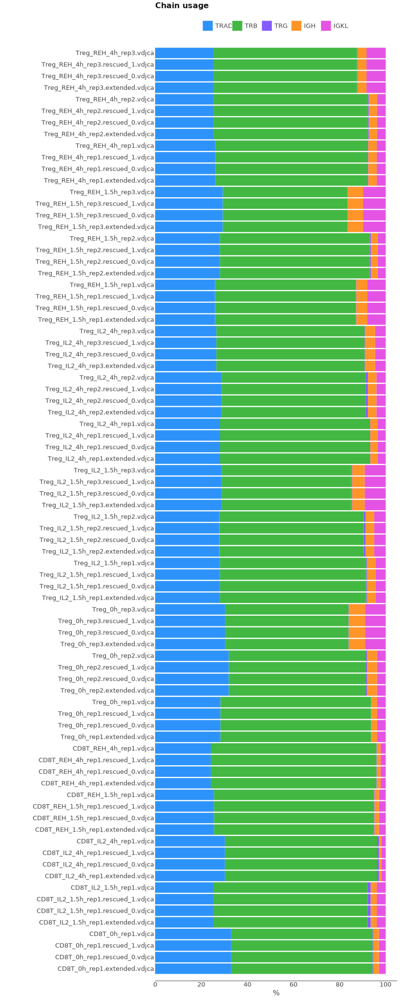

# RNASeq

Here we will discuss how to extract TCR repertoire from RNASeq data.

## Data libraries

This tutorial uses the data from the following publication: *Calibration of cell-intrinsic interleukin-2 response thresholds guides design of a regulatory T cell biased agonist*.  	Glassman CR et al., Elife 2021 May 18;10.
[doi: 10.7554/eLife.65777 ](https://doi.org/10.7554/elife.65777)

Tregs were isolated from B6-Foxp3EGFP mice using CD4+ T cell isolation kit followed by fluorescence-activated cell sorting (FACS) for GFP expression to isolate Tregs. CD8+ T cells were isolated from C57BL/6J mice using CD8+ T cell isolation kit. Isolated cells were stimulated with 200 nM IL-2 or IL-2-REH and total RNA was extracted. 500 ng of RNA was used for RNA-Seq library preparation with the Kapa mRNA HyperPrep Kit (KK8580, Kapa Biosystems). DNA fragments between 250 bp and 400 bp were recovered, purified, and sequenced on an Illumina HiSeq3000 system (50 bp, single end).

In this publication authors did not study immune repertoires. This is also an example of how MiXCR can retrieve data from experiments that were nor originally designed for obtaining TCR or BCR repertoires.

<figure markdown>

</figure>

The data for this tutorial can be downloaded using the script bellow.

??? note "Download raw data"
    ```shell
    #!/usr/bin/env bash
    curl -L ftp://ftp.sra.ebi.ac.uk/vol1/fastq/SRR132/028/SRR13228528/SRR13228528.fastq.gz -o CD8T_REH_4h_rep1.fastq.gz
    curl -L ftp://ftp.sra.ebi.ac.uk/vol1/fastq/SRR132/010/SRR13228510/SRR13228510.fastq.gz -o Treg_IL2_1.5h_rep1.fastq.gz
    curl -L ftp://ftp.sra.ebi.ac.uk/vol1/fastq/SRR132/027/SRR13228527/SRR13228527.fastq.gz -o CD8T_IL2_4h_rep1.fastq.gz
    curl -L ftp://ftp.sra.ebi.ac.uk/vol1/fastq/SRR132/016/SRR13228516/SRR13228516.fastq.gz -o Treg_REH_1.5h_rep2.fastq.gz
    curl -L ftp://ftp.sra.ebi.ac.uk/vol1/fastq/SRR132/009/SRR13228509/SRR13228509.fastq.gz -o Treg_0h_rep1.fastq.gz
    curl -L ftp://ftp.sra.ebi.ac.uk/vol1/fastq/SRR132/015/SRR13228515/SRR13228515.fastq.gz -o Treg_IL2_1.5h_rep2.fastq.gz
    curl -L ftp://ftp.sra.ebi.ac.uk/vol1/fastq/SRR132/017/SRR13228517/SRR13228517.fastq.gz -o Treg_IL2_4h_rep2.fastq.gz
    curl -L ftp://ftp.sra.ebi.ac.uk/vol1/fastq/SRR132/011/SRR13228511/SRR13228511.fastq.gz -o Treg_REH_1.5h_rep1.fastq.gz
    curl -L ftp://ftp.sra.ebi.ac.uk/vol1/fastq/SRR132/026/SRR13228526/SRR13228526.fastq.gz -o CD8T_REH_1.5h_rep1.fastq.gz
    curl -L ftp://ftp.sra.ebi.ac.uk/vol1/fastq/SRR132/012/SRR13228512/SRR13228512.fastq.gz -o Treg_IL2_4h_rep1.fastq.gz
    curl -L ftp://ftp.sra.ebi.ac.uk/vol1/fastq/SRR132/025/SRR13228525/SRR13228525.fastq.gz -o CD8T_IL2_1.5h_rep1.fastq.gz
    curl -L ftp://ftp.sra.ebi.ac.uk/vol1/fastq/SRR132/013/SRR13228513/SRR13228513.fastq.gz -o Treg_REH_4h_rep1.fastq.gz
    curl -L ftp://ftp.sra.ebi.ac.uk/vol1/fastq/SRR132/018/SRR13228518/SRR13228518.fastq.gz -o Treg_REH_4h_rep2.fastq.gz
    curl -L ftp://ftp.sra.ebi.ac.uk/vol1/fastq/SRR132/024/SRR13228524/SRR13228524.fastq.gz -o CD8T_0h_rep1.fastq.gz
    curl -L ftp://ftp.sra.ebi.ac.uk/vol1/fastq/SRR132/023/SRR13228523/SRR13228523.fastq.gz -o Treg_REH_4h_rep3.fastq.gz
    curl -L ftp://ftp.sra.ebi.ac.uk/vol1/fastq/SRR132/014/SRR13228514/SRR13228514.fastq.gz -o Treg_0h_rep2.fastq.gz
    curl -L ftp://ftp.sra.ebi.ac.uk/vol1/fastq/SRR132/022/SRR13228522/SRR13228522.fastq.gz -o Treg_IL2_4h_rep3.fastq.gz
    curl -L ftp://ftp.sra.ebi.ac.uk/vol1/fastq/SRR132/019/SRR13228519/SRR13228519.fastq.gz -o Treg_0h_rep3.fastq.gz
    curl -L ftp://ftp.sra.ebi.ac.uk/vol1/fastq/SRR132/021/SRR13228521/SRR13228521.fastq.gz -o Treg_REH_1.5h_rep3.fastq.gz
    curl -L ftp://ftp.sra.ebi.ac.uk/vol1/fastq/SRR132/020/SRR13228520/SRR13228520.fastq.gz -o Treg_IL2_1.5h_rep3.fastq.gz    
    ```
## Upstream analysis

The easiest way to obtain results from this type of data is to use `mixcr analyze shotgun` command:

```shell
> mixcr analyze shotgun \ 
  --species hsa \
  --starting-material rna \
  --receptor-type bcr \
  fastq/CD8T_REH_4h_rep1.fastq.gz \
  result/CD8T_REH_4h_rep1
```

Arguments explained:

`--species`
: is set to `mmu` for _Mus Musculus_

`--starting-material`
: `rna` It affects the choice of V gene region which will be used as target in [`align`](../reference/mixcr-align.md) step (`vParameters.geneFeatureToAlign`, see [`align` documentation](../reference/mixcr-align.md)). By specifying `rna` as starting material, `VTranscriptWithout5UTRWithP` will be used as `geneFeatureToAlign` for V segment.

`--receptor-type`
: is set to `tcr` since as the samples consist of isolated Treg and CD8+ T-cells.

To process all samples together in one command a common practice is to use [GNU Parallel](https://www.gnu.org/software/parallel/):

```shell
ls fastq/*.gz | parallel -j2 \
'mixcr analyze shotgun \
  --species mmu \
  --starting-material rna \
  --receptor-type tcr \
  {} \
  {=s:.*\/:result/:;s:\.fastq.gz::=}'
```

### Under the hood pipeline:

Under the hood the command above actually executes the following pipeline:


#### `align`

Alignment of raw sequencing reads against reference database of V-, D-, J- and C- gene segments.

```shell
# align raw reads
mixcr align -s hsa \
    -p rna-seq \
    -OvParameters.geneFeatureToAlign=VTranscriptWithout5UTRWithP \
    -OallowPartialAlignments=true \
    --report results/CD8T_REH_4h_rep1.report \
    fastq/CD8T_REH_4h_rep1.fastq.gz \
    result/CD8T_REH_4h_rep1.vdjca
```
Option `--report` is specified here explicitly. `-p rnaseq` defines a set of aligner parameters specifically for RNASeq data. `-OallowPartialAlignments=true` preserves partial alignments to be assembled with `assemblePartial` on the next step.

#### `assemblePartial`
Assembles alignments that only partially cover `CDR3` region. This is a mandatory step for RNASeq data, as reads randomly cover all TCR / BCR segments. This function works with pairs of alignments (assembles two alignments at a time), thus it is usually recommended to perform two rounds of `assemblePartial` for better yield. For more information check [`mixcr assemblePartial`](../reference/mixcr-assemblePartial.md)

```shell
# assemble overlapping fragmented sequencing reads
# First round
mixcr assemblePartial \
  --report results/CD8T_REH_4h_rep1.report \
  result/CD8T_REH_4h_rep1.vdjca \
  result/CD8T_REH_4h_rep1.rescued_1.clna

#Second round  
mixcr assemblePartial \
  --report results/CD8T_REH_4h_rep1.report \
  result/CD8T_REH_4h_rep1.rescued_1.vdjca \
  result/CD8T_REH_4h_rep1.rescued_2.vdjca
```
Note that we specify the same report file on every step, thus reports will be appended to the same file.

#### `extend`

If V- and/or J- segments  are uniquely determined, but `CDR3` edges lack nucleotides, `mixcr extend` will impute those from germline. This step is only applicable to T-cells due to the absence of hypermutations.

```shell
mixcr extend \
    --report result/CD8T_REH_4h_rep1.report \
    result/CD8T_REH_4h_rep1.rescued_2.vdjca \
    result/CD8T_REH_4h_rep1.extended.vdjca
```

#### `assemble`

Assembles alignments into clonotypes and applies several layers of errors correction(ex. quality-awared correction for sequencing errors, clustering to correct for PCR errors). Check [`mixcr assemble`](../reference/mixcr-assemble.md) for more information. Since data contains no primer sequences options `-OseparateByV=true` and `-OseparateByJ=true` are used, because we can be sure of V and J segments sequences and can use it to distinguish clones. 

```shell
# assemble CDR3 clonotypes
mixcr assemble \
    -OseparateByV=true \
    -OseparateByJ=true \
    --report results/CD8T_REH_4h_rep1.report \
    result/CD8T_REH_4h_rep1.extended.vdjca \
    result/CD8T_REH_4h_rep1.clns
```

#### `export`

Exports clonotypes from `.clns` file into human-readable tables.
```shell
# export to tsv
> mixcr exportClones \
    -p full \
    result/CD8T_REH_4h_rep1.clns \
    CD8T_REH_4h_rep1.txt
```
Here `-p full` defines the full preset of common export columns. Check [`mixcr export`](../reference/mixcr-export.md) for more information.

## Quality control

Now, when the analysis is complete, lets visualize quality report data. Looking at the alignment report in this case won't be of much help, because the cDNA library was ton enriched with TCR sequences, thus we already know that only a small part of reads has been successfully aligned. What is going to be more descriptive is to look at the chain usage among samples.

```shell
> mixcr exportQc chainUsage \
    result/*.vdjca \
    chainUsage.pdf
```

<figure markdown>

</figure>

This plot reveals a mild contamination by B-cells, since IGH and IGKL chains present in the samples despite Treg and CD8+ cells have been isolated for library preparation.


## Full length BCR assembly

Because RNAseq reads randomly cover the whole receptor gene region it is possible to assemble full-length sequences. To do that we should specify `--contig-assembly` option for `mixcr analyze shotgun` command.

```shell
> mixcr analyze shotgun \ 
    --species hsa \
    --starting-material rna \
    --receptor-type bcr \
    --contig-assembly \
    fastq/CD8T_REH_4h_rep1.fastq.gz \
    result/CD8T_REH_4h_rep1
```

With this option MiXCR will try to assemble the longest possible sequences from input data.

Under the hood this adjusts pipeline in the following manner:


1. Modify `mixcr assemble command` by adding `--write-alignments` option. With this option MiXCR will output `.clna` file that preserves original alignments.
    ```shell
    > mixcr assemble \
        -OseparateByV=true \
        -OseparateByJ=true \
        --write-alignments \
        --report results/CD8T_REH_4h_rep1.report \
        result/CD8T_REH_4h_rep1.extended.vdjca \
        result/CD8T_REH_4h_rep1.clna 
    ```
2. An additional [`assembleContigs`](../reference/mixcr-assembleContigs.md) step will be added after `mixcr assemble`. On this step MiXCR will use previously preserved alignments to build wider contigs for
   clonal sequence.
    
    ```shell
    > mixcr assembleContigs \
        --report results/CD8T_REH_4h_rep1.report \
        result/CD8T_REH_4h_rep1.clna \
        result/CD8T_REH_4h_rep1.clns
    ```

