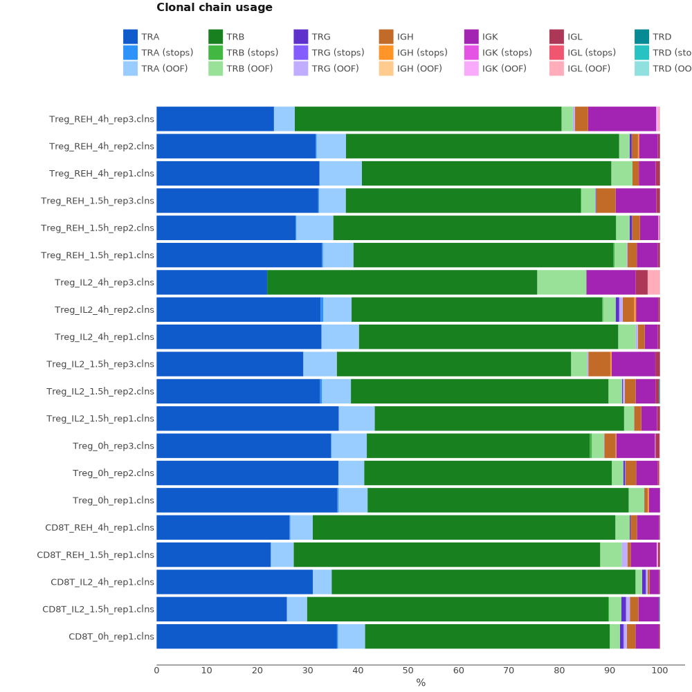

# RNA-Seq

Here we will discuss how to extract TCR repertoire from RNA-Seq data. In this particular case we extract only TCR data because only T-cells were used in cDNA library preparation, but this protocol with slight adjustments, that will be mentioned further, is applicable to BCR data also.

## Data libraries

This tutorial uses the data from the following publication: *Calibration of cell-intrinsic interleukin-2 response thresholds guides design of a regulatory T cell biased agonist*.  	Glassman CR et al., Elife 2021 May 18;10.
[doi: 10.7554/eLife.65777 ](https://doi.org/10.7554/elife.65777)

Tregs were isolated from B6-Foxp3EGFP mice using CD4+ T cell isolation kit followed by fluorescence-activated cell sorting (FACS) for GFP expression to isolate Tregs. CD8+ T cells were isolated from C57BL/6J mice using CD8+ T cell isolation kit. Isolated cells were stimulated with 200 nM IL-2 or IL-2-REH and total RNA was extracted. 500 ng of RNA was used for RNA-Seq library preparation with the Kapa mRNA HyperPrep Kit (KK8580, Kapa Biosystems). DNA fragments between 250 bp and 400 bp were recovered, purified, and sequenced on an Illumina HiSeq3000 system (50 bp, single end).

In this publication authors did not study immune repertoires. This is also an example of how MiXCR can retrieve data from experiments that were nor originally designed for obtaining TCR or BCR repertoires.

On the scheme bellow you can see structure of cDNA library. UMI is located in the first 12 bp of R2.


All data may be downloaded directly from SRA (PRJEB44566) using e.g. [SRA Explorer](https://sra-explorer.info).

??? tip "Use [aria2c](https://aria2.github.io) for efficient download of the full dataset with the proper filenames:"
    ```shell title="download.sh"
    --8<-- "guides/rnaseq/scripts/010-download-aria2c.sh"
    ```
    ```shell title="download-list.txt"
    --8<-- "guides/rnaseq/scripts/download-list.txt"
    ```

## Upstream analysis

The easiest way to obtain results from this type of data is to use `mixcr analyze rna-seq` command:

MiXCR has a dedicated preset for RNA-seq data, thus running the pipeline is as easy as:

```shell
--8<-- "guides/rnaseq/scripts/020-upstream-preset.sh"
```

`--species mmu`
: is a mix-in that specifies the name of the species. mmu for _Mus Musculus_ in this case.

Running the command above will generate the following files:

```shell
> ls results/

# human-readable reports 
CD8T_REH_4h_rep1.report

# raw alignments (highly compressed binary file)
CD8T_REH_4h_rep1.vdjca

# files for each mixcr assemblePartial
CD8T_REH_4h_rep1.passembled.0.vdjca
CD8T_REH_4h_rep1.passembled.1.vdjca

# `mixcr extend` outputfile with CDR3 region extended alignments 
CD8T_REH_4h_rep1.extended.vdjca

# A binary file wich has all the information on the clonotypes
CD8T_REH_4h_rep1.clns

# TRA, TRB, TRG and TRD CDR3 clonotypes exported in tab-delimited txt
CD8T_REH_4h_rep1.clonotypes.TRA.tsv
CD8T_REH_4h_rep1.clonotypes.TRB.tsv
CD8T_REH_4h_rep1.clonotypes.TRG.tsv
CD8T_REH_4h_rep1.clonotypes.TRD.tsv
CD8T_REH_4h_rep1.clonotypes.TRAD.tsv
```

While `.clns` file holds all data and is used for downstream analysis using [`mixcr postanalisis`](../reference/mixcr-postanalysis.md), the output `.txt` clonotype table will contain exhaustive information about each clonotype as well:

??? tip "See first 100 records from FebControl1.clones.IGH.tsv clonotype table"
    {{ read_csv('docs/mixcr/guides/rnaseq/figs/CD8T_REH_4h_rep1.clones.tsv', engine='python', sep='\t', nrows=100) }}

In order to run the analysis for all samples in the project on Linux we can use [GNU Parallel](https://www.gnu.org/software/parallel/) in the following way:

```shell
--8<-- "guides/rnaseq/scripts/020-upstream-preset-parallel.sh"
```
### Under the hood pipeline:

Under the hood the command above actually executes the following pipeline:


#### `align`

Alignment of raw sequencing reads against reference database of V-, D-, J- and C- gene segments.

```shell
--8<-- "guides/rnaseq/scripts/040-upstream-align.sh"
```

Option `--report` is specified here explicitly. 

`--species mmu`
: mmu for _Mus Musculus_

`-p rna-seq`
: defines a set of aligner parameters specifically for RNASeq data. 

`-OvParameters.geneFeatureToAlign="VTranscriptWithout5UTRWithP"`
: defines V gene feature to align, which includes the full V-gene sequence excluding 5'UTR.

`-OvParameters.parameters.floatingLeftBound=false -OjParameters.parameters.floatingRightBound=false -OсParameters.parameters.floatingRightBound=false`
: a global alignment will be used on every gene-segment bound due to the absence of primers

`-OallowPartialAlignments=true`
: preserves partial alignments to be assembled with `assemblePartial` on the next step.


#### `assemblePartial`
Assembles alignments that only partially cover `CDR3` region. This is a mandatory step for RNA-Seq data, as reads randomly cover all TCR / BCR segments. This function works with pairs of alignments (assembles two alignments at a time), thus it is usually recommended to perform two rounds of `assemblePartial` for better yield. For more information check [`mixcr assemblePartial`](../reference/mixcr-assemblePartial.md).

```shell
--8<-- "guides/rnaseq/scripts/041-upstream-assemblePartial.sh"
```

Note that we specify the same report file on every step, thus reports will be appended to the same file.

#### `extend`

If V- and/or J- segments  are uniquely determined, but `CDR3` edges lack nucleotides, `mixcr extend` will impute those from germline. 

!!! note 
    This step is only applicable to T-cells due to the absence of hypermutations! In case of BCR data this step is omitted.

```shell
--8<-- "guides/rnaseq/scripts/042-upstream-extend.sh"
```

#### `assemble`

Assembles alignments into clonotypes and applies several layers of errors correction(ex. quality-awared correction for sequencing errors, clustering to correct for PCR errors). Check [`mixcr assemble`](../reference/mixcr-assemble.md) for more information. 

```shell
--8<-- "guides/rnaseq/scripts/050-upstream-assemble.sh"
```

`-OassemblingFeatures="CDR3"`
: clones will be assembled by `CDR3` sequence.

`-OseparateByV=true`
: Separate clones by V-gene

`-OseparateByJ=true`
: Separate clones by J-gene

#### `export`

Exports clonotypes from `.clns` file into human-readable tables.

```shell
--8<-- "guides/rnaseq/scripts/060-upstream-exportClones.sh"
```

Check [`mixcr export`](../reference/mixcr-export.md) for more additional fields.

## Quality control

Now, when the analysis is complete, lets visualize quality report data. Looking at the alignment report in this case won't be of much help, because the cDNA library was not enriched with TCR sequences, thus we already know that only a small part of reads has been successfully aligned. What is going to be more descriptive is to look at the chain usage among samples.

```shell
--8<-- "guides/rnaseq/scripts/120-qc-chainUsage.sh"
```



This plot reveals a mild contamination by B-cells, since IGH and IGKL chains present in the samples despite Treg and CD8+ cells have been isolated for library preparation.


## Full length receptor assembly

Because RNA-Seq reads randomly cover the whole receptor gene region it is possible to assemble longer clone sequences then just `CDR3`. To do that we can use another RNA-seq preset specifically tuned to assemble the longest clone sequence possible.

```shell
--8<-- "guides/rnaseq/scripts/130-upstream-preset-full-length.sh"
```

Under the hood this preset differs from the one used previously in the following manner:


1. `--write-alignments` option is added to `mixcr assemble` command to preserve the alignments that were not used in `CDR3` clone assembly.
!!! note 
    With this option MiXCR will output `.clna` (instead of `.clns`) file that preserves original alignments.

```shell
--8<-- "guides/rnaseq/scripts/140-upstream-assemble-full-length.sh"
```

2. An additional [`assembleContigs`](../reference/mixcr-assembleContigs.md) step will be added after `mixcr assemble`. On this step MiXCR will use previously preserved alignments to build the longest possible clonal sequence.

```shell
--8<-- "guides/rnaseq/scripts/150-upstream-assembleContigs.sh"
```
## Reports
Finally, MiXCR provides a very convenient way to look at the reports generated at ech step. Every `.vdjca`, `.clns` and `.clna` file holds all the reports for every MiXCR function that has been applied to this sample. E.g. in our case `.clns` file contains reports for `mixcr align` and `mixcr assemble`. To output this report use [`mixcr exportReports`](../reference/mixcr-exportReports.md) as shown bellow. Note `--json` parameter will output a JSON-formatted report.

```shell
--8<-- "guides/rnaseq/scripts/125-qc-exportReports.sh"
```

```shell
--8<-- "guides/rnaseq/scripts/125-qc-exportReports-json.sh"
```

??? "Show report file"
    === "`.txt`"
        ```shell
        --8<-- "guides/rnaseq/figs/CD8T_REH_4h_rep1.report.txt"
        ```
    === "`.json`"
        ```js
        --8<-- "guides/rnaseq/figs/CD8T_REH_4h_rep1.report.json"
        ```