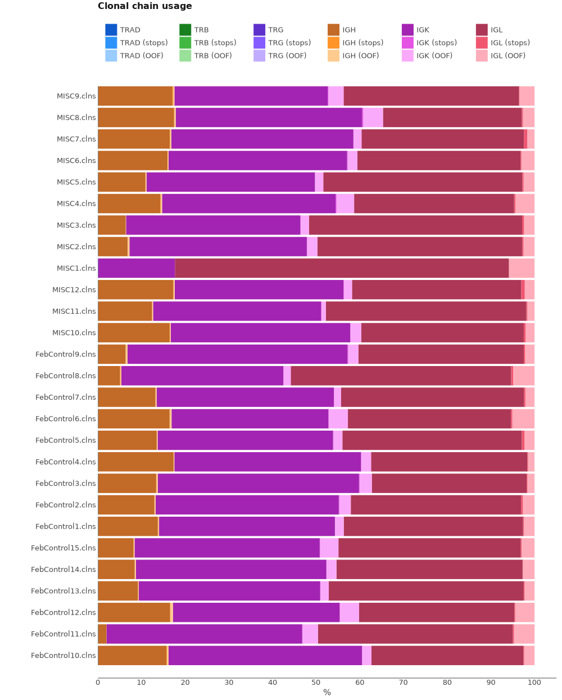

# SMARTer Human BCR IgG IgM H/K/L Profiling Sequencing Kit (Takara Bio Inc.)

Here we will discuss how to process BCR cDNA libraries obtained with SMARTer Human BCR IgG IgM H/K/L Profiling Sequencing Kit (Takara Bio Inc.).

## Data libraries

This tutorial uses the data from the following publication: *The autoimmune signature of hyperinflammatory multisystem inflammatory syndrome in children* Rebecca A. Porritt, et al,JCI (2021)
[doi:10.1172/JCI151520](https://doi.org/10.1172/JCI151520)

Library construction was performed using the SMARTer Human BCR IgG IgM H/K/L Profiling Sequencing Kit (Takara Bio Inc.). Up to 50 ng of total RNA per sample was used for reverse transcription, followed by 4 separate PCR amplification reactions for IgG, IgM, IgK, and IgL. A second round of PCR amplified the entire BCR variable region and a small portion of the constant region. After size selection, quantification and fragment analysis of the individual libraries were performed. Individual chains were then pooled and sequenced on the MiSeq (Illumina) using 2 × 300 bp sequencing. Fastq raw data have been deposited in the European Nucleotide Archive (ENA) under accession number PRJEB44566. 

!!! note
    FASTQ files have been merged, thus every pair of FASTQ files holds sequences for all chains corresponding to a sample.

On the scheme bellow you can see structure of cDNA library. UMI is located in the first 12 bp of R2.


All data may be downloaded directly from SRA using e.g. [SRA Explorer](https://sra-explorer.info):
??? tip "Use this script to download the full data set with the proper filenames for the tutorial:"
    ```shell
    #!/usr/bin/env bash
    #!/usr/bin/env bash
    curl -L ftp://ftp.sra.ebi.ac.uk/vol1/fastq/ERR595/003/ERR5952573/ERR5952573_1.fastq.gz	-o FebControl1_R1.fastq.gz
    curl -L ftp://ftp.sra.ebi.ac.uk/vol1/fastq/ERR595/003/ERR5952573/ERR5952573_2.fastq.gz	-o FebControl1_R2.fastq.gz
    curl -L ftp://ftp.sra.ebi.ac.uk/vol1/fastq/ERR595/004/ERR5952574/ERR5952574_1.fastq.gz	-o FebControl2_R1.fastq.gz
    curl -L ftp://ftp.sra.ebi.ac.uk/vol1/fastq/ERR595/004/ERR5952574/ERR5952574_2.fastq.gz	-o FebControl2_R2.fastq.gz
    curl -L ftp://ftp.sra.ebi.ac.uk/vol1/fastq/ERR595/005/ERR5952575/ERR5952575_1.fastq.gz	-o FebControl3_R1.fastq.gz
    curl -L ftp://ftp.sra.ebi.ac.uk/vol1/fastq/ERR595/005/ERR5952575/ERR5952575_2.fastq.gz	-o FebControl3_R2.fastq.gz
    curl -L ftp://ftp.sra.ebi.ac.uk/vol1/fastq/ERR595/006/ERR5952576/ERR5952576_1.fastq.gz	-o FebControl4_R1.fastq.gz
    curl -L ftp://ftp.sra.ebi.ac.uk/vol1/fastq/ERR595/006/ERR5952576/ERR5952576_2.fastq.gz	-o FebControl4_R2.fastq.gz
    curl -L ftp://ftp.sra.ebi.ac.uk/vol1/fastq/ERR595/007/ERR5952577/ERR5952577_1.fastq.gz	-o FebControl5_R1.fastq.gz
    curl -L ftp://ftp.sra.ebi.ac.uk/vol1/fastq/ERR595/007/ERR5952577/ERR5952577_2.fastq.gz	-o FebControl5_R2.fastq.gz
    curl -L ftp://ftp.sra.ebi.ac.uk/vol1/fastq/ERR595/008/ERR5952578/ERR5952578_1.fastq.gz	-o FebControl6_R1.fastq.gz
    curl -L ftp://ftp.sra.ebi.ac.uk/vol1/fastq/ERR595/008/ERR5952578/ERR5952578_2.fastq.gz	-o FebControl6_R2.fastq.gz
    curl -L ftp://ftp.sra.ebi.ac.uk/vol1/fastq/ERR595/009/ERR5952579/ERR5952579_1.fastq.gz	-o FebControl7_R1.fastq.gz
    curl -L ftp://ftp.sra.ebi.ac.uk/vol1/fastq/ERR595/009/ERR5952579/ERR5952579_2.fastq.gz	-o FebControl7_R2.fastq.gz
    curl -L ftp://ftp.sra.ebi.ac.uk/vol1/fastq/ERR595/000/ERR5952580/ERR5952580_1.fastq.gz	-o FebControl8_R1.fastq.gz
    curl -L ftp://ftp.sra.ebi.ac.uk/vol1/fastq/ERR595/000/ERR5952580/ERR5952580_2.fastq.gz	-o FebControl8_R2.fastq.gz
    curl -L ftp://ftp.sra.ebi.ac.uk/vol1/fastq/ERR595/001/ERR5952581/ERR5952581_1.fastq.gz	-o FebControl9_R1.fastq.gz
    curl -L ftp://ftp.sra.ebi.ac.uk/vol1/fastq/ERR595/001/ERR5952581/ERR5952581_2.fastq.gz	-o FebControl9_R2.fastq.gz
    curl -L ftp://ftp.sra.ebi.ac.uk/vol1/fastq/ERR595/002/ERR5952582/ERR5952582_1.fastq.gz	-o FebControl10_R1.fastq.gz
    curl -L ftp://ftp.sra.ebi.ac.uk/vol1/fastq/ERR595/002/ERR5952582/ERR5952582_2.fastq.gz	-o FebControl10_R2.fastq.gz
    curl -L ftp://ftp.sra.ebi.ac.uk/vol1/fastq/ERR595/003/ERR5952583/ERR5952583_1.fastq.gz	-o FebControl11_R1.fastq.gz
    curl -L ftp://ftp.sra.ebi.ac.uk/vol1/fastq/ERR595/003/ERR5952583/ERR5952583_2.fastq.gz	-o FebControl11_R2.fastq.gz
    curl -L ftp://ftp.sra.ebi.ac.uk/vol1/fastq/ERR595/004/ERR5952584/ERR5952584_1.fastq.gz	-o FebControl12_R1.fastq.gz
    curl -L ftp://ftp.sra.ebi.ac.uk/vol1/fastq/ERR595/004/ERR5952584/ERR5952584_2.fastq.gz	-o FebControl12_R2.fastq.gz
    curl -L ftp://ftp.sra.ebi.ac.uk/vol1/fastq/ERR595/005/ERR5952585/ERR5952585_1.fastq.gz	-o FebControl13_R1.fastq.gz
    curl -L ftp://ftp.sra.ebi.ac.uk/vol1/fastq/ERR595/005/ERR5952585/ERR5952585_2.fastq.gz	-o FebControl13_R2.fastq.gz
    curl -L ftp://ftp.sra.ebi.ac.uk/vol1/fastq/ERR595/006/ERR5952586/ERR5952586_1.fastq.gz	-o FebControl14_R1.fastq.gz
    curl -L ftp://ftp.sra.ebi.ac.uk/vol1/fastq/ERR595/006/ERR5952586/ERR5952586_2.fastq.gz	-o FebControl14_R2.fastq.gz
    curl -L ftp://ftp.sra.ebi.ac.uk/vol1/fastq/ERR595/007/ERR5952587/ERR5952587_1.fastq.gz	-o FebControl15_R1.fastq.gz
    curl -L ftp://ftp.sra.ebi.ac.uk/vol1/fastq/ERR595/007/ERR5952587/ERR5952587_2.fastq.gz	-o FebControl15_R2.fastq.gz
    curl -L ftp://ftp.sra.ebi.ac.uk/vol1/fastq/ERR595/008/ERR5952588/ERR5952588_1.fastq.gz	-o MISC1_R1.fastq.gz
    curl -L ftp://ftp.sra.ebi.ac.uk/vol1/fastq/ERR595/008/ERR5952588/ERR5952588_2.fastq.gz	-o MISC1_R2.fastq.gz
    curl -L ftp://ftp.sra.ebi.ac.uk/vol1/fastq/ERR595/009/ERR5952589/ERR5952589_1.fastq.gz	-o MISC2_R1.fastq.gz
    curl -L ftp://ftp.sra.ebi.ac.uk/vol1/fastq/ERR595/009/ERR5952589/ERR5952589_2.fastq.gz	-o MISC2_R2.fastq.gz
    curl -L ftp://ftp.sra.ebi.ac.uk/vol1/fastq/ERR595/000/ERR5952590/ERR5952590_1.fastq.gz	-o MISC3_R1.fastq.gz
    curl -L ftp://ftp.sra.ebi.ac.uk/vol1/fastq/ERR595/000/ERR5952590/ERR5952590_2.fastq.gz	-o MISC3_R2.fastq.gz
    curl -L ftp://ftp.sra.ebi.ac.uk/vol1/fastq/ERR595/001/ERR5952591/ERR5952591_1.fastq.gz	-o MISC4_R1.fastq.gz
    curl -L ftp://ftp.sra.ebi.ac.uk/vol1/fastq/ERR595/001/ERR5952591/ERR5952591_2.fastq.gz	-o MISC4_R2.fastq.gz
    curl -L ftp://ftp.sra.ebi.ac.uk/vol1/fastq/ERR595/002/ERR5952592/ERR5952592_1.fastq.gz	-o MISC5_R1.fastq.gz
    curl -L ftp://ftp.sra.ebi.ac.uk/vol1/fastq/ERR595/002/ERR5952592/ERR5952592_2.fastq.gz	-o MISC5_R2.fastq.gz
    curl -L ftp://ftp.sra.ebi.ac.uk/vol1/fastq/ERR595/003/ERR5952593/ERR5952593_1.fastq.gz	-o MISC6_R1.fastq.gz
    curl -L ftp://ftp.sra.ebi.ac.uk/vol1/fastq/ERR595/003/ERR5952593/ERR5952593_2.fastq.gz	-o MISC6_R2.fastq.gz
    curl -L ftp://ftp.sra.ebi.ac.uk/vol1/fastq/ERR595/004/ERR5952594/ERR5952594_1.fastq.gz	-o MISC7_R1.fastq.gz
    curl -L ftp://ftp.sra.ebi.ac.uk/vol1/fastq/ERR595/004/ERR5952594/ERR5952594_2.fastq.gz	-o MISC7_R2.fastq.gz
    curl -L ftp://ftp.sra.ebi.ac.uk/vol1/fastq/ERR595/005/ERR5952595/ERR5952595_1.fastq.gz	-o MISC8_R1.fastq.gz
    curl -L ftp://ftp.sra.ebi.ac.uk/vol1/fastq/ERR595/005/ERR5952595/ERR5952595_2.fastq.gz	-o MISC8_R2.fastq.gz
    curl -L ftp://ftp.sra.ebi.ac.uk/vol1/fastq/ERR595/006/ERR5952596/ERR5952596_1.fastq.gz	-o MISC9_R1.fastq.gz
    curl -L ftp://ftp.sra.ebi.ac.uk/vol1/fastq/ERR595/006/ERR5952596/ERR5952596_2.fastq.gz	-o MISC9_R2.fastq.gz
    curl -L ftp://ftp.sra.ebi.ac.uk/vol1/fastq/ERR595/007/ERR5952597/ERR5952597_1.fastq.gz	-o MISC10_R1.fastq.gz
    curl -L ftp://ftp.sra.ebi.ac.uk/vol1/fastq/ERR595/007/ERR5952597/ERR5952597_2.fastq.gz	-o MISC10_R2.fastq.gz
    curl -L ftp://ftp.sra.ebi.ac.uk/vol1/fastq/ERR595/008/ERR5952598/ERR5952598_1.fastq.gz	-o MISC11_R1.fastq.gz
    curl -L ftp://ftp.sra.ebi.ac.uk/vol1/fastq/ERR595/008/ERR5952598/ERR5952598_2.fastq.gz	-o MISC11_R2.fastq.gz
    curl -L ftp://ftp.sra.ebi.ac.uk/vol1/fastq/ERR595/009/ERR5952599/ERR5952599_1.fastq.gz	-o MISC12_R1.fastq.gz
    curl -L ftp://ftp.sra.ebi.ac.uk/vol1/fastq/ERR595/009/ERR5952599/ERR5952599_2.fastq.gz	-o MISC12_R2.fastq.gz
    ```

## Upstream analysis

The most straightforward way to get clonotype tables is to use a universal [`mixcr analyze`](../reference/mixcr-analyze.md) command.

According to the library preparation protocol, the library does not have any V primers on 5'-end and has C primers on 3' end. Thus, the command for a single sample is the following:

```shell
> mixcr analyze amplicon \
    --species hsa \
    --starting-material rna \
    --receptor-type bcr \
    --5-end no-v-primers \
    --3-end c-primers \
    --adapters no-adapters \
    --assemble "-OassemblingFeatures={FR1Begin:FR4End}" \
    --umi-pattern "^N{7}(R1:*) \ ^(UMI:N{12})N{4}(R2:*)" \
    fastq/FebControl1_R1.fastq.gz \
    fastq/FebControl1_R2.fastq.gz \
    results/FebControl1
```

The meaning of these options is the following.

`--species`
:   is set to `hsa` for _Homo Sapience_

`--starting-material`
:   RNA or DNA. It affects the choice of V gene region which will be used as target in [`align`](../reference/mixcr-align.md) step (`vParameters.geneFeatureToAlign`, see [`align` documentation](../../reference/mixcr-align.md)): `rna` corresponds to the `VTranscriptWithout5UTRWithP` and `dna` to `VGeneWithP` (see [Gene features and anchor points](../reference/ref-gene-features.md) for details)

`--receptor-type`
:   `bcr`. It affects the choice of underlying alignment algorithms: MiXCR uses fundamentally different algorithms for TCRs and BCRs because BCRs have somatic hypermutations and long indels.

`--umi-pattern`
:   is used to specify UMI pattern for the library. MiXCR provides a powerful regex-like [language](../reference/ref-tag-pattern.md) allowing to specify almost arbitrary barcode structure. Here we use `^N{7}(R1:*) \ ^(UMI:N{12})N{4}(R2:*)` pattern to specify the location of UMI.

`--5-end`
: is set to `no-v-primers`, because the library was obtained using 5'RACE. This leads to a global alignment algorithm on the left bound of V gene.

`--3-end-primers`
:  is set `c-primers` according to the cDNA library preparation protocol.

`--adapers`
:  is set to `no-adapters`. Presence or absence of adapter sequences results in the choice between local and global alignment algorithms on the edges of the target sequence.

`--assemble`
: `"-OassemblingFeatures={FR1Begin:FR4End}"`. We pass an extra parameter to `mixcr assemble` step of the pipeline. By default, clones are assembled by `CDR3` sequence, but in case of full-length BCR data we want to extend this assembling feature to capture hypermutations in V gene.

Running the command above will generate the following files:

```shell
> ls result/

# human-readable reports 
FebControl1.report
# raw alignments (highly compressed binary file)
FebControl1.vdjca
# alignments with corrected UMI barcode sequences 
FebControl1.corrected.vdjca
# IGH, IGK and IGL CDR3 clonotypes (highly compressed binary file)
FebControl1.clns
# IGH, IGK and IGL CDR3 clonotypes exported in tab-delimited txt
FebControl1.clonotypes.IGH.tsv
FebControl1.clonotypes.IGK.tsv
FebControl1.clonotypes.IGL.tsv  

```

Obtained `*.tsv` files can be used for manual examination. `*.clns` files can be used for downstream analysis using [`mixcr postanalisis`](../reference/mixcr-postanalysis.md). By default, MiXCR exports clonotypes in a tab-delimited format separately for each immunological chain.

In order to run the analysis for all samples in the project on Linux we can use [GNU Parallel](https://www.gnu.org/software/parallel/) in the following way:

```shell
> ls /fastq/*_R1* | \
  parallel -j2 \
  'mixcr analyze amplicon \
    --species hsa \
    --starting-material rna \
    --receptor-type bcr \
    --5-end no-v-primers \
    --3-end c-primers \
    --adapters no-adapters \
    --assemble "-OassemblingFeatures={FR1Begin:FR4End}" \
    --umi-pattern "^N{"7"}(R1:*) \ ^(UMI:N{"12"})N{"4"}(R2:*)" \
    --report {=s:.*/:results/:;s:_R1.*:\.report:=} \
    {} \
    {=s:R1:R2:=} \
    {=s:.*/:results/:;s:_R1.*::=}'
```

### Under the hood pipeline:

Under the hood the command above actually executes the following pipeline:


#### `align`

Alignment of raw sequencing reads against reference database of V-, D-, J- and C- gene segments.

```shell
# align raw reads
> mixcr align -s hsa \
    -p kAligner2 \
    -OvParameters.geneFeatureToAlign="VTranscriptWithout5UTRWithP" \
    -OvParameters.parameters.floatingLeftBound=false \
    -OjParameters.parameters.floatingRightBound=false \
    -OcParameters.parameters.floatingRightBound=false \
    --report results/13_d60_lymph_node_germinal_center_B_cell.report \
    --tag-pattern '^N{7}(R1:*) \ ^(UMI:N{12})N{4}(R2:*)' \
    fastq/FebControl1_R1.fastq.gz \
    fastq/FebControl1_R2.fastq.gz \
    FebControl1.vdjca
```
Option `--report` is specified here explicitly.
- `-p kAligner2` specifies an BCR aligner.
- `-OvParameters.parameters.floatingLeftBound=false -OjParameters.parameters.floatingRightBound=false -OcParameters.parameters.floatingRightBound=false` are all set to `false` which results in a global aligning algorithm on all segment bounds.

#### `correctAndSortTags`

[Corrects](../reference/mixcr-correctAndSortTags.md) sequencing and PCR errors _inside_ barcode sequences. This step is essential to correct artificial diversity caused by errors in barcodes.

```shell
> mixcr correctAndSortTags \
    --report FebControl1.report \
    --json-report FebControl1.report.json \
    FebControl1.vdjca \
    FebControl1.corrected.vdjca
```

#### `assemble`

Assembles alignments into clonotypes and applies several layers of errors correction(ex. quality-awared correction for sequencing errors, clustering to correct for PCR errors). Check [`mixcr assemble`](../reference/mixcr-assemble.md) for more information.

```shell
# assemble CDR3 clonotypes
> mixcr assemble \
    -OseparateByV=true \
    -OseparateByJ=true \
    -OseparateByC=true \
    -OassemblingFeatures={FR1Begin:FR4End} \
    --report FebControl1.corrected.report \
    FebControl1.corrected.vdjca \
    FebControl1.clns
```

Since no V primers are present and isotype specific C primers were used, we can separate clones by V, J and C segments even if they have the same `CDR3`. This is important especially for BCR data due to hypermutations and in order to identify isotypes.

#### `export`

Exports clonotypes from `.clns` file into human-readable tables.
```shell
# export to tsv
> mixcr exportClones \
    -p full \
    FebControl1.clns \
    FebControl1.tsv
```
Here `-p full` defines the full preset of common export columns. Check [`mixcr export`](../reference/mixcr-export.md) for more information.

## Quality control

Now when we have all files processed lets perform Quality Control. That can be easily done using [`mixcr exportQc`](../reference/mixcr-exportQc.md)
function.

```shell
# obtain alignment quality control
> mixcr exportQc align \
    result/*.vdjca \
    alignQc.pdf
```

<figure markdown>

</figure>

The plot above demonstrates a high quality alignment rate. Now Lets look at the chain distribution in every sample.

```shell
# obtain chain usage plot
> mixcr exportQc chainUsage \
    result/*.vdjca \
    usageQc.pdf
```

<figure markdown>

</figure>

We see that in most sample number of light chains significantly dominate over IGH. Since libraries for all chains were generated in a separate PCR reactions according to the protocol, we might suggest that this bias arise from unequal mixing of cDNA libraries prior sequencing.
