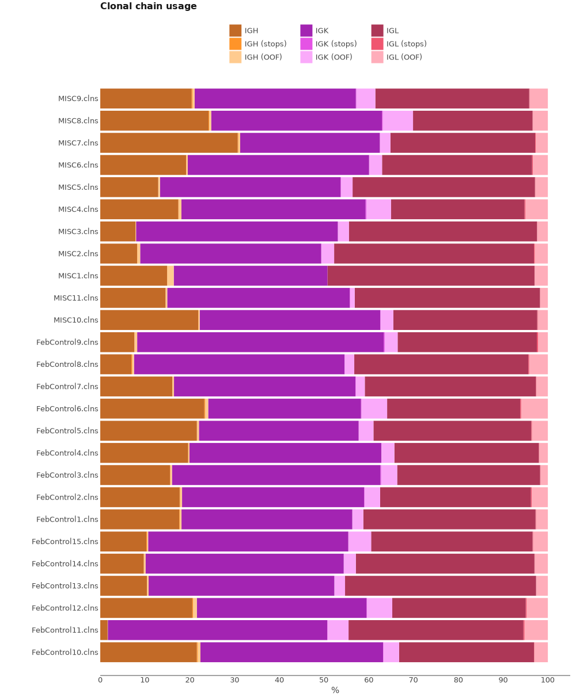

# SMARTer Human BCR IgG IgM H/K/L Profiling Sequencing Kit (Takara Bio Inc.)

Here we will discuss how to process BCR cDNA libraries obtained with [SMARTer Human BCR IgG IgM H/K/L Profiling Sequencing Kit](https://www.takarabio.com/products/next-generation-sequencing/immune-profiling/human-repertoire/human-bcr-profiling-kit-for-illumina-sequencing) (Takara Bio Inc.).

## Data libraries

This tutorial uses the data from the following publication: *The autoimmune signature of hyperinflammatory multisystem inflammatory syndrome in children* Rebecca A. Porritt, et al,JCI (2021)
[doi:10.1172/JCI151520](https://doi.org/10.1172/JCI151520)

Library construction was performed using the SMARTer Human BCR IgG IgM H/K/L Profiling Sequencing Kit (Takara Bio Inc.). Up to 50 ng of total RNA per sample was used for reverse transcription, followed by 4 separate PCR amplification reactions for IgG, IgM, IgK, and IgL. A second round of PCR amplified the entire BCR variable region and a small portion of the constant region. After size selection, quantification and fragment analysis of the individual libraries were performed. Individual chains were then pooled and sequenced on the MiSeq (Illumina) using 2 × 300 bp sequencing. Fastq raw data have been deposited in the European Nucleotide Archive (ENA) under accession number PRJEB44566. 

!!! note
    FASTQ files have been merged, thus every pair of FASTQ files holds sequences for all chains corresponding to a sample.

On the scheme bellow you can see structure of cDNA library. UMI is located in the first 12 bp of R2.


All data may be downloaded directly from SRA (PRJEB44566) using e.g. [SRA Explorer](https://sra-explorer.info).

??? tip "Use [aria2c](https://aria2.github.io) for efficient download of the full dataset with the proper filenames:"
    ```shell title="download.sh"
    --8<-- "guides/takara-hsa-bcr/scripts/010-download-aria2c.sh"
    ```
    ```shell title="download-list.txt"
    --8<-- "guides/takara-hsa-bcr/scripts/download-list.txt"
    ```

## Upstream analysis

MiXCR has a dedicated preset for this protocol, thus analysing the data is as easy as:

```shell
--8<-- "guides/takara-hsa-bcr/scripts/020-upstream-preset.sh"
```

Running the command above will generate the following files:

```shell
> ls result/

# human-readable reports 
FebControl1.report
# raw alignments (highly compressed binary file)
FebControl1.vdjca
# alignments with refined UMI barcode sequences 
FebControl1.refined.vdjca
# IGH, IGK and IGL CDR3 clonotypes (highly compressed binary file)
FebControl1.clns
# IGH, IGK and IGL CDR3 clonotypes exported in tab-delimited txt
FebControl1.clonotypes.IGH.tsv
FebControl1.clonotypes.IGK.tsv
FebControl1.clonotypes.IGL.tsv
```

While `.clns` file holds all data and is used for downstream analysis using [`mixcr postanalisis`](../reference/mixcr-postanalysis.md), the output `.txt` clonotype table will contain exhaustive information about each clonotype as well:

??? tip "See first 100 records from FebControl1.clones.IGH.tsv clonotype table"
    {{ read_csv('docs/mixcr/guides/takara-hsa-bcr/figs/FebControl1.clones.tsv', engine='python', sep='\t', nrows=100) }}

In order to run the analysis for all samples in the project on Linux we can use [GNU Parallel](https://www.gnu.org/software/parallel/) in the following way:

```shell
--8<-- "guides/takara-hsa-bcr/scripts/020-upstream-preset-parallel.sh"
```

### Under the hood pipeline:

Under the hood the command above actually executes the following pipeline:

#### `align`
Alignment of raw sequencing reads against reference database of V-, D-, J- and C- gene segments.

```shell
--8<-- "guides/takara-hsa-bcr/scripts/040-upstream-align.sh"
```

Option `--report` is specified here explicitly.

`--species hsa`
: determines the organism species (hsa for _Homo Sapiens_).

`-p  generic-amplicon-with-umi`
:  a default preset of MiXCR parameters for amplicon data with UMIs.

`-OvParameters.geneFeatureToAlign="VTranscriptWithout5UTRWithP"`
: Sets a V gene feature to align. Check [gene features](../reference/ref-gene-features.md) for more info.

`-OvParameters.parameters.floatingLeftBound=false`
: Results in a global alignment algorithm for V gene left bound. We use it because we don't have any primers covering V gene coding sequence.

`-OjParameters.parameters.floatingRightBound=false`
: Results in a global alignment algorithm for J gene right bound, because reverse primers are located in C-gene region.

`-OcParameters.parameters.floatingRightBound=true`
: Results in a local alignment algorithm for C gene right bound, because reverse primers are located in C-gene region.

`--tagPattern "^N{7}(R1:*) \ ^(UMI:N{12})N{4}(R2:*)"`
: tag pattern specifies the location of the UMI barcode and also trims N nucleotides on the 5' end of R1 according to the library structure.


#### `refineTagsAndSort`

[Corrects](../reference/mixcr-refineTagsAndSort.md) sequencing and PCR errors _inside_ barcode sequences. This step does extremely important job by correcting artificial diversity caused by errors in barcodes. In the considered example project it corrects only sequences of UMIs.

```shell
--8<-- "guides/takara-hsa-bcr/scripts/045-upstream-refineTagsAndSort.sh"
```

#### `assemble`
Assembles alignments into clonotypes and applies several layers of errors correction:

- quality-dependent correction for sequencing errors
- PCR-error correction by clustering
- UMI-based error correction)

Check [`mixcr assemble`](../reference/mixcr-assemble.md) for more information.


```shell
--8<-- "guides/takara-hsa-bcr/scripts/050-upstream-assemble.sh"
```

Options `--report` and `--json-report` are specified here explicitly so that the report files will be appended with assembly report.

`-OassemblingFeatures=CDR3`
: By default `takara-hsa-bcr-cdr3` preset assembles clones by `CDR3` sequence.

`-separateByJ: true`
: Separate clones with the same assembling feature, but different V-genes.

`-separateByV: true`
: Separate clones with the same assembling feature, but different J-genes.

`-separateByC: true`
: Separate clones with the same assembling feature, but different C-genes. In this case the protocol utilizes sequence-specific primers that allow to separate IgG and IgM isotypes.

#### `export`
Exports clonotypes from .clns file into human-readable tables.

```shell
--8<-- "guides/takara-mmu-tcr/scripts/060-upstream-exportClones.sh"
```

`-с IGH`
: defines a specific chain to be exported.

`-uniqueTagCount UMI`
: adds a column with the number of UMIs for each clone.


## Quality control

Now when we have all files processed lets perform Quality Control. That can be easily done using [`mixcr exportQc`](../reference/mixcr-exportQc.md)
function.

```shell
--8<-- "guides/takara-hsa-bcr/scripts/080-qc-align.sh"
```


The plot above demonstrates a high quality alignment rate. Nevertheless, about 10% of reads did not align to the reference. MiXCR provides a convenient way to extract not aligned reads and investigate their origin.

By default, MiXCR removed non target reads during alignment. We will realign reads for one of the samples (e.g. MISC9) and extract not aligned reads (`--not-aligned-R1`, `--not-aligned-R2`) to separate FASTQ files for manual inspection. See [`mixcr align`](../reference/mixcr-align.md) for more details.

Bellow is the complete command:

```shell
--8<-- "guides/takara-hsa-bcr/scripts/090-qc-debug-align.sh"
```

Resulting `MISC9_notAligned_R1.fastq` and `MISC9_notAligned_R2.fastq` files can be manually inspected. A brief [BLAST](https://blast.ncbi.nlm.nih.gov/Blast.cgi) search revealed most not aligned sequences come from DNA sequence (in between gene segments or from immunoglobulin like genes (e.g.IGLL5) )

Now Lets look at the chain distribution in every sample.

```shell
--8<-- "guides/takara-hsa-bcr/scripts/120-qc-chainUsage.sh"
```



We see that in most sample number of light chains significantly dominate over IGH. Since libraries for all chains were generated in a separate PCR reactions according to the protocol, we might suggest that this bias arise from unequal mixing of cDNA libraries prior sequencing.

## Full-length clonotype assembly

SMARTer Human BCR IgG IgM H/K/L Profiling Sequencing Kit allows to recover a broader BCR receptor sequence then just `CDR3` region. Since this protocol is based on 5'RACE method, the full V-gene sequence should present. Reverse sequence specific primers are located in C-gene region providing enough sequence for IgG\IgM isotype identification.

Taking into account what is mentioned above, the longest possible assembling feature for this protocol is `VDJRegion`.

MiXCR has a specific preset to obtain full-length BCR clones with SMARTer Human BCR IgG IgM H/K/L Profiling Sequencing Kit:

```shell
--8<-- "guides/takara-hsa-bcr/scripts/130-upstream-preset-full-length.sh"
```

The `mixcr assemble` step in this preset differs from the one above in the following manner:

```shell
--8<-- "guides/takara-hsa-bcr/scripts/140-upstream-assemble-full-length.sh"
```

`-OassemblingFeatures="VDJRegion"`
: sets the assembling feature to the region which starts from `FR1Begin` and ends at the end of `FR4`.

Notice that we do not use `-OseparateByV=true` and `-OseparateByJ=true` in this case because assembling feature already covers full V and J sequences, thus in case if clones have identical `CDR3` they will still be separated. We still use `-OseparateByC=true` option for isotype identification.

## Reports
Finally, MiXCR provides a very convenient way to look at the reports generated at ech step. Every `.vdjca`, `.clns` and `.clna` file holds all the reports for every MiXCR function that has been applied to this sample. E.g. in our case `.clns` file contains reports for `mixcr align` and `mixcr assemble`. To output this report use [`mixcr exportReports`](../reference/mixcr-exportReports.md) as shown bellow. Note `--json` parameter will output a JSON-formatted report.

```shell
--8<-- "guides/takara-hsa-bcr/scripts/125-qc-exportReports.sh"
```

```shell
--8<-- "guides/takara-hsa-bcr/scripts/125-qc-exportReports-json.sh"
```

??? "Show report file"
    === "`.txt`"
        ```shell
        --8<-- "guides/takara-hsa-bcr/figs/FebControl1.report.txt"
        ```
    === "`.json`"
        ```js
        --8<-- "guides/takara-hsa-bcr/figs/FebControl1.report.json"
        ```