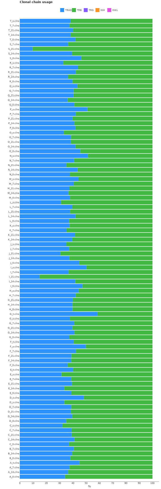

# SMARTer Mouse TCR a/b Profiling Kit
Here we will discuss how to process TCR cDNA libraries obtained with SMARTer Mouse TCR a/b Profiling Kit.

## Data libraries

This tutorial uses the data from the following publication: *A T cell repertoire timestamp is at the core of responsiveness to CTLA-4 blockade* Hagit Philip et al., , iScience, 2021 Feb;
[doi: 10.1016/j.isci.2021.102100](https://doi.org/10.1016/j.isci.2021.102100)

Samples were collected from 20 mice implanted with MC38 adenocarcinoma cells. The experiment contained 2 groups, of which the first group (5 animals with ids A - E) was dosed with 10 ml/kg/day of vehicle on day 1, 3 and 6 of the experiment. The second group (15 animals with ids F - T) was dosed with the investigational antibody anti-mCTLA4 (5/2.5 mg/kg/day at 1/3, 6). After treatment with the immune checkpoint inhibitor antibody anti-mCTLA4 blood samples for the preparation of PBMCs were taken at days 0,7,14 and 21. Tumors (where still visible) and spleens were collected immediately after euthanasia, and directly transferred to liquid nitrogen (snap-frozen samples). Total RNA was isolated from every sample and cDNA libraries were prepared using SMARTer Mouse TCR a/b Profiling Kit. TCR sequencing was performed on an Illumina Miseq sequencer using the 600-cycle Miseq reagent kit v3(Illumina) with pair-end, 2x300 base pair reads.

All data is available from SRA (PRJNA658348) using e.g. [SRA Explorer](https://sra-explorer.info).

??? tip "Use [aria2c](https://aria2.github.io) for efficient download of the full dataset with the proper filenames:"
    ```shell title="download.sh"
    --8<-- "abhelix-bcr/scripts/010-download-aria2c.sh"
    ```
    ```shell title="download-list.txt"
    --8<-- "abhelix-bcr/scripts/download-list.txt"
    ```

The project contains 100 FASTQ file pairs. For the purpose of this tutorial we assume that all fastq files are stored in `fastq/` folder. Each file name encodes the information about mouse id and PMBC sample time-point (0,7,14,21 days) or tissue (s - spleen, t -tumor)
- `S` - mouce id, experiment group
- `s` - spleen tissue

The structure of the library is shown on the picture bellow.


## Upstream analysis

MiXCR has a dedicated preset for this protocol, thus analysing the data is as easy as:

```shell
--8<-- "takara-mmu-tcr/scripts/020-upstream-preset.sh"
```

One might also use [GNU Parallel](https://www.gnu.org/software/parallel/) to process all samples at once:

```shell
--8<-- "takara-mmu-tcr/scripts/020-upstream-preset-parallel.sh"
```

Under the hood the command above actually executes the following pipeline:


### Under the hood pipeline:

Under the hood the command above actually executes the following pipeline:

#### `align`
Alignment of raw sequencing reads against reference database of V-, D-, J- and C- gene segments.

```shell
--8<-- "takara-mmu-tcr/scripts/040-upstream-align.sh"
```

Option `--report` is specified here explicitly.

`--species mmu`
: determines the organism species (mmu for _Mus Musculus_).

`-p default_4.0`
:  a default preset of MiXCR parameters which includes a dedicated TCR aligner.

`-OvParameters.geneFeatureToAlign="VTranscriptWithout5UTRWithP"`
: Sets a V gene feature to align. Check [gene features](../reference/ref-gene-features.md) for more info.

`-OvParameters.parameters.floatingLeftBound=false`
: Results in a global alignment algorithm for V gene left bound. We use it because we don't have any primers covering V gene coding sequence.

`-OjParameters.parameters.floatingRightBound=false`
: Results in a global alignment algorithm for J gene right bound, because reverse primers are located in C-gene region.

#### `assemble`
Assembles alignments into clonotypes and applies several layers of errors correction(ex. quality-dependent correction for sequencing errors, PCR-error correction by clustering). Check [`mixcr assemble`](../reference/mixcr-assemble.md) for more information.

```shell
--8<-- "abhelix-bcr/scripts/050-upstream-assemble.sh"
```

Options `--report` and `--json-report` are specified here explicitly so that the report files will be appended with assembly report.

`-OassemblingFeatures=CDR3`
: By default `takara-mmu-tcr-cdr3` preset assembles clones by `CDR3` sequence.

#### `export`
Exports clonotypes from .clns file into human-readable tables.

```shell
--8<-- "takara-mmu-tcr/scripts/060-upstream-exportClones.sh"
```

`-с <chain>`
: defines a specific chain to be exported.


After executing the command above for every sample we will have a following set of output files:
```shell
# human-readable reports 
S_s.report
# raw alignments (highly compressed binary file)
S_s.vdjca
# TCRα & TCRβ CDR3 clonotypes (highly compressed binary file)
S_s.clns
# TCRα & TCRβ CDR3 clonotypes exported in tab-delimited txt
S_s.TRB.txt
S_s.TRB.txt
```

While `.clns` file holds all data and is used for downstream analysis, the output `.txt` clonotype table will contain exhaustive information about each clonotype as well:

??? tip "See first 100 records from S_s clonotype table"
    {{ read_csv('docs/mixcr/guides/takara-mmu-tcr/figs/S_s.clones.tsv', engine='python', sep='\t', nrows=100) }}

## Quality control

Now when we have processed all samples, we can proceed to quality control. First thing that we want to look at is the alignment quality. This can be easily done with the following command:

```shell
--8<-- "takara-mmu-tcr/scripts/080-qc-align.sh"
```


From the plot above we see, that only about 50% of reads from every sample have been successfully aligned. The major reason why the alignment failed is that a lot of reads lack TCR sequences. In that case, if we want to dig a bit deeper into the issue we can realign one of the samples and save not-aligned reads into separate files for manual inspection. Let's pick one of the samples, ex. S_7, and realign it.

```shell
--8<-- "takara-mmu-tcr/scripts/090-qc-debug-align.sh"
```

Now one can use BLAST to determine the origin of the reads in  `S_7_notAligned_R1.fastq` and `S_7_notAligned_R2.fastq`. In this particular case BLAST showed that major part of the non-aligned reads aligns with DNA sequence in between TCR gene segments which may be consequences of DNA contamination.


Finally, we can look at the chain distribution among all clones. 

```shell
--8<-- "takara-mmu-tcr/scripts/120-qc-chainUsage.sh"
```

On the plot bellow we see, despite some TRB dominance, both (TCR alpha and TCR beta) chains equally present in each sample.




## Full-length clonotype assembly

SMARTer Mouse TCR a/b Profiling Kit  allows to recover a broader TCR receptor sequence then just `CDR3` region. Since this protocol is based on 5'RACE method, the full V-gene sequence should present. Reverse sequence specific primers are located in C-gene region, thus the read fully covers J-gene.

The longest possible assembling feature for this protocol is `"{FR1Begin:FR4End}"`.

MiXCR has a specific preset to obtain full-length TCR clones with SMARTer Mouse TCR a/b Profiling protocol:

```shell
--8<-- "takara-mmu-tcr/scripts/130-upstream-preset-full-length.sh"
```

The `mixcr assemble` step in this preset differs from the one above in the following manner:

```shell
--8<-- "takara-mmu-tcr/scripts/140-upstream-assemble-full-length.sh"
```

`-OassemblingFeatures="{FR1Begin:FR4End}"`
: sets the assembling feature to the region which starts from `FR1Begin` and ends at the end of `FR4`.

Notice that we do not use `-OseparateByV=true` and `-OseparateByJ=true` in this case because assembling feature already covers full V and J sequences, thus in case several clones have identical `CDR3` they will still be separated.

## Reports
Finally, MiXCR provides a very convenient way to look at the reports generated at ech step. Every `.vdjca`, `.clns` and `.clna` file holds all the reports for every MiXCR function that has been applied to this sample. E.g. in our case `.clns` file contains reports for `mixcr align` and `mixcr assemble`. To output this report use [`mixcr exportReports`](../reference/mixcr-exportReports.md) as shown bellow. Note `--json` parameter will output a JSON-formatted report.

```shell
--8<-- "takara-mmu-tcr/scripts/125-qc-exportReports.sh"
```

```shell
--8<-- "takara-mmu-tcr/scripts/125-qc-exportReports-json.sh"
```

??? "Show report file"
    === "`.txt`"
        ```shell
        --8<-- "takara-mmu-tcr/figs/S_s.report.txt"
        ```
    === "`.json`"
        ```js
        --8<-- "takara-mmu-tcr/figs/S_s.report.json"
        ```
