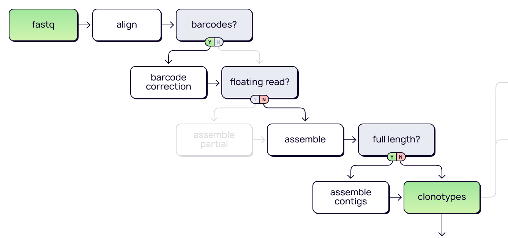

# `mixcr analyze`

Uber command to run complicated analysis pipelines for generic data types in one line.

## Generic targeted amplicon libraries

MiXCR `analyze amplicon` runs the dedicated pipeline for the analysis of enriched targeted generic TCR/IG libraries (5’RACE, Amplicon, Multiplex, etc) with or without UMIs. The pipeline includes [alignment](./mixcr-align.md) of raw sequencing reads, [tag correction](./mixcr-correctAndSortTags.md) in case of UMI-barcoded data, [assembly](./mixcr-assemble.md) of aligned sequences into clonotypes, optional [contig assembly](./mixcr-assembleContigs.md) and finally [export](./mixcr-export.md#clonotype-tables) of the resulting clonotype tables into tab-delimited files.



```
mixcr analyze amplicon [-f] [-t <threads>] \
    --species <species> \
    --starting-material <startingMaterial> \
    --5-end <5End> \
    --3-end <3End> \
    --adapters <adapters> \
    [--umi-pattern <pattern>] \
    [--umi-pattern-name <patternName>] \
    [--region-of-interest <regionOfInterest>] \
    [--receptor-type <receptorType>] \
    [--contig-assembly] \
    [--report <report>] \
    [--json-report <jsonReport>] \
    [--library <library>] \
    [--align <alignParameters>] \
    [--align-preset <alignPreset>] \
    [--assemble <assembleParameters>] \
    [--assembleContigs <assembleContigParameters>] \
    [--export <exportParameters>] \
    [--no-export] \
    [--only-productive] \
    [--impute-germline-on-export] \
    input_file1 [input_file2] \
    output_prefix
```

The command takes raw sequencing data as input and supports the following formats (same as [`align`](./mixcr-align.md)): paired-end and single-end [`.fastq`](https://en.wikipedia.org/wiki/FASTQ_format), [`.fasta`](https://en.wikipedia.org/wiki/FASTA_format), [`.bam` and `.sam`](https://en.wikipedia.org/wiki/Binary_Alignment_Map). Since `analyze` command produces multiple files as output it requires to specify output file name prefix.

`-f, --force-overwrite`
: Force overwrite of output file(s).

`-t, --threads <threads>`
: Specify number of processing threads

`-s, --species <species>`
: Species (organism). Possible values: `hsa` (or HomoSapiens), `mmu` (or MusMusculus), `rat`, `spalax`, `alpaca`, `lamaGlama`, `mulatta` (_Macaca Mulatta_), `fascicularis` (_Macaca Fascicularis_) or any species from [IMGT ® library](../guides/external-libraries.md).

`--starting-material <startingMaterial>`
: Starting material. Possible values: `rna`, `dna`

`--5-end <5End>`
: 5'-end of the library. Possible values: `no-v-primers` (e.g. 5'RACE with template switch oligo or a like), `v-primers` (V gene single primer / multiplex)

`--3-end <3End>`
: 3'-end of the library. Possible values: `j-primers` (J gene single primer / multiplex), `j-c-intron-primers` (J-C intron single primer / multiplex), `c-primers` (C gene single primer / multiplex; e.g. IGHC primers specific to different immunoglobulin isotypes)

`--adapters <adapters>`
: Presence of PCR primers and/or adapter sequences. If sequences of primers used for PCR or adapters are present in sequencing data, it may influence the accuracy of V, J and C gene segments identification and CDR3 mapping. Possible values: `adapters-present`, `no-adapters`

`--umi-pattern <pattern>`
: [Pattern](./ref-tag-pattern.md) for UMI-barcoded data

`--umi-pattern-name`
: One of [predefined](./ref-tag-pattern.md) barcode patterns for UMI-barcoded data

`--region-of-interest <regionOfInterest>`
: MiXCR will use only reads covering the whole target region; reads which partially cover selected region will be dropped during [clonotype assembly](./mixcr-assemble.md). All non-CDR3 options require long high-quality paired-end data. Default value `CDR3`.

`--receptor-type <chains>`
: Receptor type. Possible values: `tcr`, `bcr`, `xcr` (default), `tra`, `trb`, `trd`, `trg`, `igh`, `igk`, `igl`

`--contig-assembly`
: Assemble longest possible [consensus contig sequences](./mixcr-assembleContigs.md) from input data.

`-r, --report <report>`
: Report file path

`-j, --json-report <jsonReport>`
: JSON report file path.

`-b, --library <library>`
: V/D/J/C gene library.

`--align <alignParameters>`
: Additional parameters for [align step](./mixcr-align.md) specified with double quotes (e.g `--align "--limit 1000" --align "-OminSumScore=100"` etc.

`--align-preset <alignPreset>`
: [Aligner parameters](./mixcr-align.md#aligner-parameters) preset

`--assemble <assembleParameters>`
: Additional parameters for [assemble](./mixcr-assemble.md) step specified with double quotes (e. g `--assemble "-OassemblingFeatures=[V5UTR+L1+L2+FR1,FR3+CDR3] --assemble "-ObadQualityThreshold=0"` etc.)

`--assembleContigs <assembleContigParameters>`
: Additional parameters for [assemble contigs](./mixcr-assembleContigs.md) step specified with double quotes

`--export <exportParameters>`
: Additional parameters for [`exportClones`](./mixcr-export.md#clonotype-tables) step specified with double quotes (e.g `--export "-p full" --export "-cloneId"` etc).

`--impute-germline-on-export`
: [Impute germline](./mixcr-export.md#export-contigs-with-imputation) on export

`--only-productive`
: Filter out-of-frame sequences and clonotypes with stop-codons in clonal sequence export

`--no-export`
: Do not export clonotypes to tab-delimited file.

Example usage for a generic 5'RACE TCR protocol with no UMIs for _Mus Musculus_ alpha chain:

```shell
> mixcr analyze amplicon \
    --species mmu \
    --starting-material rna \
    --5-primers v-primers \
    --3-primers j-primers \
    --adapters adapters-present \
    --receptor-type tcr \
    --report sample1.report \
    sample1_R1.fastq.gz \
    sample1_R2.fastq.gz \
    sample1
```

The output will contain the following files:

```shell
> ls

# human-readable reports 
sample1.report
# raw alignments (highly compressed binary file)
sample1.vdjca
# TCRα CDR3 clonotypes (highly compressed binary file)
sample1.clns
# TCRα clonotypes exported in tab-delimited txt
sample1.clonotypes.TRAD.tsv  
```
## Concatenating across multiple lanes

Sometimes it is required to concatenate several fastq files and analyse it as a single sample. This is a common practise when files are separated across sequencing lanes. MiXCR uses `{{n}}` syntax, that is similar to Linux wildcard behaviour.

Bellow you can see an example of how to pass 8 fastq files (four per each paired read) to `mixcr analyze`:

```shell
> ls fastq/
    sample1_L001_S25_R1.fastq.gz    sample1_L001_S25_R2.fastq.gz 
    sample1_L002_S25_R1.fastq.gz    sample1_L002_S25_R2.fastq.gz
    sample1_L003_S25_R1.fastq.gz    sample1_L003_S25_R2.fastq.gz
    sample1_L004_S25_R1.fastq.gz    sample1_L004_S25_R2.fastq.gz

> mixcr analyze amplicon \
    --species mmu \
    --starting-material rna \
    --5-primers v-primers \
    --3-primers j-primers \
    --adapters adapters-present \
    --receptor-type TRAD \
    --report sample1.report \
    fastq/sample1_L{{n}}_S25_R1.fastq.gz \
    fastq/sample1_L{{n}}_S25_R2.fastq.gz
```

### Details

Under the hood `mixcr analyze amplicon` is equivalent to execution of the following MiXCR actions:

#### `align`

[Performs](mixcr-align.md):

- alignment of raw sequencing reads against reference database of V-, D-, J- and C- gene segments
- pattern matching of tag pattern sequence and extraction of barcodes

```
mixcr align \
    --species <species> \
    --preset <alignerPreset> \
    --tag-pattern <umiPattern> \
    -OvParameters.geneFeatureToAlign=<vFeatureToAlign> \
    -OvParameters.parameters.floatingLeftBound=<vBound> \
    -OvParameters.parameters.floatingRightBound=<jBound> \
    -OvParameters.parameters.floatingRightBound=<cBound> \
    [align options] \
    input_R1.fastq [input_R2.fastq] \
    output_prefix.vdjca
```

Values of parameters are computed from the values of required analyze amplicon options.

Option `--starting-material` affects the choice of V gene region which will be used as a target for Variable segment: `rna` corresponds to the `VTranscriptWithout5UTRWithP` and `dna` to `VGeneWithP` (see [Gene features and anchor points](ref-gene-features.md) for details).

Option `--receptor-type` affects aligner parameters preset if `--align-preset` is not specified. For BCR data MiXCR will use [`kAligner2`](mixcr-align.md#v-j-and-c-aligners-parameters), which is better suited for highly mutated data with big indels, while in other case it will use [`kAligner`](mixcr-align.md#v-j-and-c-aligners-parameters).

The presence or absence of primer and adapter sequences affects behavior of aligners with respect to the alignment boundaries (`floatingLeftBound`/`floatingRightBound` [aligner options](mixcr-align.md#aligner-parameters):

- if V gene single primer / multiplex is used at `5’-end` and `adapters-present`, the option value for `floatingLeftBound` will be set to `true` for V gene aligner parameters; in other cases it will be set to false;
- if J gene single primer / multiplex is used at `3’-end` and `adapters-present`, the option value `floatingRightBound` will be set to `true` for J gene aligner parameters; in other cases it will be set to `false`;
- if J-C intron single primer / multiplex is used at `3’-end` and `adapters-present`, `floatingRightBound` will be set to `true` for C gene aligner parameters; in other cases it will be set to `false`.

#### `correctAndSortTags`

[Corrects](mixcr-correctAndSortTags.md) sequencing and PCR errors _inside_ barcode sequences.

```
> mixcr correctAndSortTags \
    [correct options] \
    output_prefix.vdjca \
    output_prefix.corrected.vdjca
```

#### `assemble`

[Assembles](mixcr-assemble.md) clonotypes and applies several layers of errors correction.

```
> mixcr assemble \
    [--write-alignments] \
    -OassemblingFeatures=<regionOfInterest> \
    -OseparateByV=<separateByV> \
    -OseparateByJ=<separateByJ> \
    -OseparateByC=<separateByC> \
    [assemble options] \
    output_prefix.corrected.vdjca \
    output_prefix.(clns|clna)
```

Option `--write-alignments` is used if `--contig-assembly` is specified for `analyze amplicon`.

The presence or absence of primer and adapter sequences also affects behavior of clonotype [pre-clusterign](mixcr-assemble.md#pre-clustering-parameters):

- if V gene single primer / multiplex is used at `5’-end` and `adapters-present`, the option value for `separateByV` will be set to `false`; in other cases it will be set to `true`;
- if J gene single primer / multiplex is used at `3’-end` and `adapters-present`, the option value `separateByJ` will be set to `false`; in other cases it will be set to `true`;
- if J-C intron single primer / multiplex is used at `3’-end` and `adapters-present`, `separateByC` will be set to `false` for C gene aligner parameters; in other cases it will be set to `true`.

#### `assembleContigs`

[Assembles](mixcr-assembleContigs.md) full-length (as long as present) consensus contig sequences:

```
> mixcr assembleContigs \
    [export options] \
    output_prefix.clna \
    output_prefix.contigs.clns
```

#### `exportClones`

[Exports](mixcr-export.md#clonotype-tables) clonotype tables separately for each immunological chain:

```
> mixcr exportClones --chains TRAD \
    [export options] \
    output_prefix.contigs.clns \
    output_prefix.clonotypes.TRAD.txt

> mixcr exportClones --chains TRB \
    [export options] \
    output_prefix.contigs.clns \
    output_prefix.clonotypes.TRB.txt
    
> mixcr exportClones --chains IGH \
    [export options] \
    output_prefix.contigs.clns \
    output_prefix.clonotypes.IGH.txt
    
> mixcr exportClones --chains IGK \
    [export options] \
    output_prefix.contigs.clns \
    output_prefix.clonotypes.IGK.txt
    
> mixcr exportClones --chains IGL \
    [export options] \
    output_prefix.contigs.clns \
    output_prefix.clonotypes.IGL.txt
```

## Generic non-targeted shotgun data (RNA-Seq)

MiXCR `analyze amplicon` runs the dedicated pipeline for the analysis of non-enriched RNA-seq and non-targeted genomic data. The pipeline includes [alignment](mixcr-align.md) of raw sequencing reads, [partial assembly](mixcr-assemblePartial.md) of overlapping fragmented reads, [imputation](mixcr-extend.md) of good TCR alignments, [assembly](mixcr-assemble.md) of aligned sequences into clonotypes, optional reconstruction of longest possible [consensus contigs](mixcr-assembleContigs.md) and [exporting](mixcr-export.md#clonotype-tables) the resulting clonotypes into tab-delimited files.


```shell
mixcr analyze shotgun [-f] [-t <threads>] \
    --species <species> \
    --starting-material <startingMaterial> \
    [--contig-assembly] \
    [--do-not-extend-alignments] \
    [--assemble-partial-rounds <nRounds>] \
    [--report <report>] \
    [--json-report <jsonReport>] \
    [--library <library>] \
    [--align <alignParameters>] \
    [--assemblePartial <assemblePartialParameters>]
    [--extend <extendParameters>] \
    [--assemble <assembleParameters>] \
    [--assembleContigs <assembleContigParameters>] \
    [--export <exportParameters>] \
    [--no-export] \
    [--only-productive] \
    [--impute-germline-on-export] \
    input_file1 [input_file2] \
    output_prefix
```

The command takes raw sequencing data as input and supports the following formats (same as [`align`](./mixcr-align.md)): paired-end and single-end [`.fastq`](https://en.wikipedia.org/wiki/FASTQ_format), [`.fasta`](https://en.wikipedia.org/wiki/FASTA_format), [`.bam` and `.sam`](https://en.wikipedia.org/wiki/Binary_Alignment_Map). Since `analyze` command produces multiple files as output it requires to specify output file name prefix. Note that the pipeline assumes that the data contain no adapter / primer sequences. The pipeline is [rigorously optimize](https://www.nature.com/articles/nbt.3979) to extract all available productive information from the data keeping at the same time zero false-positive rate.

`-f, --force-overwrite`
: Force overwrite of output file(s).

`-t, --threads <threads>`
: Specify number of processing threads

`-s, --species <species>`
: Species (organism). Possible values: `hsa` (or HomoSapiens), `mmu` (or MusMusculus), `rat`, `spalax`, `alpaca`, `lamaGlama`, `mulatta` (_Macaca Mulatta_), `fascicularis` (_Macaca Fascicularis_) or any species from [IMGT ® library](../guides/external-libraries.md).

`--starting-material <startingMaterial>`
: Starting material. Possible values: `rna`, `dna`

`--contig-assembly`
: Assemble longest possible [consensus contig sequences](./mixcr-assembleContigs.md) from input data.

`--do-not-extend-alignments`
: Skip [TCR extension](mixcr-extend.md) step

`assemble-partial-rounds <nRounds>`
: Number of times [`assemblePartial`](mixcr-assemblePartial.md) is run

`-r, --report <report>`
: Report file path

`-j, --json-report <jsonReport>`
: JSON report file path


`-b, --library <library>`
: V/D/J/C gene library.

`--align <alignParameters>`
: Additional parameters for [align step](./mixcr-align.md) specified with double quotes (e.g `--align "--limit 1000" --align "-OminSumScore=100"` etc.

`--assemblePartial <assemblePartialParameters>`
: Additional parameters for [partial assemgly step](mixcr-assemblePartial.md) specified with double quotes.

`--extend <extendParameters>`
: Additional parameters for [TCR extension step](mixcr-extend.md) specified with double quotes.

`--assemble <assembleParameters>`
: Additional parameters for [assemble](./mixcr-assemble.md) step specified with double quotes (e. g `--assemble "-OassemblingFeatures=[V5UTR+L1+L2+FR1,FR3+CDR3] --assemble "-ObadQualityThreshold=0"` etc.)

`--assembleContigs <assembleContigParameters>`
: Additional parameters for [assemble contigs](./mixcr-assembleContigs.md) step specified with double quotes

`--export <exportParameters>`
: Additional parameters for [`exportClones`](./mixcr-export.md#clonotype-tables) step specified with double quotes (e.g `--export "-p full" --export "-cloneId"` etc).

`--impute-germline-on-export`
: [Impute germline](./mixcr-export.md#export-contigs-with-imputation) on export

`--only-productive`
: Filter out-of-frame sequences and clonotypes with stop-codons in clonal sequence export

`--no-export`
: Do not export clonotypes to tab-delimited file.

Example usage:

```shell
> mixcr analyze shotgun \
    --species hs \
    --starting-material rna \
    --report sample1.report \
    --contig-assembly \
    --impute-germline-on-export \
    sample1_R1.fastq.gz \
    sample1_R2.fastq.gz \
    sample1
```

The output will contain the following files:

```shell
> ls

# human-readable reports 
sample1.report
# raw alignments (highly compressed binary file)
sample1.vdjca
# partial assemble round #1
sample1.rescued_1.vdjca
# partial assemble round #2
sample1.rescued_2.vdjca
# extended alignments (for TCRs)
sample1.extended.vdjca
# CDR3 clonotypes (highly compressed binary clones & alignments file)
sample1.clna
# consensus contig sequences
sample1.contigs.clns
# TCR/BCR Clonotypes exported in tab-delimited txt
sample1.clonotypes.TRAD.tsv
sample1.clonotypes.TRB.tsv
sample1.clonotypes.IGH.tsv
sample1.clonotypes.IGK.tsv
sample1.clonotypes.IGL.tsv
```

### Details

Under the hood `mixcr analyze amplicon` is equivalent to execution of the following MiXCR actions:

#### `align`

[Performs](mixcr-align.md) alignment of raw sequencing reads against reference database of V-, D-, J- and C- gene segments:

```
mixcr align \
    --species <species> \
    --preset rna-seq \
    -OvParameters.geneFeatureToAlign=<vFeatureToAlign> \
    -OvParameters.parameters.floatingLeftBound=false \
    -OvParameters.parameters.floatingRightBound=false \
    -OvParameters.parameters.floatingRightBound=false \
    [align options] \
    input_R1.fastq [input_R2.fastq] \
    output_prefix.vdjca
```

MiXCR uses [`rna-seq` preset](mixcr-align.md#aligner-parameters) which is specifically optimized for non-targeted fragmented shotgun data.

Option `--starting-material` affects the choice of V gene region which will be used as a target for Variable segment: `rna` corresponds to the `VTranscriptWithout5UTRWithP` and `dna` to `VGeneWithP` (see [Gene features and anchor points](ref-gene-features.md) for details).

#### `assemblePartial`

[Rescues](mixcr-assemblePartial.md) alignments which only partially cover CDR3 region.

```
> mixcr assemblePartial \
    [assemblePartial options] \
    output_prefix.vdjca \
    output_prefix.rescued_1.vdjca
    
> mixcr assemblePartial \
    [assemblePartial options] \
    output_prefix.rescued_1.vdjca \
    output_prefix.rescued_2.vdjca
```

#### `extend`

[Extends](mixcr-extend.md) edges of TCR alignments which misses only a few letter at the edges to cover full CDR3.

```
> mixcr extend \
    [extend options] \
    output_prefix.rescued_2.vdjca \
    output_prefix.extended.vdjca 
    
```

#### `assemble`

[Assembles](mixcr-assemble.md) CDR3 clonotypes and applies several layers of errors correction.

```
> mixcr assemble \
    [--write-alignments] \
    -OassemblingFeatures=CDR3 \
    -OseparateByV=true \
    -OseparateByJ=true \
    [assemble options] \
    output_prefix.corrected.vdjca \
    output_prefix.(clns|clna)
```

Option `--write-alignments` is used if `--contig-assembly` is specified for `analyze amplicon`.

#### `assembleContigs`

[Assembles](mixcr-assembleContigs.md) full-length (as long as present) consensus contig sequences:

```
> mixcr assembleContigs \
    [export options] \
    output_prefix.clna \
    output_prefix.contigs.clns
```

#### `exportClones`

[Exports](mixcr-export.md#clonotype-tables) clonotype tables separately for each immunological chain:

```
> mixcr exportClones --chains TRAD \
    [export options] \
    output_prefix.contigs.clns \
    output_prefix.clonotypes.TRAD.txt

> mixcr exportClones --chains TRB \
    [export options] \
    output_prefix.contigs.clns \
    output_prefix.clonotypes.TRB.txt
    
> mixcr exportClones --chains IGH \
    [export options] \
    output_prefix.contigs.clns \
    output_prefix.clonotypes.IGH.txt
    
> mixcr exportClones --chains IGK \
    [export options] \
    output_prefix.contigs.clns \
    output_prefix.clonotypes.IGK.txt
    
> mixcr exportClones --chains IGL \
    [export options] \
    output_prefix.contigs.clns \
    output_prefix.clonotypes.IGL.txt
```