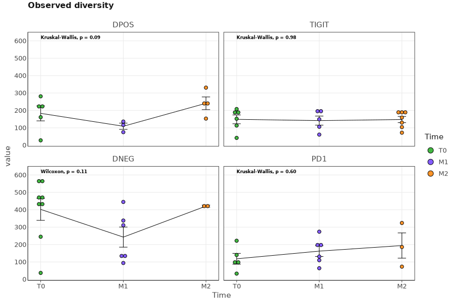
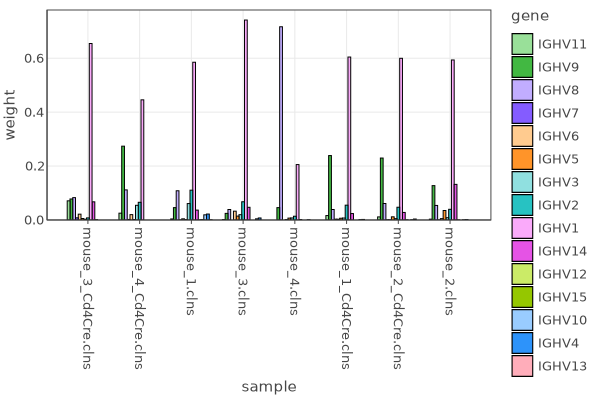
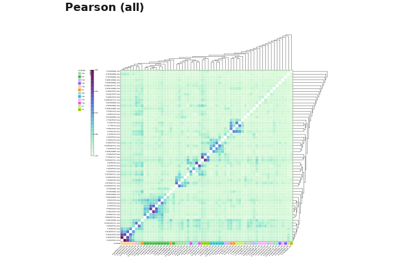

# `mixcr exportPlots`

A set of routines for graphical export of [postanalysis](./mixcr-postanalysis.md) results. MiXCR supports graphical export in PDF, SVG, EPS, PNG and JPEG formats.

## Diversity and CDR3 metrics

```
mixcr exportPlots (diversity|cdr3metrics) 
    [--chains <chain>]... 
    [--filter <meta(|>|>=|=|<=|<)value>[,<meta(|>|>=|=|<=|<)value>...]]... 
    [--metadata <path>] 
    [--plot-type <plotType>] 
    [--primary-group <meta>] 
    [--primary-group-values <value>[,<value>...]]... 
    [--secondary-group <meta>] 
    [--secondary-group-values <value>[,<value>...]]... 
    [--facet-by <meta>] 
    [--hide-overall-p-value] 
    [--pairwise-comparisons] 
    [--ref-group <refGroup>] 
    [--hide-non-significant] 
    [--paired] 
    [--method <method>] 
    [--method-multiple-groups <method>] 
    [--p-adjust-method <method>] 
    [--show-significance] 
    [--metric <metric>[,<metric>...]]... 
    [--width <n>] 
    [--height <n>] 
    [--no-warnings] 
    [--verbose] 
    [--help]
    pa.json[.gz] output.(pdf|eps|svg|png|jpeg)
```
Exports [diversity](./mixcr-postanalysis.md#diversity-measures) or [CDR3 metrics](./mixcr-postanalysis.md#cdr3-metrics) visualization plots from the [individual](./mixcr-postanalysis.md#individual-postanalysis) postanalysis results. When exporting in PDF format the resulting file will contain multiple pages: one page per metric. For exaporint in other formats one need to specify `--metrics <metric>` option to export one particular metric.

Basic command line options are:

`pa.json[.gz]`
: Input file with postanalysis results.

`output.(pdf|eps|svg|png|jpeg)`
: Output PDF/EPS/PNG/JPEG file name.

`--chains <chain>`
: Export only for specified immunological chains.

`--filter <filter>[,<filter>...]`
: Filter samples to put on a plot by their metadata values. Filter allows equality (`species=cat`) or arithmetic comparison (`age>=10`) etc.

`--metadata <path>`
: [Metadata](./mixcr-postanalysis.md#metadata) file in a tab- (`.tsv`) or comma- (`.csv`) separated form. Must contain `sample` column which matches names of input files.

`--plot-type <plotType>`
: Plot type. Possible values: `boxplot`, `boxplot-bindot`, `boxplot-jitter`, `violin`, `violin-bindot`, `barplot`, `barplot-stacked`, `lineplot`, `lineplot-jitter`, `lineplot-bindot`, `scatter`

`-p, --primary-group <meta>`
: Specify metadata column used to group datasets.

`-pv, --primary-group-values <value>[,<value>...]`
: List of comma separated primary group values.

`-s, --secondary-group <meta>`
: Secondary group.

`-sv, --secondary-group-values <value>[,<value>...]`
: List of comma separated secondary group values.

`--facet-by <meta>`
: Facet by.

`--metric <metric>[,<metric>...]`
: Output only specified list of metrics:

    - for [`cdr3metrics`](./mixcr-postanalysis.md#cdr3-metrics) possible values are: `cdr3lenAA`, `cdr3lenNT`, `ndnLenNT`, `addedNNT`, `strength`, `hydrophobicity`, `surface`, `volume`, `charge`
    
    - for [`diversity`](./mixcr-postanalysis.md#diversity-measures) possible values are: `observed`, `shannonWiener`, `chao1`, `normalizedShannonWienerIndex`, `inverseSimpsonIndex`, `giniIndex`, `d50`, `efronThisted`


`--hide-overall-p-value`
: Hide overall p-value.

`--pairwise-comparisons`
: Show pairwise p-value comparisons.

`--ref-group <refGroup>`
: Reference group for compare means statistics. Can be 'all' or some specific value.

`--hide-non-significant`
: Hide non-significant observations.

`--paired`
: Do paired analysis

`--method <method>`
: Statistical test method. Available methods: [`Wilcoxon`](https://en.wikipedia.org/wiki/Mann–Whitney_U_test) (default), [`ANOVA`](https://en.wikipedia.org/wiki/Analysis_of_variance), [`TTest`](https://en.wikipedia.org/wiki/Student%27s_t-test), [`KruskalWallis`](https://en.wikipedia.org/wiki/Kruskal–Wallis_one-way_analysis_of_variance), [`KolmogorovSmirnov`](https://en.wikipedia.org/wiki/Kolmogorov–Smirnov_test)

`--method-multiple-groups <method>`
: Test method for multiple groups comparison. Available methods: [`KruskalWallis`](https://en.wikipedia.org/wiki/Kruskal–Wallis_one-way_analysis_of_variance) (default), [`Wilcoxon`](https://en.wikipedia.org/wiki/Mann–Whitney_U_test), [`ANOVA`](https://en.wikipedia.org/wiki/Analysis_of_variance), [`TTest`](https://en.wikipedia.org/wiki/Student%27s_t-test), [`KolmogorovSmirnov`](https://en.wikipedia.org/wiki/Kolmogorov–Smirnov_test)

`--p-adjust-method <method>`
: Method used to adjust p-values. Available methods: Available methods: [`Holm`](https://www.jstor.org/stable/4615733) (default), [`BenjaminiHochberg`](https://www.jstor.org/stable/2346101), [`BenjaminiYekutieli`](https://www.jstor.org/stable/2674075), [`Bonferroni`](https://en.wikipedia.org/wiki/Holm%E2%80%93Bonferroni_method), [`Hochberg`](https://www.jstor.org/stable/2336325), [`Hommel`](https://www.jstor.org/stable/2336190), `none`

`--show-significance`
: Show significance levels instead of p-values ( `ns` for p-value >= 0.05, `***` for p-value < 0.0001,  `**` for p-value < 0.001, `*` in other case).

`--width <n>`
: Plot width.

`--height <n>`
: Plot height.

`-nw, --no-warnings`
: Suppress all warning messages.

`--verbose`
: Verbose warning messages.

`-h, --help`
: Show this help message and exit.

### Examples

Use primary grouping and facets: 

```shell
> mixcr exportPlots diversity -f \
    --plot-type lineplot-bindot \
    --primary-group Time \
    --primary-group-values T0,M1,M2 \
    --facet-by Marker \
    pa/i.json.gz \
    plots/diversity_facets.pdf
```



Use secondary grouping:

```shell
> mixcr exportPlots diversity -f \
    --primary-group Marker \
    --secondary-group Time \
    --secondary-group-values T0,M1,M2 \
    pa/i.json.gz \
    plots/pdf
```


[TODO more examples]


## Gene segment usage

```
mixcr exportPlots (vUsage|jUsage|isotypeUsage|vjUsage) [-f]
    [--chains <chain>]... 
    [--filter <meta(|>|>=|=|<=|<)value>[,<meta(|>|>=|=|<=|<)value>...]]... 
    [--metadata <path>] 
    [--family-usage] 
    [--no-samples-dendro] 
    [--no-genes-dendro]
    [--color-key <key>]... 
    [--bar-plot] 
    [--facet-by <s>]
    [--width <n>] 
    [--height <n>] 
    [--palette <s>] 
    [--h-labels-size <d>] 
    [--v-labels-size <d>]   
    [--no-warnings] 
    [--verbose] 
    [--help] 
    pa.json[.gz] output.(pdf|eps|svg|png|jpeg)
```
Exports [gene segment usage](./mixcr-postanalysis.md#segment-usage-metrics) heatmap plots from the [individual](./mixcr-postanalysis.md#individual-postanalysis) postanalysis results.

`pa.json[.gz]`
: Input file with postanalysis results.

`output.(pdf|eps|svg|png|jpeg)`
: Output PDF/EPS/PNG/JPEG file name.

`--chains <chain>`
: Export only for specified immunological chains.

`--filter <meta(|>|>=|=|<=|<)value>[,<meta(|>|>=|=|<=|<)value>...]`
: Filter samples to put on a plot by their metadata values. Filter allows equality (`species=cat`) or arithmetic comparison (`age>=10`) etc.

`--metadata <path>`
: [Metadata](./mixcr-postanalysis.md#metadata) file in a tab- (`.tsv`) or comma- (`.csv`) separated form. Must contain `sample` column which matches names of input files.

`--family-usage`
: Show gene family usage instead.

`--no-samples-dendro`
: Don't add samples dendrogram on heatmap.

`--bar-plot`
:   export bar plot instead of heatmap (groups samples by genes)

`--bar-plot-by-sample`
:  export bar plot instead of heatmap (groups genes by sample)

`--family-usage`
:   show gene family usage instead

`--no-genes-dendro`
: Don't add genes dendrogram on heatmap.

`--color-key <key>`
: Add color key layer to heatmap.

`--bar-plot`
: Export bar plot instead of heatmap.

`--facet-by <s>`
: Facet bar-plot.

`--palette <s>`
: Color palette for heatmap. Available names: diverging, viridis2magma, lime2rose, blue2red, teal2red, softSpectral, sequential, viridis, magma, sunset, rainbow, salinity, density. Default: density

`--h-labels-size <d>`
: Width of horizontal labels. One unit corresponds to the width of one tile.

`--v-labels-size <d>`
: Height of vertical labels. One unit corresponds to the height of one tile.

`--width <n>`
: Plot width.

`--height <n>`
: Plot height.

`-nw, --no-warnings`
: Suppress all warning messages.

`--verbose`
: Verbose warning messages.

`-h, --help`
: Show this help message and exit.

### Examples

Export Variable gene segment usage plot and add color key:
```shell
mixcr exportPlots vUsage -f \
    --color-key Patient \
    pa/i.json.gz \
    plots/vUsage.svg
```


Export Joining gene segment usage plot and specify another palette:
```shell
mixcr exportPlots jUsage -f \
    --palette magma \
    --color-key Marker \
    pa/i.json.gz \
    plots/jUsage.svg
```


Export Variable gene segment families usage plot as a bar-plot by samples :

```shell
mixcr exportPlots vUsage -f \ 
  --bar-plot-by-sample \
  --family-usage \
  pa/individual.json.gz \
  plots/vUsage.svg 

```




Export Variable gene segment families usage plot as a bar-plot by genes :

```shell
mixcr exportPlots vUsage -f \ 
  --bar-plot \
  --family-usage \
  pa/individual.json.gz \
  plots/vUsage.svg 

```


## Overlap
```
mixcr exportPlots overlap 
    [--chains <chain>]... 
    [--filter <meta(|>|>=|=|<=|<)value>[,<meta(|>|>=|=|<=|<)value>...]]... 
    [--metadata <path>] 
    [--no-dendro]
    [--color-key <meta>]... 
    [--fill-diagonal]
    [--metric <metric>]... 
    [--width <n>] 
    [--height <n>] 
    [--palette <s>] 
    [--h-labels-size <d>] 
    [--v-labels-size <d>] 
    [--no-warnings] 
    [--verbose] 
    [--help] 
    pa.json[.gz] output.(pdf|eps|svg|png|jpeg)
```
Exports [pairwise distance metrics](./mixcr-postanalysis.md#segment-usage-metrics) heatmap plots from the [overlap](./mixcr-postanalysis.md#overlap-postanalysis) postanalysis results.

`pa.json[.gz]`
: Input file with postanalysis results.

`output.(pdf|eps|svg|png|jpeg)`
: Output PDF/EPS/PNG/JPEG file name.

`--chains <chain>`
: Export only for specified immunological chains.

`--filter <meta(|>|>=|=|<=|<)value>[,<meta(|>|>=|=|<=|<)value>...]`
: Filter samples to put on a plot by their metadata values. Filter allows equality (`species=cat`) or arithmetic comparison (`age>=10`) etc.

`--metadata <path>`
: [Metadata](./mixcr-postanalysis.md#metadata) file in a tab- (`.tsv`) or comma- (`.csv`) separated form. Must contain `sample` column which matches names of input files.

`--group-by <s>`
: Group heatmaps by specific metadata properties.

`--no-dendro`
: Don't add dendrograms

`--color-key <meta>`
: Add color key layer to the heatmap. One may write `--color-key x_meta` to draw color key horizontally (default) or `--color-key y_meta` to draw vertically.

`--fill-diagonal`
: Fill diagonal line

`--metric <metric>`
: Select specific metrics to export. Possible values are: SharedClonotypes, RelativeDiversity, F1Index, F2Index, JaccardIndex, Pearson, PearsonAll

`--palette <s>`
: Color palette for heatmap. Available names: diverging, viridis2magma, lime2rose, blue2red, teal2red, softSpectral, sequential, viridis, magma, sunset, rainbow, salinity, density. Default: density

`--width <n>`
: Plot width.

`--height <n>`
: Plot height.

`--h-labels-size <d>`
: Width of horizontal labels. One unit corresponds to the width of one tile.

`--v-labels-size <d>`
: Height of vertical labels. One unit corresponds to the height of one tile.

`-nw, --no-warnings`
: Suppress all warning messages.

`--verbose`
: Verbose warning messages.

`-h, --help`
: Show this help message and exit.
### Examples

Export overlap with color key:

```
> mixcr exportPlots overlap \
    --metric pearsonAll \
    --color-key Patient \
    pa/o.json.gz \
    plots/overlap.pdf
```


## SHM trees
```
mixcr exportPlots shmTrees 
    [--ids <id>[,<id>...]]... 
    [--filter-min-nodes <n>] 
    [--filter-min-height <n>] 
    [--node-color <meta>] 
    [--line-color <meta>] 
    [--node-size <meta>] 
    [--node-label <meta>] 
    [--alignment-nt <gene_feature>] 
    [--alignment-aa <gene_feature>] 
    [--alignment-no-fill] 
    [--metadata <path.(tsv|csv)>] 
    [--force-overwrite] 
    [--no-warnings] 
    [--verbose] 
    [--help] 
    [[--filter-in-feature <gene_feature>] [--pattern-max-errors <n>] (--filter-aa-pattern <pattern> | --filter-nt-pattern <pattern>)] 
    trees.shmt plots.pdf 
```
Visualize SHM tree and save in PDF format

`trees.shmt`
: Input file produced by 'findShmTrees' command.

`plots.pdf`
: Path where to write PDF file with plots.

`--ids <id>[,<id>...]`
: Filter specific trees by id

`--filter-min-nodes <n>`
: Minimal number of nodes in tree

`--filter-min-height <n>`
: Minimal height of the tree

`--node-color <meta>`
: Color nodes with given metadata column

`--line-color <meta>`
: Color lines with given metadata column

`--node-size <meta>`
: Size nodes with given metadata column. Predefined columns: "Abundance". Default: Abundance

`--node-label <meta>`
: Label nodes with given metadata column. Predefined columns: "Isotype"

`--alignment-nt <gene_feature>`
: Show tree nucleotide alignments using specified gene feature

`--alignment-aa <gene_feature>`
: Show tree amino acid alignments using specified gene feature

`--alignment-no-fill`
: Do not highlight alignments with color

`-m, --metadata <path.(tsv|csv)>`
: Path to metadata file Metadata should be a .tsv or .csv file with a column named 'sample' with filenames of .clns files used in findShmTrees

`-f, --force-overwrite`
: Force overwrite of output file(s).

`-nw, --no-warnings`
: Suppress all warning messages.

`--verbose`
: Verbose warning messages.

`-h, --help`
: Show this help message and exit.

Filter by pattern options:

`--filter-in-feature <gene_feature>`
: Match pattern inside specified gene feature. Default: CDR3

`--pattern-max-errors <n>`
: Max allowed subs & indels. Default: 0

`--filter-aa-pattern <pattern>`
: Filter specific trees by aa pattern.

`--filter-nt-pattern <pattern>`
: Filter specific trees by nt pattern.
