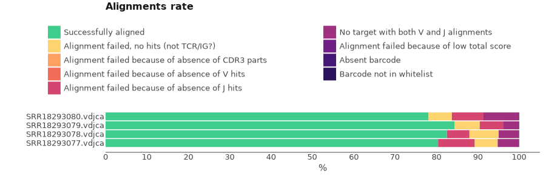
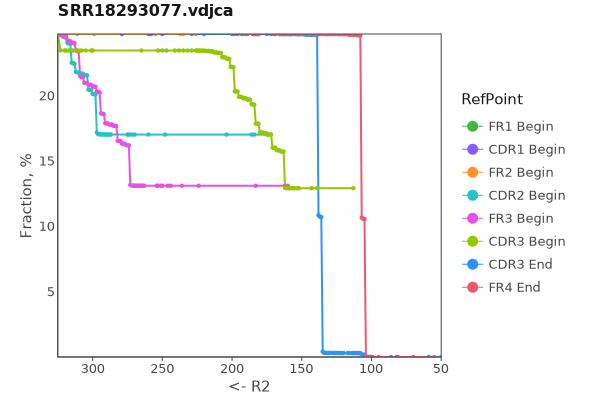
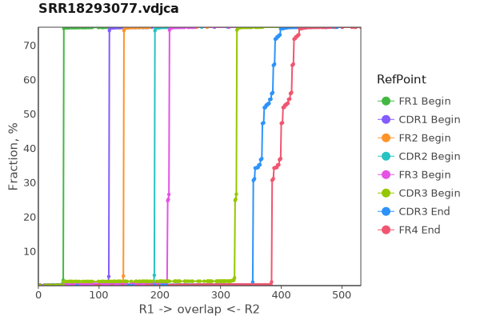
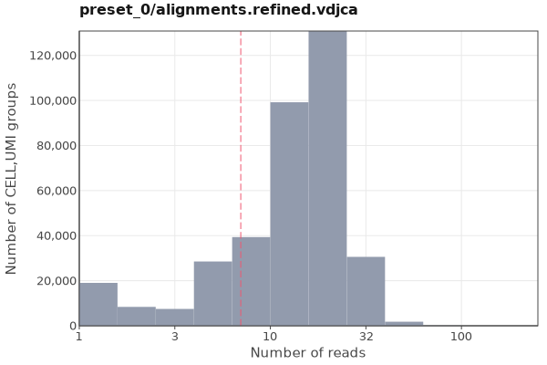

# `mixcr exportQc`

Exports various quality control metrics in a graphical form. Supported file formats: PDF, EPS, SVG, PNG and JPEG.

## Alignment reports
```
mixcr exportQc align
    [--absolute-values] 
    [--width <n> --height <n>] 
    [--force-overwrite] 
    [--no-warnings] 
    [--verbose] 
    [--help] 
    sample.(vdjca|clns|clna)... align.(pdf|eps|svg|png|jpeg)  
```

Exports [alignment reports](report-align.md).

`sample.(vdjca|clns|clna)...`
: Paths to input files with alignments

`align.(pdf|eps|svg|png|jpeg)`
: Path where to write output plots

`--absolute-values`
: Plot in absolute values instead of percent

`--width <n>`
: Plot width

`--height <n>`
: Plot height

`-f, --force-overwrite`
: Force overwrite of output file(s).

`-nw, --no-warnings`
: Suppress all warning messages.

`--verbose`
: Verbose messages.

`-h, --help`
: Show this help message and exit.

Example:

```
mixcr exportQc align *.vdjca alignQc.pdf
```


## Reads coverage
```
mixcr exportQc coverage
    [--show-boundaries] 
    [--force-overwrite] 
    [--no-warnings] 
    [--verbose] 
    [--help] 
    sample.vdjca... coverage.(pdf|eps|svg|png|jpeg)  
```
Exports [anchor points](ref-gene-features.md) coverage by the library. It separately plots coverage for R1, R2 and overlapping reads.

`sample.vdjca...`
: Paths to input files

`coverage.(pdf|eps|svg|png|jpeg)`
: Path where to write output plots

`--show-boundaries`
: Show V alignment begin and J alignment end

`-f, --force-overwrite`
: Force overwrite of output file(s).

`-nw, --no-warnings`
: Suppress all warning messages.

`--verbose`
: Verbose messages.

`-h, --help`
: Show this help message and exit.

Example:

```shell
mixcr exportQc coverage SRR18293077.vdjca coverage.pdf
```

=== "R1"
    <figure markdown>
    
    </figure>
=== "R2"
    <figure markdown>
    
    </figure>
=== "Overlap"
    <figure markdown>
    
    </figure>

## Chain usage
```
mixcr exportQc chainUsage
    [--absolute-values] 
    [--align-chain-usage] 
    [--hide-non-functional] 
    [--width <n> --height <n>] 
    [--force-overwrite] 
    [--no-warnings] 
    [--verbose] 
    [--help] 
    sample.(vdjca|clns|clna)... usage.(pdf|eps|svg|png|jpeg)  
```
Exports chain usage summary in either alignments (`.vdjca`) or clonotypes (`.clns`). 

Command line options are: 

`sample.(vdjca|clns|clna)...`
: Paths to input files

`usage.(pdf|eps|svg|png|jpeg)`
: Path where to write output plots

`--absolute-values`
: Plot in absolute values instead of percent

`--align-chain-usage`
: When specifying .clnx files on input force to plot chain usage for alignments

`--hide-non-functional`
: Hide fractions of non-functional CDR3s (out-of-frames and containing stops)

`--width <n>`
: Plot width

`--height <n>`
: Plot height

`-f, --force-overwrite`
: Force overwrite of output file(s).

`-nw, --no-warnings`
: Suppress all warning messages.

`--verbose`
: Verbose messages.

`-h, --help`
: Show this help message and exit.

Example:
```shell
> mixcr exportQc chainUsage --hide-non-functional results/*.clns chainUsage.pdf 
```


## Barcodes
```
mixcr exportQc tags 
    [--log] 
    [--force-overwrite] 
    [--no-warnings] 
    [--verbose] 
    [--help]
    sample.(vdjca|clns|clna)... coverage.(pdf|eps|svg|png|jpeg) 
```

Tag refinement statistics plots.

`sample.(vdjca|clns|clna)...`
: Paths to input files

`coverage.(pdf|eps|svg|png|jpeg)`
: Path where to write output plots

`--log`
: Use log10 scale for y-axis

`-f, --force-overwrite`
: Force overwrite of output file(s).

`-nw, --no-warnings`
: Suppress all warning messages.

`--verbose`
: Verbose messages.

`-h, --help`
: Show this help message and exit.


For example, for 10x VDJ data:
```shell
> mixcr exportQc tags 10x-data.clns barcodesFiltering.pdf 
```



The upper plot shows reads per UMI distribution and cut-off threshold used to filter erroneous UMIs. The second plot shows UMI per cell barcode distribution and cut-off threshold used to filter erroneous cell barcodes.
