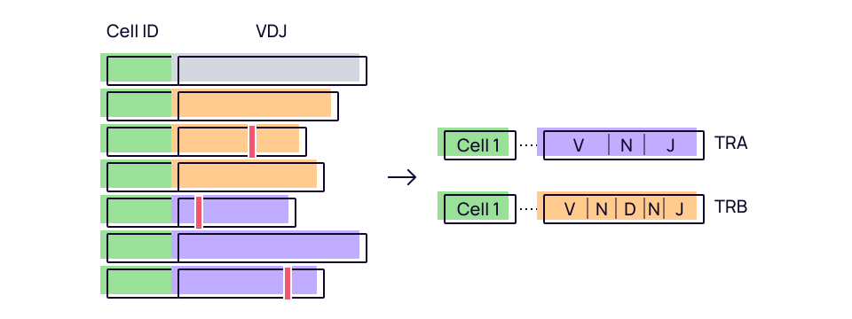

# `mixcr findAlleles`

Finds V- and J-gene allelic variants in a given sample(s). As result MiXCR creates a new [repseq.io](ref-repseqio-json-format.md) reference library and re-aligns clonotypes against this library with allelic variants.



Note that clontypes passed as input must be cut by and fully covered by the same [gene feature](mixcr-assemble.md#core-assembler-parameters). So, for example `.clns` files with [contigs](overview-analysis-overview.md#contig-assemblymixcr-assemblecontigsmd), must be assembled using [`assembleContigs`](mixcr-assembleContigs.md) with `--cut-by` option.

Allele inference algorithms applies different strategies to identify allelic variants with sufficient statistical significance. The algorithm for B-cells allows to reliably discriminate between somatic hypermutations, hot spots and real allelic variants.  


## Command line options

```
mixcr findAlleles 
   [--output-template <template.clns>] 
   [--export-library <path>] 
   [--export-alleles-mutations <path>] 
   [-O <key=value>]... 
   [--report <path>] 
   [--json-report <path>] 
   [--use-local-temp] 
   [--threads <n>] 
   [--force-overwrite] 
   [--no-warnings] 
   [--verbose] 
   [--help] 
   input_file.clns...
```
The command returns a highly-compressed, memory- and CPU-efficient binary `.clns` (clones) file that holds exhaustive information about clonotypes re-aligned to novelly discovered allelic variants. The resulting [reference library](ref-repseqio-json-format.md) is built-in in the `.clns` file but also may be exported directly with `--export-library` option. Clonotype tables can be further extracted in tabular form using [`exportClones`](./mixcr-export.md#clonotype-tables) or in human-readable form using [`exportClonesPretty`](./mixcr-exportPretty.md#clonotypes). Additionally, MiXCR produces a comprehensive [report](./report-findAlleles.md) which provides a detailed summary of allele search.

Basic command line options are:

`input_file.clns...`
: Input files for allele search

`-o, --output-template <template.clns>`
: Output template may contain {file_name} and {file_dir_path},

outputs for '-o /output/folder/{file_name}_with_alleles.clns input_file.clns input_file2.clns' will be /output/folder/input_file_with_alleles.clns and /output/folder/input_file2_with_alleles.clns,

outputs for '-o {file_dir_path}/{file_name}_with_alleles.clns /some/folder1/input_file.clns /some/folder2/input_file2.clns' will be /seme/folder1/input_file_with_alleles.clns and /some/folder2/input_file2_with_alleles.clns

Resulted outputs must be uniq

`--export-library <path>`
: Path where to write library with found alleles.

`--export-alleles-mutations <path>`
: Path to write descriptions and stats (see [below](#allelic-variants-summary-table)) for all result alleles, existed and new (see below).

`-O  <key=value>`
: Overrides default build SHM parameter values

`-r, --report <path>`
: [Report](./report-findAlleles.md) file (human readable version, see `-j / --json-report` for machine readable report).

`-j, --json-report <path>`
: JSON formatted [report](./report-findAlleles.md) file.

`--use-local-temp`
: Put temporary files in the same folder as the output files.

`-t, --threads <n>`
: Processing threads

`-f, --force-overwrite`
: Force overwrite of output file(s).

`-nw, --no-warnings`
: Suppress all warning messages.

`--verbose`
: Verbose warning messages.

`-h, --help`
: Show this help message and exit.

`-r, --report <reportFile>`
: [Report](./report-findAlleles.md) file (human readable version, see -j / --json-report for machine readable report)

`-j, --json-report <jsonReport>`
: JSON formatted [report](./report-findAlleles.md) file

`-t, --threads <threads>`
: Specify number of processing threads

`-O  <String=String>` 
: Overrides default find alleles parameter values (see below).


Example:
```shell
mixcr findAlleles \
    --output-template {file_name}.allelic.clns \
    --output-library alleles.repseqio.json \
    --export-alleles-mutations allele_stats.tsv \
    donor1_t1.clns donor1_t2.clns donor1_t3.clns
```


## Allelic variants summary table

Summary table produced with `--export-alleles-mutations` contain the following columns:

`alleleName`
: allele name in a resulting library; for novel allelic variants will contain count of mutations from known allele and number of mutations in CDR3

`geneName`
: gene name; the same for heterozygous

`type`
: V or J

`alleleMutationsReliableGeneFeatures`
: gene features inside which allele was found (including CDR3 part that was used for search)

`alleleMutationsReliableRanges`
: ranges in genome of `alleleMutationsReliableGeneFeatures`

`mutations`
: allele mutations from germline

`clonesCount`
: clones count that was aligned to this allele

`naivesCount`
: count of clones with no mutations in V and J

`lowerDiversityBound`
: lower bound of diversity of clones

`totalClonesCountForGene`
: total clones count of this allele and its zygotes (the same `geneName`)

`clonesCountWithNegativeScoreChange`
: count of clones that align better on original library than on build one

`filteredForAlleleSearchNaivesCount`
: counts of clones with no mutations in V and J after `useClonesWithCountGreaterThen` filter

`filteredForAlleleSearchClonesCount`
: counts of clones after `useClonesWithCountGreaterThen` filter

`filteredForAlleleSearchClonesCountWithNegativeScoreChange`
: count of clones that align better on original library than on build one after `useClonesWithCountGreaterThen` filter

`scoreDelta`
: stats of score change of clones (size, sum, min, max, avg, quadraticMean, stdDeviation)


## Allele inference algorithm parameters

Below one can find parameters of inference algorithms that may be tuned.

`-OfilterForDataWithUmi.useClonesWithCountGreaterThen=0`
: If data has UMI tag then search alleles only by clones with count greater or equal to value (default `0`).

`-OfilterForDataWithoutUmi.useClonesWithCountGreaterThen=1`
: If data has no UMI tag then search alleles only by clones with count greater or equal to value (default `1`).

`-OsearchAlleleParameter.topByDiversity=0.25`
: Percentage to get top of alleles by **lower bound of diversity** (default `0.25`).

`-OsearchAlleleParameter.minRelativePenaltyBetweenAllelesForCloneAlign=0.15`
: On decision about clone matching to allele will check relation between score penalties between the best and the next alleles (default `0.15`).

`-OsearchAlleleParameter.diversityRatioToSearchCommonMutationsInAnAllele=0.95`
: After an allele is found, it will be enriched with mutations that exists in this portion of clones that aligned on the allele (default `0.95`).

`-OsearchAlleleParameter.minCountOfNaiveClonesToAddAllele=2`
: Alleles will be filtered by min count of clones that are **naive by complementary gene** (default `2`).

`-OdiversityThresholds.minDiversityForMutation=0.03`
: Min percentage from max diversity (count of different CDR3 length multiply by count of uniq **complementary genes**) of mutation for it may be considered as a candidate for allele mutation (default `0.03`).

`-OdiversityThresholds.minDiversityForAllele=0.03`
: Filter out allele candidates with percentage from max diversity (count of different CDR3 length multiply by count of uniq **complementary genes**) less than this parameter (default `0.03`).

`-OdiversityThresholds.diversityForSkipTestForRatioForZeroAllele=0.1`
: If percentage from max diversity (count of different CDR3 length multiply by count of uniq **complementary genes**) of zero allele greater or equal to this, than it will not be tested by diversity ratio (default `0.1`).

`-OsearchMutationsInCDR3.minClonesCount=5`
: Letter must be represented in not less than `minClonesCount` clones (default `5`).

`-OsearchMutationsInCDR3.minPartOfTheSameLetter=0.7`
: Portion of clones from group that must have the same letter (default `0.7`).

`-OsearchMutationsInCDR3.minDiversity=0.5`
: Letter must be represented by not less than `minDiversity` percentage of diversity by **complementary gene** (default `0.5`).

`-OsearchMutationsInCDR3=null`
: If searchMutationsInCDR3 set to null there will be no search for mutations in CDR3
