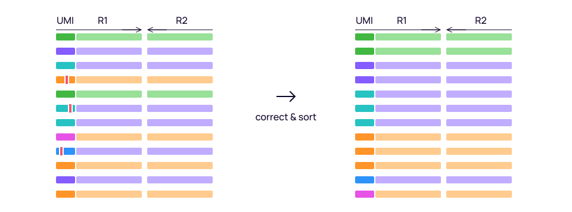
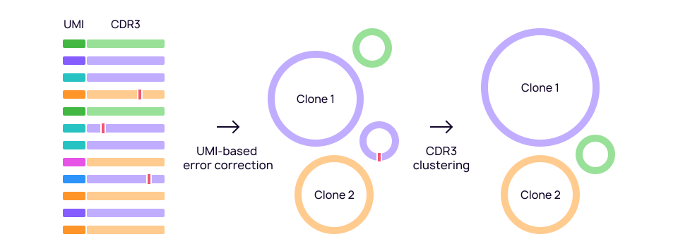
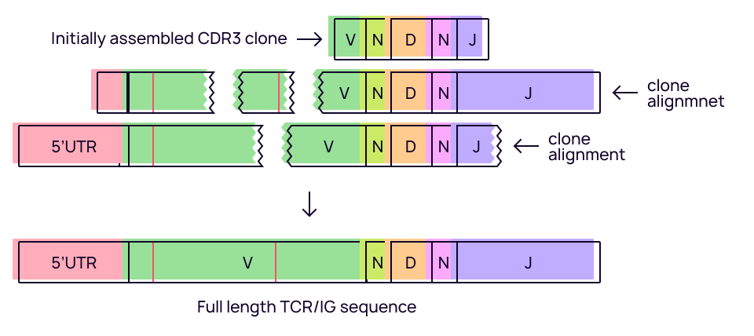
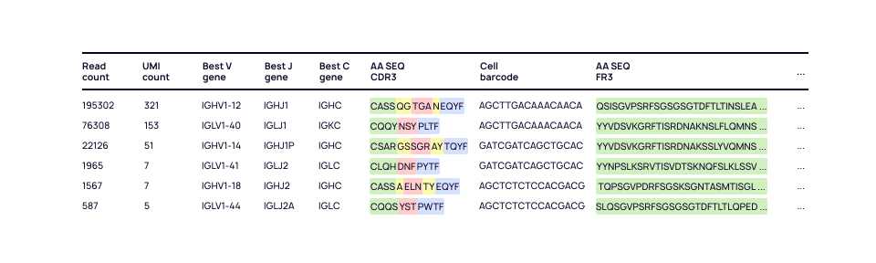

# Analysis overview

MiXCR analysis in a typical study consists of two parts:

- upstream analysis of raw sequencing data;
- downstream analysis of repertoire tables.

The exact steps and parameters of the analysis workflow are largely dependent on the data type and wet lab library preparation protocol used. In addition, downstream analysis steps may vary depending on the objectives of the particular study and available metadata.

To systematize the approach of running workflows for a wide diversity of protocols and study designs, MiXCR provides a powerful concept of [presets](overview-presets-and-mixins.md) which allows to execute specifically optimized pre-configured analysis pipelines for a variety of widely adopted data types and library preparation protocols. The whole pipeline can be run using a convenient one-line [`analyze`](mixcr-analyze.md) command or in a step by step mode for better hardware utilization.

Below we give a high-level overview of MiXCR actions which consitute most of the data analysis pipelines.

## Upstream analysis steps

Upstream analysis basically includes alignment of raw sequencing data against reference V-, D-, J- and C- gene segment database and assembling of clonotypes based on different criteria. There are plenty of peculiarities caused by different data types and library preparation protocols. Below is the list of key upstream analysis steps.

### [Alignment](mixcr-align.md)

The initial step of the analysis is alignment of raw sequencing data against reference V-, D-, J- and C- gene segment database.
    

MiXCR implements a family of highly efficient alignment algorithms, which may be tuned depending on the particular library architecture. At a top level it uses fast [k-mer seed-and-vote approach](http://nar.oxfordjournals.org/content/41/10/e108) and implements two aligners: the first one with [linear scoring](mixcr-align.md#parameters-for-kaligner) is better designed for T-cells and the second one with [affine scoring](mixcr-align.md#parameters-for-kaligner2) better supports long indels which are more typical for B-cells. In the depths it switches to different variations of more expensive classical [Needleman–Wunsch](https://en.wikipedia.org/wiki/Needleman–Wunsch_algorithm) and [Smith–Waterman](https://en.wikipedia.org/wiki/Smith–Waterman_algorithm) algoritms to find optimal alignments. It may use either [global, local or glocal](https://en.wikipedia.org/wiki/Sequence_alignment#Global_and_local_alignments) alignments at 5'- and 3'- ends of raw reads depending on the presense of absence of primers and adapters. 
 
In case of paired-end data, MiXCR [merges](mixcr-align.md#merging-algorithm-parameters) overlapping mate pairs using either subsequence match (if overlap is long enough) or alignment aided overlap. In the latter case it is able to overlap mate pairs even if there is only a single overlapping nucleotide. Optionally, MiXCR can trimm low quality nucleotides at read edges.  

Also at the alignment step MiXCR performs barcodes sequences extraction for barcoded data. There is a powerfull [regex-like](ref-tag-pattern.md) pattern-matching language allowing to use almost arbitrary barcode design.  

The built-in reference [gene library](http://github.com/repseqio/library) of V-, D-, J- and C- segments is thoroughly compiled for every available species using the data specifically obtained from multiple dedicated sequencing runs as well as from hundreds of other experiments. At the same time MiXCR supports using of [external libraries](../guides/external-libraries.md) or even to assemble a [custom library](../guides/create-custom-library.md) from scratch.     

### [Tag refinement](mixcr-refineTagsAndSort.md)

For barcoded (tagged) data, corrects errors _inside_ barcode sequences and filters out spurious barcodes.

There are multiple sources of erroneous and spurious barcodes and this step is crucial to eliminate artificial diversity caused by them.

Errors inside barcode sequences are generated either during PCR or sequencig steps. MiXCR correction algorithm uses prefix trees and different clustering strategies to identify and correct those errors _inside_ barcode sequences.

Spurious barcodes arise from multiple sources. For UMIs this is oftenly a recombination and formation of chimeric molecules. For many of droplet-based single cell technologies, spruious barcodes come from exploded cells and/or empty droplets. MiXCR has a powerful and highly tunebale filtering strategies able to identify and filter out clusters of such spurious barcodes. Importantly, fraction of spurious barcodes in some protocols may be as high as 90% which makes this filtering extremely important.

### [Partial assembly](mixcr-assemblePartial.md)

For shotgun/fragmented data, rescues alignments that partially cover CDR3 region.

Typically this step is applied for non-targeted RNA-Seq data or in case of a fragmented data when target molecule is randomly shredded (e.g. 10x chemistry). In such cases there may be a fraction of alignmets that do not cover whole CDR3 region, especially for short read data. MiXCR implements a [powerful algorithm](https://www.nature.com/articles/nbt.3979) to identify groups of such alignments coming from the same molecule but different reads and merge them in order to reconstruct CDR3 region and prevent this information from losing. The algorithm applies multiple criteria to identify such groups and utilizes barcodes if they are present in the data.
 
The procedure is [throughly optimized](https://www.nature.com/articles/nbt.3979) both on thouthands of RNA-Seq datasets as well on a simulated data applaying various multiobjective optimization strategies, as result showing highest possible recall rate keeping at the same time zero rate of false-positives.     

### [CDR3 extension](mixcr-extend.md)

For non-enriched RNA-Seq TCR data, imputes missing nucleotides at the edges of CDR3 region.  

To safely utilize even those reads that still only partially cover CDR3 but fully cover the N-D-N region, an optional CDR3 extension step for TCRs (but not Igs, due to possible presence of hypermutations). This step fills in the edges of the CDR3 based on known information on the relevant germline gene segments. This is only applied for sequences assigned with definite V and J genes (often supported by companion paired-end reads), but at the same time do not cover the CDR3 sequence end-to-end, missing few germline nucleotides. Since TCRs do not undergo hypermutations and their germline sequences are quite well-conserved, it is reasonable to artificially extend the CDR3 for such junctions with existing data from reference germline genes. 

The procedure is also [throughly optimized](https://www.nature.com/articles/nbt.3979) and tested on many real and in-silico datasets,  showing approximately zero false extension rate.

### [Clonotype assembly](mixcr-assemble.md)

The key step of the upstream analysis is clonotype assembly.

Basically, clone assembler groups alignments by similar nucleotide sequences of assembling feature, possibly using fuzzy matching and clustering for PCR and sequencing error correction. It allows to use arbitrary [gene feature](./ref-gene-features.md) that covers N-D-N region, which gives a flexibility to adjust assembling feature for a particular wet lab protocol or kit, for example using VDJRegion or just CDR3 or even CDR2+FR3+CDR3 (when paired-end sequences have gap in FR2).

For barcoded data, MiXCR first builds pre-clones by grouping alignments with the same barcode and building a consensus alignment (or multiple alignments which is the case of low barcodes diversity or birthday problem).

MiXCR applies [two basic layers of error correction](https://www.nature.com/articles/nmeth.3364). The first one is [quality-guided mapping](https://pubmed.ncbi.nlm.nih.gov/22806588/) to account for sequencing errors and rescue reads containing nucleotides with low [Phred quality score](https://en.wikipedia.org/wiki/Phred_quality_score). The second layer is used to correct PCR errors which may still present even for UMI-barcoded data. PCR errors are corrected by applying a special heuristic multi-layer clustering with fuzzy matching to identify clusters of erroneous clonotypes and distinguish them from real hypermutations or allelic variants.

### [Contig assembly](mixcr-assembleContigs.md)

For fragmented data, assembles longest available consensus contig receptor sequences.  

MiXCR uses powerful alignment-guided algorithm to reconstruct full-length (or at least longest available) of B- and T-cell receptors. This step is used for fragmented data like RNA-Seq or 10x, when individual alignments do not cover full VDJ, typically short reads, and located in a random position of VDJ region. For such case it is possible to assemble clonotypes only by CDR3 region and then apply contig assembly. It iterates over alignments used to build a particular clone (MiXCR preserves this mapping) and reconstructs a consensus contig sequence.

Importantly, alignment-guided consensus algorithm detects hypermutations for B-cell data and discriminates them from PCR/sequencing errors. So a single initial CDR3 clonotype will be split into multiple clonotypes according to found hypermutations outside of CDR3 region. 

Finally, if data contains cell barcodes, contig assembly procedure may be performed individually for each cell. 

### [Export](mixcr-export.md)

The end results of upstream analysis are clonotype tables.

MiXCR allows to export exhaustive information about each clone including nucleotide and amino acid sequences of all available [gene features](ref-gene-features.md), gene assignments, allelic and somatic mutations, positions of reference points, abundance in reads or barcodes, and many more. This info may exported in a [tabular form](mixcr-export.md) with optional possibility to adjust a set of exporting columns by choosing from the list of nearly hundred of available export fields. MiXCR also supports export in [AIRR format](mixcr-exportAirr.md). Additionally, it is possible to export a [well-formatted](mixcr-exportPretty.md) human-readable clonotypes for manual inspection. 

