# Built-in presets

MiXCR provides a comprehensive list of built-in presets for many of available commercial kits, data types and library preparation protocols.

Bellow you caan find an example command showing how to use presets:

```shell
mixcr analyze milab-human-bcr-multiplex-cdr3 \
      +dontSeparateBy C \
      sample_R1.fastq.gz \
      sample_R2.fastq.gz \
      sample_result
```
,where:
- `milab-human-bcr-multiplex-cdr3` is a preset name
- `+dontSeparateBy C` is an optional mix-in. 

Bellow you will find a great variety of presets dedicated to different types of input data or to the particular commercially available kit that was used in experiment. Most of the presets do not require any additional arguments and will work out-of-the-box.

## Protocols

## Kits

### MiLaboratories

#### [HUMAN IG RNA MULTIPLEX](https://milaboratories.com/human-ig-rna-multiplex-kit)

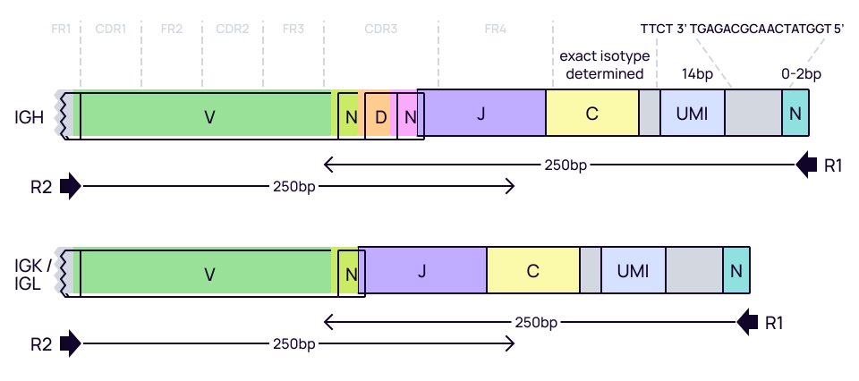

Preset name: **`milab-human-bcr-multiplex-cdr3`**

- discriminates all IGH isotypes including IgM, IgD, IgG3, IgG1, IgA1, IgG2, IgG4, IgE, and IgA2
- assemble clonotypes by `CDR3` sequence
- UMI-depended error-correction
- separate clones by isotype  (C-gene) by default. To change this behavior use `+dontSeparateBy C` mix-in.

Preset name: **`milab-human-bcr-multiplex-full-length`**

- discriminates all IGH isotypes including IgM, IgD, IgG3, IgG1, IgA1, IgG2, IgG4, IgE, and IgA2
- assemble clonotypes by `VDJ` region.
- UMI-depended error-correction
- separate clones by isotype (C-gene) by default. To change this behavior use `+dontSeparateBy C` mix-in.

#### [HUMAN TCR RNA MULTIPLEX KIT](https://milaboratories.com/human-tcr-rna-multiplex-kit)


This kit allows to obtain human TCR alpha and beta repertoires for different types of available RNA material, with high sensitivity and UMI-based accuracy.

Preset name: **`milab-human-tcr-rna-multiplex-cdr3`**
- assemble clonotypes by `CDR3` sequence
- UMI-depended error-correction

See [this tutorial](../guides/milaboratories-human-tcr-rna-multi.md) for the under-the-hood details.

#### [HUMAN TCR RNA KIT](https://milaboratories.com/human-tcr-rna-kit)


The kit allows to obtain unbiased TCR alpha and beta repertoires with UMI-based accuracy.

Preset name: **`milab-human-tcr-rna-race-cdr3`**
- assemble clonotypes by `CDR3` sequence
- UMI-depended error-correction

Preset name: **`milab-human-tcr-rna-race-full-length`**
- assemble clonotypes by `VDJ` region
- UMI-depended error-correction


#### [HUMAN TCR DNA MULTIPLEX KIT](https://milaboratories.com/human-tcr-dna-multiplex-kit)
The kit allows to obtain TCR alpha and beta repertoires for different types of available DNA material, with the highest possible sensitivity.

Preset name: **`milab-human-tcr-dna-multiplex-cdr3`**
- assemble clonotypes by `CDR3` sequence

### Takara Bio

#### [SMART-Seq Human BCR (with UMIs)](https://www.takarabio.com/products/next-generation-sequencing/immune-profiling/human-repertoire/smart-seq-human-bcr-(with-umis)) & [SMARTer Human BCR IgG IgM H/K/L Profiling Kit](https://www.takarabio.com/products/next-generation-sequencing/immune-profiling/human-repertoire/human-bcr-profiling-kit-for-illumina-sequencing)

**SMART-Seq Human BCR (with UMIs)** provides a sensitive and reproducible solution for generating high-quality NGS libraries for profiling the human BCR repertoire. The kit leverages SMART (Switching Mechanism at 5' end of RNA Template) full-length cDNA synthesis technology and pairs NGS with a 5’-RACE approach to capture the complete V(D)J variable regions of all human B-cell receptor (BCR) heavy (IgG/M/D/A/E) and light (IgK/L) chains.

**SMARTer Human BCR IgG IgM H/K/L Profiling Kit** pairs 5' RACE with NGS technology to provide a sensitive, accurate, and optimized approach to BCR profiling from RNA input samples. The 5' RACE method reduces variability and allows for priming from the constant region of BCR heavy or light chains. This kit combines these benefits with gene-specific amplification to capture complete V(D)J variable regions of BCR transcripts and provide a highly sensitive and reproducible method for profiling B-cell repertoires.


Preset name: **`takara-human-bcr-cdr3`**

- assemble clonotypes by `CDR3` sequence
- UMI-depended error-correction
- separate clones by isotype (C-gene) by default. To change this behavior use `+dontSeparateBy C` mix-in.

Preset name: **`takara-human-bcr-full-length`**

- assemble clonotypes by `VDJ` region.
- UMI-depended error-correction
- separate clones by isotype (IgG, IgM) (C-gene) by default. To change this behavior use `+dontSeparateBy C` mix-in.

#### [SMARTer Human TCR a/b Profiling Kit v2](https://www.takarabio.com/products/next-generation-sequencing/immune-profiling/human-repertoire/human-tcrv2-profiling-kit-for-illumina-sequencing)

The **SMARTer Human TCR a/b Profiling Kit v2 (TCRv2)** is powered by robust chemistry that provides unparalleled sensitivity and reproducibility. The kit leverages SMART (Switching Mechanism at 5' end of RNA Template) full-length cDNA synthesis technology and pairs NGS with a 5'-RACE approach to capture the complete V(D)J variable regions of TRA and TRB genes.

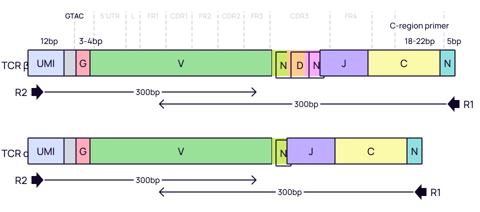

Preset name: **`takara-human-tcr-V2-cdr3`**

- assemble clonotypes by `CDR3` sequence
- UMI-depended error-correction
- separate clones by isotype (C-gene) by default. To change this behavior use `+dontSeparateBy C` mix-in.

Preset name: **`takara-human-tcr-V2-full-length`**

- assemble clonotypes by `VDJ` region.
- UMI-depended error-correction
- separate clones by isotype (C-gene) by default. To change this behavior use `+dontSeparateBy C` mix-in.

#### [SMARTer Human TCR a/b Profiling Kit](https://www.takarabio.com/products/next-generation-sequencing/immune-profiling/human-repertoire/human-tcr-profiling-kit-for-illumina-sequencing)

**SMARTer Human TCR a/b Profiling Kit** allows to obtain full-length sequences of TCR-alpha and TCR-beta V(D)J variable regions.


Preset name: **`takara-human-tcr-V1-cdr3`**

- assemble clonotypes by `CDR3` sequence

Preset name: **`takara-human-tcr-V1-full-length`**

- assemble clonotypes by `VDJ` region.

#### [SMARTer Mouse BCR IgG H/K/L Profiling Kit](https://www.takarabio.com/products/next-generation-sequencing/immune-profiling/mouse-repertoire/mouse-bcr-profiling-kit-for-illumina-sequencing)

The **SMARTer Mouse BCR IgG H/K/L Profiling Kit** pairs 5' RACE with NGS technology to provide a sensitive, accurate, and optimized approach to BCR profiling. The 5'-RACE method reduces variability and allows for priming from the constant region of BCR heavy or light chains. This kit combines these benefits with gene-specific amplification to capture complete V(D)J variable regions of BCR transcripts and provide a highly sensitive and reproducible method for profiling B-cell repertoires.

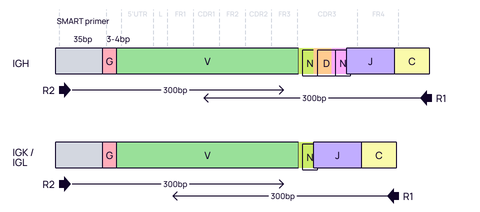

Preset name: **`takara-mouse-bcr-cdr3`**

- assemble clonotypes by `CDR3` sequence

Preset name: **`takara-mouse-bcr-full-length`**

- assemble clonotypes by `VDJ` region.

#### [SMARTer Mouse TCR a/b Profiling Kit](https://www.takarabio.com/products/next-generation-sequencing/immune-profiling/mouse-repertoire/mouse-tcr-profiling-kit-for-illumina-sequencing)

The **SMARTer Mouse TCR a/b Profiling Kit** provides a powerful new solution for those seeking to perform T-cell receptor (TCR) repertoire analysis using NGS. The kit employs a 5'-RACE-based approach to capture complete V(D)J variable regions of TCR transcripts, starting from as little as 10 ng to 500 ng of total RNA obtained from mouse spleen, thymus, or PBMCs, or from 1,000 to 10,000 purified T cells. As the name suggests, the kit can be used to generate data for both TCR-alpha and TCR-beta chain diversity, either in the same experiment or separately.

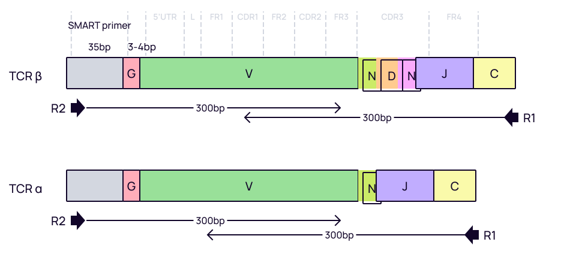

Preset name: **`takara-mouse-tcr-cdr3`**

- assemble clonotypes by `CDR3` sequence

Preset name: **`takara-mouse-tcr-full-length`**

- assemble clonotypes by `VDJ` region.

### New England BioLabs

#### [NEBNext® Immune Sequencing Kit (Human) BCR & TCR](https://www.neb.com/products/e6320-nebnext-immune-sequencing-kit-human#Product%20Information)

With the **NEBNext® Immune Sequencing Kit (Human)**, sequence the full-length immune gene repertoires of B cells and T cells. Profile somatic mutations across all relevant contexts (e.g., V, D, and J segments and isotypes IgM, IgD, IgG, IgA, and IgE) with improved sequence accuracy. Characterize BCR light, BCR heavy, TCRα and TCRβ chains. This kit includes UMIs for source-molecule identification.


Preset name: **`nebnext-human-bcr-cdr3`**

- assemble clonotypes by `CDR3` sequence
- UMI-depended error-correction
- separate clones by isotype (IgG, IgA, IgE, IgM, IgD) by default. To change this behavior use `+dontSeparateBy C` mix-in.

Preset name: **`nebnext-human-bcr-full-length`**

- assemble clonotypes by `VDJ` sequence
- UMI-depended error-correction
- separate clones by isotype (IgG, IgA, IgE, IgM, IgD) by default. To change this behavior use `+dontSeparateBy C` mix-in.

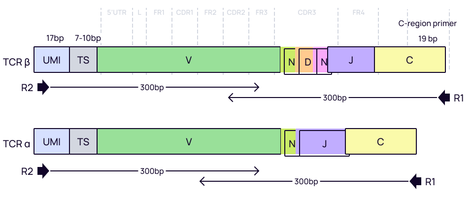

Preset name: **`nebnext-human-tcr-cdr3`**

- assemble clonotypes by `CDR3` sequence
- UMI-depended error-correction

Preset name: **`nebnext-human-tcr-full-length`**

- assemble clonotypes by `VDJ` sequence
- UMI-depended error-correction

#### [NEBNext® Immune Sequencing Kit (Mouse) BCR & TCR](https://www.neb.com/products/e6330-nebnext-immune-sequencing-kit-mouse#Product%20Information)

With the **NEBNext® Immune Sequencing Kit (Mouse)**, sequence the full-length immune gene repertoires of B cells and T cells. Profile somatic mutations across all relevant contexts (e.g., V, D, and J segments and isotypes IgM, IgD, IgG, IgA, and IgE) with improved sequence accuracy. Characterize BCR light, BCR heavy, TCRα, TCRβ, TCRγ and TCRδ chains. This kit includes UMIs for source-molecule identification.

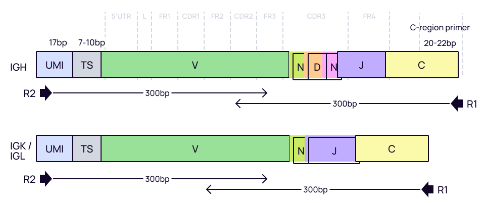

Preset name: **`nebnext-mouse-bcr-cdr3`**

- assemble clonotypes by `CDR3` sequence
- UMI-depended error-correction
- separate clones by isotype (IgG, IgA, IgE, IgM, IgD) by default. To change this behavior use `+dontSeparateBy C` mix-in.

Preset name: **`nebnext-mouse-bcr-full-length`**

- assemble clonotypes by `VDJ` sequence
- UMI-depended error-correction
- separate clones by isotype (IgG, IgA, IgE, IgM, IgD) by default. To change this behavior use `+dontSeparateBy C` mix-in.


Preset name: **`nebnext-mouse-tcr-cdr3`**

- assemble clonotypes by `CDR3` sequence
- TCRα, TCRβ, TCRγ and TCRδ chains
- UMI-depended error-correction

Preset name: **`nebnext-mouse-tcr-full-length`**

- assemble clonotypes by `VDJ` sequence
- TCRα, TCRβ, TCRγ and TCRδ chains
- UMI-depended error-correction

### [AbHelix](https://abhelix.com/)

#### BCR


This kit allows identification of IgG1,IgG1,IgG1,IgG1,IgGM,IgA isotypes. Apparently isotypes are separated prior to the final PCR reaction, in a way that resulting sequences don't cover C region enough. Thus, this preset does not separate clones by C-gene, implying that different isotypes have been already separated into different samples.

Preset name: **`abhelix-human-bcr-cdr3`**

- assemble clonotypes by `CDR3` sequence

Preset name: **`abhelix-human-bcr-full-length`**

- assemble clonotypes by `VDJ` sequence

#### TCR


Preset name: **`abhelix-human-tcr-cdr3`**

- assemble clonotypes by `CDR3` sequence

Preset name: **`abhelix-human-tcr-full-length`**

- assemble clonotypes by `VDJ` sequence

### Biomed2

#### FR1-FR4 Human Multiplex BCR Primer set

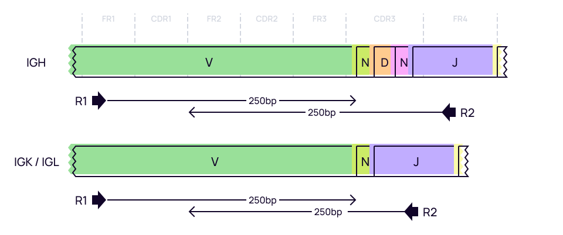

Preset name: **`biomed2-human-bcr-cdr3`**

- assemble clonotypes by `CDR3` sequence


Preset name: **`biomed2-human-bcr-full-length`**

- assemble clonotypes by `VDJ` region

### Qiagen

The **QIAseq Immune Repertoire RNA Library Kits** use Unique Molecular Indices (UMI) with gene-specific primers to target specific RNAs for NGS sequencing. Each unique panel is carefully designed and laboratory-verified for sequencing performance with a UMI-aware alignment software for maximum sequencing performance and accurate results. The Human and Mouse T-cell Receptors Panel is used for sequencing the V(D)J region of the alpha, beta, delta and gamma genes, including the CDR3 regions.

#### [QIAseq™ Human TCR Panel Immune Repertoire RNA Library Kit](https://geneglobe.qiagen.com/us/product-groups/qiaseq-immune-repertoire-rna-library-kits)

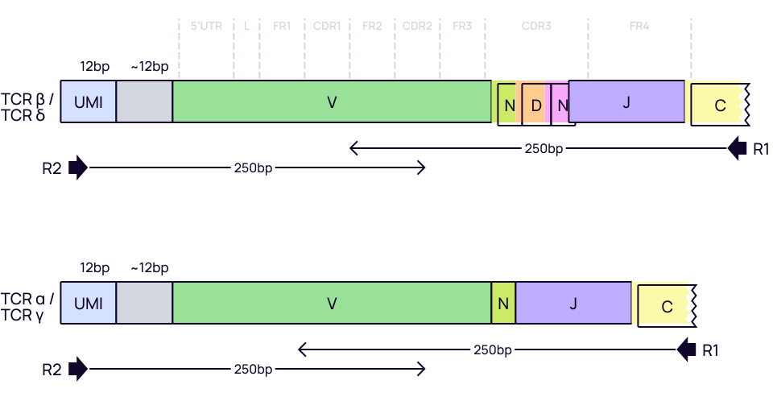

Preset name: **`qiaseq-human-tcr-cdr3`**

- assemble clonotypes by `CDR3` sequence
- UMI-depended error-correction

Preset name: **`qiaseq-human-tcr-full-length`**

- assemble clonotypes by `VDJ` sequence
- UMI-depended error-correction

#### [QIAseq™ Mouse TCR Panel Immune Repertoire RNA Library Kit](https://geneglobe.qiagen.com/us/product-groups/qiaseq-immune-repertoire-rna-library-kits)


Preset name: **`qiaseq-mouse-tcr-cdr3`**

- assemble clonotypes by `CDR3` sequence
- UMI-depended error-correction

Preset name: **`qiaseq-mouse-tcr-full-length`**

- assemble clonotypes by `VDJ` sequence
- UMI-depended error-correction

### Illumina

#### [AmpliSeq for Illumina Immune Repertoire Plus, TCR beta Panel](https://www.illumina.com/products/by-type/sequencing-kits/library-prep-kits/ampliseq-immune-repertoire-panel.html)

AmpliSeq for **Illumina Immune Repertoire Plus**, TCR beta Panel is a highly multiplexed targeted resequencing panel to measure T cell diversity and clonal expansion by sequencing T cell receptor (TCR) beta chain rearrangements. RNA evaluation of TCRβ chain rearrangements, including CDR1, CDR2, and CDR3 (with up to 400 bp read-length amplicons)

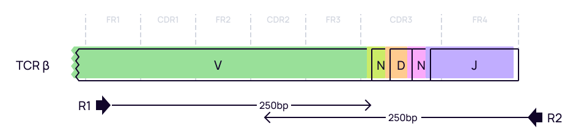

Preset name: **`ampliseq-tcrb-plus-cdr3`**

- assemble clonotypes by `CDR3` sequence

Preset name: **`ampliseq-tcrb-plus-full-length`**

- assemble clonotypes by the region starting from `CDR1` till the end of `FR4`

#### [AmpliSeq™ for Illumina® TCR beta-SR Panel](https://www.illumina.com/products/by-type/sequencing-kits/library-prep-kits/ampliseq-immune-repertoire-panel.html)

Sequences TCR beta chain rearrangements, with up to 80 bp read-length amplicons for characterizing CDR3.

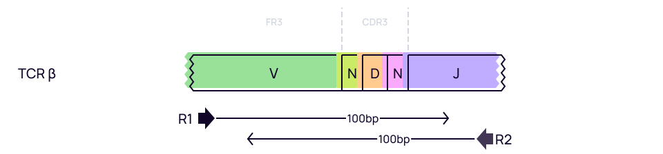

Preset name: **`ampliseq-tcrb-sr-cdr3`**

- assemble clonotypes by `CDR3` sequence

### 10XGenomics

#### [10x Genomics single cell VDJ](https://milaboratories.com/human-tcr-rna-multiplex-kit)


Preset names:

- **`10x-vdj-tcr`** for human or mouse TCR profiling 
- **`10x-vdj-bcr`** for human or mouse BCR profiling

This kit allows to obtain TCR alpha and beta repertoires for different types of available RNA material, with high sensitivity and UMI-based accuracy.

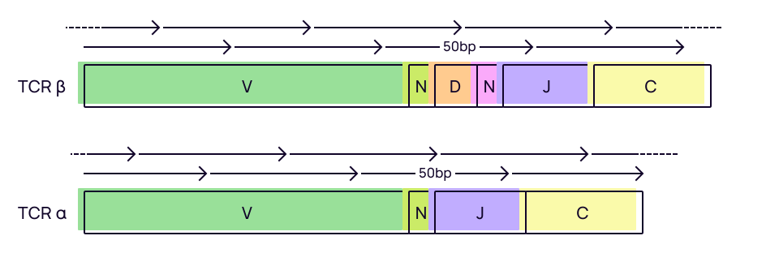

There only required mixin is `species`. Example command:

```shell
mixcr analyze 10x-vdj-bcr \
     +species hsa \
      sample_R1.fastq.gz \
      sample_R2.fastq.gz \
      sample_result
```


See [this tutorial](../guides/milaboratories-human-tcr-rna-multi.md) for the under-the-hood details.
