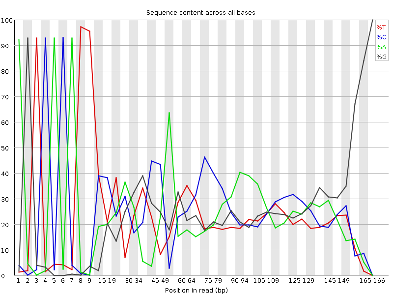
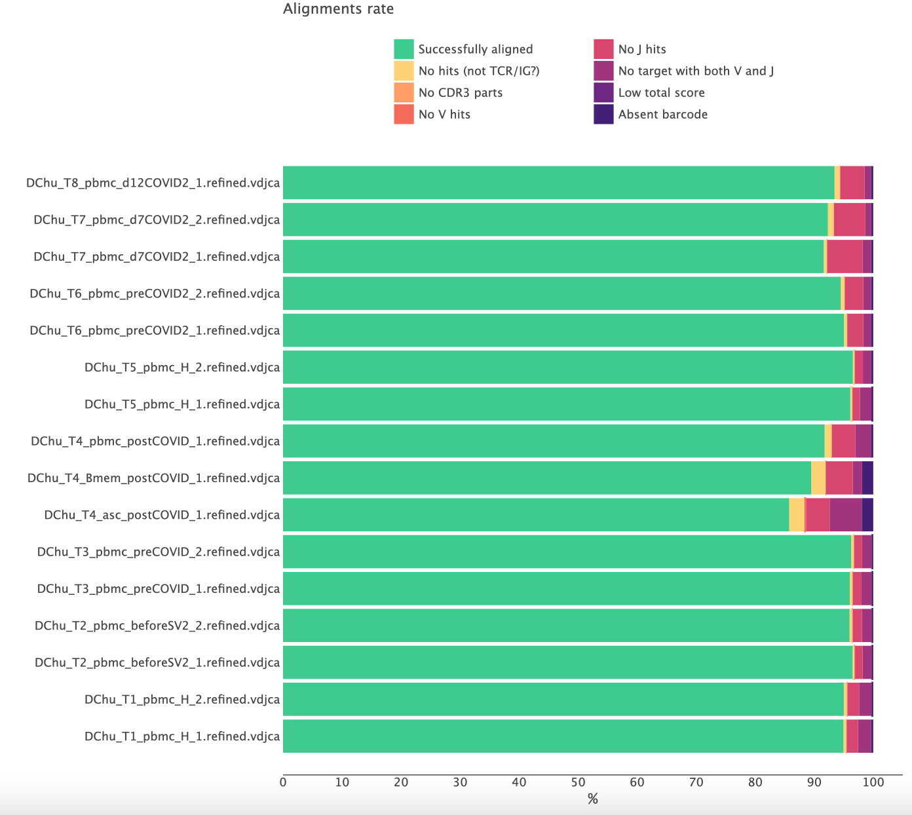

# When the analysis results look poor

<div align="right">
<i>"Garbage in, garbage out."</i> <br>
The <a href="https://en.wikipedia.org/wiki/Garbage_in,_garbage_out">GIGO</a> principle.
</div>


MiXCR takes raw sequencing data as input and extracts repertoire information based on the provided parameters and library architecture. Millions of sequencing datasets prepared with hundreds of different wet lab protocols and technologies have been analyzed by MiXCR through the years.

When results of the analysis look poor (high rate of failed alignments, low number of clones etc), there might be only two global reasons:

 - wet lab issues (in our experience this covers 90% of cases) or 
 - wrong analysis settings (this is another 10%).

Below we elaborate on how to assess the basic quality of the libraries, read MiXCR reports, discover wet lab issues and troubleshoot to get maximum information from the data you have.

## General sequencing quality checks

It's a good idea to perform the basic sequencing quality checks before running MiXCR analysis. Such quality checks can be done with tools like [FastQC](https://www.bioinformatics.babraham.ac.uk/projects/fastqc/Help/), which provides HTML reports with potential problems.

```shell
fastqc r1.fastq.gz r2.fastq.gz -o /path/to/qc/reports/
```

In the report file one needs to pay attention to several modules relevant to Rep-Seq libraries. Even though they may be marked as "passed", still some issues specific to repertoire sequencing may be found there. Contrary, there are some modules marked red even for high quality data, just because of the amplicon library structure; one can safely discard those marks.

### Per base sequence quality

Left figure shows high quality sequencing for the MiSeq 300+300 BCR-seq, with the majority of the positions in reads being reliably called. Right figure shows an example of a lower quality full-length BCR library. This data is characterized by low quality scores after 185-189 position, so we should remember it and potentially expect imperfect further alignment or clonotype assembly.


=== "High quality"
    
=== "Low quality"
    


### Per sequence quality score

Shows the average quality and distribution of qualities in the sample. Left figure is for high quality data, where the majority of reads have high average quality. For the right dataset, although the FastQC report didn't label this module as having any problems, we see that in general the distribution is skewed to the lower average quality values. Thus we may expect that in the second case a greater fraction of reads may be discarded by quality thresholds in downstream analysis.

=== "High quality"
    
=== "Low quality"
    

Reasons for lower quality bases especially in the end of the sequence:

 - challenges of SBS technology ([https://www.nature.com/articles/nbt.1585](https://www.nature.com/articles/nbt.1585))
 - low clusterization during the sequencing process
 - low diversity in the library


### Per base sequence content

Most of the time one will see this kind of result: extremely high peaks in the beginning are primers or adapters and the rest of the curves represent uneven distribution for the amplicon data.




### Sequence duplication level

Represents how many sequences are unique in the library. For the amplicon libraries that may naturally have lower diversity, we may expect a high level of duplication and a red mark in this module. Also, some experimental aspects might influence here: low  cell/RNA/DNA content  in initial sample,  degraded or damaged RNA/DNA, PCR over-amplification, etc.


### Overrepresented sequences.

Reports sequences that are overrepresented in the library.  Typically those sequences are primers, barcodes, adapters and might be different in R1 and R2 files. Homologous or identical parts of the C gene segments may dominate in some types of the RNA-based libraries. Also, some V gene segments  are more common than the others so this also might be a reason for high levels of overrepresented sequences.


## Rep-Seq libraries

### Alignments

MiXCR [alignment report](report-align.md) is key to assess the quality of the repertoire library and correctness of the used analysis settings. One can export reports in [textual](mixcr-exportReports.md), [json](mixcr-exportReports.md), [tabular](mixcr-exportReportsTable.md) and [graphical](mixcr-exportQc.md) forms. For example, to export textual report run:

```shell
mixcr exportReports alignments.vdjca
```

To get a brief overview of the overall performance across multiple samples it's useful to export a basic alignment report in a graphical form:

```shell
mixcr exportQc align *.clns alignQc.pdf
```

Normally, the result looks like this:



Here more than 90% of the reads are successfully aligned and the CDR3 region was identified. A significantly lower rate of successfully aligned reads is a clear signal of some issues with the libraries.

Before considering different reasons in more details, the general advice is to check that

 - you specify correct species (e.g. you don't use human reference for monkey data);
 - you use appropriate [analysis preset](overview-built-in-presets.md) for your library (e.g. you don't use amplicon presets for RNA-Seq data).

Alignment report shows the reasons why your reads are not aligned. Let's consider them in more detail.


#### Alignment failed, no hits (not TCR/IG?)

The most common reason for failed alignments. It simply means that reads do not cover neither V nor J regions, i.e. are not from TCR/IG molecules. There may be several of reasons for this, the most common ones include:

 - wet lab contamination from a foreign material;
 - primers mis-annealing to a non-target loci;
 - DNA contamination in RNA material;
 - other protocol and/or wet lab issues;
 - wrong choice of species in analysis settings (e.g. you have a cat library while used a human reference library).

Note that if you analyze non-targeted libraries (e.g. bulk RNA-Seq or Exome-Seq) it is normal to have a high percentage (>90-95%) of non TRC/IG reads.

In order to troubleshoot, rerun alignment and save not aligned reads into separate files:
```shell
mixcr align --preset <preset-name> \
      --not-aligned-R1 na_R1.fastq.gz \
      --not-aligned-R2 na_R2.fastq.gz \
      in_R1.fastq.gz \
      in_R2.fastq.gz \
      alignments.vdjca
```
Pick a few random sequences from na files and [BLAST](https://blast.ncbi.nlm.nih.gov) them to identify whether they are coming from contamination / non-target loci or aligned to different species. If there are no BLAST hits, check whether the sequences are artificial (e.g. adapters).


#### Alignment failed because of absence of V or J hits

This means that sequencing reads cover either V or J region but not both of them simultaneously. There might be several reasons for that.

One common reason is incorrect orientation of reads, typically caused by some pre-processing of the input data performed before MiXCR. A common example is pre-processing with external tools like MiGEC, which is a legacy tool for handling UMIs and demultiplexing. MiGEC reverse complements one of the reads, thus requiring running MiXCR with `-OreadsLayout=Collinear` option. Without this option, the fraction of no V- or no J-hits (depending on your library structure) will be extremely high.

??? Warning "We strongly do not recommend to use any pre-processing tools; MiXCR has absolutely everything to handle any type of sequencing data and protocol."

Another typical reason is a very low sequencing quality in one of the reads when sequencing has completely failed.

Finally, it might be a wrong use of the analysis preset: if the input data is randomly fragmented (RNA-, Exome-Seq, 10x etc.) and the used preset is designed for amplicon libraries, you would see a high percentage here (since with amplicon settings MiXCR drops all reads that do not full cover CDR3 region). So check and use an [appropriate preset](overview-built-in-presets.md) for fragmented data.


#### Absent barcode


For barcoded data means that barcodes can't be extracted using the specified [tag pattern](ref-tag-pattern.md). The first thing to check is that a correct tag pattern and/or a correct [analysis preset](overview-built-in-presets.md) are used. If the library is unstranded, one should use either `--tag-parse-unstranded` option or change the preset accordingly. Finally, the quality of data may be low, so that tags can't be parsed because of too many sequencing errors.

To troubleshoot, rerun alignment and save not aligned reads into separate files:
```shell
mixcr align --preset preset_name \
      --not-aligned-R1 na_R1.fastq.gz \
      --not-aligned-R2 na_R2.fastq.gz \
      in_R1.fastq.gz \
      in_R2.fastq.gz \
      alignments.vdjca
```
Take a few random raw reads from not aligned files and check that the reads indeed contain the expected barcodes. Adjust the tag pattern accordingly.


### Molecular barcodes

Here we cover some issues specific to UMI barcoded data. MiXCR provides different characteristics allowing to assess the quality of UMI barcoded libraries. One of the report characteristics - absent barcode sequence - is already covered [above](#absent-barcode). Other useful characteristics are available in [coverage](mixcr-exportQc.md#barcodes), [tag refinement](report-refineTagsAndSort.md) and [`assemble`](report-assemble.md) reports.

#### Coverage

To export UMI coverage report in a graphical form one can do:
```shell
mixcr exportQc tags *.clns coverage.pdf
```

=== "Normal coverage"
    
=== "Under-sequencing"
    
=== "Over-sequencing"
    

Normally, a good coverage shows bimodal distribution. The first peak corresponds to a single read per UMI group, which  represents erroneous reads (noise). The second peak - good quality UMI groups. The red line corresponds to the threshold that MiXCR automatically calculated to discard spurious barcodes.

For a poor library, featuring significant under-sequencing, we don't observe bimodal distribution so sequencing is not exhaustive, and you won't be able to utilize UMIs for the error correction and truly assess the diversity within the sample. This typically happens when the library lacks reads due to low total sequencing output or mistakes at library pooling. The best solution here is of course to re-sequence the data. Otherwise, one can just ignore UMIs and exclude them from the analysis.

In an opposite case of an over-sequenced library, we have bimodal distribution, but the second peak is around 100 reads per UMI and even higher. It indicates that the library was over-sequenced. This is absolutely normal for the libraries with a low amount of input material (e.g. low cell count or low amount of RNA). However, if this is not expected, it might reflect that something happened during the library preparation (e.g. RNA degradation).

#### Barcode error correction and filtering

MiXCR corrects PCR and sequencing errors inside barcode sequences at the [`refineTagsAndSort`](mixcr-refineTagsAndSort.md) step. It also applies filtering based on the automatically calculated thresholds and whitelists. The [report](report-refineTagsAndSort.md) generated at this step allows us to check whether everything is good.

Basically there are four key lines in the report which shows the key indicators. The following example is for a good library:
```
UMI input diversity: 11117
UMI output diversity: 1253 (11.27%)
UMI input reads: 872582
UMI output reads: 827111 (94.79%)
```
Here we see that almost 90% of UMIs were either corrected or dropped by the filters. It seems that the number is high, but at the same the rest 10% of UMIs contain almost 95% of reads. Thise is a typical situation for even a high quality date. When the number of output reads is significantly low it indicates that something went wrong and you will typically see issues in other reports.   


#### UMI diversity
There are few characteristics in the [assemble report](report-assemble.md) specific to UMI data which are worth paying attention to.

The first one is a histogram of the number of clonotypes per UMI. Typically, for a good data it looks like:

```
Number of clonotypes per group:
  0: + 1209 (0.04%) = 1209 (0.04%)
  1: + 2891630 (98.45%) = 2892839 (98.5%)
  2~3: + 44182 (1.5%) = 2937021 (100%)
```

Here 0.04% of UMIs do not contain clone sequence and were just dropped, 98.45% of UMIs groups contain exactly one consensus and 1.5% result in 2-3 consensus per UMI group. This 1.5% is normal, because of the birth paradox.

In a bad situation, one will see a large percent of UMI groups with more than one consensus per group. Typically, this happens when UMIs have low diversity. If this is not expected, then a possible reason is either a wrong tag pattern used (if this is a custom protocol) or some wet lab issues (the lack of N letters in the barcodes).

[//]: # (Unassigned alignments. The number of alignments that were not used in any consensus. A typical situation: there are 10 alignments with one CDR3 and 1 alignment with completely different CDR3 in a single UMI group; then MiXCR drops this single alignment, as it can be assigned to a consensus and at the same time does not have enough support to form another consensus. Typically such unassigned alignments are the result of sequence hopping or other common natural wet lab artifacts. The expected value for such alignments is less than one percent, while the large value here signals some serious library preparation issue.)


### Clone assembly

Most of the issues with Rep-Seq libraries already express themselves at the alignment step. However there are some reported characteristics of clonotype assembly allowing to better understand the origin of problems. All of them are available in [assemble report](report-assemble.md).

Let's consider the most important lines in the report. Here is the example for a good library:
```
Final clonotype count: 12419
Reads used in clonotypes, percent of total: 1368667 (83.95%)
Reads dropped due to the lack of a clone sequence, percent of total: 1221 (0.01%)
Reads clustered in PCR error correction, percent of used: 137359 (10.03%)
```

Final clonotype count shows how many clonotypes were found in the sample. This number strongly depends on the biology of your sample. The typical problem is that the final clonotype count is lower than you expected to see. You need to take a profound look at other reported characteristics to clarify why it is so.

Reads used in clonotypes tells how many reads were used in clonotypes after all the steps of the pipeline and this is the most important number for the quality check. The fraction of reads used in clonotypes is lower than around 80% indicates that there were issues requiring investigation. If alignment quality checks are passed, the assemble report can provide further insights for this investigation.

Reads clustered in PCR error correction shows how many reads were dropped during the PCR error correction performed by MiXCR. If your data doesn't utilize UMIs this percentage might be relatively high (up to 30-40%), which is fine.


#### Reads dropped due to the lack of a clone sequence

How many alignments are dropped because they don't cover the full sequence of the [assembling feature](mixcr-assemble.md#core-assembler-parameters) chosen for clonal assembly. The high number (>10%) here is the most common problem that you might face, and the most common reason is that you are trying to extract full-length clonal sequences of the receptors, but the library is prepared in such a way that it does not cover the full length of the receptor.

For amplicon protocols all alignments that are used in clone assembly already cover the CDR3 region. The high rate here may be seen only when the used assembling feature is longer than just CDR3. For example, if the assembling feature is full-length VDJRegion, the high rate of dropped reads simply means that the library actually does not cover VDJRegion. There are three reasons for that:
    
 - short sequencing used (to cover the full length one at least need 250+250 bp technology);
 - something happened in the wet lab (check other reports);
 - the protocol is not a full-length and the used preset is inappropriate.

For example. You sequenced the BCR library using 150+150 bp technology, so the full length of the receptor is not covered. If the preset used is e.g. `takara-human-bcr-full-length`, then you will get an extremely high percentage of reads dropped due to the lack of clonal sequence. Change the preset to  `takara-human-bcr-cdr3` or use ` --assemble-clonotypes-by [{CDR1Begin:FR3Begin(+50)},{FR3End(-20):FR4End}]` (check what is covered with [`exportAlignmentsPretty`](mixcr-exportPretty.md)) to utilize the maximum available information.


## Fragmented data

### Non-targeted sequencing (RNA-Seq, Exome-Seq)

RNA-seq data is quite different from target amplicon data, because reads are fragmented and only a small fraction of reads is related to the immune receptor loci. Let's overview some details of the reports for a typical RNA-seq library.

#### Alignment

MiXCR alignment reports are crucial to assess the quality of the repertoire library and correctness of the used analysis settings. One can export reports in text, tabular, json and graphical formats. For example, here is the command to export an alignment report  directly to standard output:

```shell
mixcr exportReports alignments.vdjca
```

Looking through an align report you should not be surprised by extremely low successfully aligned reads (from 0.01% up to 3%)

#### Example:
Here is an example of RNA-Seq data from peripheral blood mononuclear cells (PBMCs) and sorted IgG B-cells. Both libraries were sequenced using Illumina NovaSeq 150+150 bp technology.
MiXCR has a dedicated preset for RNA-seq data. The command for running the pipeline for RNA-seq data:


```shell
mixcr analyze rnaseq-cdr3 \
--species hsa
path/to/input/files \
path/to/output/files
```

Let's look at the basic report characteristics with the `exportReportsTable` command, which allows exporting key points from the reports across multiple files:

>_ mixcr exportReportsTable	  \
-fileName              \
-inputFilesAlign       \
-totalReads            \
-overlapped            \
-successAligned        \
-droppedNoClonalSeq    \
-totalClonotypes       \
-readsUsedInClonotypes \
/path/to/clns/files

fileName
inputFilesAlign
totalReads
overlapped
successAligned
droppedNoClonalSeq
totalClonotypes
readsUsedInClonotypes
rna_seq_Bcell_IgG.clns
Bcell_IgG_R1.fastq.gz,Bcell_IgG_R2.fastq.gz
8101322
56.91
0.39
0.16
654
17363
rna_seq_pbmc.clns
PBMC_R1.fastq.gz, PBMC_R2.fastq.gz
1596014
60.6
0.06
0.03
157
417


Here we see that only 0,39% reads were aligned in RNA-seq from sorted IgG cells and 0,06% in RNA-Seq from the PBMC. Because only a small portion of reads are used in clonotypes, a total clonotype count for RNA-Seq data is also not high, as we can see in the example. Furthermore, we deliberately add the overlap percentage in the report to discuss it more deeply. The point is that MiXCR assembles clonotypes based on overlapping fragmented sequencing reads, but not overlapped R1 andR2 reads. Based on your library structure, the number of overlapped reads in RNA-Seq data may be even 0%, however it doesn't affect further clonotypes count as in Rep-Seq data for example.  
Also, it might be useful to explore mixcr exportQc chainUsage option :

>_ mixcr exportQc chainUsage
path/to/clns/files \
path/to/graph.(png/pdf/jpg)

Here in this picture we see that chain usage for RNA-Seq from PBMC is different from the B cell- IgG RNA-Seq. In the PBMC sample we see a wide range of immune cells: T cells with TCR-alpha (TRA) b TCR-beta (TRB), as well as sequences from heavy and light chains of B cells. This plot shows that B cell enrichment protocol helped to increase the number of B cells in the sample, however a low T cells contamination still takes place.


Targeted sequencing (10x Genomics & others)


Advanced example
Let's take a look at a more complicated case demonstrating possible data quality problems. The libraries were prepared using MiLaboratories Human IG RNA Multiplex kit and sequenced using 300+300 b.p. Illumina MiSeq platform so the full length of BCRs should be covered.

The library structure.

We ran the pipeline using milab-human-bcr-multiplex-full-length preset for multiple files using parallel:

>_ realpath dir/with/files/*R1*.fastq.gz |
parallel --line-buffer -j 2 \
'mixcr analyze milab-human-bcr-multiplex-full-length -f \
{} {=s:R1:R2:=} \                        
{=s:.*/:/path/to/result/dir/:;s:_R.*::=} '


Let's look at the basic report characteristics with the `exportReportsTable` command, which allows exporting key points from the reports across multiple files:

>_ mixcr exportReportsTable	  \
-fileName              \
-inputFilesAlign       \
-totalReads            \
-patternMatchedReads   \
-overlapped            \
-successAligned        \
-droppedNoClonalSeq    \
-totalClonotypes       \
-readsUsedInClonotypes \
/path/to/clns/file

fileName
inputFilesAlign
totalReads
patternMatchedReads
overlapped
successAligned
droppedNoClonalSeq
totalClonotypes
readsUsedInClonotypes
1609-memory_S5_L001.clns
1609-memory_R1.fastq.gz,
1609-memory_R2..fastq.gz
1134924
98.11
50.83
89.5
46.87
2723
757718
1609-PBMC_S4_L001.clns
1609-PBMC_R1.fastq.gz,
1609-PBMC_R2..fastq.gz
1178081
99.6
54.85
91.76
44
17820
611795
1609-plasma_S6_L001.clns
1609-plasma_R1.fastq.gz
1609-plasma_R2.fastq.gz
777108
98.06
54.1
85.76
35.83
514
499988
2409_S3_L001.clns
2409_R1.fastq.gz,
2409_R2.fastq.gz
8804767
99.7
51.88
93.49
44.63
75693
2580918
2807-1_S1_L001.clns
2807-1_R1.fastq.gz
2807-1_R2.fastq.gz
4498501
99.68
57.34
96.11
45.78
71028
2745475
2807-2_S2_L001.clns
2807-2_R1.fastq.gz,
2807-2_R2.fastq.gz
2702030
99.67
58.74
96.54
47.45
55602
1471083


Here we highlighted the values that represent potential problems. First, we can notice that despite the high number of successfully aligned reads in all files (from 86% to 97%),  only around 54%- 58% of reads were overlapped. This might indicate that there is a conflict on the end of the reads and this mismatch hinders the reads overlapping. Also, we see that around ⅓ of reads were dropped because of no clonal sequence. The milab-human-bcr-multiplex-full-length preset uses full receptor sequence (VDJRegion) as clonal sequence, so FR1, CDR1, FR2, CDR2, FR3, CDR3 and FR4 parts must be fully covered. If the ends of the reads are conflicting, MiXCR will not be able to overlap them and therefore identify the clonal sequence. We can take one of the files from this example and use alignments pretty export to have a glimpse of alignments and reads overlapping:

>_ mixcr exportAlignmentsPretty -n 10 path/to/vdjca/file

`-n 10` option limits the number of alignments in the output.
Пример красивый

We see that sequences labeled Tag0 and Tag1 were not overlapped, while records with successful overlaps contain Tag0 labels only. We can manually overlap several of the non-overlapped reads to estimate the scale of the problem and identify the root of the problem. Here is one example, the numbers represent the scaled quality score (highest -7, lowest - 1)
So, we see that the ends of the reads have overall poor sequencing quality and what is more important they conflict with each other in a lot of positions. The possible reason why the ends are poorly aligned is low sequencing quality, so the best solution is to run FastQC to check the per base sequence quality module:


This picture represents one of the files from the example, the R1 and R2 sequence quality respectively.
Actually, we see that the sequence quality is lower on the ends as we expected.

Troubleshooting.
If we want to utilize maximum information from this data we can tweak parameters and use more relaxed requirements for read overlapping


>_ mixcr analyze milab-human-bcr-multiplex-full-length -f \
-Malign.parameters.mergerParameters.minimalIdentity=0.7 \
path/to/input/files/ \
path/to/output/files

After running the pipeline with this option we see dramatic improvements in both fraction of overlapped reads and reads dropped because of no clonal sequence:


fileName
inputFilesAlign
totalReads
patternMatchedReads
overlapped
successAligned
droppedNoClonalSeq
totalClonotypes
readsUsedInClonotypes
1609-memory_S5_L001.clns
609-memory_R1.fastq.gz,
1609-memory_R2.fastq.gz
1134924
98.11
85.05
89.95
21.72
2845
775436
1609-PBMC_S4_L001.clns
1609-PBMC_R1.fastq.gz,
1609-PBM_R2.fastq.gz
1178081
99.6
88.69
92.53
21.34
21242
743483
1609-plasma_S6_L001.clns
1609-plasma_R1.fastq.gz,
1609-plasma_R2.fastq.gz
777108
98.06
84.64
87.72
14.66
550
524066
2409_S3_L001.clns
2409_R1.fastq.gz,
2409_R2.fastq.gz
8804767
99.7
88.21
94.22
20.37
115184
4237104
2807-1_S1_L001.clns
2807-1_R1.fastq.gz,
2807-1_R2.fastq.gz
4498501
99.68
90.99
96.62
22.38
78884
3023190
2807-2_S2_L001.clns
2807-2_R1.fastq.gz,
2807-2_R2.fastq.gz
2702030
99.67
91.76
96.95
25.46
66988
1734316


Decreasing the threshold may lead to potential spurious clonotypes being identified. However one of the reads still had higher quality in the overlapping part, so the risk appears to be not essential. On the other hand, using additional ways to corroborate the findings, e.g. analysis of extra replicates is still a good idea in such cases.

