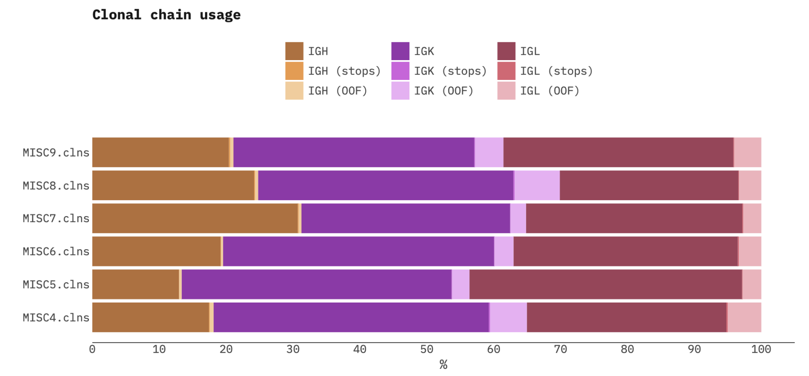

# MiXCR quality controls  

<div align="right">
<i>"Garbage in, garbage out"</i> - <br>
<a href="https://en.wikipedia.org/wiki/Garbage_in,_garbage_out">GIGO principle</a>
</div>


MiXCR takes raw sequencing data as input and extracts repertoire information based on the provided parameters and library architecture. Millions of sequencing datasets prepared with hundreds of different wet lab protocols and technologies have been analyzed by MiXCR through the years.

When results of the analysis look poor (high rate of failed alignments, low number of clones etc), there might be only two global reasons:

 - wet lab issues (in our experience this covers 90% of cases) or 
 - wrong analysis settings (this is another 10%).

MiXCR provides a set of instruments allowing to deeply assess the quality of input data and analysis.

## Quality checks report

Each [preset](overview-built-in-presets.md) contains a list of recommended [quality checks](qc-list-of-checks.md) for this particular type of data. When running MiXCR using [`analyze`](mixcr-analyze.md) command, it will automatically generate the summary and print it to the standard output. One can also use [`mixcr qc`](mixcr-qc.md) command to export report from .clns file:
```
mixcr qc clonotypes.clns
```
<pre><code>  Successfully aligned reads:                           90.027% [OK]
  Off target (non TCR/IG) reads:                        8.28%   [OK]
  Reads with no V or J hits:                            1.63%   [OK]
  Reads with no barcode:                                0.0%    [OK]
  Overlapped paired-end reads:                          92.096% [OK]
  Alignments that do not cover VDJRegion:               7.72%   <span style="color:yellow">[WARN]</span>
  Tag groups that do not cover VDJRegion:               4.51%   [OK]
  Barcode collisions in clonotype assembly:             0.090%  [OK]
  Unassigned alignments in clonotype assembly:          1.16%   [OK]
  Reads used in clonotypes:                             78.39%  <span style="color:yellow">[WARN]</span>
  Alignments dropped due to low sequence quality:       0.0%    [OK]
  Alignments clustered in PCR error correction:         0.026%  [OK]
  Clonotypes clustered in PCR error correction:         0.022%  [OK]
  Clones dropped in post-filtering:                     0.0%    [OK]
  Alignments dropped in clones post-filtering:          0.0%    [OK]
  Reads dropped in tags error correction and filtering: 7.18%   <span style="color:yellow">[WARN]</span>
  UMIs artificial diversity eliminated:                 31.55%  <span style="color:yellow">[WARN]</span>
  Reads dropped in UMI error correction and whitelist:  0.58%   [OK]
  Reads dropped in tags filtering:                      6.59%   <span style="color:yellow">[WARN]</span>
</code></pre>

The full list of available quality checks can be found [here](qc-list-of-checks.md).

## Alignment summary report

Provides an overview of alignment performance for a list of samples. Example:

```
mixcr exportQc align *.vdjca alignQc.pdf
```


## Chain usage summary report

Provides chain usage summary for a list of samples. Example:
```shell
> mixcr exportQc chainUsage --hide-non-functional results/*.clns chainUsage.pdf 
```


## Barcode coverage report

Provides barcode coverage statistics for sample. For example, for 10x VDJ data:
```shell
> mixcr exportQc tags 10x-data.clns barcodesFiltering.pdf 
```

=== "UMI"
    <figure markdown>
    
    </figure>
=== "Cell"
    <figure markdown>
    
    </figure>

The first plot shows reads per UMI distribution and cut-off threshold used to filter erroneous UMIs. The second plot shows UMI per cell barcode distribution and cut-off threshold used to filter erroneous cell barcodes.

## Generic quality issues

Below we elaborate on how to assess the basic quality of the libraries, read MiXCR reports, discover wet lab issues and troubleshoot to get maximum information from the data you have. Check out:

 - [Checking sequencing quality](qc-sequencing-quality.md)
 - [Assessing quality of Rep-Seq libraries](qc-repseq.md)
 - [Non-targeted shotgun libraries](qc-rnaseq.md)
