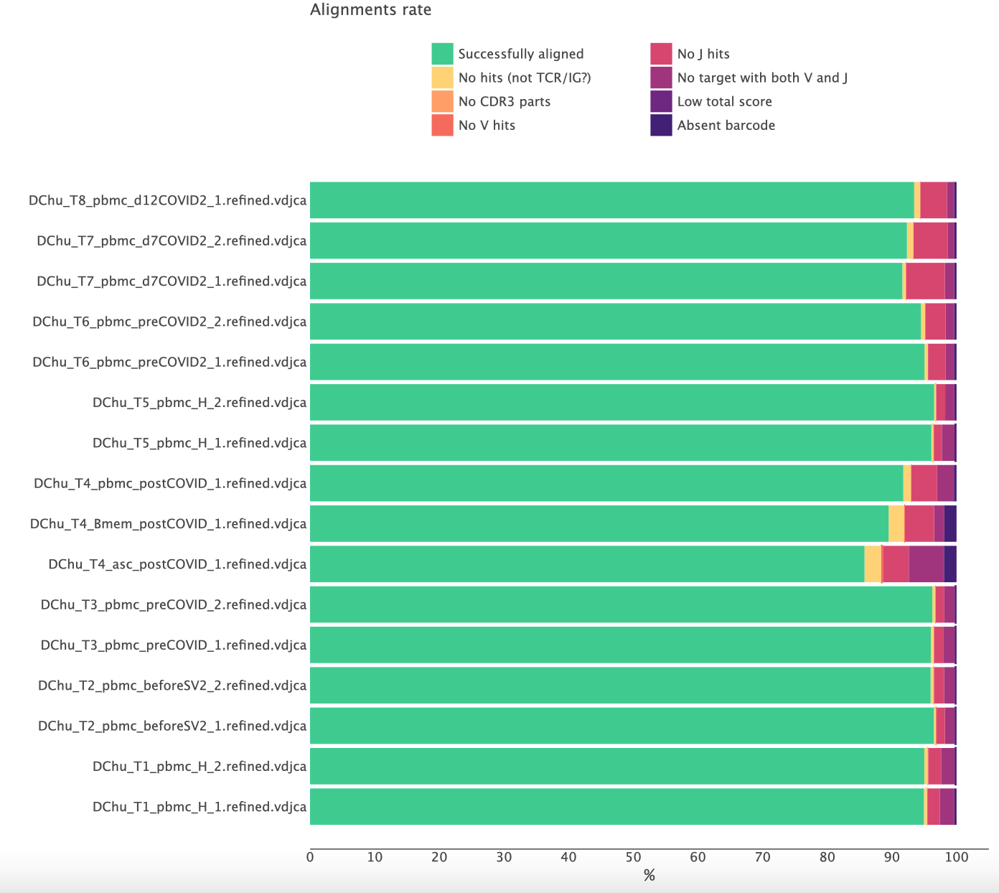
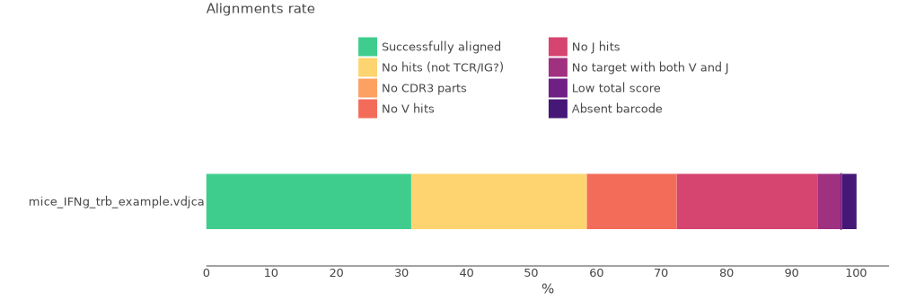
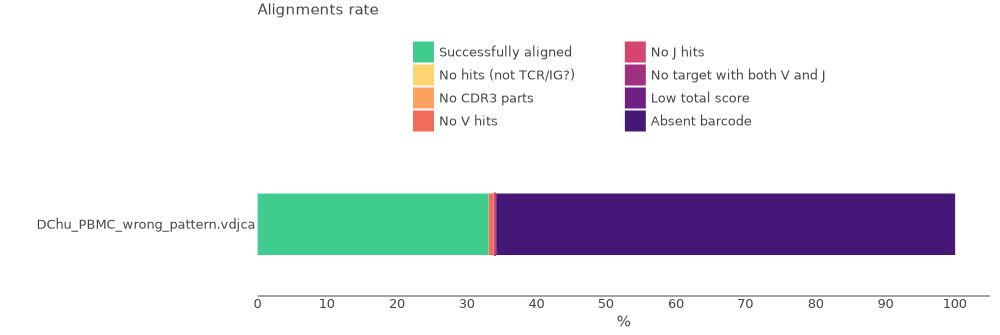
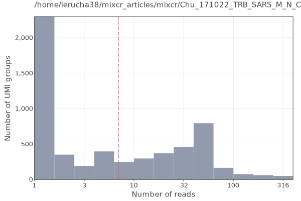
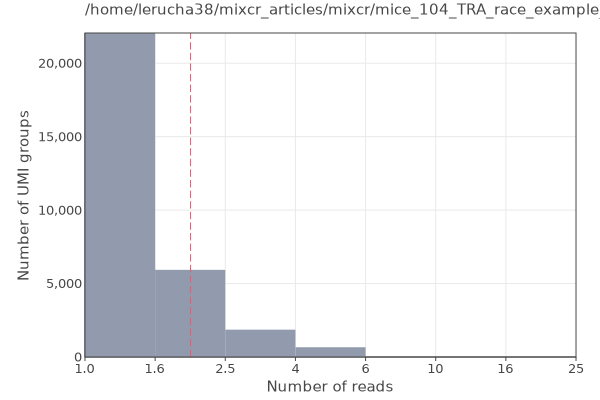
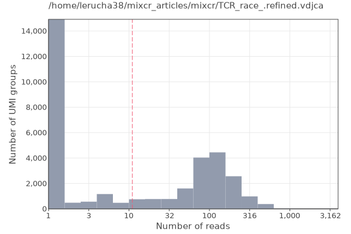
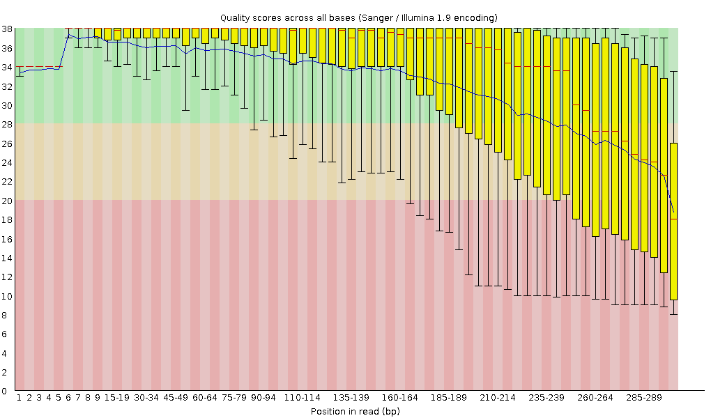
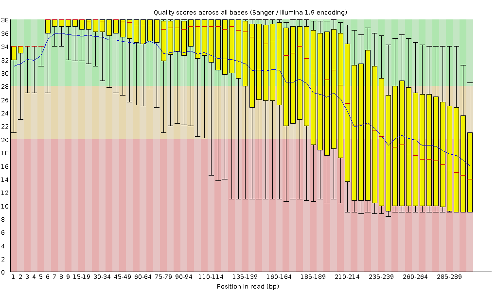

# Rep-Seq libraries

The key feature of targeted amplicon repertoire sequencing (Rep-Seq) libraries is a dedicated enrichment with VDJ sequences. Such libraries are expected to have nearly all reads covering CDR3 region or, depending on the location of the primers and sequencing length, even a full-length of the VDJ receptor.   

## Alignments

MiXCR [alignment report](report-align.md) is key to assess the quality of the repertoire library and correctness of the used analysis settings. One can export reports in [textual](mixcr-exportReports.md), [json](mixcr-exportReports.md), [tabular](mixcr-exportReportsTable.md) and [graphical](mixcr-exportQc.md) forms. For example, to export textual report run:

```shell
mixcr exportReports alignments.vdjca
```

To get a brief overview of the overall performance across multiple samples it's useful to export a basic alignment report in a graphical form:

```shell
mixcr exportQc align *.clns alignQc.pdf
```

Normally, the result looks like this:



Here more than 90% of the reads are successfully aligned and the CDR3 region was identified. A significantly lower rate of successfully aligned reads is a clear signal of some issues with the libraries.

Before considering different reasons in more details, the general advice is to check that

 - you specify correct species (e.g. you don't use human reference for monkey data);
 - you use appropriate [analysis preset](overview-built-in-presets.md) for your library (e.g. you don't use amplicon presets for RNA-Seq data).

Alignment report shows the reasons why your reads are not aligned. Let's consider them in more detail.



### Alignment failed, no hits (not TCR/IG?)

The most common reason for failed alignments. It simply means that reads do not cover neither V nor J regions, i.e. are not from TCR/IG molecules. There may be several of reasons for this, the most common ones include:

 - wet lab contamination from a foreign material;
 - primers mis-annealing to a non-target loci;
 - DNA contamination in RNA material;
 - other protocol and/or wet lab issues;
 - wrong choice of species in analysis settings (e.g. you have a cat library while used a human reference library).

Note that if you analyze non-targeted libraries (e.g. bulk RNA-Seq or Exome-Seq) it is normal to have a high percentage (>90-95%) of non TRC/IG reads.

In order to troubleshoot, rerun alignment and save not aligned reads into separate files:
```shell
mixcr align --preset <preset-name> \
      --not-aligned-R1 na_R1.fastq.gz \
      --not-aligned-R2 na_R2.fastq.gz \
      in_R1.fastq.gz \
      in_R2.fastq.gz \
      alignments.vdjca
```
Pick a few random sequences from na files and [BLAST](https://blast.ncbi.nlm.nih.gov) them to identify whether they are coming from contamination / non-target loci or aligned to different species. If there are no BLAST hits, check whether the sequences are artificial (e.g. adapters).

### Alignment failed because of absence of V or J hits

This means that sequencing reads cover either V or J region but not both of them simultaneously. There might be several reasons for that.

One common reason is incorrect orientation of reads, typically caused by some pre-processing of the input data performed before MiXCR. A common example is pre-processing with external tools like MiGEC, which is a legacy tool for handling UMIs and demultiplexing. MiGEC reverse complements one of the reads, thus requiring running MiXCR with `-OreadsLayout=Collinear` option. Without this option, the fraction of no V- or no J-hits (depending on your library structure) will be extremely high.

??? Warning "We strongly advice against using any pre-processing tools; MiXCR has absolutely everything to handle any type of sequencing data and protocol."

Another typical reason is a very low sequencing quality in one of the reads when sequencing has completely failed.

Finally, it might be a wrong use of the analysis preset: if the input data is randomly fragmented (RNA-, Exome-Seq, 10x etc.) and the used preset is designed for amplicon libraries, you would see a high percentage here (since with amplicon settings MiXCR drops all reads that do not full cover CDR3 region). So check and use an [appropriate preset](overview-built-in-presets.md) for fragmented data.


### Absent barcode



For barcoded data means that barcodes can't be extracted using the specified [tag pattern](ref-tag-pattern.md). The first thing to check is that a correct tag pattern and/or a correct [analysis preset](overview-built-in-presets.md) are used. If the library is unstranded, one should use either `--tag-parse-unstranded` option or change the preset accordingly. Finally, the quality of data may be low, so that tags can't be parsed because of too many sequencing errors.

To troubleshoot, rerun alignment and save not aligned reads into separate files:
```shell
mixcr align --preset preset_name \
      --not-aligned-R1 na_R1.fastq.gz \
      --not-aligned-R2 na_R2.fastq.gz \
      in_R1.fastq.gz \
      in_R2.fastq.gz \
      alignments.vdjca
```
Take a few random raw reads from not aligned files and check that the reads indeed contain the expected barcodes. Adjust the tag pattern accordingly.


## Molecular barcodes

Here we cover some issues specific to UMI barcoded data. MiXCR provides different characteristics allowing to assess the quality of UMI barcoded libraries. One of the report characteristics - absent barcode sequence - is already covered [above](#absent-barcode). Other useful characteristics are available in [coverage](mixcr-exportQc.md#barcodes), [tag refinement](report-refineTagsAndSort.md) and [`assemble`](report-assemble.md) reports.

### Coverage

To export UMI coverage report in a graphical form one can do:
```shell
mixcr exportQc tags *.clns coverage.pdf
```

=== "Normal coverage"
    
=== "Under-sequencing"
    
=== "Over-sequencing"
    

Normally, a good coverage shows bimodal distribution. The first peak corresponds to a single read per UMI group, which  represents erroneous reads (noise). The second peak - good quality UMI groups. The red line corresponds to the threshold that MiXCR automatically calculated to discard spurious barcodes.

For a poor library, featuring significant under-sequencing, we don't observe bimodal distribution so sequencing is not exhaustive, and you won't be able to utilize UMIs for the error correction and truly assess the diversity within the sample. This typically happens when the library lacks reads due to low total sequencing output or mistakes at library pooling. The best solution here is of course to re-sequence the data. Otherwise, one can just ignore UMIs and exclude them from the analysis.

In an opposite case of an over-sequenced library, we have bimodal distribution, but the second peak is around 100 reads per UMI and even higher. It indicates that the library was over-sequenced. This is absolutely normal for the libraries with a low amount of input material (e.g. low cell count or low amount of RNA). However, if this is not expected, it might reflect that something happened during the library preparation (e.g. RNA degradation).

### Barcode error correction and filtering

MiXCR corrects PCR and sequencing errors inside barcode sequences at the [`refineTagsAndSort`](mixcr-refineTagsAndSort.md) step. It also applies filtering based on the automatically calculated thresholds and whitelists. The [report](report-refineTagsAndSort.md) generated at this step allows us to check whether everything is good.

Basically there are four key lines in the report which shows the key indicators. The following example is for a good library:
```
UMI input diversity: 11117
UMI output diversity: 1253 (11.27%)
UMI input reads: 872582
UMI output reads: 827111 (94.79%)
```
Here we see that almost 90% of UMIs were either corrected or dropped by the filters. It seems that the number is high, but at the same the rest 10% of UMIs contain almost 95% of reads. Thise is a typical situation for even a high quality date. When the number of output reads is significantly low it indicates that something went wrong and you will typically see issues in other reports.   


### UMI diversity
There are few characteristics in the [assemble report](report-assemble.md) specific to UMI data which are worth paying attention to.

The first one is a histogram of the number of clonotypes per UMI. Typically, for a good data it looks like:

```
Number of clonotypes per group:
  0: + 1209 (0.04%) = 1209 (0.04%)
  1: + 2891630 (98.45%) = 2892839 (98.5%)
  2~3: + 44182 (1.5%) = 2937021 (100%)
```

Here 0.04% of UMIs do not contain clone sequence and were just dropped, 98.45% of UMIs groups contain exactly one consensus and 1.5% result in 2-3 consensus per UMI group. This 1.5% is normal, because of the birth paradox.

In a bad situation, one will see a large percent of UMI groups with more than one consensus per group. Typically, this happens when UMIs have low diversity. If this is not expected, then a possible reason is either a wrong tag pattern used (if this is a custom protocol) or some wet lab issues (the lack of N letters in the barcodes).

[//]: # (Unassigned alignments. The number of alignments that were not used in any consensus. A typical situation: there are 10 alignments with one CDR3 and 1 alignment with completely different CDR3 in a single UMI group; then MiXCR drops this single alignment, as it can be assigned to a consensus and at the same time does not have enough support to form another consensus. Typically such unassigned alignments are the result of sequence hopping or other common natural wet lab artifacts. The expected value for such alignments is less than one percent, while the large value here signals some serious library preparation issue.)


## Clone assembly

Most of the issues with Rep-Seq libraries already express themselves at the alignment step. However there are some reported characteristics of clonotype assembly allowing to better understand the origin of problems. All of them are available in [assemble report](report-assemble.md).

Let's consider the most important lines in the report. Here is the example for a good library:
```
Final clonotype count: 12419
Reads used in clonotypes, percent of total: 1368667 (83.95%)
Reads dropped due to the lack of a clone sequence, percent of total: 1221 (0.01%)
Reads clustered in PCR error correction, percent of used: 137359 (10.03%)
```

Final clonotype count shows how many clonotypes were found in the sample. This number strongly depends on the biology of your sample. The typical problem is that the final clonotype count is lower than you expected to see. You need to take a profound look at other reported characteristics to clarify why it is so.

Reads used in clonotypes tells how many reads were used in clonotypes after all the steps of the pipeline and this is the most important number for the quality check. The fraction of reads used in clonotypes is lower than around 80% indicates that there were issues requiring investigation. If alignment quality checks are passed, the assemble report can provide further insights for this investigation.

Reads clustered in PCR error correction shows how many reads were dropped during the PCR error correction performed by MiXCR. If your data doesn't utilize UMIs this percentage might be relatively high (up to 30-40%), which is fine.


### Reads dropped due to the lack of a clone sequence

How many alignments are dropped because they don't cover the full sequence of the [assembling feature](mixcr-assemble.md#core-assembler-parameters) chosen for clonal assembly. The high number (>10%) here is the most common problem that you might face, and the most common reason is that you are trying to extract full-length clonal sequences of the receptors, but the library is prepared in such a way that it does not cover the full length of the receptor.

For amplicon protocols all alignments that are used in clone assembly already cover the CDR3 region. The high rate here may be seen only when the used assembling feature is longer than just CDR3. For example, if the assembling feature is full-length VDJRegion, the high rate of dropped reads simply means that the library actually does not cover VDJRegion. There are three reasons for that:
    
 - short sequencing used (to cover the full length one at least need 250+250 bp technology);
 - something happened in the wet lab (check other reports);
 - the protocol is not a full-length and the used preset is inappropriate.

For example. You sequenced the BCR library using 150+150 bp technology, so the full length of the receptor is not covered. If the preset used is e.g. `takara-human-bcr-full-length`, then you will get an extremely high percentage of reads dropped due to the lack of clonal sequence. Change the preset to  `takara-human-bcr-cdr3` or use ` --assemble-clonotypes-by [{CDR1Begin:FR3Begin(+50)},{FR3End(-20):FR4End}]` (check what is covered with [`exportAlignmentsPretty`](mixcr-exportPretty.md)) to utilize the maximum available information.


## Advanced example

Let's take a look at a more complicated case demonstrating possible data quality problems. The libraries were prepared using MiLaboratories Human IG RNA Multiplex kit and sequenced using 300+300 b.p. Illumina MiSeq platform so the full length of BCRs should be covered.


We ran the pipeline using [`milab-human-bcr-multiplex-full-length`](overview-built-in-presets.md#milaboratories) preset for multiple files using parallel:

```
realpath dir/with/files/*R1*.fastq.gz |
parallel --line-buffer -j 2 \
    'mixcr analyze milab-human-bcr-multiplex-full-length -f \
    {} {=s:R1:R2:=} \                        
    {=s:.*/:/path/to/result/dir/:;s:_R.*::=} '
```

Let's look at the basic report characteristics with the [`exportReportsTable`](mixcr-exportReportsTable.md) command, which allows exporting key points from the reports across multiple files:

```shell
mixcr exportReportsTable	 \
      -fileName              \
      -totalReads            \
      -successAligned        \
      -patternMatchedReads   \
      -overlapped            \
      -droppedNoClonalSeq    \
      -totalClonotypes       \
      -readsUsedInClonotypes \
      /path/to/clns/file
```

| fileName                 | totalReads | successAligned | patternMatchedReads | overlapped | droppedNoClonalSeq | totalClonotypes | readsUsedInClonotypes |
|--------------------------|------------|----------------|---------------------|------------|--------------------|-----------------|-----------------------|
| 1609-memory_S5_L001.clns | 1,134,924  | **89.5%**      | 98.11%              | **50.83%** | **46.87%**         | 2,723           | 757,718               |
| 1609-PBMC_S4_L001.clns   | 1,178,081  | **91.76%**     | 99.6%               | **54.85%** | **44%**            | 17,820          | 611,795               |
| 1609-plasma_S6_L001.clns | 777,108    | **85.76%**     | 98.06%              | **54.1%**  | **35.83%**         | 514             | 499,988               |
| 2409_S3_L001.clns        | 8,804,767  | **93.49%**     | 99.7%               | **51.88%** | **44.63%**         | 75,693          | 2,580,918             |
| 2807-1_S1_L001.clns      | 4,498,501  | **96.11%**     | 99.68%              | **57.34%** | **45.78%**         | 71,028          | 2,745,475             |
| 2807-2_S2_L001.clns      | 2,702,030  | **96.54%**     | 99.67%              | **58.74%** | **47.45%**         | 55,602          | 1,471,083             |

Here we highlighted the values that represent potential problems. First, we can notice that despite the high number of successfully aligned reads in all files (from 86% to 97%), only around 54%-58% of reads were overlapped. This might indicate that there is a conflict on the end of the reads and this mismatch hinders the reads overlapping. Also, we see that around 1/3 of reads were dropped because of no clonal sequence. The `milab-human-bcr-multiplex-full-length` preset uses full receptor sequence ([`VDJRegion`](ref-gene-features.md)) as [clonal sequence](mixcr-assemble.md), so `FR1`, `CDR1`, `FR2`, `CDR2`, `FR3`, `CDR3` and `FR4` parts must be fully covered. If the ends of the reads are conflicting, MiXCR will not be able to overlap them and therefore identify the clonal sequence. We can take one of the files from this example and use alignments pretty export to have a glimpse of alignments and reads overlapping:
```
mixcr exportAlignmentsPretty -n 10 path/to/vdjca/file
```
Here `-n 10` option limits the number of alignments in the output.

```
>>> Read ids: 8

>>> Tags:
>>> UMI: TTTGATTACGGTTT FGGGGGGGGGGGGC


                     FR1><CDR1              CDR1><FR2                                               
                 E  V  S  G  I  T  F  S  S  F  A  M  H  W  V  R  Q  A  P  G  K  G  L  D  W  V  A    
    Quality     77777777777777777776777777777767777777777777777777777777677777777777777777776777    
    Target0   0 GAAGTCTCTGGAATCACCTTTAGTAGTTTTGCTATGCACTGGGTCCGCCAGGCTCCAGGCAAGGGGCTGGACTGGGTGGC 79   Score
IGHV3-30*00 223 gCagCctctggaTtcaccttCagtagCtAtgGCatgcactgggtccgccaggctccaggcaaggggctggaGtgggtggc 302  914

                FR2><CDR2              CDR2><FR3                                                    
                  S  V  S  F  D  G  N  T  E  H  Y  A  D  S  V  K  G  R  V  T  I  A  R  D  N  S      
    Quality     67777772577267777777777775674577777775777777777777472522467776761144626556744577    
    Target0  80 GTCTGTATCCTTCGATGGAAACACTGAACACTACGCAGACTCCGTGAAGGGCCGTGTCACCATCGCCAGAGACAATTCCA 159  Score
IGHV3-30*00 303 AGTtAtatcAtATgatggaaGTaAtAaaTactaTgcagactccgtgaagggccgATtcaccatcTccagagacaattcca 382  914

                                                                       FR3><CDR3    V><VP           
                K  K  T  L  Y  M  Q  M  N  S  L  T  L  E  D  Q  A  V  E  Y  L  S    R  T  F   D     
    Quality     625664645576323226672647777315613115676515111253644461114367333411  355241221 12    
    Target0 160 AGAAGACGCTGTACATGCAGATGAACAGCCTGACCCTTGAGGACCAGGCTGTGGAGTACTTGTCGA--GAACCTTCG-AC 236  Score
IGHV3-30*00 383 agaaCacgctgtaTCtgcaAatgaacagcctgaGAGCtgaggacACggctgtgTaTtactGTGcgaAAgaTcTttcgCac 462  914

                       VP>                                    
                 L  L  I  L  *  F  Y  Y  L  G  L  G  T  L     
    Quality     132322122335622352225466764461312315413411    
    Target0 237 CTTTTGATCCTTTAGTTTTATTATTTGGGCCTGGGAACCCTG 278  Score
IGHV3-30*00 463 AGtAATaCAc                                 472  914

                                                                                                    
                _ Q  C  R  F  T  I  Y  R  D  T  S  Q  K  T  L  Y  L  Q  M  N  S  L  T  L  E  D      
    Quality     11211335463422145142162115143134441651667764543155445566653445533155757663324776    
    Target1   0 GCAGTGCCGATTCACCATCTACAGAGACACTTCCCAGAAGACGCTGTATCTGCAGATGAACAGCCTGACACTTGAGGACA 79   Score
IGHV3-30*00 348 gAagGgccgattcaccatctCcagagacaAttccAagaaCacgctgtatctgcaAatgaacagcctgaGaGCtgaggaca 427  720

                          FR3><CDR3V>       <D         D>   <J        CDR3><FR4                     
                T  A  V  Y  Y  C  A  R  T  F  D  L  L  T  L  Y  F  D  Y  W  G  Q  G  T  L  V  T     
    Quality     55514764555235347652354677776647764652477776774777777777777777777765367777767777    
    Target1  80 CGGCTGTGTATTACTGTGCGAGAACCTTCGATCTTTTGACTCTTTATTTTGATTATTGGGGCCAGGGAACCCTGGTCACC 159  Score
IGHV3-30*00 428 cggctgtgtattactgtgcga                                                            448  720
 IGHD3-9*00  37                             cgatAttttgact                                        49   51
   IGHJ4*00  22                                             taCtttgaCtaCtggggccagggaaccctggtcacc 57   373

                   FR4><C                                                                        
              V  S  S  A  S  P  T  S  P  K  V  F  P  L  S  L  D  S  T  P  Q  D  G  N  V  V  V    
 Quality     77777646245477677657777777777777777777767575752426777777777777777777777777777777    
 Target1 160 GTCTCCTCAGCATCCCCGACCAGCCCCAAGGTCTTCCCGCTGAGCCTCGACAGCACCCCCCAAGATGGGAACGTGGTCGT 239  Score
IGHJ4*00  58 gtctcctcag                                                                       67   373
IGHA2*00   0           catccccgaccagccccaaggtcttcccgctgagcctcgacagcaccccccaagatgggaacgtggtcgt 69   400

                           
               A  C  L     
 Quality     6277777777    
 Target1 240 CGCATGCCTG 249  Score
IGHA2*00  70 cgcatgcctg 79   400
```

We see that sequences labeled `Tag0` and `Tag1` were not overlapped, while records with successful overlaps contain `Tag0` labels only. We can manually overlap several of the non-overlapped reads to estimate the scale of the problem and identify the root of the problem. Here is one example, the numbers represent the scaled quality score (highest -7, lowest - 1):
```
7777777777777777777677777777776777777777777777777777777767777777777777777777677767777772577267777777777775674577777775777777777777472522467776761144626556744577625664645576323226672647777315613115676515111253644461114367333411
GAAGTCTCTGGAATCACCTTTAGTAGTTTTGCTATGCACTGGGTCCGCCAGGCTCCAGGCAAGGGGCTGGACTGGGTGGCGTCTGTATCCTTCGATGGAAACACTGAACACTACGCAGACTCCGTGAAGGGCCGTGTCACCATCGCCAGAGACAATTCCAAGAAGACGCTGTACATGCAGATGAACAGCCTGACCCTTGAGGACCAGGCTGTGGAGTACTTGTCGAGAACCTTCGACCTTTTGATCCTTTAGTTTTATTATTTGGGCCTGGGAACCCTG
                                                                                                                             GCAGTGCCGATTCACCATCTACAGAGACACTTCCCAGAAGACGCTGTATCTGCAGATGAACAGCCTGACACTTGAGGACACGGCTGTGTATTACTGTGCGAGAACCTTCGATCTTTTGACTCTTTATTTTGATTATTGGGGCCAGGGAACCCTGGTCACC
                                                                                                                             1121133546342214514216211514313444165166776454315544556665344553315575766332477655514764555235347652354677776647764652477776774777777777777777777765367777767777
```

So, we see that the ends of the reads have overall poor sequencing quality and what is more important they conflict with each other in a lot of positions. The possible reason why the ends are poorly aligned is low sequencing quality, so the best solution is to run FastQC to check the per base sequence quality module:

=== "R1"
    
=== "R2"
    

This picture represents one of the files from the example, the R1 and R2 sequence quality respectively. Actually, we see that the sequence quality is lower on the ends as we expected.


If we want to utilize maximum information from this data we can tweak parameters and use more relaxed requirements for read overlapping
```
mixcr analyze milab-human-bcr-multiplex-full-length \
      -Malign.parameters.mergerParameters.minimalIdentity=0.7 \
      path/to/input/files/ \
      path/to/output/files
```
After running the pipeline with this option we see dramatic improvements in both fraction of overlapped reads and reads dropped because of no clonal sequence:


| fileName                 | totalReads | successAligned | patternMatchedReads | overlapped | droppedNoClonalSeq | totalClonotypes | readsUsedInClonotypes |
|--------------------------|------------|----------------|---------------------|------------|--------------------|-----------------|-----------------------|
| 1609-memory_S5_L001.clns | 1134924    | **89.95%**     | 98.11%              | **85.05%** | **21.72%**         | 2845            | 775436                |
| 1609-PBMC_S4_L001.clns   | 1178081    | **92.53%**     | 99.6%               | **88.69%** | **21.34%**         | 21242           | 743483                |
| 1609-plasma_S6_L001.clns | 777108     | **87.72%**     | 98.06%              | **84.64%** | **14.66%**         | 550             | 524066                |
| 2409_S3_L001.clns        | 8804767    | **94.22%**     | 99.7%               | **88.21%** | **20.37%**         | 115184          | 4237104               |
| 2807-1_S1_L001.clns      | 4498501    | **96.62%**     | 99.68%              | **90.99%** | **22.38%**         | 78884           | 3023190               |
| 2807-2_S2_L001.clns      | 2702030    | **96.95%**     | 99.67%              | **91.76%** | **25.46%**         | 66988           | 1734316               |

Decreasing the threshold may lead to potential spurious clonotypes being identified. However one of the reads still had higher quality in the overlapping part, so the risk appears to be not essential. On the other hand, using additional ways to corroborate the findings, e.g. analysis of extra replicates is still a good idea in such cases.