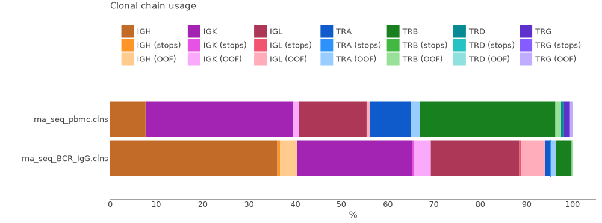

# Non-targeted data: bulk RNA- and Exome-Seq

Bulk RNA-seq data is quite different from [target amplicon](qc-repseq.md) data, because reads are fragmented and only a tiny fraction of reads is related to the immune receptor loci. Here we'll overview some details of the reports for a typical RNA-seq library.

MiXCR [alignment](report-align.md) and [assemble](report-assemble.md) reports are key to assess analysis performance of the non-targeted library. One can export reports in [textual](mixcr-exportReports.md), [json](mixcr-exportReports.md), [tabular](mixcr-exportReportsTable.md) and [graphical](mixcr-exportQc.md) forms. For example, to export textual report run:

```shell
mixcr exportReports alignments.vdjca
```

Looking through an align report you should not be surprised by extremely low successfully aligned reads (from 0.01% up to 3%). 

Here is an example of RNA-Seq data from peripheral blood mononuclear cells (PBMCs) and sorted IgG B-cells. Both libraries were sequenced using Illumina NovaSeq 150+150 bp technology. MiXCR has a [dedicated preset](overview-built-in-presets.md#rna-seq-data) for RNA-seq data and the command for running the pipeline is:

```shell
mixcr analyze rnaseq-cdr3 \
      --species hsa       \
      path/to/input/files \
      path/to/output/files
```

Let's look at the basic report characteristics with the [`exportReportsTable`](mixcr-exportReportsTable.md) command, which allows exporting key points from the reports across multiple files:
```shell
mixcr exportReportsTable	 \
      -fileName              \
      -totalReads            \
      -successAligned        \
      -overlapped            \
      -droppedNoClonalSeq    \
      -totalClonotypes       \
      -readsUsedInClonotypes \
      /path/to/clns/files
```

| fileName               | totalReads | successAligned | overlapped | droppedNoClonalSeq | totalClonotypes | readsUsedInClonotypes | 
|------------------------|------------|----------------|------------|--------------------|-----------------|-----------------------|
| rna_seq_Bcell_IgG.clns | 8,101,322  | **0.39%**      | 56.91%     | 0.16%              | **654**         | 17363                 |
| rna_seq_pbmc.clns      | 1,596,014  | **0.06%**      | 60.6%      | 0.03%              | **157**         | 417                   |


Here we see that only **0.39%** reads were aligned in RNA-seq from sorted IgG cells and **0.06%** in RNA-Seq from the PBMC.

Since only a small portion of reads are used in clonotypes, a total clonotype count for RNA-Seq data is also not high, as we can see in the example. Furthermore, we deliberately add the overlap percentage in the report to discuss it more deeply. The point is that MiXCR assembles clonotypes based on overlapping fragmented sequencing reads, but not overlapped R1 and R2 reads. Based on your library structure, the number of overlapped reads in RNA-Seq data may be even 0%, however it doesn't affect further clonotypes count as in Rep-Seq data for example.  

Also, it might be useful to explore chain usage statistics:

```
mixcr exportQc chainUsage \
      path/to/clns/files \
      path/to/graph.(png/jpg/svg/pdf)
```


In this picture we see that chain usage for RNA-Seq from PBMC is different from the B cell- IgG RNA-Seq. In the PBMC sample we see a wide range of immune cells: T cells with TCR-alpha (TRA) and TCR-beta (TRB), as well as sequences from heavy and light chains of B cells. This plot shows that B cell enrichment protocol helped to increase the number of B cells in the sample, however a low T cells contamination still takes place.