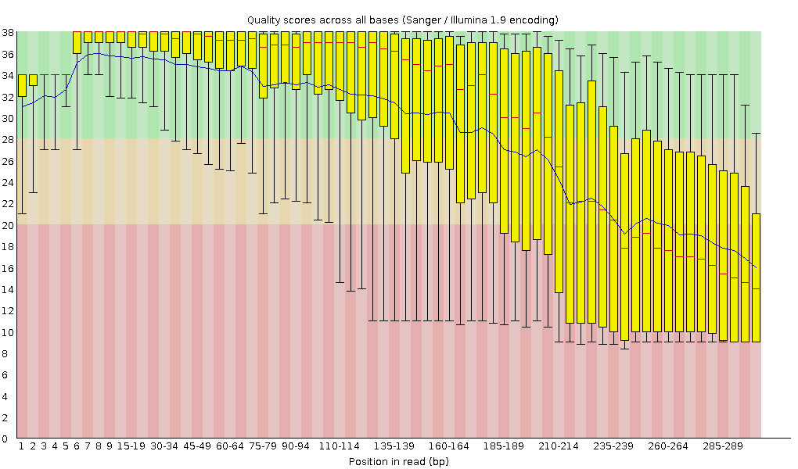
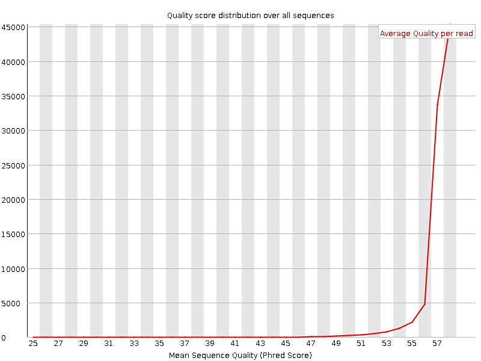
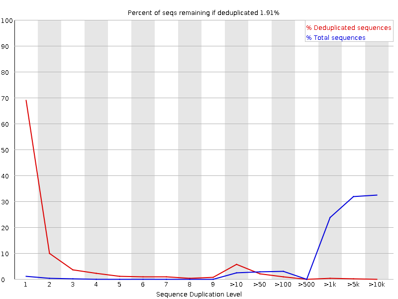

# Sequencing quality

It's a good idea to perform the basic sequencing quality checks before running MiXCR analysis. Such quality checks can be done with tools like [FastQC](https://www.bioinformatics.babraham.ac.uk/projects/fastqc/Help/), which provides HTML reports with potential problems.

```shell
fastqc r1.fastq.gz r2.fastq.gz -o /path/to/qc/reports/
```

In the report file one needs to pay attention to several modules relevant to Rep-Seq libraries. Even though they may be marked as "passed", still some issues specific to repertoire sequencing may be found there. Contrary, there are some modules marked red even for high quality data, just because of the amplicon library structure; one can safely discard those marks.

## Per base sequence quality

Left figure shows high quality sequencing for the MiSeq 300+300 BCR-seq, with the majority of the positions in reads being reliably called. Right figure shows an example of a lower quality full-length BCR library. This data is characterized by low quality scores after 185-189 position, so we should remember it and potentially expect imperfect further alignment or clonotype assembly.


=== "High quality"
    
=== "Low quality"
    


## Per sequence quality score

Shows the average quality and distribution of qualities in the sample. Left figure is for high quality data, where the majority of reads have high average quality. For the right dataset, although the FastQC report didn't label this module as having any problems, we see that in general the distribution is skewed to the lower average quality values. Thus we may expect that in the second case a greater fraction of reads may be discarded by quality thresholds in downstream analysis.

=== "High quality"
    
=== "Low quality"
    

Reasons for lower quality bases especially in the end of the sequence:

 - challenges of SBS technology ([https://www.nature.com/articles/nbt.1585](https://www.nature.com/articles/nbt.1585))
 - low clusterization during the sequencing process
 - low diversity in the library


## Per base sequence content

Most of the time one will see this kind of result: extremely high peaks in the beginning are primers or adapters and the rest of the curves represent uneven distribution for the amplicon data.


## Sequence duplication level

Represents how many sequences are unique in the library. For the amplicon libraries that may naturally have lower diversity, we may expect a high level of duplication and a red mark in this module. Also, some experimental aspects might influence here: low  cell/RNA/DNA content  in initial sample,  degraded or damaged RNA/DNA, PCR over-amplification, etc.



## Overrepresented sequences.

Reports sequences that are overrepresented in the library.  Typically those sequences are primers, barcodes, adapters and might be different in R1 and R2 files. Homologous or identical parts of the C gene segments may dominate in some types of the RNA-based libraries. Also, some V gene segments  are more common than the others so this also might be a reason for high levels of overrepresented sequences.


